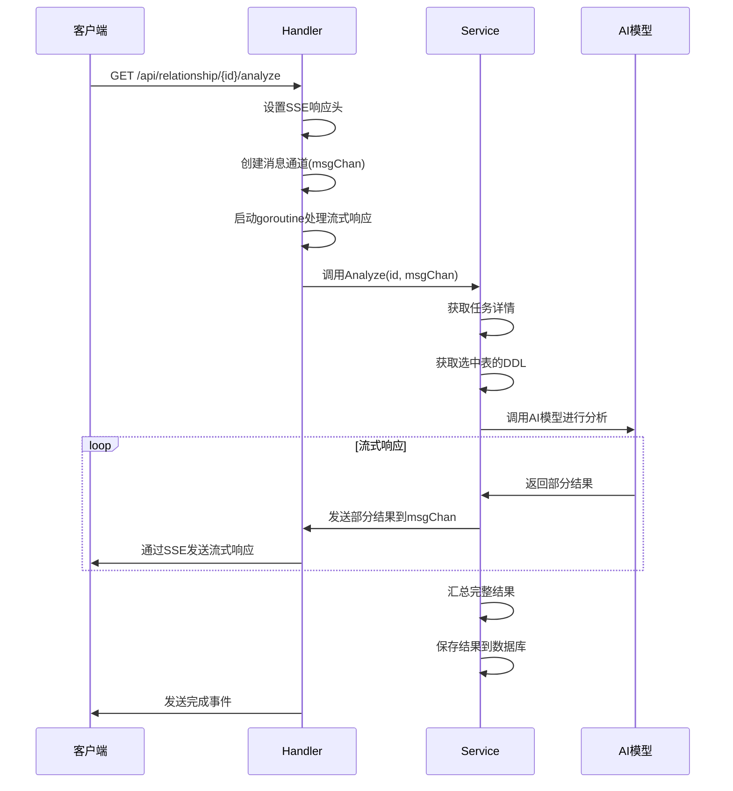
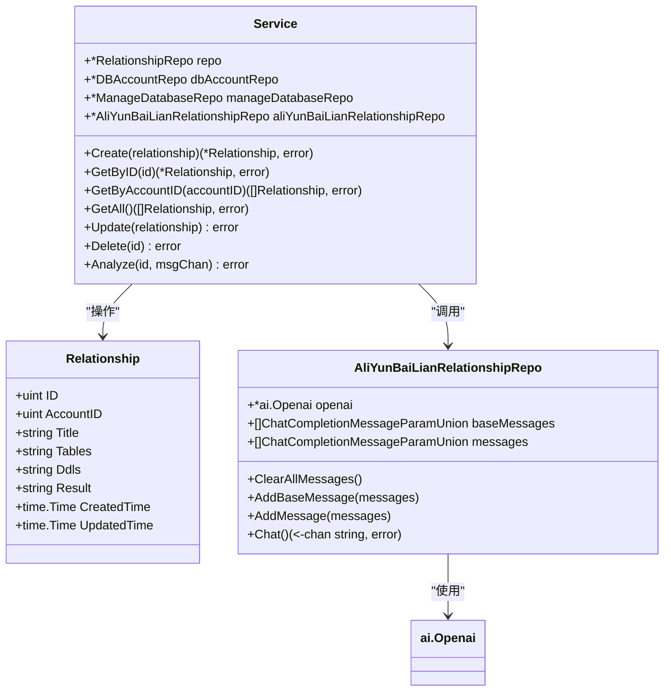

# 关系分析API

<cite>
**本文档引用的文件**
- [handler.go](file://internal/app/tools/business/relationship/handler.go)
- [service.go](file://internal/app/tools/business/relationship/service.go)
- [aliyun_bailian_relationship_repo.go](file://internal/app/tools/repo/aliyun_bailian_relationship/aliyun_bailian_relationship_repo.go)
- [prompts.go](file://internal/app/tools/repo/aliyun_bailian_relationship/prompts.go)
- [relationship.go](file://internal/app/tools/models/relationship.go)
- [model.go](file://internal/app/tools/business/relationship/model.go)
- [response.go](file://internal/app/tools/infra/response/api/response.go)
</cite>

## 目录
1. [简介](#简介)
2. [API端点说明](#api端点说明)
3. [异步分析流程](#异步分析流程)
4. [服务层实现](#服务层实现)
5. [AI提示词设计](#ai提示词设计)
6. [使用示例](#使用示例)

## 简介
关系分析API提供了一套完整的数据库结构智能分析功能，允许用户创建分析任务、管理任务状态，并通过AI模型自动分析数据库表之间的关系。系统采用异步处理模式，支持流式响应，确保大容量DDL分析的实时性和响应性。

**Section sources**
- [handler.go](file://internal/app/tools/business/relationship/handler.go#L1-L218)
- [service.go](file://internal/app/tools/business/relationship/service.go#L1-L182)

## API端点说明
关系分析API提供以下核心端点：

### GET /api/relationship
获取所有分析任务列表

**响应示例**
```json
{
  "code": 200,
  "msg": "获取关系记录列表成功",
  "data": [
    {
      "id": 1,
      "account_id": 1,
      "title": "用户系统分析",
      "tables": "[{\"name\":\"users\",\"comment\":\"用户表\"}]",
      "ddls": "",
      "result": "",
      "created_time": "2024-01-01T00:00:00Z",
      "updated_time": "2024-01-01T00:00:00Z"
    }
  ]
}
```

### POST /api/relationship
创建新的分析任务

**请求体参数**
- `account_id`: 数据库账户ID（必填）
- `title`: 任务标题（必填）
- `tables`: 选中的表信息（JSON格式）

**请求示例**
```json
{
  "account_id": 1,
  "title": "订单系统分析",
  "tables": "[{\"name\":\"orders\",\"comment\":\"订单表\"},{\"name\":\"order_items\",\"comment\":\"订单项表\"}]"
}
```

### GET /api/relationship/:id
获取指定任务详情

### PUT /api/relationship/:id
更新任务信息

### DELETE /api/relationship/:id
删除指定任务

### POST /api/relationship/:id/analyze
触发AI分析核心端点

该端点采用SSE（Server-Sent Events）协议，通过流式传输方式返回AI分析结果。客户端可通过轮询或WebSocket方式接收部分结果，最终完成完整分析。

**Section sources**
- [handler.go](file://internal/app/tools/business/relationship/handler.go#L25-L35)
- [handler.go](file://internal/app/tools/business/relationship/handler.go#L48-L186)

## 异步分析流程
关系分析采用异步非阻塞架构，确保长时间运行的AI分析不会阻塞HTTP请求。



**Diagram sources**
- [handler.go](file://internal/app/tools/business/relationship/handler.go#L188-L216)
- [service.go](file://internal/app/tools/business/relationship/service.go#L101-L180)

**Section sources**
- [handler.go](file://internal/app/tools/business/relationship/handler.go#L188-L216)
- [service.go](file://internal/app/tools/business/relationship/service.go#L101-L180)

## 服务层实现
服务层负责协调数据访问和AI分析，实现核心业务逻辑。

### 数据结构


**Diagram sources**
- [service.go](file://internal/app/tools/business/relationship/service.go#L15-L20)
- [relationship.go](file://internal/app/tools/models/relationship.go#L6-L14)
- [aliyun_bailian_relationship_repo.go](file://internal/app/tools/repo/aliyun_bailian_relationship/aliyun_bailian_relationship_repo.go#L13-L15)

### 分析流程
1. 从数据库获取分析任务
2. 解析选中的表名
3. 从目标数据库获取DDL定义
4. 聚合DDL数据并分块处理
5. 调用AI模型进行关系分析
6. 流式传输部分结果
7. 汇总完整结果并保存

**Section sources**
- [service.go](file://internal/app/tools/business/relationship/service.go#L101-L180)

## AI提示词设计
AI提示词设计是关系分析的核心，确保模型能够准确理解任务并输出标准化结果。

### 系统提示词（System Prompt）
```go
func SystemPrompt() string {
	return `你是一名专业的数据库结构分析助手（Database Schema Intelligence Assistant）。

每次对话都是完全独立的，不可引用或使用任何上一次对话的内容、上下文或记忆。
如果用户未提供数据库 DDL，则视为当前上下文中不存在任何数据库表结构。
你的职责：
1. 记住并理解当前会话中用户提供的 MySQL DDL；
2. 在当前会话中，根据这些表结构分析关系；
3. 不可使用任何之前会话的数据或逻辑；
4. 当用户说“记住以下DDL”时，只需记忆，不输出内容；
5. 当用户说“请输出关系分析”时，才进行分析；
6. 输出应使用中文，并严格按指定格式。
你的目标：帮助用户构建当前提供的数据库全貌与关系网络。
`
}
```

### DDL记忆提示词
```go
func UserChunkDDlPrompt(index int, text string) string {
	return fmt.Sprintf(`以下是第 %v 批 MySQL 数据库表结构（DDL），请将这些表的定义记住，作为后续分析的基础。
不要输出任何解释、总结、分析或确认语句，只返回已记住。
只需静默地将这些表的结构信息添加到你的知识中。
开始记忆以下 DDL：
--------------------
%s
--------------------
`, index, text)
}
```

### 分析请求提示词
```go
func UserSummaryPrompt() string {
	return `现在请根据你已记住的所有 MySQL 表结构，分析整个数据库的结构关系。
请只输出以下两部分内容，不要输出任何额外说明或解释：
---
### 核心实体说明
请列出数据库中最核心的业务实体（如用户、课程、订单、交易、产品等），
并简要说明每个实体的作用与意义。
| 实体名称 | 说明 |
|-----------|------|
| （示例）user | 用户表，保存系统注册用户的基本信息 |
| （示例）course | 课程表，记录课程的基本资料与类型 |
| （示例）order | 订单表，用于记录用户购买或报名信息 |
---
### 核心关系一览表
请整理所有表之间存在的外键或逻辑关联（字段名相同的引用也视为逻辑关联），
以表格形式列出。
| 源表 | 关联字段 | 目标表 | 关系类型 | 说明 |
|------|-----------|--------|----------|------|
| （示例）course_sign_user | user_id | user | 外键 | 课程报名记录对应的用户 |
| （示例）course_sign_user | course_id | course | 外键 | 报名表关联的课程 |
| （示例）course | coach_id | coach | 外键 | 课程对应的教练 |
---
请严格遵循以上表格格式输出，不要添加其它段落、注释或文字。
`
}
```

**Section sources**
- [prompts.go](file://internal/app/tools/repo/aliyun_bailian_relationship/prompts.go#L5-L56)

## 使用示例
以下示例演示从创建任务到获取分析结果的完整流程。

### curl示例
```bash
# 1. 创建分析任务
TASK_ID=$(curl -X POST http://localhost:3000/api/relationship \
  -H "Content-Type: application/json" \
  -d '{
    "account_id": 1,
    "title": "用户系统分析",
    "tables": "[{\"name\":\"users\",\"comment\":\"用户表\"},{\"name\":\"profiles\",\"comment\":\"用户资料表\"}]"
  }' | jq -r '.data.id')

echo "创建任务ID: $TASK_ID"

# 2. 触发AI分析（流式响应）
curl -X GET http://localhost:3000/api/relationship/$TASK_ID/analyze \
  -H "Accept: text/event-stream"
```

### JavaScript示例
```javascript
// 1. 创建分析任务
async function createAnalysisTask() {
  const response = await fetch('/api/relationship', {
    method: 'POST',
    headers: {
      'Content-Type': 'application/json',
    },
    body: JSON.stringify({
      account_id: 1,
      title: '用户系统分析',
      tables: JSON.stringify([
        { name: 'users', comment: '用户表' },
        { name: 'profiles', comment: '用户资料表' }
      ])
    })
  });
  
  const data = await response.json();
  return data.data.id;
}

// 2. 触发AI分析
async function analyzeRelationship(taskId) {
  const eventSource = new EventSource(`/api/relationship/${taskId}/analyze`);
  let fullResult = '';
  
  eventSource.onmessage = function(event) {
    const response = JSON.parse(event.data);
    if (response.code === 200) {
      fullResult += response.data;
      // 更新UI显示部分结果
      document.getElementById('analysis-result').innerHTML += response.data;
    }
  };
  
  eventSource.addEventListener('done', function(event) {
    console.log('分析完成');
    eventSource.close();
  });
  
  eventSource.onerror = function(event) {
    console.error('分析出错:', event);
    eventSource.close();
  };
}

// 使用示例
createAnalysisTask().then(taskId => {
  console.log('任务创建成功:', taskId);
  analyzeRelationship(taskId);
});
```

**Section sources**
- [handler.go](file://internal/app/tools/business/relationship/handler.go#L188-L216)
- [service.go](file://internal/app/tools/business/relationship/service.go#L101-L180)