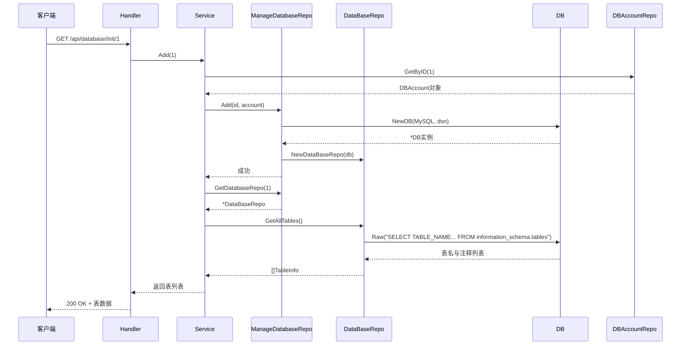
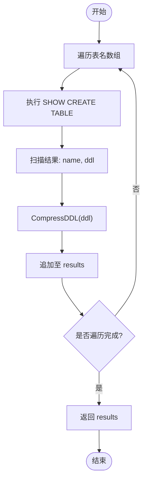
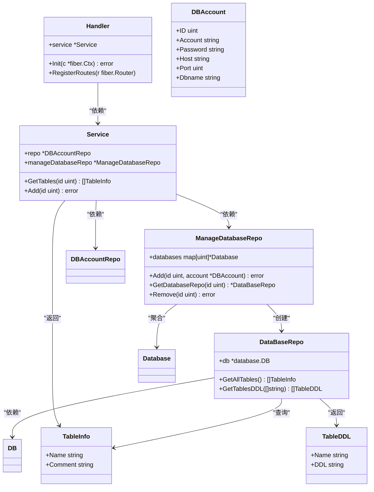

# 数据库浏览API

<cite>
**本文档引用文件**  
- [handler.go](file://internal/app/tools/business/database/handler.go)
- [service.go](file://internal/app/tools/business/database/service.go)
- [manage_database_repo.go](file://internal/app/tools/repo/manage_database_repo.go)
- [database_repo.go](file://internal/app/tools/repo/database_repo.go)
- [table_info.go](file://internal/app/tools/models/table_info.go)
- [response.go](file://internal/app/tools/infra/response/api/response.go)
- [db.go](file://internal/infra/database/db.go)
</cite>

## 目录
1. [简介](#简介)
2. [核心端点说明](#核心端点说明)
3. [处理流程分析](#处理流程分析)
4. [响应结构与示例](#响应结构与示例)
5. [错误处理机制](#错误处理机制)
6. [性能优化建议](#性能优化建议)
7. [调用示例](#调用示例)
8. [架构图示](#架构图示)

## 简介
本文档详细描述数据库浏览功能的API设计与实现，重点涵盖两个核心接口：初始化数据库连接并获取表列表、获取指定表结构信息。系统通过动态连接管理机制，支持多数据库实例的元数据查询，并结合GORM与原生SQL实现高效元数据提取。

## 核心端点说明

### GET /api/database/init/:id
该接口用于初始化指定数据库连接并获取所有表名及注释。

- **路径参数 `:id`**：表示数据库账户ID，对应 `db_account` 表中的主键。系统通过该ID从数据库账户仓库中查询连接信息。
- **功能流程**：
  1. 解析路径参数 `id`
  2. 调用服务层 `Add` 方法建立数据库连接池
  3. 查询 `information_schema.tables` 获取当前数据库所有表信息
  4. 返回表名与注释列表

**Section sources**
- [handler.go](file://internal/app/tools/business/database/handler.go#L20-L31)
- [service.go](file://internal/app/tools/business/database/service.go#L23-L30)

### GET /api/database/table/:id/:table
该接口用于获取特定表的详细结构信息（字段名、类型、是否主键、默认值等）及DDL语句。

- **路径参数 `:id`**：数据库账户ID
- **路径参数 `:table`**：目标表名
- **功能流程**：
  1. 通过 `id` 定位已建立的数据库连接
  2. 执行 `SHOW CREATE TABLE` 获取表定义
  3. 返回格式化后的DDL语句

> 注意：当前代码库中尚未实现此端点的Handler方法，但底层 `DataBaseRepo.GetTablesDDL` 已提供支持。

**Section sources**
- [database_repo.go](file://internal/app/tools/repo/database_repo.go#L47-L71)

## 处理流程分析

### Handler.Init 流程
`Handler.Init` 是初始化数据库连接的核心入口，其处理流程如下：

1. 使用 `cast.ToInt` 将路径参数 `id` 转换为整型
2. 调用 `service.Add(id)` 建立数据库连接
3. 调用 `service.GetTables(id)` 获取表列表
4. 返回成功响应或错误信息



**Diagram sources**
- [handler.go](file://internal/app/tools/business/database/handler.go#L20-L31)
- [service.go](file://internal/app/tools/business/database/service.go#L23-L30)
- [manage_database_repo.go](file://internal/app/tools/repo/manage_database_repo.go#L28-L40)
- [database_repo.go](file://internal/app/tools/repo/database_repo.go#L20-L45)

### GetTableDDL 实现流程
`GetTablesDDL` 方法通过执行原生SQL获取表定义：

1. 遍历传入的表名数组
2. 对每个表执行 `SHOW CREATE TABLE \`表名\`` 语句
3. 提取返回结果中的DDL部分
4. 使用 `utils.CompressDDL` 压缩格式化
5. 构造 `TableDDL` 对象返回



**Diagram sources**
- [database_repo.go](file://internal/app/tools/repo/database_repo.go#L47-L71)

## 响应结构与示例

### 表列表响应结构
```json
{
  "code": 200,
  "msg": "ok",
  "data": [
    {
      "name": "users",
      "comment": "用户信息表"
    },
    {
      "name": "orders",
      "comment": "订单记录表"
    }
  ]
}
```

**Section sources**
- [table_info.go](file://internal/app/tools/models/table_info.go#L3-L7)
- [response.go](file://internal/app/tools/infra/response/api/response.go#L14-L20)

### DDL响应结构（待实现）
```json
{
  "code": 200,
  "msg": "ok",
  "data": [
    {
      "name": "users",
      "ddl": "CREATE TABLE `users` (...)"
    }
  ]
}
```

**Section sources**
- [table_info.go](file://internal/app/tools/models/table_info.go#L8-L12)

## 错误处理机制

### 连接失败处理
当数据库连接失败时，`NewDB` 函数返回错误，由 `ManageDatabaseRepo.Add` 捕获并向上抛出，最终由 `Handler.Init` 返回400错误。

```mermaid
graph TB
A[连接失败] --> B[NewDB返回error]
B --> C[Add方法返回error]
C --> D[Init捕获error]
D --> E[api.Error(c, 400, ...)]
E --> F[返回400响应]
```

**Section sources**
- [manage_database_repo.go](file://internal/app/tools/repo/manage_database_repo.go#L34-L37)
- [db.go](file://internal/infra/database/db.go#L29-L75)

### 表不存在处理
在 `GetTablesDDL` 中，若某表不存在，`row.Scan` 将返回错误，系统会跳过该表继续处理其余表，确保整体流程不中断。

**Section sources**
- [database_repo.go](file://internal/app/tools/repo/database_repo.go#L60-L62)

## 性能优化建议

1. **连接池管理**：`NewDB` 中已配置最大100连接、10空闲连接，建议根据实际并发量调整
2. **大表元数据查询**：`information_schema.tables` 查询性能受表数量影响，建议：
   - 缓存表列表结果
   - 分页查询（当前未实现）
3. **批量DDL获取**：当前为逐表查询，可考虑：
   - 并行执行 `SHOW CREATE TABLE`
   - 使用协程提升响应速度
4. **索引优化**：确保 `information_schema.tables.table_schema` 字段有索引

## 调用示例

### 初始化连接并获取表列表
```bash
curl -X GET "http://localhost:3000/api/database/init/1"
```

**预期响应**：
```json
{
  "code": 200,
  "msg": "ok",
  "data": [
    {
      "name": "user_info",
      "comment": "用户基本信息"
    },
    {
      "name": "product_catalog",
      "comment": "商品目录"
    }
  ]
}
```

### 获取表DDL（待实现）
```bash
curl -X GET "http://localhost:3000/api/database/table/1/users"
```

## 架构图示



**Diagram sources**
- [handler.go](file://internal/app/tools/business/database/handler.go#L9-L11)
- [service.go](file://internal/app/tools/business/database/service.go#L9-L12)
- [manage_database_repo.go](file://internal/app/tools/repo/manage_database_repo.go#L9-L11)
- [database_repo.go](file://internal/app/tools/repo/database_repo.go#L12-L14)
- [table_info.go](file://internal/app/tools/models/table_info.go#L4-L7)