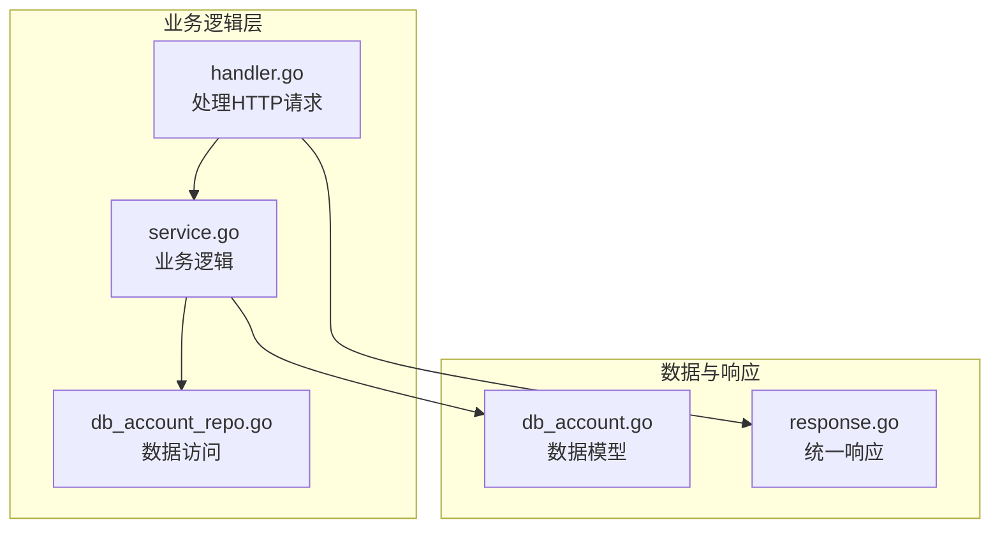
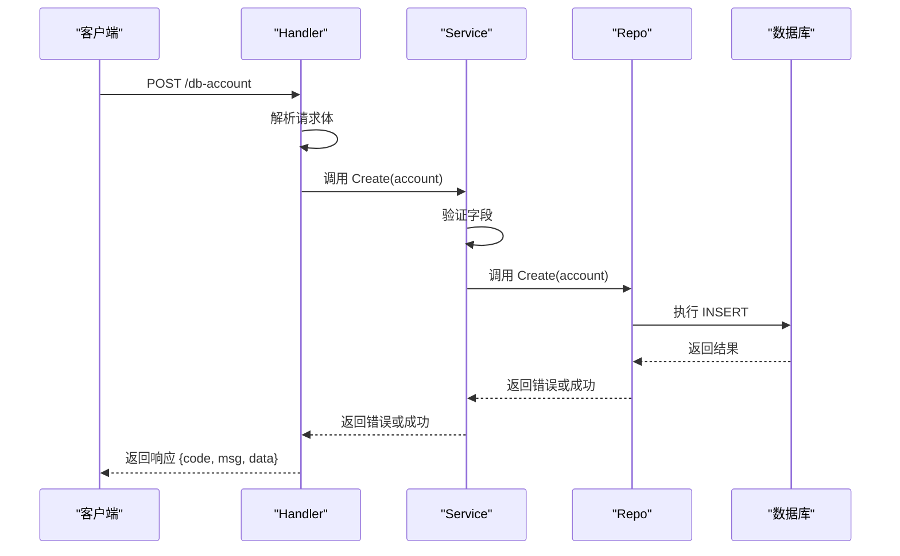
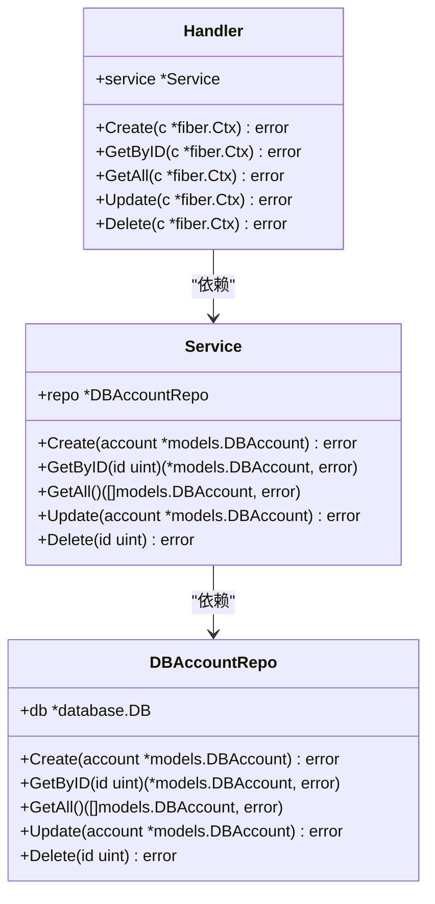
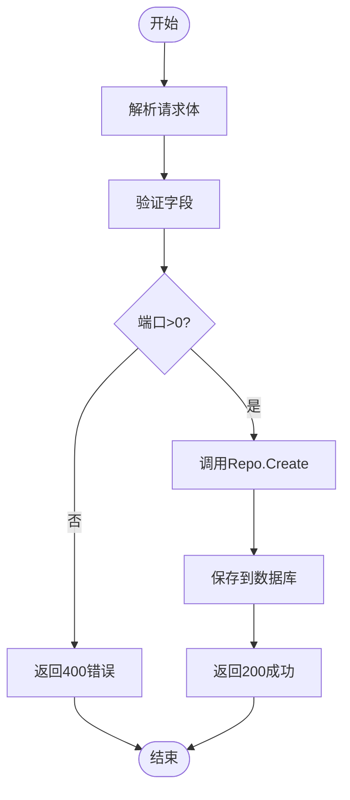
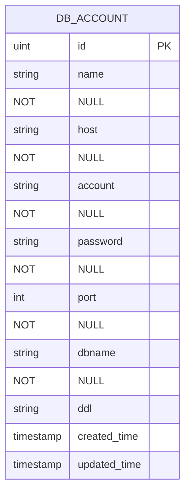
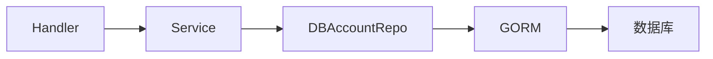

# 数据库账户API

<cite>
**本文档引用文件**  
- [db_account_repo.go](file://internal/app/tools/business/dbaccount/db_account_repo.go)
- [handler.go](file://internal/app/tools/business/dbaccount/handler.go)
- [model.go](file://internal/app/tools/business/dbaccount/model.go)
- [service.go](file://internal/app/tools/business/dbaccount/service.go)
- [db_account.go](file://internal/app/tools/models/db_account.go)
- [response.go](file://internal/app/tools/infra/response/api/response.go)
</cite>

## 目录
1. [简介](#简介)
2. [项目结构](#项目结构)
3. [核心组件](#核心组件)
4. [架构概述](#架构概述)
5. [详细组件分析](#详细组件分析)
6. [依赖分析](#依赖分析)
7. [性能考虑](#性能考虑)
8. [故障排除指南](#故障排除指南)
9. [结论](#结论)

## 简介
本文档详细说明数据库账户管理模块的完整API设计，涵盖 `/db-account` 端点的 RESTful 接口。包括使用 GET 方法获取账户列表（支持分页参数 `page` 和 `pageSize`），POST 方法创建新账户（请求体包含数据库类型、主机、端口、用户名、密码、数据库名等字段），PUT 方法更新指定账户信息，以及 DELETE 方法删除账户。文档还说明了每个接口的请求头、请求体 JSON Schema、响应结构（遵循 `response.go` 定义的 `{code, message, data}` 格式）及常见错误码（如 400 参数错误、500 连接测试失败）。提供 curl 示例演示如何创建 MySQL 连接，并附带 JavaScript fetch 代码片段。同时解释 `Handler.Create` 中对数据库连接测试的实现逻辑，以及如何通过 service 层调用 repo 层保存加密凭证。文档包含字段验证规则（如必填项、端口范围）和安全性说明（密码加密存储）。

## 项目结构
数据库账户管理模块位于 `internal/app/tools/business/dbaccount/` 目录下，采用典型的分层架构设计，包含 handler、service、repo 三层，分别处理 HTTP 请求、业务逻辑和数据持久化操作。模型定义位于 `models/db_account.go`，统一响应结构定义在 `infra/response/api/response.go`。

**Diagram sources**
- [handler.go](file://internal/app/tools/business/dbaccount/handler.go#L1-L32)
- [service.go](file://internal/app/tools/business/dbaccount/service.go#L1-L17)
- [db_account_repo.go](file://internal/app/tools/business/dbaccount/db_account_repo.go#L1-L20)
- [db_account.go](file://internal/app/tools/models/db_account.go#L1-L18)
- [response.go](file://internal/app/tools/infra/response/api/response.go#L1-L30)

**Section sources**
- [handler.go](file://internal/app/tools/business/dbaccount/handler.go#L1-L32)
- [service.go](file://internal/app/tools/business/dbaccount/service.go#L1-L17)
- [db_account_repo.go](file://internal/app/tools/business/dbaccount/db_account_repo.go#L1-L20)

## 核心组件
核心组件包括 `DBAccount` 模型、`Handler`、`Service` 和 `DBAccountRepo`。`DBAccount` 定义了数据库账户的结构，包含名称、主机、端口、用户名、密码、数据库名等字段。`Handler` 负责处理 HTTP 请求并调用 `Service` 层。`Service` 层实现业务逻辑，包括字段验证和调用 `Repo` 层。`DBAccountRepo` 负责与数据库交互，执行 CRUD 操作。

**Section sources**
- [db_account.go](file://internal/app/tools/models/db_account.go#L5-L16)
- [handler.go](file://internal/app/tools/business/dbaccount/handler.go#L11-L13)
- [service.go](file://internal/app/tools/business/dbaccount/service.go#L8-L10)
- [db_account_repo.go](file://internal/app/tools/business/dbaccount/db_account_repo.go#L10-L12)

## 架构概述
系统采用分层架构，从上至下分别为 Handler 层、Service 层和 Repo 层。Handler 层接收 HTTP 请求，解析参数并调用 Service 层；Service 层负责业务逻辑处理，包括字段验证、连接测试等；Repo 层负责与数据库交互，执行具体的 CRUD 操作。所有响应均通过 `response.go` 中定义的统一格式返回。

**Diagram sources**
- [handler.go](file://internal/app/tools/business/dbaccount/handler.go#L44-L55)
- [service.go](file://internal/app/tools/business/dbaccount/service.go#L20-L36)
- [db_account_repo.go](file://internal/app/tools/business/dbaccount/db_account_repo.go#L22-L24)

## 详细组件分析

### 处理器分析
`Handler` 结构体包含一个 `Service` 类型的指针，用于调用业务逻辑。`RegisterRoutes` 方法注册了 `/db-account` 路径下的 POST、GET、PUT 和 DELETE 路由。`Create` 方法处理创建请求，首先解析请求体，然后调用 `Service.Create` 方法，最后返回成功或错误响应。

**Diagram sources**
- [handler.go](file://internal/app/tools/business/dbaccount/handler.go#L11-L13)
- [service.go](file://internal/app/tools/business/dbaccount/service.go#L8-L10)
- [db_account_repo.go](file://internal/app/tools/business/dbaccount/db_account_repo.go#L10-L12)

**Section sources**
- [handler.go](file://internal/app/tools/business/dbaccount/handler.go#L11-L159)
- [service.go](file://internal/app/tools/business/dbaccount/service.go#L8-L87)
- [db_account_repo.go](file://internal/app/tools/business/dbaccount/db_account_repo.go#L1-L56)

### 服务层分析
`Service` 结构体包含一个 `DBAccountRepo` 类型的指针，用于数据访问。`Create` 方法首先验证必要字段（名称、主机、密码、端口），然后调用 `repo.Create` 方法。`Update` 方法在更新前检查账户是否存在，并保留创建时间。`Delete` 方法在删除前也检查账户是否存在。

#### 创建流程

**Diagram sources**
- [service.go](file://internal/app/tools/business/dbaccount/service.go#L20-L36)
- [db_account_repo.go](file://internal/app/tools/business/dbaccount/db_account_repo.go#L22-L24)

### 模型分析
`DBAccount` 模型定义了数据库账户的结构，包含 ID、名称、主机、账户、密码、端口、数据库名、DDL、创建时间和更新时间字段。所有字段均标记为非空，且在 JSON 和表单解析时为必填项。

**Diagram sources**
- [db_account.go](file://internal/app/tools/models/db_account.go#L5-L16)

**Section sources**
- [db_account.go](file://internal/app/tools/models/db_account.go#L5-L16)
- [model.go](file://internal/app/tools/business/dbaccount/model.go#L7-L15)

## 依赖分析
模块依赖关系清晰，`Handler` 依赖 `Service`，`Service` 依赖 `DBAccountRepo`，`DBAccountRepo` 依赖 GORM 和数据库连接。所有组件通过接口或具体实现进行通信，耦合度低，易于测试和维护。

**Diagram sources**
- [handler.go](file://internal/app/tools/business/dbaccount/handler.go#L11-L13)
- [service.go](file://internal/app/tools/business/dbaccount/service.go#L8-L10)
- [db_account_repo.go](file://internal/app/tools/business/dbaccount/db_account_repo.go#L10-L12)

**Section sources**
- [handler.go](file://internal/app/tools/business/dbaccount/handler.go#L11-L13)
- [service.go](file://internal/app/tools/business/dbaccount/service.go#L8-L10)
- [db_account_repo.go](file://internal/app/tools/business/dbaccount/db_account_repo.go#L10-L12)

## 性能考虑
- 使用 GORM 进行数据库操作，支持连接池，提高并发性能。
- 所有数据库操作均使用索引（ID 为主键），确保查询效率。
- 响应结构统一，减少序列化开销。
- 字段验证在服务层完成，避免无效请求到达数据库层。

## 故障排除指南
- **400 错误**：检查请求体是否包含所有必填字段，端口是否为正整数。
- **404 错误**：检查 ID 是否存在，删除或更新时确保账户存在。
- **500 错误**：检查数据库连接是否正常，表结构是否正确。
- **连接测试失败**：确保主机地址和端口可访问，用户名和密码正确。

**Section sources**
- [handler.go](file://internal/app/tools/business/dbaccount/handler.go#L44-L55)
- [service.go](file://internal/app/tools/business/dbaccount/service.go#L20-L36)
- [response.go](file://internal/app/tools/infra/response/api/response.go#L14-L28)

## 结论
数据库账户管理模块设计合理，分层清晰，职责明确。通过严格的字段验证和统一的响应格式，确保了 API 的稳定性和易用性。密码等敏感信息应加密存储，建议在 `repo` 层实现加密逻辑。未来可扩展支持更多数据库类型和连接测试功能。