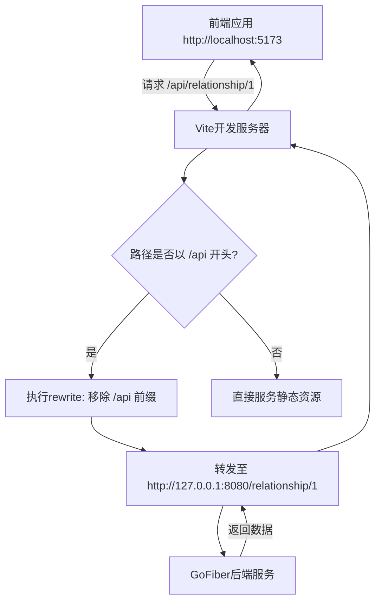

# API集成与调用封装

<cite>
**本文档引用的文件**  
- [api.ts](file://web/database_api/src/lib/api.ts)
- [relationshipApi.ts](file://web/database_api/src/lib/relationshipApi.ts)
- [vite.config.ts](file://web/database_api/vite.config.ts)
- [relationship.ts](file://web/database_api/src/types/relationship.ts)
</cite>

## 目录

1. [引言](#引言)
2. [项目结构概览](#项目结构概览)
3. [核心API封装层设计](#核心api封装层设计)
4. [关系分析模块专用接口](#关系分析模块专用接口)
5. [开发环境跨域代理配置](#开发环境跨域代理配置)
6. [环境变量与基础路径管理](#环境变量与基础路径管理)
7. [API调用示例与状态处理](#api调用示例与状态处理)
8. [结论](#结论)

## 引言

本项目为前后端一体化架构，前端基于Vue 3 + TypeScript构建，后端采用GoFiber框架。API调用层作为前端与后端通信的核心桥梁，承担着请求封装、拦截处理、响应解析和错误提示等关键职责。本文档全面记录前端API调用层的设计与实现，重点分析`api.ts`中的客户端封装机制、`relationshipApi.ts`中针对关系分析模块的专用接口设计，以及`vite.config.ts`中开发环境跨域代理的解决方案。

## 项目结构概览

前端代码位于`web/database_api/src`目录下，主要结构如下：
- `lib/`：存放API封装文件，包括通用客户端`api.ts`和业务专用接口`relationshipApi.ts`
- `types/`：类型定义文件，如`relationship.ts`中定义了关系数据结构
- `router/`：路由配置
- `views/`：页面组件
- 根目录下`vite.config.ts`负责开发服务器配置

该结构实现了逻辑分层清晰、职责分离良好的前端架构设计。

**Section sources**
- [vite.config.ts](file://web/database_api/vite.config.ts#L1-L27)
- [api.ts](file://web/database_api/src/lib/api.ts#L1-L48)

## 核心API封装层设计

`api.ts`文件通过Axios创建了一个统一的HTTP客户端实例，实现了请求拦截、响应拦截和错误处理的标准化流程。

客户端配置了`/api`作为默认基础路径，超时时间为10秒，并设置`Content-Type`为`application/json`。请求拦截器可用于添加认证令牌等前置操作，目前预留了Bearer Token的插入位置。响应拦截器自动提取`response.data`作为返回值，简化了调用方的数据处理逻辑。对于401未授权状态码，拦截器中预留了重定向至登录页的处理逻辑。

这种封装方式确保了所有API请求具有一致的行为模式，提升了代码可维护性和安全性。

**Section sources**
- [api.ts](file://web/database_api/src/lib/api.ts#L1-L48)

## 关系分析模块专用接口

`relationshipApi.ts`文件封装了针对关系分析模块的所有API调用，基于`api.ts`中定义的客户端实例进行扩展。

文件中定义了多个CRUD操作函数，如`createRelationship`、`getRelationshipById`、`updateRelationship`等，均采用异步函数形式返回Promise，符合现代JavaScript异步编程规范。参数类型使用`Partial<Relationship>`以支持部分更新，返回类型严格对应后端接口定义。

特别值得注意的是`analyzeRelationship`函数，它并未使用常规的POST请求，而是采用Server-Sent Events (SSE)技术实现流式响应。该函数接收`id`、消息回调`onMessage`和完成回调`onDone`作为参数，创建`EventSource`连接到`/api/relationship/{id}/analyze`端点。通过监听`onmessage`事件实时接收分析结果，`onerror`处理连接异常，并监听自定义`done`事件以正确关闭连接。这种方式适用于长时间运行的分析任务，能够实时推送进度和结果。

**Section sources**
- [relationshipApi.ts](file://web/database_api/src/lib/relationshipApi.ts#L1-L89)
- [relationship.ts](file://web/database_api/src/types/relationship.ts#L1-L16)

## 开发环境跨域代理配置

在开发阶段，前端Vite服务器运行在5173端口，而后端GoFiber服务运行在8080端口，存在跨域问题。`vite.config.ts`通过配置代理解决此问题。

配置中将所有以`/api`开头的请求代理至`http://127.0.0.1:8080`。`changeOrigin: true`确保请求头中的origin被正确修改为目标服务器地址。最关键的是`rewrite`函数：`(path) => path.replace(/^\/api/, '')`，它将请求路径中的`/api`前缀移除。例如，前端请求`/api/relationship/1`时，代理后实际转发至后端的`/relationship/1`路径。

这一重写机制是必要的，因为后端路由本身不包含`/api`前缀。若不进行重写，代理请求将无法匹配后端路由规则，导致404错误。该配置实现了无缝的开发体验，使前端代码无需关心实际服务地址。



**Diagram sources**
- [vite.config.ts](file://web/database_api/vite.config.ts#L18-L24)

**Section sources**
- [vite.config.ts](file://web/database_api/vite.config.ts#L1-L27)

## 环境变量与基础路径管理

项目通过构建标签（build tags）实现开发与生产环境的无缝切换。在Go代码中，`build_dev.go`和`build_prod.go`分别定义了`dev`和`prod`构建环境。

开发环境下，后端调用`SetupDev`函数启动代理，将非API请求转发至Vite开发服务器。生产环境下，前端构建产物被嵌入二进制文件，通过`embed`包静态服务。这种设计使得前端无需配置不同的API基础路径——在两种环境下，前端始终请求`/api`前缀的接口，由后端或Vite代理负责路由到正确的处理程序。

`api.ts`中设置的`baseURL: '/api'`因此具有环境无关性，确保了代码在不同部署场景下的一致行为，简化了配置管理。

**Section sources**
- [build_dev.go](file://backend/bin/main/build_dev.go#L1-L16)
- [build_prod.go](file://backend/bin/main/build_prod.go#L1-L21)
- [dev.go](file://backend/bin/main/compile/dev.go#L1-L63)

## API调用示例与状态处理

以下是典型的API调用模式示例：

对于常规RESTful操作，如获取所有关系记录：
```typescript
import { getAllRelationships } from '@/lib/relationshipApi';

// 调用示例
const loadRelationships = async () => {
  try {
    const relationships = await getAllRelationships();
    // 处理数据
  } catch (error) {
    // 处理错误，已被拦截器捕获
  }
};
```

对于流式分析任务：
```typescript
import { analyzeRelationship } from '@/lib/relationshipApi';

// 调用示例
const startAnalysis = (id: number) => {
  const eventSource = analyzeRelationship(id, 
    (msg) => {
      // 实时更新UI，显示分析进度或结果
      console.log('收到消息:', msg);
    },
    () => {
      // 分析完成，更新状态
      console.log('分析完成');
    }
  );

  // 可在适当时候手动关闭连接
  // eventSource.close();
};
```

加载状态处理通常在组件中实现，通过布尔标志控制加载指示器的显示。错误提示由全局拦截器统一处理，可根据状态码进行分类提示。

**Section sources**
- [relationshipApi.ts](file://web/database_api/src/lib/relationshipApi.ts#L45-L67)
- [ApiTestView.vue](file://web/database_api/src/views/ApiTestView.vue#L1-L35)

## 结论

本项目的API调用层设计体现了良好的分层架构思想。通过`api.ts`实现通用请求处理，`relationshipApi.ts`封装业务专用接口，`vite.config.ts`解决开发环境跨域问题，三者协同工作，构建了一个健壮、可维护的前端通信体系。SSE技术的应用为长时间运行的任务提供了优秀的用户体验解决方案。基于构建标签的环境切换机制消除了配置差异，实现了开发与生产环境的一致性。整体设计充分考虑了可扩展性、可维护性和开发效率，为项目的持续演进奠定了坚实基础。