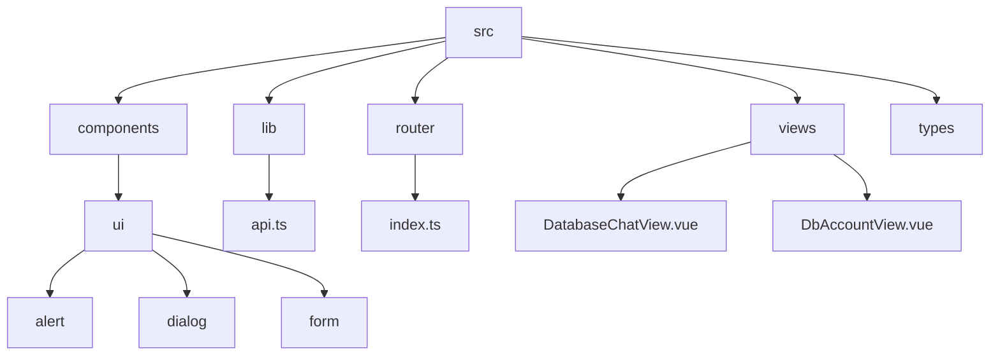
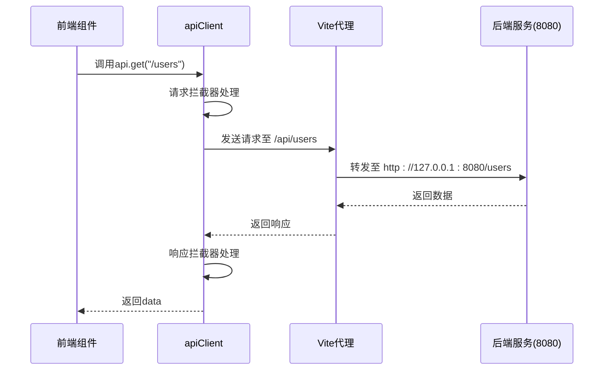

# 前端架构设计

<cite>
**本文档引用的文件**  
- [main.ts](file://web/src/main.ts)
- [vite.config.ts](file://web/vite.config.ts)
- [api.ts](file://web/src/lib/api.ts)
- [index.ts](file://web/src/router/index.ts)
- [Alert.vue](file://web/src/components/ui/alert/Alert.vue)
- [Dialog.vue](file://web/src/components/ui/dialog/Dialog.vue)
- [Form.vue](file://web/src/components/ui/form/Form.vue)
</cite>

## 目录
1. [项目结构](#项目结构)
2. [核心组件](#核心组件)
3. [应用初始化流程](#应用初始化流程)
4. [路由配置与视图组织](#路由配置与视图组织)
5. [Vite开发代理配置](#vite开发代理配置)
6. [UI组件库集成与封装](#ui组件库集成与封装)
7. [API统一调用封装](#api统一调用封装)
8. [结论](#结论)

## 项目结构

项目采用典型的Vue 3 + Vite前端架构，整体结构清晰，模块职责分明。`src`目录下分为`components`（组件）、`lib`（工具与API）、`router`（路由）、`views`（视图）和`types`（类型定义）等核心模块，符合现代前端工程化组织规范。



**Diagram sources**  
- [web/src](file://web/src)

## 核心组件

项目基于shadcn-vue风格的UI组件库进行二次封装，所有基础UI组件位于`src/components/ui`目录下，通过Vue单文件组件（SFC）实现，并通过`index.ts`统一导出，便于在项目中按需引入。组件设计遵循原子化原则，支持高度复用。

**Section sources**  
- [Alert.vue](file://web/src/components/ui/alert/Alert.vue)
- [Dialog.vue](file://web/src/components/ui/dialog/Dialog.vue)
- [Form.vue](file://web/src/components/ui/form/Form.vue)

## 应用初始化流程

`main.ts`为应用入口文件，负责Vue应用的创建与初始化。通过`createApp`创建根实例，并挂载`App.vue`根组件。关键初始化操作包括：
- 引入并使用`vue-router`实现路由控制
- 全局挂载路由实例
- 将应用挂载至DOM节点`#app`

该流程简洁高效，符合Vue 3组合式API的推荐实践。

**Section sources**  
- [main.ts](file://web/src/main.ts#L1-L11)

## 路由配置与视图组织

`src/router/index.ts`定义了完整的前端路由结构，采用`createRouter`与`createWebHistory`构建基于HTML5 History模式的路由系统。路由组织特点如下：
- 根路径`/`重定向至`/test`
- `/test`作为主布局容器，其子路由包含Home、About、API测试、数据库账户管理等视图
- 动态路由`/database-chat/:id`用于加载指定数据库ID的聊天界面，对应`DatabaseChatView`（实际为`IndexView.vue`）

该设计实现了视图的模块化组织与动态加载，支持灵活的导航结构。

```mermaid
flowchart TD
Start[/] --> Redirect[重定向到 /test]
Redirect --> Test[/test]
Test --> Home[/test]
Test --> About[/test/about]
Test --> ApiTest[/test/api-test]
Test --> DbAccount[/test/db-account]
Test --> Login[/test/login]
Dynamic[/database-chat/:id] --> DatabaseChatView
```

**Diagram sources**  
- [index.ts](file://web/src/router/index.ts#L1-L59)

**Section sources**  
- [index.ts](file://web/src/router/index.ts#L1-L59)
- [DatabaseChatView.vue](file://web/src/views/DatabaseChatView.vue)
- [DbAccountView.vue](file://web/src/views/DbAccountView.vue)

## Vite开发代理配置

`vite.config.ts`中配置了开发服务器的代理规则，解决前端开发环境下的跨域问题。关键配置如下：
- 代理路径：`/api`
- 目标地址：`http://127.0.0.1:8080`（后端服务端口）
- `changeOrigin: true`确保请求来源被正确修改
- `rewrite`规则将`/api`前缀移除，实现无缝转发

此配置使得前端在开发时可通过`/api/xxx`请求后端接口，由Vite自动转发至8080端口，无需前端代码关心实际后端地址。

**Section sources**  
- [vite.config.ts](file://web/vite.config.ts#L1-L27)

## UI组件库集成与封装

项目集成shadcn-vue风格的UI组件库，位于`src/components/ui`目录。核心组件如`alert`、`dialog`、`form`等均采用组合式API编写，具备以下特点：
- 每个组件由多个子组件构成（如`AlertDialog`包含`Trigger`、`Content`、`Action`等）
- 通过`index.ts`统一导出，支持按需引入
- 组件高度可定制，支持插槽（slot）和属性（props）扩展
- 风格与Tailwind CSS深度集成，支持主题定制

该封装模式提升了UI一致性与开发效率。

**Section sources**  
- [Alert.vue](file://web/src/components/ui/alert/Alert.vue)
- [Dialog.vue](file://web/src/components/ui/dialog/Dialog.vue)
- [Form.vue](file://web/src/components/ui/form/Form.vue)

## API统一调用封装

`src/lib/api.ts`封装了基于Axios的RESTful API调用客户端，实现统一的请求管理。主要特性包括：
- 基础URL设置为`/api`，与Vite代理规则匹配
- 设置请求超时时间（10秒）和默认请求头
- 配置请求拦截器：可扩展添加认证Token
- 配置响应拦截器：自动返回`response.data`，并统一处理401等错误状态

该封装降低了API调用的复杂度，增强了错误处理能力和可维护性。



**Diagram sources**  
- [api.ts](file://web/src/lib/api.ts#L1-L48)

**Section sources**  
- [api.ts](file://web/src/lib/api.ts#L1-L48)

## 结论

本项目前端架构设计合理，技术选型先进，具备良好的可维护性与扩展性。通过Vue 3组合式API、Vite构建工具、shadcn-vue组件库和Axios封装，构建了一个现代化的前端应用。路由组织清晰，API调用统一，开发环境代理配置完善，为后续功能迭代奠定了坚实基础。