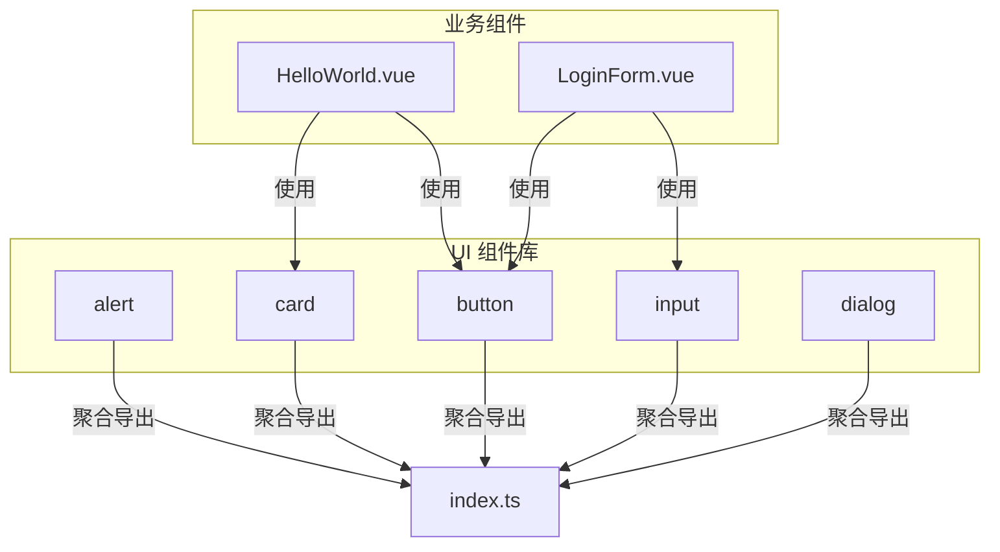
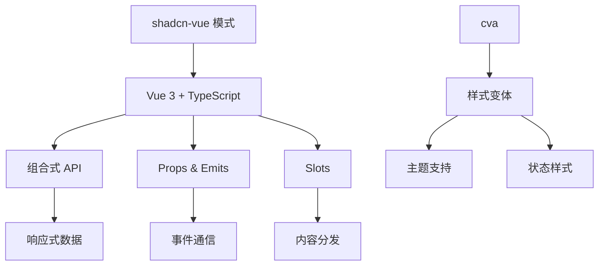
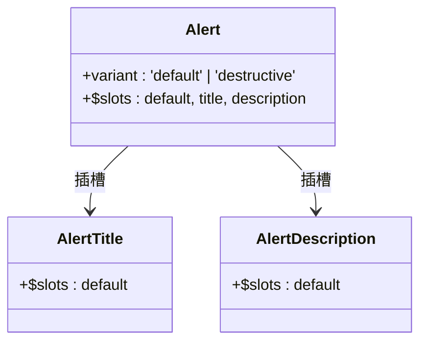
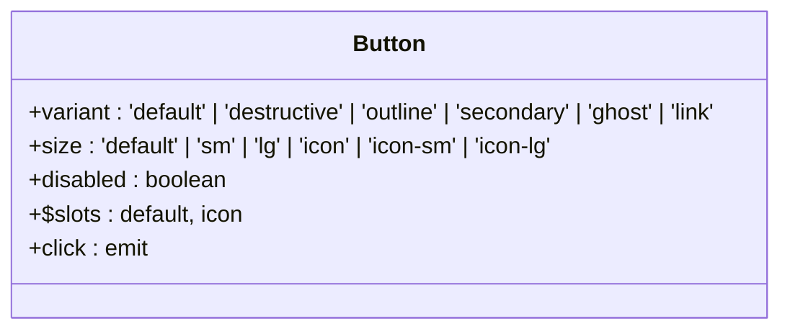
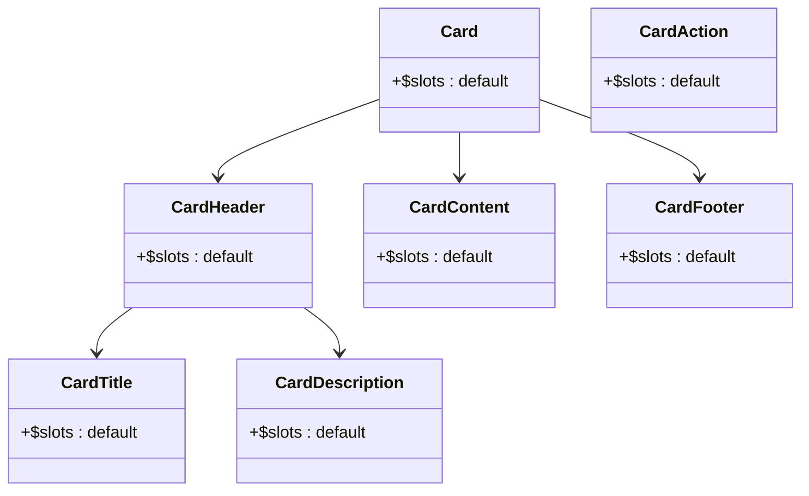
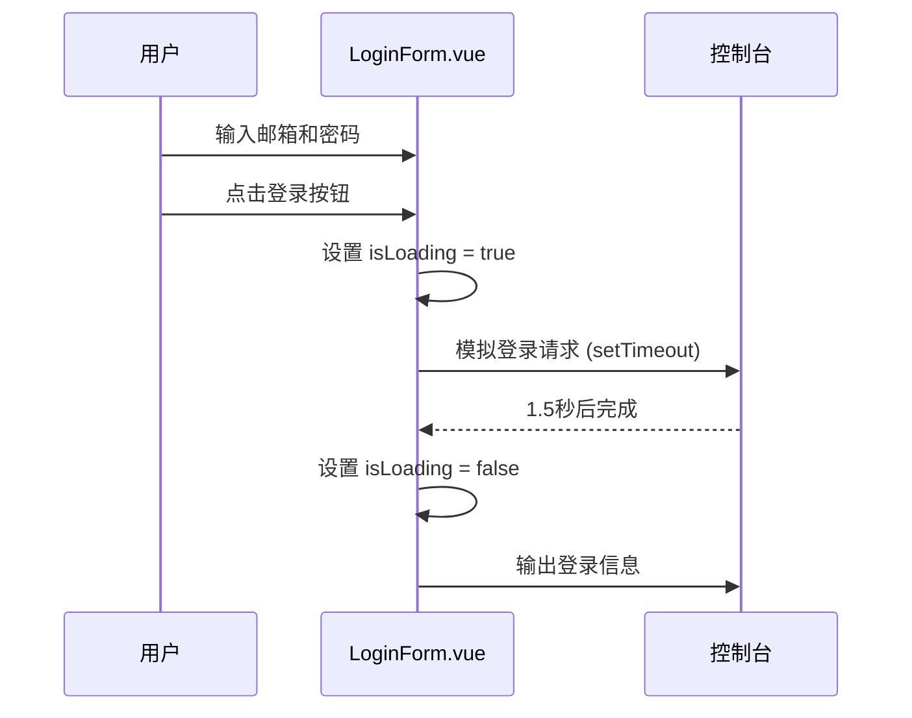
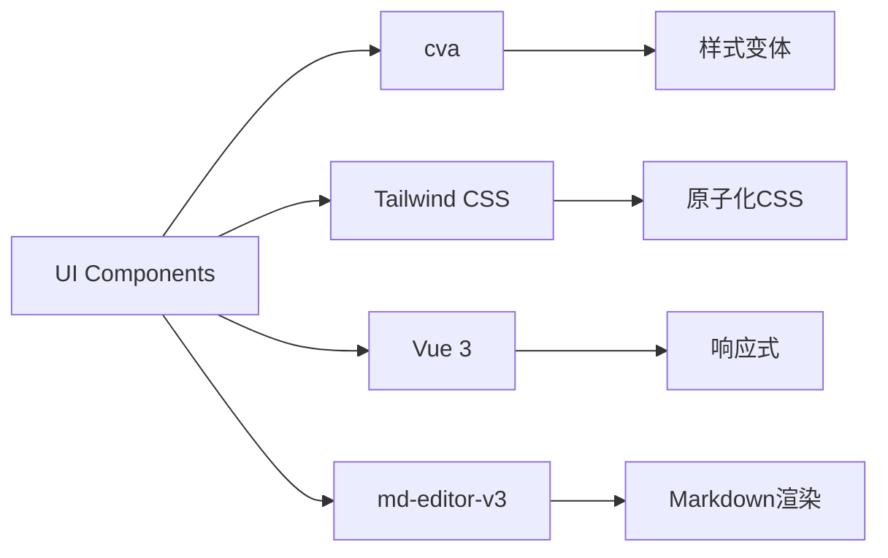

# 组件结构

<cite>
**本文档中引用的文件**  
- [Alert.vue](file://web/src/components/ui/alert/Alert.vue)
- [Button.vue](file://web/src/components/ui/button/Button.vue)
- [Input.vue](file://web/src/components/ui/input/Input.vue)
- [Card.vue](file://web/src/components/ui/card/Card.vue)
- [Dialog.vue](file://web/src/components/ui/dialog/Dialog.vue)
- [index.ts](file://web/src/components/ui/alert/index.ts)
- [index.ts](file://web/src/components/ui/button/index.ts)
- [index.ts](file://web/src/components/ui/card/index.ts)
- [index.ts](file://web/src/components/ui/dialog/index.ts)
- [index.ts](file://web/src/components/ui/input/index.ts)
- [MarkdownViewer.vue](file://web/src/components/ui/MarkdownViewer.vue)
- [HelloWorld.vue](file://web/src/components/HelloWorld.vue)
- [LoginForm.vue](file://web/src/components/LoginForm.vue)
</cite>

## 目录
1. [简介](#简介)
2. [项目结构](#项目结构)
3. [核心组件](#核心组件)
4. [架构概述](#架构概述)
5. [详细组件分析](#详细组件分析)
6. [依赖分析](#依赖分析)
7. [性能考虑](#性能考虑)
8. [故障排除指南](#故障排除指南)
9. [结论](#结论)

## 简介
本文档详细记录了基于 shadcn-vue 的前端 UI 组件库的设计与实现。重点分析了 alert、dialog、button、input、card 等基础组件的封装结构，包括其 Vue 单文件组件（SFC）实现、props 定义、事件机制及插槽使用。同时说明了每个组件目录下 `index.ts` 文件如何实现组件导出聚合以支持按需引入，并解释了 `MarkdownViewer.vue` 的特殊功能实现。通过 `HelloWorld.vue` 和 `LoginForm.vue` 展示了业务组件如何复用 UI 组件库构建界面。

## 项目结构
前端组件库位于 `web/src/components/ui` 目录下，采用模块化设计，每个组件拥有独立的子目录，包含其主组件、子组件和 `index.ts` 导出文件。业务组件（如 `HelloWorld.vue` 和 `LoginForm.vue`）位于 `web/src/components/` 根目录下，用于演示 UI 组件的实际应用。



**Diagram sources**  
- [web/src/components/ui](file://web/src/components/ui)
- [web/src/components/HelloWorld.vue](file://web/src/components/HelloWorld.vue)
- [web/src/components/LoginForm.vue](file://web/src/components/LoginForm.vue)

**Section sources**  
- [web/src/components/ui](file://web/src/components/ui)
- [web/src/components/HelloWorld.vue](file://web/src/components/HelloWorld.vue)
- [web/src/components/LoginForm.vue](file://web/src/components/LoginForm.vue)

## 核心组件
本节分析 alert、button、input、card、dialog 等核心 UI 组件的实现方式，重点关注其 SFC 结构、props 定义、事件处理和插槽机制。

**Section sources**  
- [Alert.vue](file://web/src/components/ui/alert/Alert.vue)
- [Button.vue](file://web/src/components/ui/button/Button.vue)
- [Input.vue](file://web/src/components/ui/input/Input.vue)
- [Card.vue](file://web/src/components/ui/card/Card.vue)
- [Dialog.vue](file://web/src/components/ui/dialog/Dialog.vue)

## 架构概述
整个 UI 组件体系基于 shadcn-vue 设计模式，采用可组合、可扩展的 Vue 3 + TypeScript 实现。组件通过 `class-variance-authority`（cva）进行样式变体管理，支持多种主题和状态。所有组件通过 `index.ts` 文件统一导出，便于按需引入和 Tree Shaking。



**Diagram sources**  
- [button/index.ts](file://web/src/components/ui/button/index.ts)
- [alert/index.ts](file://web/src/components/ui/alert/index.ts)

## 详细组件分析

### 基础组件封装分析

#### Alert 组件分析
Alert 组件由 `Alert.vue`、`AlertTitle.vue` 和 `AlertDescription.vue` 组成，支持默认和破坏性（destructive）两种变体。通过 `alertVariants` 函数定义样式变体，利用 `cva` 实现灵活的 Tailwind CSS 类组合。



**Diagram sources**  
- [Alert.vue](file://web/src/components/ui/alert/Alert.vue)
- [AlertTitle.vue](file://web/src/components/ui/alert/AlertTitle.vue)
- [AlertDescription.vue](file://web/src/components/ui/alert/AlertDescription.vue)
- [index.ts](file://web/src/components/ui/alert/index.ts)

**Section sources**  
- [Alert.vue](file://web/src/components/ui/alert/Alert.vue)
- [index.ts](file://web/src/components/ui/alert/index.ts)

#### Button 组件分析
Button 组件支持多种变体（default、destructive、outline、secondary、ghost、link）和尺寸（default、sm、lg、icon 等）。通过 `buttonVariants` 定义样式规则，结合 `VariantProps` 类型推断实现类型安全的 props。



**Diagram sources**  
- [Button.vue](file://web/src/components/ui/button/Button.vue)
- [index.ts](file://web/src/components/ui/button/index.ts)

**Section sources**  
- [Button.vue](file://web/src/components/ui/button/Button.vue)
- [index.ts](file://web/src/components/ui/button/index.ts)

#### Input 组件分析
Input 组件为原生 input 元素封装，提供统一的样式和禁用状态控制。支持 v-model 双向绑定，通过 class 属性集成 Tailwind CSS 样式。

**Section sources**  
- [Input.vue](file://web/src/components/ui/input/Input.vue)
- [index.ts](file://web/src/components/ui/input/index.ts)

#### Card 组件分析
Card 组件采用组合式结构，由 `Card`、`CardHeader`、`CardTitle`、`CardDescription`、`CardContent`、`CardFooter` 和 `CardAction` 等子组件构成，支持灵活的内容布局。



**Diagram sources**  
- [Card.vue](file://web/src/components/ui/card/Card.vue)
- [CardHeader.vue](file://web/src/components/ui/card/CardHeader.vue)
- [CardTitle.vue](file://web/src/components/ui/card/CardTitle.vue)
- [CardDescription.vue](file://web/src/components/ui/card/CardDescription.vue)
- [CardContent.vue](file://web/src/components/ui/card/CardContent.vue)
- [CardFooter.vue](file://web/src/components/ui/card/CardFooter.vue)
- [CardAction.vue](file://web/src/components/ui/card/CardAction.vue)
- [index.ts](file://web/src/components/ui/card/index.ts)

**Section sources**  
- [Card.vue](file://web/src/components/ui/card/Card.vue)
- [index.ts](file://web/src/components/ui/card/index.ts)

#### Dialog 组件分析
Dialog 组件提供模态对话框功能，由 `Dialog`、`DialogTrigger`、`DialogContent`、`DialogHeader`、`DialogTitle`、`DialogDescription`、`DialogFooter` 等组件组成，支持开放/关闭控制和内容滚动。

**Section sources**  
- [Dialog.vue](file://web/src/components/ui/dialog/Dialog.vue)
- [index.ts](file://web/src/components/ui/dialog/index.ts)

### 导出聚合机制
每个组件目录下的 `index.ts` 文件通过 `export { default as ComponentName } from "./ComponentName.vue"` 语法实现命名导出，便于在项目中按需引入，例如：

```ts
import { Button } from "@/components/ui/button"
import { Alert, AlertTitle, AlertDescription } from "@/components/ui/alert"
```

该机制支持 Tree Shaking，确保未使用的组件不会被打包。

**Section sources**  
- [button/index.ts](file://web/src/components/ui/button/index.ts)
- [alert/index.ts](file://web/src/components/ui/alert/index.ts)
- [card/index.ts](file://web/src/components/ui/card/index.ts)
- [dialog/index.ts](file://web/src/components/ui/dialog/index.ts)
- [input/index.ts](file://web/src/components/ui/input/index.ts)

### MarkdownViewer 特殊功能实现
`MarkdownViewer.vue` 组件基于 `md-editor-v3` 库实现，用于渲染 AI 返回的 Markdown 内容。通过 `MdPreview` 组件解析并展示 Markdown，`MdCatalog` 提供内容目录导航功能，支持滚动同步。

**Section sources**  
- [MarkdownViewer.vue](file://web/src/components/ui/MarkdownViewer.vue)

### 业务组件复用示例

#### HelloWorld 组件分析
`HelloWorld.vue` 作为示例组件，展示了基础的 Vue 响应式数据绑定和事件处理，虽未直接使用复杂 UI 组件，但体现了 Vue 3 的基本用法。

**Section sources**  
- [HelloWorld.vue](file://web/src/components/HelloWorld.vue)

#### LoginForm 组件分析
`LoginForm.vue` 是典型的业务组件，复用了原生 input 和 button 元素，并通过 Tailwind CSS 手动实现样式。展示了表单状态管理（`form`、`isLoading`）和提交处理逻辑。



**Diagram sources**  
- [LoginForm.vue](file://web/src/components/LoginForm.vue)

**Section sources**  
- [LoginForm.vue](file://web/src/components/LoginForm.vue)

## 依赖分析
UI 组件库依赖 `class-variance-authority` 进行样式变体管理，`tailwindcss` 提供实用类支持，`vue` 3.x 作为框架基础。`MarkdownViewer.vue` 额外依赖 `md-editor-v3` 实现 Markdown 渲染。



**Diagram sources**  
- [package.json](file://web/package.json)
- [button/index.ts](file://web/src/components/ui/button/index.ts)
- [MarkdownViewer.vue](file://web/src/components/ui/MarkdownViewer.vue)

## 性能考虑
- 所有组件均采用按需引入方式，通过 `index.ts` 聚合导出，支持 Tree Shaking
- 使用 `v-memo` 或 `computed` 优化渲染性能
- `MarkdownViewer.vue` 仅在需要时加载 `md-editor-v3`，避免初始包体积过大
- 组件设计遵循单一职责原则，确保可维护性和复用性

## 故障排除指南
- **组件样式未生效**：检查是否正确引入 Tailwind CSS 和组件样式类
- **按需引入失败**：确认 `index.ts` 导出语法正确，路径无误
- **Markdown 不渲染**：确保 `source` prop 传递了有效的 Markdown 字符串
- **响应式失效**：检查是否在 `<script setup>` 中正确使用 `ref` 或 `reactive`

**Section sources**  
- [tailwind.config.js](file://web/tailwind.config.js)
- [vite.config.ts](file://web/vite.config.ts)
- [MarkdownViewer.vue](file://web/src/components/ui/MarkdownViewer.vue)

## 结论
该前端组件库基于 shadcn-vue 模式构建，具有良好的可扩展性、类型安全性和按需加载能力。通过标准化的 SFC 结构和 `cva` 样式管理，实现了统一的设计语言。业务组件可轻松复用这些基础组件构建复杂界面，同时保持代码简洁和维护性。未来可进一步完善可访问性（a11y）支持和响应式适配策略。