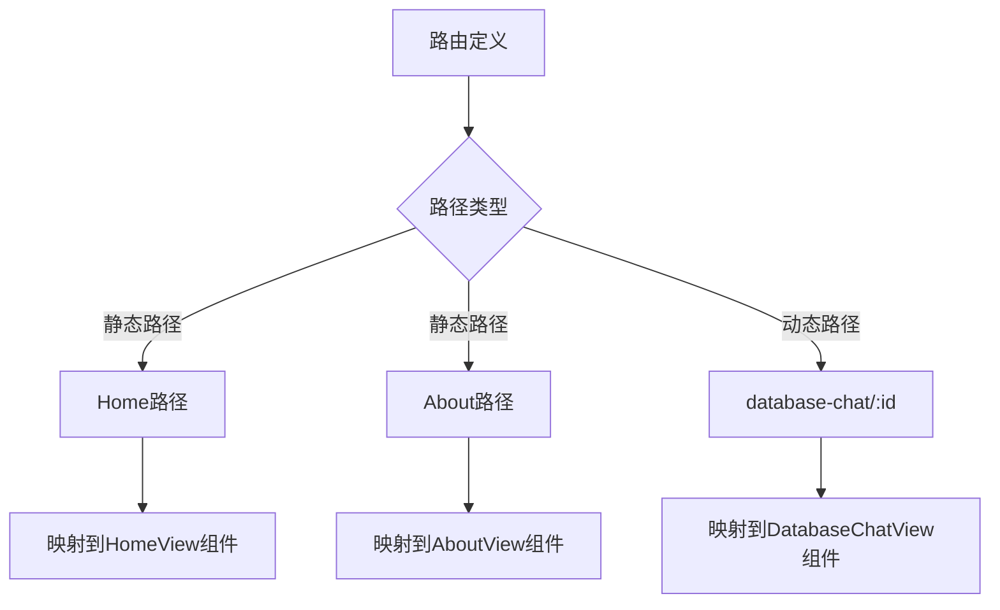
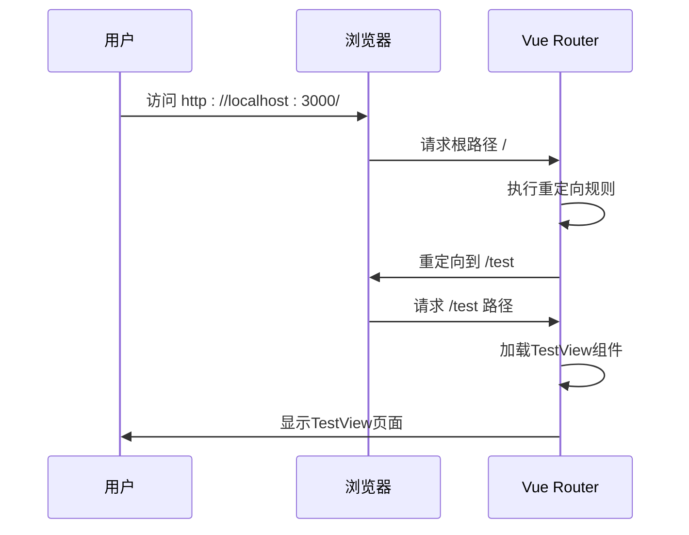
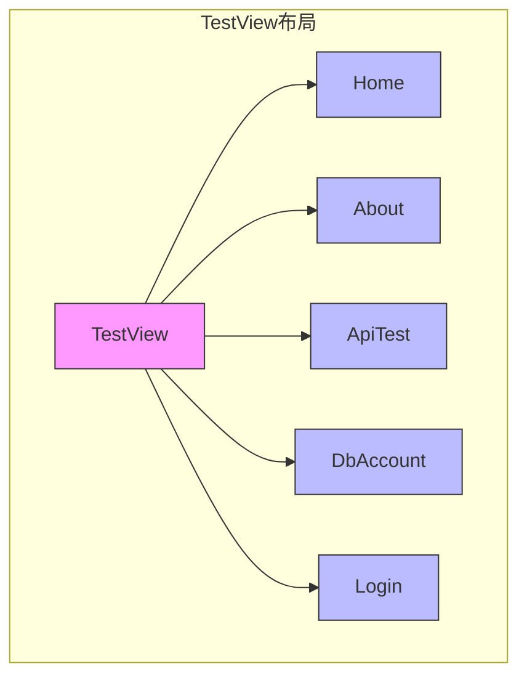

# 路由与状态管理

<cite>
**Referenced Files in This Document**   
- [index.ts](file://web/database_api/src/router/index.ts)
- [main.ts](file://web/database_api/src/main.ts)
- [TestView.vue](file://web/database_api/src/views/TestView.vue)
</cite>

## 目录
1. [路由配置解析](#路由配置解析)
2. [路由类型与配置差异](#路由类型与配置差异)
3. [SPA导航行为分析](#spa导航行为分析)
4. [嵌套路由结构](#嵌套路由结构)
5. [应用初始化流程](#应用初始化流程)
6. [状态管理建议](#状态管理建议)

## 路由配置解析

Vue Router的配置通过`createRouter`函数创建路由实例，采用`createWebHistory`模式实现单页应用(SPA)的无刷新导航。路由配置定义了应用的导航结构和页面映射关系。

**Section sources**
- [index.ts](file://web/database_api/src/router/index.ts#L1-L59)

## 路由类型与配置差异

### 静态路由配置
静态路由如Home、About等页面通过明确的路径定义实现，每个路由项包含路径、名称和对应的组件引用。这些路由在应用启动时即被确定，无需参数即可访问。

### 动态路由配置
动态路由`/database-chat/:id`通过路径参数`:id`实现，允许在相同组件模板下展示不同数据内容。这种配置方式适用于需要根据ID或其他参数动态加载内容的场景，如数据库会话详情页面。



**Diagram sources**
- [index.ts](file://web/database_api/src/router/index.ts#L10-L50)

**Section sources**
- [index.ts](file://web/database_api/src/router/index.ts#L10-L50)

## SPA导航行为分析

`createWebHistory`模式利用HTML5 History API实现URL导航而无需页面刷新，提供类似多页应用的用户体验。当用户访问根路径`/`时，系统通过重定向规则自动跳转到`/test`路径，这一设计意图是确保应用有明确的默认入口点，避免空白页面或错误状态。



**Diagram sources**
- [index.ts](file://web/database_api/src/router/index.ts#L12-L13)

**Section sources**
- [index.ts](file://web/database_api/src/router/index.ts#L12-L13)

## 嵌套路由结构

在`/test`路径下定义的`children`结构实现了功能模块的组织。TestView作为父级布局组件，其内部通过`<RouterView />`提供插槽，子路由组件在该插槽中渲染。这种嵌套设计将相关功能模块组织在同一布局框架内，实现了导航一致性与界面统一性。



**Diagram sources**
- [index.ts](file://web/database_api/src/router/index.ts#L16-L44)
- [TestView.vue](file://web/database_api/src/views/TestView.vue#L59)

**Section sources**
- [index.ts](file://web/database_api/src/router/index.ts#L16-L44)
- [TestView.vue](file://web/database_api/src/views/TestView.vue#L59)

## 应用初始化流程

### 应用实例创建
`main.ts`文件中通过`createApp(App)`创建Vue应用实例，App作为根组件承载整个应用的UI结构。这一过程初始化了Vue的核心功能和组件树。

### 插件注册机制
`app.use(router)`将Vue Router作为插件注册到应用实例中，使路由功能在整个应用中可用。这种插件机制遵循Vue的扩展规范，确保路由系统与Vue核心的无缝集成。

### 挂载过程
`app.mount('#app')`将应用实例挂载到DOM中id为'app'的元素上，完成Vue应用与页面的连接。这一过程触发组件渲染和路由初始化，使应用进入可交互状态。

```mermaid
flowchart TD
A[导入依赖] --> B[创建应用实例]
B --> C[注册路由插件]
C --> D[挂载到DOM]
D --> E[应用就绪]
A --> A1[createApp]
A --> A2[router]
B --> B1[createApp(App)]
C --> C1[app.use(router)]
D --> D1[app.mount('#app')]
```

**Diagram sources**
- [main.ts](file://web/database_api/src/main.ts#L7-L10)

**Section sources**
- [main.ts](file://web/database_api/src/main.ts#L7-L10)

## 状态管理建议

尽管当前项目未使用Vuex或Pinia进行状态管理，但随着应用复杂度增加，建议采用Pinia进行模块化状态管理。Pinia提供更简洁的API、更好的TypeScript支持和模块化设计，适合管理跨组件的共享状态，如用户认证信息、数据库连接状态等。通过定义store模块，可以实现状态的集中管理和响应式更新，提高代码的可维护性和可测试性。

**Section sources**
- [main.ts](file://web/database_api/src/main.ts)
- [index.ts](file://web/database_api/src/router/index.ts)