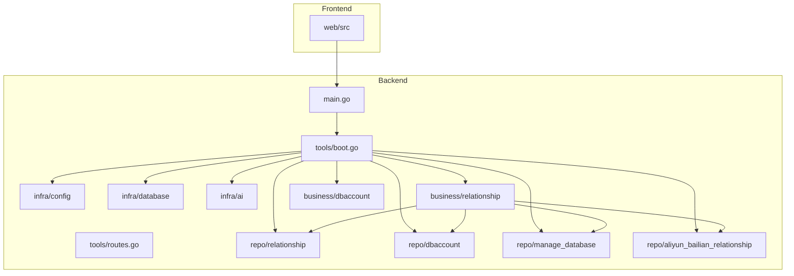
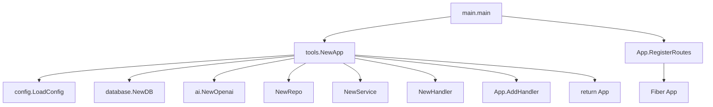
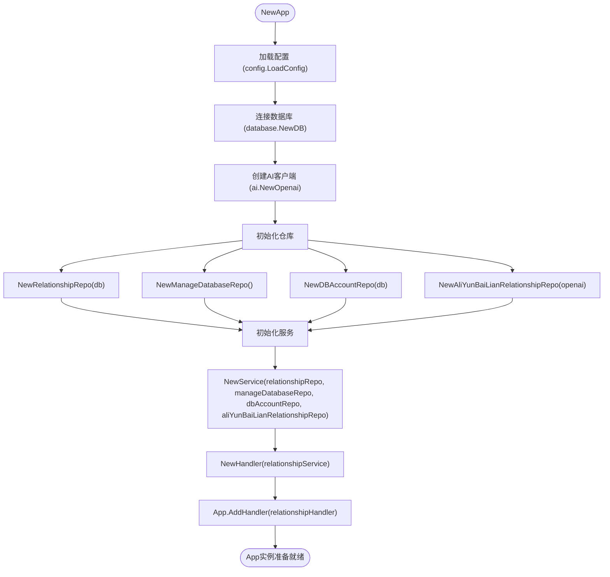
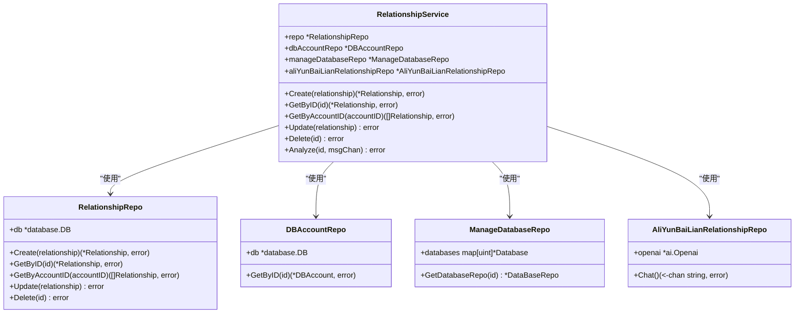
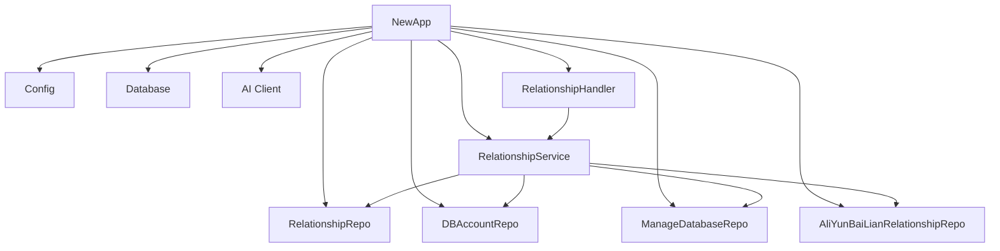

# 依赖注入机制

<cite>
**本文档引用的文件**
- [main.go](file://main.go)
- [boot.go](file://internal/app/tools/boot.go)
- [service.go](file://internal/app/tools/business/relationship/service.go)
- [relationship_repo.go](file://internal/app/tools/business/relationship/relationship_repo.go)
- [db_account_repo.go](file://internal/app/tools/business/dbaccount/db_account_repo.go)
- [manage_database_repo.go](file://internal/app/tools/repo/manage_database_repo.go)
- [aliyun_bailian_relationship_repo.go](file://internal/app/tools/repo/aliyun_bailian_relationship/aliyun_bailian_relationship_repo.go)
- [config.go](file://internal/infra/config/config.go)
- [db.go](file://internal/infra/database/db.go)
- [routes.go](file://internal/app/tools/routes.go)
</cite>

## 目录
1. [简介](#简介)
2. [项目结构](#项目结构)
3. [核心组件](#核心组件)
4. [架构概述](#架构概述)
5. [详细组件分析](#详细组件分析)
6. [依赖分析](#依赖分析)
7. [性能考虑](#性能考虑)
8. [故障排除指南](#故障排除指南)
9. [结论](#结论)

## 简介
本系统采用手动依赖注入（DI）模式实现控制反转（IoC），通过 `NewApp` 函数作为依赖容器，在应用启动时集中初始化基础设施、服务与仓库实例。该设计将对象的创建和依赖关系的管理从具体业务逻辑中解耦，显著提升了代码的可测试性和模块独立性。整个流程始于 `main.go` 的入口函数，依次加载配置、建立数据库连接、初始化 AI 客户端，并逐层组装 `Repo` 和 `Service` 实例，最终完成路由注册，形成一个清晰、可维护的应用生命周期。

## 项目结构
系统采用分层架构，主要分为 `internal` 和 `web` 两大模块。`internal` 目录存放后端核心逻辑，遵循清晰的分层原则：`infra` 层负责基础设施（配置、数据库、AI），`app/tools` 层包含应用核心（依赖注入、路由）、业务模块（`business`）和数据访问层（`repo`）。`business` 目录下的每个子模块（如 `relationship`、`dbaccount`）都遵循 `handler -> service -> repo` 的三层模式。`web` 目录存放前端代码，通过 Vite 构建，与后端通过 RESTful API 交互。



**Diagram sources**
- [main.go](file://main.go#L1-L25)
- [boot.go](file://internal/app/tools/boot.go#L1-L92)

**Section sources**
- [main.go](file://main.go#L1-L25)
- [project_structure](file://#project_structure)

## 核心组件
系统的核心是 `App` 结构体和 `NewApp` 初始化函数。`App` 作为依赖容器，持有所有已注册的 `Handler` 实例和数据库连接。`NewApp` 函数是整个依赖注入过程的起点，它按严格的顺序执行：加载配置 → 连接数据库 → 创建 AI 客户端 → 初始化各模块的 `Repo` → 组装 `Service` → 创建 `Handler` → 注册到 `App` 容器。这种手动、显式的依赖注入方式避免了复杂的 DI 框架，使依赖关系一目了然，便于调试和理解。

**Section sources**
- [boot.go](file://internal/app/tools/boot.go#L18-L92)
- [main.go](file://main.go#L1-L25)

## 架构概述
系统采用经典的分层架构，实现了关注点分离。最底层是 `infra` 层，提供配置、数据库和 AI 服务等基础设施。中间是 `repo` 层，封装了对数据库的直接访问。上层是 `business` 层，包含 `Service` 和 `Handler`，`Service` 实现核心业务逻辑，`Handler` 处理 HTTP 请求。`NewApp` 函数作为“粘合剂”，在启动时自底向上地组装这些层。`App` 实例通过 `RegisterRoutes` 方法将所有 `Handler` 的路由注册到 Fiber 框架，完成应用的启动。



**Diagram sources**
- [main.go](file://main.go#L8-L25)
- [boot.go](file://internal/app/tools/boot.go#L40-L92)
- [routes.go](file://internal/app/tools/routes.go#L1-L10)

## 详细组件分析

### RelationshipService 依赖注入分析
以 `relationshipService` 的创建为例，可以清晰地看到手动依赖注入的过程。`NewService` 函数明确声明了四个依赖：`relationshipRepo`、`manageDatabaseRepo`、`dbAccountRepo` 和 `aliYunBaiLianRelationshipRepo`。在 `NewApp` 函数中，这四个依赖被依次创建并作为参数传递给 `NewService`，最终返回一个完全初始化的 `Service` 实例。

#### 依赖注入流程图


**Diagram sources**
- [boot.go](file://internal/app/tools/boot.go#L47-L78)
- [service.go](file://internal/app/tools/business/relationship/service.go#L22-L32)

#### 关系服务类图


**Diagram sources**
- [service.go](file://internal/app/tools/business/relationship/service.go#L14-L20)
- [relationship_repo.go](file://internal/app/tools/business/relationship/relationship_repo.go#L11-L12)
- [db_account_repo.go](file://internal/app/tools/business/dbaccount/db_account_repo.go#L11-L12)
- [manage_database_repo.go](file://internal/app/tools/repo/manage_database_repo.go#L9-L10)
- [aliyun_bailian_relationship_repo.go](file://internal/app/tools/repo/aliyun_bailian_relationship/aliyun_bailian_relationship_repo.go#L12-L13)

**Section sources**
- [service.go](file://internal/app/tools/business/relationship/service.go#L1-L182)
- [boot.go](file://internal/app/tools/boot.go#L62-L78)

### 启动流程分析
应用的完整生命周期始于 `main.go` 的 `main` 函数。它调用 `tools.NewApp(BuildEnv)`，触发整个依赖注入和初始化过程。`NewApp` 返回一个配置好的 `App` 实例后，`main` 函数立即调用其 `RegisterRoutes` 方法，将所有业务模块的路由注册到 Fiber Web 框架。最后，Web 服务器启动，开始监听请求。这个流程清晰地展示了从依赖容器创建、依赖组装到服务暴露的全过程。

```mermaid
sequenceDiagram
participant Main as main.go
participant NewApp as NewApp函数
participant Config as config.LoadConfig
participant DB as database.NewDB
participant AI as ai.NewOpenai
participant Repo as NewRepo
participant Service as NewService
participant Handler as NewHandler
participant App as App实例
participant Routes as RegisterRoutes
participant Fiber as Fiber框架
Main->>NewApp : 调用 NewApp(BuildEnv)
NewApp->>Config : 加载配置
Config-->>NewApp : 返回 Config
NewApp->>DB : 连接数据库
DB-->>NewApp : 返回 *DB
NewApp->>AI : 创建AI客户端
AI-->>NewApp : 返回 *Openai
NewApp->>Repo : 初始化各模块Repo
Repo-->>NewApp : 返回 *Repo实例
NewApp->>Service : 使用Repo创建Service
Service-->>NewApp : 返回 *Service实例
NewApp->>Handler : 使用Service创建Handler
Handler-->>NewApp : 返回 *Handler实例
NewApp->>App : 调用 AddHandler
App-->>NewApp : Handler被注册
NewApp-->>Main : 返回 *App实例
Main->>Routes : 调用 api.RegisterRoutes(fib)
Routes->>Fiber : 注册所有路由
Fiber-->>Main : 路由注册完成
Main->>Fiber : fib.Listen(" : 8080")
Fiber-->> : 服务器启动，监听请求
```

**Diagram sources**
- [main.go](file://main.go#L8-L25)
- [boot.go](file://internal/app/tools/boot.go#L40-L92)
- [routes.go](file://internal/app/tools/routes.go#L1-L10)

**Section sources**
- [main.go](file://main.go#L8-L25)
- [boot.go](file://internal/app/tools/boot.go#L40-L92)

## 依赖分析
系统的依赖关系清晰且单向。高层模块（如 `Service`）依赖于低层模块（如 `Repo`），而 `NewApp` 函数作为顶层协调者，负责创建所有依赖并将其注入到需要它们的组件中。这种设计避免了循环依赖，确保了模块的独立性。外部依赖通过 `infra` 层进行封装，如 `database` 和 `ai` 包，使得核心业务逻辑不直接耦合于具体的数据库或 AI 服务实现，便于未来替换。



**Diagram sources**
- [boot.go](file://internal/app/tools/boot.go#L40-L92)

**Section sources**
- [boot.go](file://internal/app/tools/boot.go#L18-L92)

## 性能考虑
该依赖注入模式在启动时完成所有对象的创建和依赖注入，属于“饿汉式”单例模式。这虽然在应用启动时有轻微的延迟，但避免了运行时动态创建对象的开销，对于大多数请求处理来说是高效的。数据库连接池在 `database.NewDB` 中被正确配置，有助于管理数据库连接，提升并发性能。AI 客户端的连接在 `NewOpenai` 中创建，其内部实现应考虑连接复用以优化性能。

## 故障排除指南
- **依赖注入失败**：检查 `NewApp` 函数中的初始化顺序，确保被依赖的组件（如 `Repo`）在依赖它的组件（如 `Service`）之前创建。
- **数据库连接错误**：确认 `config.go` 中的 `DatabaseURL` 配置正确，并检查 `.env` 文件或环境变量。
- **AI 服务调用失败**：验证 `OpenaiKey` 和 `OpenaiURl` 配置项的值是否正确。
- **路由无法访问**：确保 `Handler` 实例已通过 `App.AddHandler` 方法正确注册，并且 `RegisterRoutes` 方法被成功调用。

**Section sources**
- [boot.go](file://internal/app/tools/boot.go#L50-L55)
- [config.go](file://internal/infra/config/config.go#L13-L20)

## 结论
本系统通过手动依赖注入实现了优雅的控制反转。`NewApp` 函数作为中心化的依赖容器，清晰地管理了从基础设施到业务逻辑的整个对象图的创建和组装过程。以 `relationshipService` 为例，其四个依赖的注入过程充分体现了该模式的透明性和可预测性。这种设计极大地增强了代码的可测试性，因为可以在单元测试中轻松地为 `Service` 注入模拟的 `Repo` 实现。同时，它也保证了模块间的松耦合，提升了系统的可维护性和可扩展性。整个启动流程从 `main.go` 开始，经过依赖注入、服务组装，最终完成路由注册，构成了一个健壮、清晰的应用生命周期。