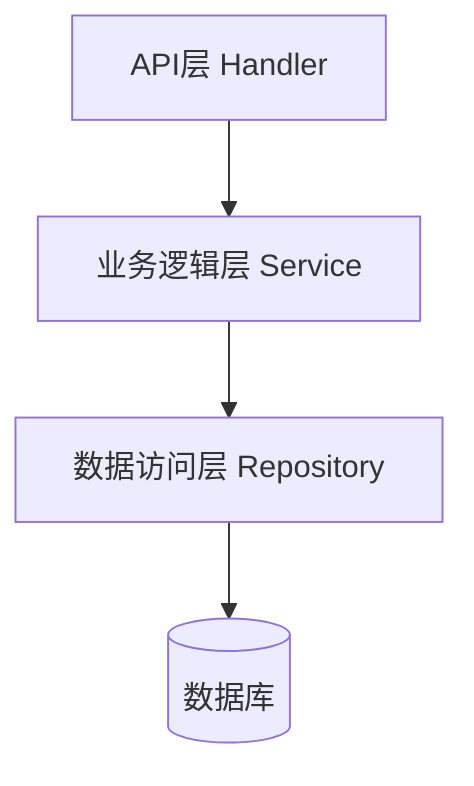
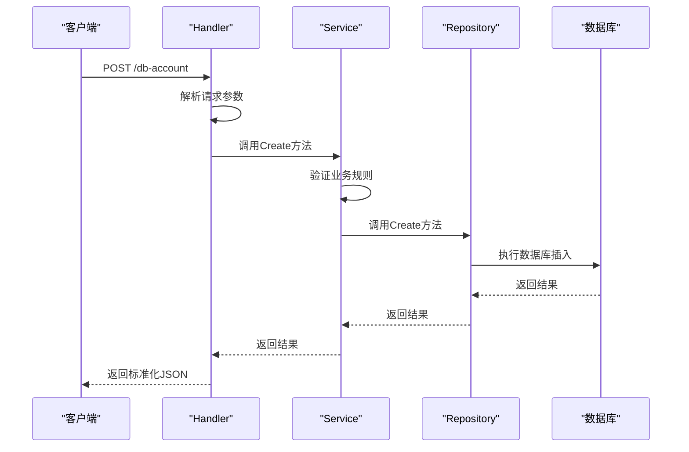

# 分层架构设计

<cite>
**本文档引用的文件**   
- [handler.go](file://internal/app/tools/business/dbaccount/handler.go)
- [service.go](file://internal/app/tools/business/dbaccount/service.go)
- [db_account_repo.go](file://internal/app/tools/business/dbaccount/db_account_repo.go)
- [response.go](file://internal/app/tools/infra/response/api/response.go)
- [handler_interfaces.go](file://internal/shared/handler_interfaces.go)
- [model.go](file://internal/app/tools/models/db_account.go)
- [boot.go](file://internal/app/tools/boot.go)
- [routes.go](file://internal/app/tools/routes.go)
</cite>

## 目录
1. [项目结构](#项目结构)
2. [核心分层架构](#核心分层架构)
3. [API层（Handler）](#apilayerhandler)
4. [业务逻辑层（Service）](#业务逻辑层service)
5. [数据访问层（Repository）](#数据访问层repository)
6. [调用链分析：dbaccount模块](#调用链分析dbaccount模块)
7. [模块解耦与接口定义](#模块解耦与接口定义)
8. [错误处理机制](#错误处理机制)
9. [统一响应格式](#统一响应格式)

## 项目结构

项目采用分层架构设计，主要目录结构如下：

```
internal/
├── app/
│   └── tools/
│       ├── business/           # 业务模块
│       │   ├── dbaccount/      # 数据库账号模块
│       │   │   ├── handler.go  # API层
│       │   │   ├── service.go  # 业务逻辑层
│       │   │   └── db_account_repo.go  # 数据访问层
│       │   └── relationship/   # 关系模块
│       ├── infra/
│       │   └── response/
│       │       └── api/
│       │           └── response.go  # 统一响应格式
│       ├── models/             # 数据模型
│       ├── repo/               # 仓库实现
│       ├── boot.go             # 应用启动
│       └── routes.go           # 路由注册
```

**Section sources**
- [boot.go](file://internal/app/tools/boot.go#L1-L93)
- [routes.go](file://internal/app/tools/routes.go#L1-L11)

## 核心分层架构

系统采用GoFiber框架实现的三层架构模式，分别为：

1. **API层（Handler）**：处理HTTP请求与响应，负责参数解析、路由注册和返回标准化JSON
2. **业务逻辑层（Service）**：协调业务逻辑，组合多个Repository完成复杂操作
3. **数据访问层（Repository）**：封装GORM数据库操作，提供数据持久化能力

各层之间通过依赖注入方式连接，保持松耦合设计。



**Diagram sources**
- [handler.go](file://internal/app/tools/business/dbaccount/handler.go#L11-L13)
- [service.go](file://internal/app/tools/business/dbaccount/service.go#L8-L10)
- [db_account_repo.go](file://internal/app/tools/business/dbaccount/db_account_repo.go#L10-L12)

## API层（Handler）

API层负责处理HTTP请求与响应，主要职责包括：

- 路由注册
- 请求参数解析
- 调用Service层执行业务逻辑
- 返回标准化JSON响应

以`dbaccount`模块为例，Handler结构体包含对Service层的引用：

```go
type Handler struct {
    service *Service
}
```

通过`RegisterRoutes`方法注册路由：

```go
func (h *Handler) RegisterRoutes(app fiber.Router) {
    route := app.Group("/db-account")
    route.Post("/", h.Create)
    route.Get("/:id", h.GetByID)
    route.Get("/", h.GetAll)
    route.Put("/:id", h.Update)
    route.Delete("/:id", h.Delete)
}
```

使用`api.Success`和`api.Error`返回标准化响应：

```go
return api2.Success(c, account, "数据库账号创建成功")
return api2.Error(c, 400, "请求参数解析失败")
```

**Section sources**
- [handler.go](file://internal/app/tools/business/dbaccount/handler.go#L11-L32)
- [handler.go](file://internal/app/tools/business/dbaccount/handler.go#L44-L55)

## 业务逻辑层（Service）

业务逻辑层负责协调业务操作，主要职责包括：

- 验证业务规则
- 组合多个Repository操作
- 处理复杂业务流程
- 传递错误信息

Service层通过依赖Repository层实现数据操作：

```go
type Service struct {
    repo *DBAccountRepo
}
```

在创建数据库账号时，Service层会验证必要字段：

```go
func (s *Service) Create(account *models.DBAccount) error {
    // 验证必要字段
    if account.Name == "" {
        return errors.New("账号名称不能为空")
    }
    if account.Host == "" {
        return errors.New("主机地址不能为空")
    }
    // ... 其他验证
    return s.repo.Create(account)
}
```

**Section sources**
- [service.go](file://internal/app/tools/business/dbaccount/service.go#L8-L10)
- [service.go](file://internal/app/tools/business/dbaccount/service.go#L20-L36)

## 数据访问层（Repository）

数据访问层封装GORM数据库操作，提供基本的CRUD功能：

```go
type DBAccountRepo struct {
    db *database.DB
}
```

实现具体的数据库操作方法：

```go
func (r *DBAccountRepo) Create(account *models.DBAccount) error {
    return r.db.Create(account).Error
}

func (r *DBAccountRepo) GetByID(id uint) (*models.DBAccount, error) {
    var account models.DBAccount
    err := r.db.First(&account, id).Error
    if err != nil {
        if errors.Is(err, gorm.ErrRecordNotFound) {
            return nil, errors.New("数据库账号不存在")
        }
        return nil, err
    }
    return &account, nil
}
```

**Section sources**
- [db_account_repo.go](file://internal/app/tools/business/dbaccount/db_account_repo.go#L10-L12)
- [db_account_repo.go](file://internal/app/tools/business/dbaccount/db_account_repo.go#L23-L38)

## 调用链分析：dbaccount模块

以创建数据库账号为例，展示从Handler接收请求到数据持久化的完整调用链：



**Diagram sources**
- [handler.go](file://internal/app/tools/business/dbaccount/handler.go#L44-L55)
- [service.go](file://internal/app/tools/business/dbaccount/service.go#L20-L36)
- [db_account_repo.go](file://internal/app/tools/business/dbaccount/db_account_repo.go#L23-L25)

## 模块解耦与接口定义

通过`HandlerInterfaces`接口实现模块解耦：

```go
type HandlerInterfaces interface {
    RegisterRoutes(r fiber.Router)
}
```

在`App`结构体中维护Handler接口列表：

```go
type App struct {
    Handlers []shared.HandlerInterfaces
    DB       *database2.DB
}
```

通过`AddHandler`方法添加处理器：

```go
func (a *App) AddHandler(handler shared.HandlerInterfaces) {
    a.Handlers = append(a.Handlers, handler)
}
```

在`RegisterRoutes`中统一注册所有路由：

```go
func (a *App) RegisterRoutes(app *fiber.App) {
    api := app.Group("/api")
    for _, handler := range a.Handlers {
        handler.RegisterRoutes(api)
    }
}
```

这种设计使得新增业务模块时无需修改核心代码，只需实现`HandlerInterfaces`接口并注册即可。

**Section sources**
- [handler_interfaces.go](file://internal/shared/handler_interfaces.go#L5-L7)
- [boot.go](file://internal/app/tools/boot.go#L18-L21)
- [routes.go](file://internal/app/tools/routes.go#L5-L10)

## 错误处理机制

系统采用分层错误处理机制：

1. **Repository层**：处理数据库层面的错误，如记录不存在
2. **Service层**：处理业务规则验证错误
3. **Handler层**：处理请求参数解析错误，并将底层错误传递给客户端

错误传递示例：

```go
// Repository层
func (r *DBAccountRepo) GetByID(id uint) (*models.DBAccount, error) {
    // ...
    if errors.Is(err, gorm.ErrRecordNotFound) {
        return nil, errors.New("数据库账号不存在")
    }
}

// Service层
func (s *Service) GetByID(id uint) (*models.DBAccount, error) {
    return s.repo.GetByID(id) // 直接传递错误
}

// Handler层
func (h *Handler) GetByID(c *fiber.Ctx) error {
    account, err := h.service.GetByID(uint(id))
    if err != nil {
        return api2.Error(c, 404, err.Error())
    }
    return api2.Success(c, account, "获取数据库账号成功")
}
```

**Section sources**
- [db_account_repo.go](file://internal/app/tools/business/dbaccount/db_account_repo.go#L32-L36)
- [service.go](file://internal/app/tools/business/dbaccount/service.go#L40-L42)
- [handler.go](file://internal/app/tools/business/dbaccount/handler.go#L77-L81)

## 统一响应格式

通过`response.go`提供统一的响应格式：

```go
type Response struct {
    Code int         `json:"code"`
    Msg  string      `json:"msg"`
    Data interface{} `json:"data,omitempty"`
}

func Success(c *fiber.Ctx, data interface{}, msg string) error {
    return c.JSON(Response{
        Code: 200,
        Msg:  msg,
        Data: data,
    })
}

func Error(c *fiber.Ctx, code int, msg string) error {
    return c.Status(code).JSON(Response{
        Code: code,
        Msg:  msg,
    })
}
```

所有Handler都使用`api.Success`和`api.Error`返回标准化响应，确保API一致性。

```mermaid
classDiagram
class Response {
+int Code
+string Msg
+interface{} Data
}
class api {
+Success(c *fiber.Ctx, data interface{}, msg string) error
+Error(c *fiber.Ctx, code int, msg string) error
}
api --> Response : "创建"
```

**Diagram sources**
- [response.go](file://internal/app/tools/infra/response/api/response.go#L8-L30)
- [handler.go](file://internal/app/tools/business/dbaccount/handler.go#L48-L49)