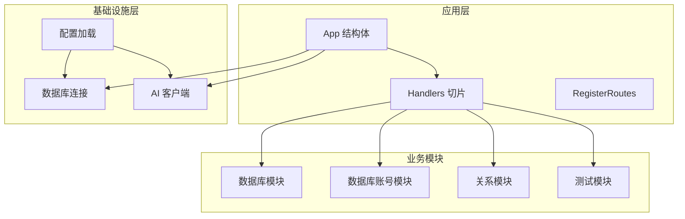
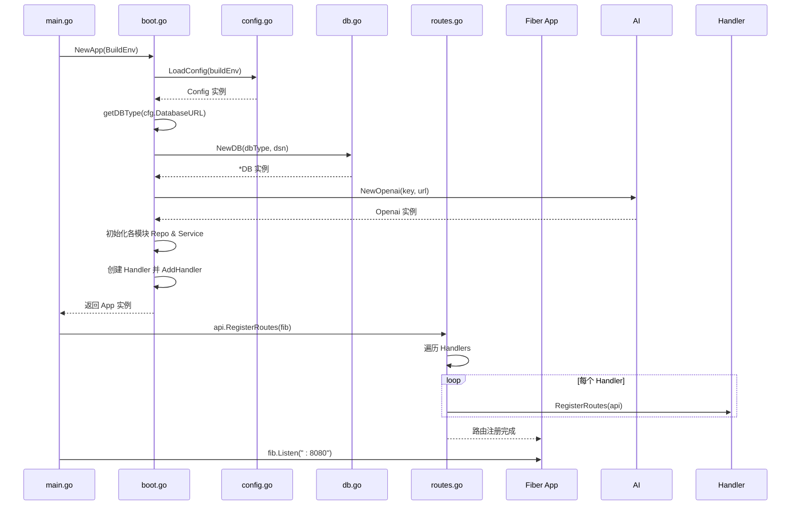
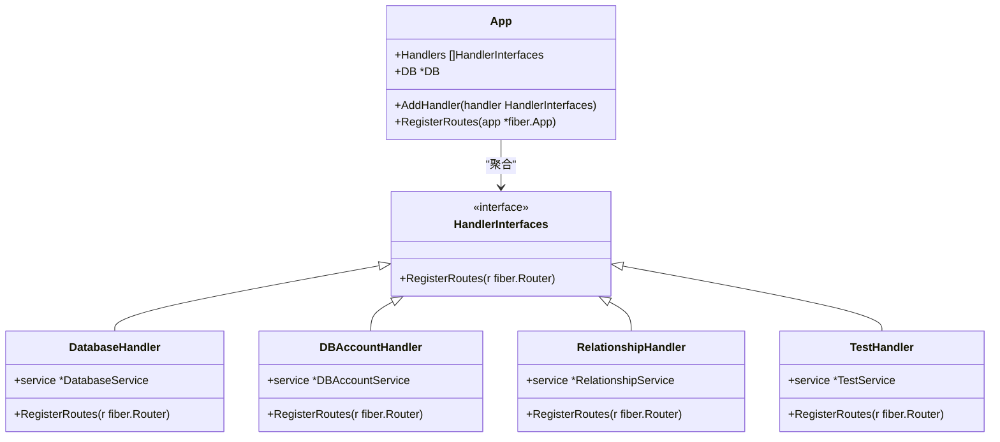
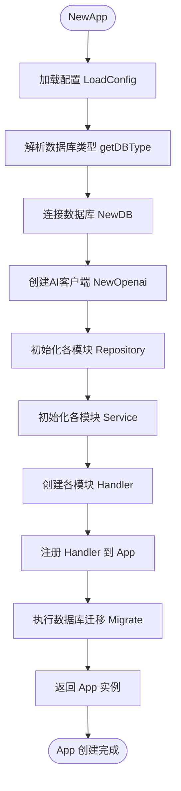
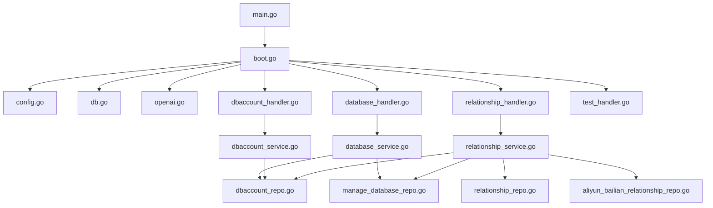

# 后端架构设计

<cite>
**本文档引用的文件**  
- [main.go](file://main.go)
- [boot.go](file://internal/app/tools/boot.go)
- [routes.go](file://internal/app/tools/routes.go)
- [config.go](file://internal/infra/config/config.go)
- [db.go](file://internal/infra/database/db.go)
- [response.go](file://internal/app/tools/infra/response/api/response.go)
- [handler_interfaces.go](file://internal/shared/handler_interfaces.go)
- [openai.go](file://internal/infra/ai/openai.go)
</cite>

## 目录
1. [简介](#简介)
2. [项目结构](#项目结构)
3. [核心组件](#核心组件)
4. [架构概览](#架构概览)
5. [详细组件分析](#详细组件分析)
6. [依赖分析](#依赖分析)
7. [性能考量](#性能考量)
8. [故障排除指南](#故障排除指南)
9. [结论](#结论)

## 简介
本文档详细描述了基于 GoFiber 框架的后端分层架构设计。系统采用模块化设计，通过 `App` 结构体聚合所有处理器（Handler），并利用接口实现路由的动态注册。启动流程包括环境初始化、配置加载、数据库连接、AI 客户端创建、服务注册及 HTTP 路由绑定。依赖注入在 `boot.go` 中完成，中间件与统一错误处理机制确保系统稳定性。响应通过 `api.Success/Error` 标准化封装，GORM 支持根据用户配置动态切换数据库类型（如 MySQL/SQLite）。

## 项目结构
项目采用分层架构，主要分为 `internal/app`（应用逻辑）、`internal/infra`（基础设施）、`internal/shared`（共享接口）和 `internal/utils`（工具函数）。业务模块按功能划分在 `internal/app/tools/business` 目录下，每个模块包含 `handler.go`、`service.go` 和 `model.go`，遵循典型的三层架构（表现层、业务层、数据层）。



**Diagram sources**  
- [main.go](file://main.go#L10-L24)
- [boot.go](file://internal/app/tools/boot.go#L18-L92)

**Section sources**  
- [main.go](file://main.go#L1-L25)
- [boot.go](file://internal/app/tools/boot.go#L1-L93)

## 核心组件
系统核心由 `App` 结构体驱动，其聚合了所有实现 `HandlerInterfaces` 接口的处理器。通过 `AddHandler` 方法注册各业务模块处理器，并在 `routes.go` 中统一注册路由。`boot.go` 负责依赖注入，初始化数据库、AI 客户端及各模块的 Repository 与 Service 实例。

**Section sources**  
- [boot.go](file://internal/app/tools/boot.go#L18-L92)
- [routes.go](file://internal/app/tools/routes.go#L5-L10)

## 架构概览
系统启动流程清晰：`main.go` 调用 `tools.NewApp` 创建应用实例，触发 `boot.go` 中的初始化流程。该流程依次加载配置、判断数据库类型、建立数据库连接、创建 OpenAI 客户端、初始化各模块的 Repository 与 Service，并注册处理器。最后通过 `RegisterRoutes` 将所有模块路由绑定到 Fiber 应用。



**Diagram sources**  
- [main.go](file://main.go#L10-L24)
- [boot.go](file://internal/app/tools/boot.go#L40-L92)
- [routes.go](file://internal/app/tools/routes.go#L5-L10)

## 详细组件分析

### App 结构体与模块化路由
`App` 结构体是系统的核心聚合器，持有所有处理器的切片和数据库实例。通过实现 `HandlerInterfaces` 接口，各业务模块可独立注册其路由，实现高内聚低耦合。



**Diagram sources**  
- [boot.go](file://internal/app/tools/boot.go#L18-L25)
- [handler_interfaces.go](file://internal/shared/handler_interfaces.go#L5-L7)
- [routes.go](file://internal/app/tools/routes.go#L5-L10)

### 启动流程与依赖注入
`boot.go` 中的 `NewApp` 函数是依赖注入的中心。它按顺序加载配置、连接数据库、创建 AI 客户端，并逐个初始化各业务模块的 Repository 和 Service，最后创建 Handler 并注册到 `App` 实例中。



**Diagram sources**  
- [boot.go](file://internal/app/tools/boot.go#L40-L92)

### 配置管理与动态数据库连接
系统通过 `config.go` 加载环境变量和 `.env` 文件，支持开发与生产环境的差异化配置。`db.go` 根据 `DatabaseURL` 动态判断数据库类型（SQLite/MySQL），并使用 GORM 实现统一的数据库操作接口。

```mermaid
flowchart LR
A[DatabaseURL] --> B{以 "file:" 开头?}
B --> |是| C[SQLite]
B --> |否| D{包含 "@tcp(" 或 "@("?}
D --> |是| E[MySQL]
D --> |否| F[默认 SQLite]
C --> G[使用 glebarez/sqlite]
E --> H[使用 gorm.io/driver/mysql]
F --> G
```

**Diagram sources**  
- [config.go](file://internal/infra/config/config.go#L22-L57)
- [db.go](file://internal/infra/database/db.go#L29-L59)

## 依赖分析
系统依赖关系清晰，`main.go` 依赖 `boot.go` 创建 `App`，`boot.go` 依赖 `config.go`、`db.go` 和 `openai.go` 完成初始化。各业务模块通过 Repository 依赖数据库，通过 Service 依赖其他模块，形成松耦合的服务网络。



**Diagram sources**  
- [main.go](file://main.go#L4-L7)
- [boot.go](file://internal/app/tools/boot.go#L3-L13)
- [handler_interfaces.go](file://internal/shared/handler_interfaces.go#L3-L7)

**Section sources**  
- [main.go](file://main.go#L1-L25)
- [boot.go](file://internal/app/tools/boot.go#L1-L93)

## 性能考量
- **数据库连接池**：`db.go` 中配置了最大空闲连接数（10）、最大打开连接数（100）和连接最大生命周期（1小时），有效管理数据库资源。
- **GORM 日志**：启用 Info 级别日志，记录慢 SQL（阈值 1 秒），便于性能监控。
- **AI 客户端单例**：`openai.go` 使用 `sync.Once` 确保客户端实例的单例化，避免重复创建。

## 故障排除指南
- **数据库连接失败**：检查 `DatabaseURL` 格式是否正确，确认数据库服务是否运行。
- **配置未加载**：确保 `.env` 文件位于项目根目录，或环境变量已正确设置。
- **路由未注册**：确认业务模块的 Handler 已通过 `app.AddHandler()` 注册。
- **AI 调用失败**：检查 `OPENAI_KEY` 和 `OPENAI_URL` 配置是否正确。

**Section sources**  
- [db.go](file://internal/infra/database/db.go#L30-L63)
- [config.go](file://internal/infra/config/config.go#L35-L38)
- [boot.go](file://internal/app/tools/boot.go#L71-L83)
- [openai.go](file://internal/infra/ai/openai.go#L32-L38)

## 结论
本系统采用清晰的分层架构与模块化设计，通过 `App` 结构体和 `HandlerInterfaces` 实现了高内聚低耦合的路由管理。启动流程严谨，依赖注入明确，支持动态数据库连接与标准化响应。系统具备良好的可维护性、可扩展性和稳定性，为后续功能迭代奠定了坚实基础。