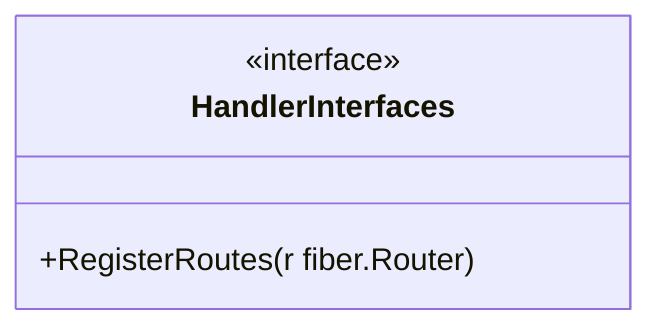
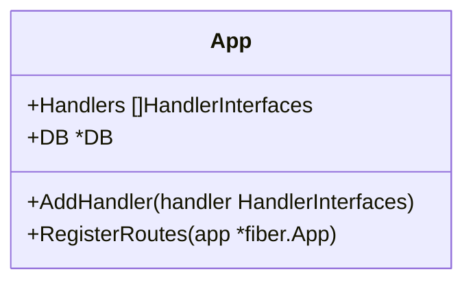
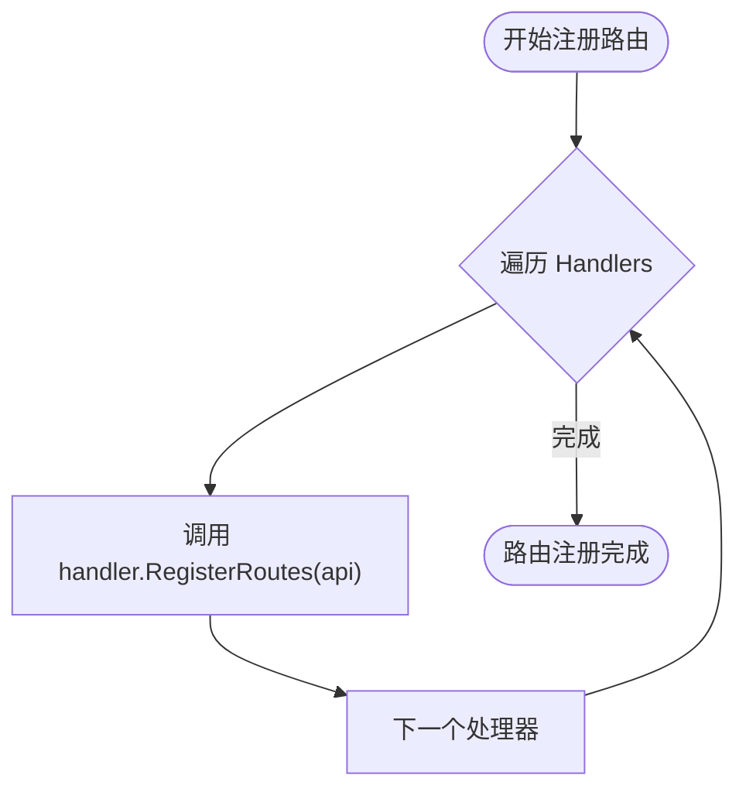
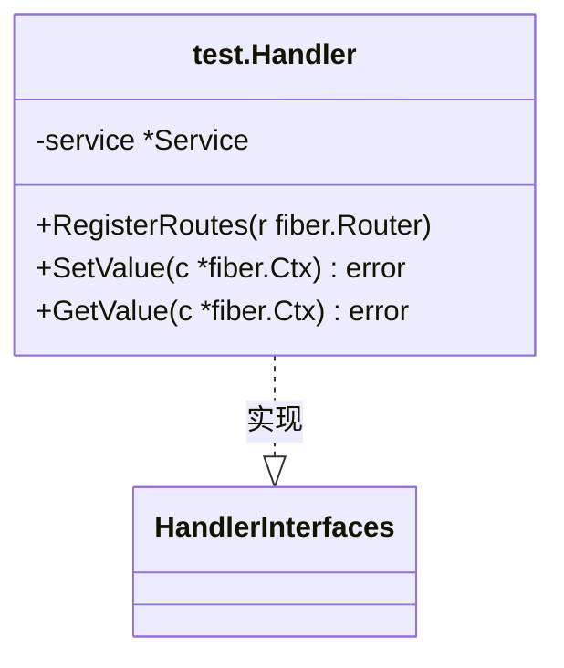
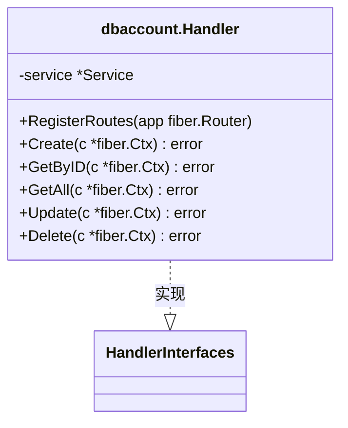
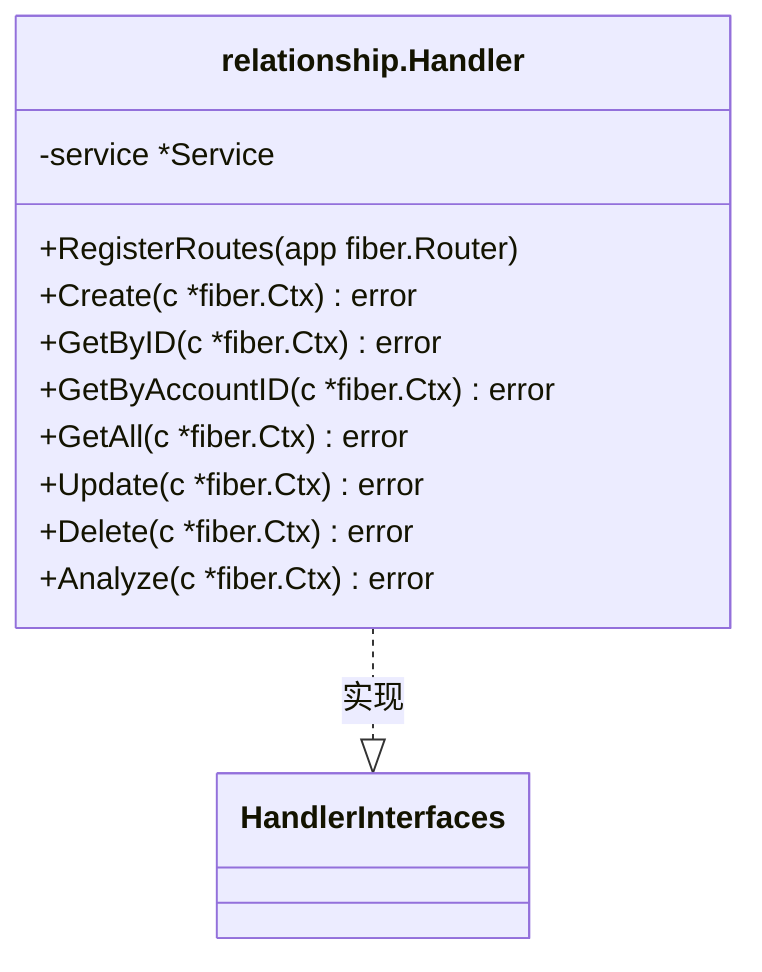

# 模块化设计

<cite>
**本文档中引用的文件**  
- [handler_interfaces.go](file://internal/shared/handler_interfaces.go)
- [boot.go](file://internal/app/tools/boot.go)
- [routes.go](file://internal/app/tools/routes.go)
- [test\handler.go](file://internal/app/tools/business/test/handler.go)
- [dbaccount\handler.go](file://internal/app/tools/business/dbaccount/handler.go)
- [relationship\handler.go](file://internal/app/tools/business/relationship/handler.go)
</cite>

## 目录
1. [引言](#引言)
2. [模块化设计核心机制](#模块化设计核心机制)
3. [HandlerInterfaces 接口定义](#handlerinterfaces-接口定义)
4. [App 结构体与 Handlers 切片](#app-结构体与-handlers-切片)
5. [路由注册机制分析](#路由注册机制分析)
6. [模块实现示例](#模块实现示例)
7. [模块化优势分析](#模块化优势分析)
8. [结论](#结论)

## 引言
本系统采用模块化架构设计，通过接口抽象与依赖聚合实现业务模块的高内聚、低耦合。各功能模块（如 test、dbaccount、relationship）独立封装自身逻辑，并通过统一接口接入主应用。该设计支持动态扩展，新模块只需实现指定接口即可无缝集成，显著提升系统的可维护性与可扩展性。

## 模块化设计核心机制
系统通过 `HandlerInterfaces` 接口规范所有业务模块的行为，`App` 结构体聚合实现了该接口的处理器实例。在应用启动时，通过 `RegisterRoutes` 方法统一注册各模块路由，实现路由的集中管理与动态加载。

**Section sources**
- [handler_interfaces.go](file://internal/shared/handler_interfaces.go#L5-L7)
- [boot.go](file://internal/app/tools/boot.go#L18-L21)
- [routes.go](file://internal/app/tools/routes.go#L5-L10)

## HandlerInterfaces 接口定义
`HandlerInterfaces` 接口定义了所有业务模块必须实现的 `RegisterRoutes` 方法，确保每个模块都能自行注册其路由规则。

**Diagram sources**
- [handler_interfaces.go](file://internal/shared/handler_interfaces.go#L5-L7)

**Section sources**
- [handler_interfaces.go](file://internal/shared/handler_interfaces.go#L5-L7)

## App 结构体与 Handlers 切片
`App` 结构体包含一个 `Handlers` 切片，用于存储所有实现了 `HandlerInterfaces` 接口的模块处理器。通过 `AddHandler` 方法可将新模块动态添加至系统中。

**Diagram sources**
- [boot.go](file://internal/app/tools/boot.go#L18-L25)

**Section sources**
- [boot.go](file://internal/app/tools/boot.go#L18-L25)

## 路由注册机制分析
`RegisterRoutes` 方法遍历 `Handlers` 切片，调用每个处理器的 `RegisterRoutes` 方法，将各模块的路由统一挂载到 `/api` 前缀下，实现集中式路由管理。

**Diagram sources**
- [routes.go](file://internal/app/tools/routes.go#L5-L9)

**Section sources**
- [routes.go](file://internal/app/tools/routes.go#L5-L9)

## 模块实现示例
以下以 `test`、`dbaccount` 和 `relationship` 模块为例，展示各模块如何独立实现路由注册。

### test 模块
`test` 模块注册 `/test` 路径下的 POST 与 GET 接口，用于测试数据存取。

**Diagram sources**
- [test\handler.go](file://internal/app/tools/business/test/handler.go#L5-L15)

**Section sources**
- [test\handler.go](file://internal/app/tools/business/test/handler.go#L5-L38)

### dbaccount 模块
`dbaccount` 模块管理数据库账号，提供 CRUD 接口，路由挂载于 `/api/db-account`。

**Diagram sources**
- [dbaccount\handler.go](file://internal/app/tools/business/dbaccount/handler.go#L12-L24)

**Section sources**
- [dbaccount\handler.go](file://internal/app/tools/business/dbaccount/handler.go#L12-L159)

### relationship 模块
`relationship` 模块处理数据库关系图谱，除常规 CRUD 外，还提供 `/analyze` 接口用于异步分析。

**Diagram sources**
- [relationship\handler.go](file://internal/app/tools/business/relationship/handler.go#L14-L26)

**Section sources**
- [relationship\handler.go](file://internal/app/tools/business/relationship/handler.go#L14-L218)

## 模块化优势分析
该设计具有以下优势：
- **高内聚低耦合**：各模块独立实现自身逻辑，仅通过接口与主系统交互。
- **易于扩展**：新增模块只需实现 `HandlerInterfaces` 并调用 `AddHandler` 即可接入。
- **集中管理**：路由统一由 `App.RegisterRoutes` 调度，便于维护与调试。
- **可测试性强**：模块可独立进行单元测试，无需依赖完整系统环境。

**Section sources**
- [boot.go](file://internal/app/tools/boot.go#L71-L83)
- [routes.go](file://internal/app/tools/routes.go#L5-L9)

## 结论
本系统通过接口抽象与聚合模式实现了高度模块化的架构设计。`App` 结构体作为核心容器，通过 `Handlers` 切片聚合所有业务模块，并利用 `RegisterRoutes` 方法实现路由的统一注册与动态扩展。该设计不仅提升了代码的可维护性与可读性，也为未来功能扩展提供了灵活的接入机制。