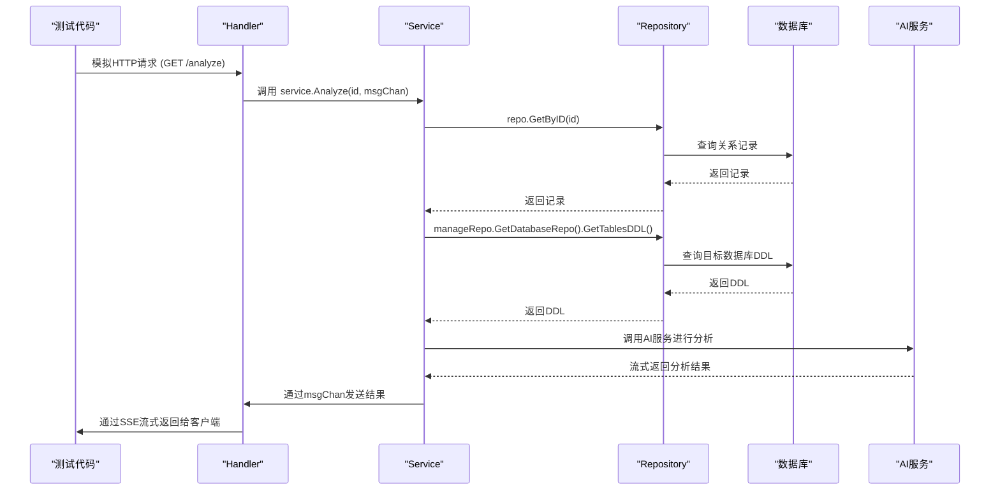

# 测试策略

<cite>
**本文档中引用的文件**  
- [service_test.go](file://internal/app/tools/business/relationship/service_test.go)
- [service.go](file://internal/app/tools/business/relationship/service.go)
- [handler.go](file://internal/app/tools/business/relationship/handler.go)
- [relationship_repo.go](file://internal/app/tools/business/relationship/relationship_repo.go)
- [config.go](file://internal/infra/config/config.go)
- [db.go](file://internal/infra/database/db.go)
- [openai.go](file://internal/infra/ai/openai.go)
- [manage_database_repo.go](file://internal/app/tools/repo/manage_database_repo.go)
- [db_account_repo.go](file://internal/app/tools/business/dbaccount/db_account_repo.go)
- [aliyun_bailian_relationship_repo.go](file://internal/app/tools/repo/aliyun_bailian_relationship/aliyun_bailian_relationship_repo.go)
</cite>

## 目录
1. [单元测试](#单元测试)
2. [集成测试](#集成测试)
3. [测试最佳实践](#测试最佳实践)

## 单元测试

本项目中的单元测试主要针对业务逻辑层（Service）进行，以确保核心功能的正确性。以 `internal/app/tools/business/relationship/service_test.go` 文件中的 `TestRelationshipService_Analyze` 测试用例为例，展示了如何为 `Analyze` 方法编写测试。

测试流程如下：
1.  **加载配置**：调用 `config.LoadConfig("dev")` 加载开发环境的配置，获取数据库连接字符串、OpenAI密钥等。
2.  **连接数据库**：使用 `database2.NewDB` 方法根据配置连接到SQLite数据库。`getTestDatabasePath` 函数用于在测试环境中定位数据库文件路径，确保测试使用正确的数据库。
3.  **初始化依赖**：创建 `openai` 客户端实例，并为 `dbaccount` 和 `manageDatabaseRepo` 等依赖项创建仓库（Repo）实例。
4.  **构建服务**：通过依赖注入，将所有仓库实例传递给 `NewService` 构造函数，从而创建一个完整的 `RelationshipService` 实例。
5.  **执行测试**：直接调用 `service.Analyze(1)` 方法，传入一个测试ID。
6.  **断言与验证**：测试代码通过 `t.Skipf` 在出现错误时跳过测试，而不是失败，这通常用于处理外部依赖（如AI服务）可能不稳定的情况。更完整的单元测试应使用 `assert` 包对返回值进行精确断言。

通过这种方式，单元测试可以隔离业务逻辑，验证其在给定输入下的行为是否符合预期。

**Section sources**
- [service_test.go](file://internal/app/tools/business/relationship/service_test.go#L58-L89)
- [service.go](file://internal/app/tools/business/relationship/service.go#L101-L180)
- [config.go](file://internal/infra/config/config.go#L22-L50)
- [db.go](file://internal/infra/database/db.go#L29-L75)

## 集成测试

集成测试旨在验证多个组件协同工作的能力，特别是完整的API调用链。本项目中，一个典型的集成测试场景是测试从HTTP请求到最终调用AI服务的完整流程：`Handler → Service → Repo → DB`。

以 `Analyze` 功能为例，其集成测试流程如下：
1.  **发起HTTP请求**：测试代码会模拟一个对 `/api/relationship/:id/analyze` 的GET请求。
2.  **Handler层处理**：`handler.go` 中的 `Analyze` 方法接收到请求，解析ID，并设置SSE（Server-Sent Events）响应头。
3.  **Service层调用**：Handler调用 `service.Analyze` 方法，并传入一个用于流式传输结果的 `msgChan` 通道。
4.  **Repo层与数据库交互**：Service层通过 `repo.GetByID` 从数据库中获取关系记录，并通过 `manageDatabaseRepo.GetDatabaseRepo` 获取目标数据库的连接，进而查询表结构（DDL）。
5.  **调用外部服务**：Service层将获取到的DDL信息传递给 `aliYunBaiLianRelationshipRepo`，由其负责与阿里云百炼AI平台进行交互，生成分析结果。
6.  **流式返回结果**：AI服务的流式响应通过 `msgChan` 通道返回给Handler，Handler再通过SSE将结果实时推送给前端。

**关键点：测试数据隔离**
为避免污染开发或生产数据库，集成测试必须使用独立的测试数据库。`getTestDatabasePath` 函数和 `config.LoadConfig("dev")` 的设计确保了这一点。测试时，系统会连接到一个专用的、可被安全修改和重置的数据库实例，从而保证了测试的独立性和安全性。

**Diagram sources**
- [handler.go](file://internal/app/tools/business/relationship/handler.go#L188-L216)
- [service.go](file://internal/app/tools/business/relationship/service.go#L101-L180)
- [relationship_repo.go](file://internal/app/tools/business/relationship/relationship_repo.go#L28-L38)
- [manage_database_repo.go](file://internal/app/tools/repo/manage_database_repo.go#L23-L27)
- [aliyun_bailian_relationship_repo.go](file://internal/app/tools/repo/aliyun_bailian_relationship/aliyun_bailian_relationship_repo.go#L49-L75)

**Section sources**
- [handler.go](file://internal/app/tools/business/relationship/handler.go#L188-L216)
- [service.go](file://internal/app/tools/business/relationship/service.go#L101-L180)

## 测试最佳实践

为了确保代码质量和稳定性，编写高质量的测试代码至关重要。以下是本项目遵循的一些最佳实践：

1.  **表格驱动测试 (Table-Driven Tests)**：对于具有多种输入和预期输出的函数，使用表格驱动测试可以极大地提高测试的可读性和覆盖率。通过定义一个包含各种测试用例的切片，然后循环执行，可以避免重复的测试代码。
2.  **合理使用Mock对象**：在单元测试中，应尽可能使用Mock对象来模拟外部依赖（如数据库、网络服务）。这可以将测试范围严格限定在被测单元内部，避免因外部服务不稳定而导致测试失败。例如，在测试 `Analyze` 服务时，可以Mock `aliYunBaiLianRelationshipRepo` 的 `Chat` 方法，直接返回预设的流式数据，从而快速验证业务逻辑。
3.  **保持测试的快速和可重复性**：测试应该尽可能快地执行。避免在测试中进行耗时的网络请求或复杂的数据库操作。利用内存数据库（如SQLite的`:memory:`模式）或Mock可以显著提升速度。同时，每个测试都应该是独立的，不依赖于其他测试的执行结果或状态，确保其可重复运行。
4.  **关注测试覆盖率**：使用 `go test -cover` 命令可以生成测试覆盖率报告。高覆盖率是代码质量的一个重要指标，它能帮助发现未被测试到的代码路径。然而，应追求有意义的覆盖率，而不仅仅是数字，确保测试用例覆盖了各种边界条件和异常情况。
5.  **清晰的测试命名**：测试函数的命名应清晰地描述其测试的场景和预期结果，例如 `TestRelationshipService_Analyze_WithValidID_ShouldReturnSuccess`。

遵循这些实践，可以构建一个健壮、可靠的测试套件，为项目的持续集成和交付提供坚实保障。

**Section sources**
- [service_test.go](file://internal/app/tools/business/relationship/service_test.go#L58-L89)
- [service.go](file://internal/app/tools/business/relationship/service.go#L101-L180)