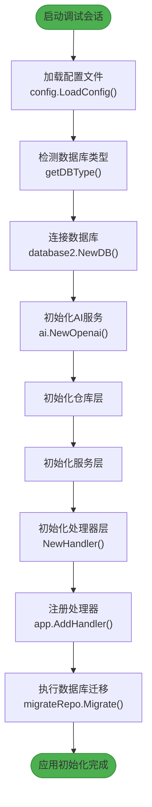
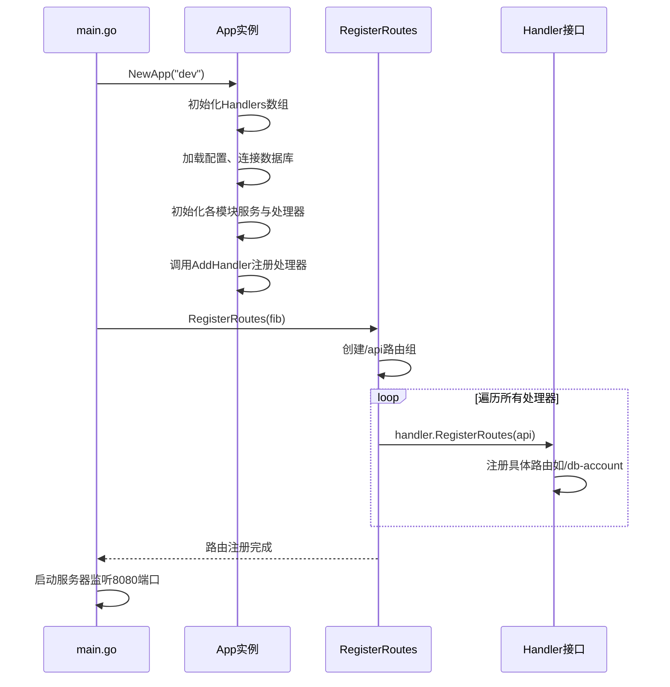

# 调试技巧

<cite>
**本文档中引用的文件**  
- [boot.go](file://internal/app/tools/boot.go)
- [routes.go](file://internal/app/tools/routes.go)
- [main.go](file://bin/main/main.go)
- [dev.go](file://bin/main/compile/dev.go)
- [start_web.go](file://bin/main/compile/start_web.go)
- [vite.config.ts](file://web/database_api/vite.config.ts)
- [config.go](file://internal/infra/config/config.go)
</cite>

## 目录
1. [Go后端调试配置](#go后端调试配置)
2. [Vue前端调试配置](#vue前端调试配置)
3. [常见调试问题排查](#常见调试问题排查)

## Go后端调试配置

### Delve调试器安装与配置

Delve是Go语言的官方推荐调试器，支持断点、变量查看、调用栈分析等核心调试功能。在本项目中，可通过以下命令安装Delve：

```bash
go install github.com/go-delve/delve/cmd/dlv@latest
```

安装完成后，可在VS Code中通过`dlv`命令启动调试会话。

### VS Code调试配置（launch.json）

在VS Code中调试本项目时，需在`.vscode/launch.json`中配置如下内容：

```json
{
  "version": "0.2.0",
  "configurations": [
    {
      "name": "Launch Backend (dev)",
      "type": "go",
      "request": "launch",
      "mode": "auto",
      "program": "${workspaceFolder}/bin/main/main.go",
      "env": {
        "GO_ENV": "dev"
      },
      "buildFlags": "-tags=dev"
    }
  ]
}
```

关键配置说明：
- **program**: 指定程序入口文件为`main.go`
- **buildFlags**: 使用`-tags=dev`构建标签，启用开发模式
- **env**: 设置环境变量以加载开发配置

**Section sources**
- [main.go](file://bin/main/main.go#L1-L25)
- [build_dev.go](file://bin/main/build_dev.go#L1-L16)

### 调试应用初始化流程（boot.go）

`boot.go`文件负责应用的初始化工作，包括配置加载、数据库连接、服务注册等。可通过在`NewApp`函数中设置断点来调试初始化流程：

1. 在`NewApp(buildEnv string)`函数入口处设置断点
2. 观察`config.LoadConfig(buildEnv)`是否正确加载了开发环境配置
3. 检查`database2.NewDB(dbType, cfg.DatabaseURL)`是否成功建立数据库连接
4. 验证各业务模块（如`dbaccount`、`relationship`）的服务和处理器是否正确初始化
5. 确认`migrateRepo.Migrate()`是否成功执行数据库迁移

该初始化流程采用依赖注入模式，通过`AddHandler`方法将各业务处理器注册到应用实例中，便于模块化管理和测试。



**Diagram sources**
- [boot.go](file://internal/app/tools/boot.go#L40-L91)
- [config.go](file://internal/infra/config/config.go#L22-L50)

**Section sources**
- [boot.go](file://internal/app/tools/boot.go#L1-L93)
- [config.go](file://internal/infra/config/config.go#L1-L58)

### 调试路由注册逻辑（routes.go）

路由注册逻辑位于`routes.go`文件中，通过`RegisterRoutes`方法将所有处理器的路由注册到Fiber应用实例。调试此流程的关键点包括：

1. 在`RegisterRoutes(app *fiber.App)`方法中设置断点
2. 观察`api := app.Group("/api")`是否正确创建API路由组
3. 跟踪`for _, handler := range a.Handlers`循环，验证每个处理器的`RegisterRoutes`方法是否被调用
4. 检查各业务模块的路由是否正确注册（如`/db-account`、`/relationship`等）

该设计采用接口驱动的路由注册模式，所有处理器实现`HandlerInterfaces`接口的`RegisterRoutes`方法，实现了路由注册的解耦和可扩展性。



**Diagram sources**
- [routes.go](file://internal/app/tools/routes.go#L5-L10)
- [handler_interfaces.go](file://internal/shared/handler_interfaces.go#L5)

**Section sources**
- [routes.go](file://internal/app/tools/routes.go#L1-L11)
- [handler_interfaces.go](file://internal/shared/handler_interfaces.go#L1-L5)

## Vue前端调试配置

### Vite源码映射（Source Map）配置

本项目使用Vite作为前端构建工具，其默认启用了源码映射功能，允许在浏览器开发者工具中直接调试TypeScript源码。相关配置位于`vite.config.ts`文件中：

```typescript
export default defineConfig({
  plugins: [vue(), tailwindcss()],
  resolve: {
    alias: {
      '@': path.resolve(__dirname, './src'),
    },
  },
  server: {
    hmr: {
      host: '127.0.0.1',
      port: 5173
    },
    proxy: {
      '/api': {
        target: 'http://127.0.0.1:8080',
        changeOrigin: true,
        rewrite: (path) => path.replace(/^\/api/, ''),
      },
    },
  },
})
```

Vite在开发模式下通过ES模块的原生支持实现快速热重载，同时生成高质量的source map文件，将压缩后的JavaScript代码映射回原始的TypeScript和Vue单文件组件。

**Section sources**
- [vite.config.ts](file://web/database_api/vite.config.ts#L1-L27)

### API请求代理配置

`vite.config.ts`中的`server.proxy`配置用于解决开发环境下的跨域问题，将前端发出的API请求代理到后端服务器：

- **代理规则**: 所有以`/api`开头的请求
- **目标地址**: `http://127.0.0.1:8080`（Go后端服务）
- **changeOrigin**: 设置为`true`，修改请求头中的origin字段
- **rewrite**: 重写路径，移除前缀`/api`

此配置使得前端代码可以直接使用相对路径`/api/db-account`发起请求，而无需关心后端服务的实际地址，提高了开发效率和代码可移植性。


**Diagram sources**
- [vite.config.ts](file://web/database_api/vite.config.ts#L18-L24)
- [dev.go](file://bin/main/compile/dev.go#L10-L63)

**Section sources**
- [vite.config.ts](file://web/database_api/vite.config.ts#L1-L27)
- [dev.go](file://bin/main/compile/dev.go#L1-L64)
- [start_web.go](file://bin/main/compile/start_web.go#L1-L75)

## 常见调试问题排查

### 断点无法命中

**可能原因及解决方案：**
1. **构建标签未正确设置**：确保`launch.json`中包含`-tags=dev`构建标志
2. **代码未重新编译**：修改Go代码后需重新启动调试会话
3. **Delve版本过旧**：更新Delve至最新版本
4. **VS Code Go扩展问题**：重启VS Code或重装Go扩展

**Section sources**
- [build_dev.go](file://bin/main/build_dev.go#L1-L16)
- [launch.json示例配置]

### 热重载失效

**可能原因及解决方案：**
1. **Vite服务器未启动**：检查`start_web.go`是否成功启动了pnpm dev服务器
2. **文件监听问题**：确认Vite配置中的`server.hmr`设置正确
3. **网络问题**：检查`server.proxy`目标地址是否可达
4. **缓存问题**：清除浏览器缓存或重启Vite开发服务器

**Section sources**
- [start_web.go](file://bin/main/compile/start_web.go#L16-L68)
- [vite.config.ts](file://web/database_api/vite.config.ts#L14-L17)

### API请求404错误

**可能原因及解决方案：**
1. **代理配置错误**：检查`vite.config.ts`中`server.proxy`的目标地址是否为`http://127.0.0.1:8080`
2. **后端服务未启动**：确认Go后端服务已在8080端口监听
3. **路由前缀不匹配**：前端请求路径应以`/api`开头
4. **后端路由未注册**：调试`routes.go`确保所有处理器已正确注册

**Section sources**
- [vite.config.ts](file://web/database_api/vite.config.ts#L20-L23)
- [routes.go](file://internal/app/tools/routes.go#L6)
- [dev.go](file://bin/main/compile/dev.go#L19)