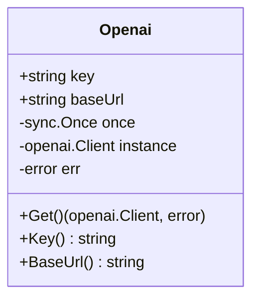
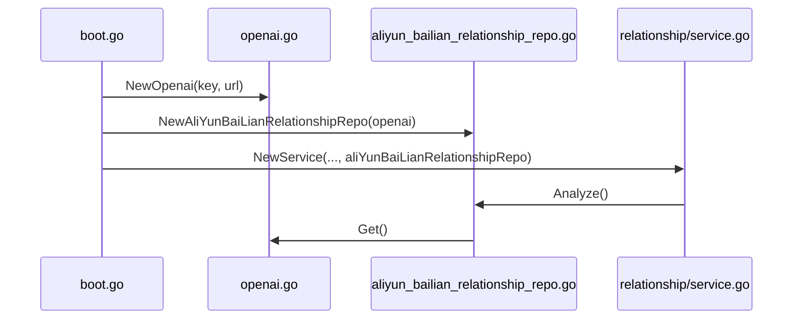

# AI服务集成

<cite>
**本文档中引用的文件**  
- [openai.go](file://internal/infra/ai/openai.go)
- [aliyun_bailian_relationship_repo.go](file://internal/app/tools/repo/aliyun_bailian_relationship/aliyun_bailian_relationship_repo.go)
- [config.go](file://internal/infra/config/config.go)
- [boot.go](file://internal/app/tools/boot.go)
</cite>

## 目录
1. [简介](#简介)
2. [OpenAI客户端配置机制](#openai客户端配置机制)
3. [AI服务替换与集成](#ai服务替换与集成)
4. [依赖注入与业务集成](#依赖注入与业务集成)
5. [错误处理与连接测试](#错误处理与连接测试)
6. [性能优化建议](#性能优化建议)
7. [常见问题与解决方案](#常见问题与解决方案)
8. [总结](#总结)

## 简介
本项目通过统一的AI客户端接口，支持多种大模型服务的集成与替换。核心机制基于`Openai`结构体实现，通过配置`apiKey`和`baseUrl`，可灵活接入阿里云百炼、Azure OpenAI或本地部署的大模型服务。系统采用依赖注入方式将AI客户端注入业务服务，确保架构的可扩展性与可维护性。

## OpenAI客户端配置机制

`Openai`结构体封装了AI客户端的核心配置与实例化逻辑，位于`internal/infra/ai/openai.go`中。其字段包括`key`（API密钥）、`baseUrl`（服务地址）、`once`（确保单例）、`instance`（客户端实例）和`err`（初始化错误）。

通过`NewOpenai(key, baseUrl)`函数创建配置实例，并在首次调用`Get()`方法时，使用`sync.Once`确保客户端仅初始化一次。`Get()`方法内部调用`openai.NewClient`，传入`option.WithAPIKey`和`option.WithBaseURL`选项，完成与OpenAI兼容API的对接。



**图示来源**  
- [openai.go](file://internal/infra/ai/openai.go#L8-L14)

**本节来源**  
- [openai.go](file://internal/infra/ai/openai.go#L8-L39)

## AI服务替换与集成

系统支持通过配置`baseUrl`和`apiKey`无缝替换底层AI服务。配置项定义在`internal/infra/config/config.go`中，包含`OpenaiURl`和`OpenaiKey`字段，支持从环境变量或`.env`文件加载。

### 阿里云百炼集成
将`baseUrl`设置为`https://dashscope.aliyuncs.com/compatible-mode/v1`，`apiKey`使用阿里云提供的API密钥。模型名称需匹配阿里云支持的模型，如`qwen3-coder-plus`。

### Azure OpenAI集成
将`baseUrl`设置为Azure OpenAI的端点地址，如`https://your-resource.openai.azure.com/openai/deployments/your-deployment`，并配置相应的`apiKey`。需注意Azure特有的路径结构。

### 本地大模型集成
对于本地部署的Ollama、LMStudio等服务，将`baseUrl`设置为`http://localhost:11434/v1`或对应地址，`apiKey`可为空或按需设置。

配置示例：
```go
cfg := config.LoadConfig(buildEnv)
openaiClient := ai.NewOpenai(cfg.OpenaiKey, cfg.OpenaiURl)
```

**本节来源**  
- [config.go](file://internal/infra/config/config.go#L13-L20)
- [openai.go](file://internal/infra/ai/openai.go#L25-L29)

## 依赖注入与业务集成

AI客户端通过依赖注入方式集成到业务服务中。以`AliYunBaiLianRelationshipRepo`为例，其结构体包含`openai *ai.Openai`字段，接收外部传入的客户端实例。

`NewAliYunBaiLianRelationshipRepo(infraOpenai *ai.Openai)`函数负责创建仓库实例，并初始化系统提示（`SystemPrompt`）。该仓库被注入`RelationshipService`，最终在`boot.go`中完成整个依赖链的组装。



**图示来源**  
- [aliyun_bailian_relationship_repo.go](file://internal/app/tools/repo/aliyun_bailian_relationship/aliyun_bailian_relationship_repo.go#L18-L25)
- [boot.go](file://internal/app/tools/boot.go#L54-L67)

**本节来源**  
- [aliyun_bailian_relationship_repo.go](file://internal/app/tools/repo/aliyun_bailian_relationship/aliyun_bailian_relationship_repo.go#L12-L25)
- [boot.go](file://internal/app/tools/boot.go#L40-L91)

## 错误处理与连接测试

系统在`Get()`方法中返回初始化错误，调用方需检查错误状态。`Chat()`方法在获取客户端实例时即进行错误检查，确保网络连接与鉴权有效。

建议在服务启动时进行连接测试：
```go
client, err := openaiClient.Get()
if err != nil {
    log.Fatal("AI服务连接失败:", err)
}
// 可选：发送测试请求
```

流式响应通过`NewStreaming`实现，需在`goroutine`中处理，确保非阻塞。错误处理应覆盖网络超时、鉴权失败、模型不存在等场景。

**本节来源**  
- [aliyun_bailian_relationship_repo.go](file://internal/app/tools/repo/aliyun_bailian_relationship/aliyun_bailian_relationship_repo.go#L53-L55)
- [openai.go](file://internal/infra/ai/openai.go#L32-L39)

## 性能优化建议

1. **客户端单例**：`Openai`结构体通过`sync.Once`保证单例，避免重复创建开销。
2. **连接复用**：HTTP客户端内部应启用连接池，减少握手延迟。
3. **流式响应**：使用`NewStreaming`实现流式输出，提升用户体验。
4. **缓存机制**：对重复的DDL分析请求，可引入缓存避免重复调用。
5. **并发控制**：限制并发请求数，防止API限流。

**本节来源**  
- [openai.go](file://internal/infra/ai/openai.go#L31-L39)
- [aliyun_bailian_relationship_repo.go](file://internal/app/tools/repo/aliyun_bailian_relationship/aliyun_bailian_relationship_repo.go#L66-L74)

## 常见问题与解决方案

### API限流
- **现象**：请求返回429状态码。
- **解决方案**：实现指数退避重试机制，或升级API配额。

### 鉴权失败
- **现象**：请求返回401或403状态码。
- **解决方案**：检查`apiKey`是否正确，确认服务端是否启用该密钥。

### 模型不存在
- **现象**：请求返回404或模型错误。
- **解决方案**：核对`Model`字段是否与目标服务支持的模型名称一致。

### 网络连接超时
- **现象**：请求长时间无响应。
- **解决方案**：检查`baseUrl`是否正确，确认网络可达性，调整超时设置。

**本节来源**  
- [aliyun_bailian_relationship_repo.go](file://internal/app/tools/repo/aliyun_bailian_relationship/aliyun_bailian_relationship_repo.go#L53-L55)
- [openai.go](file://internal/infra/ai/openai.go#L34-L36)

## 总结
本系统通过`Openai`结构体实现了灵活的AI服务集成机制，支持阿里云百炼、Azure OpenAI及本地大模型的无缝替换。依赖注入模式确保了业务逻辑与AI服务的解耦，便于维护与扩展。结合合理的错误处理与性能优化策略，可构建稳定高效的AI驱动应用。