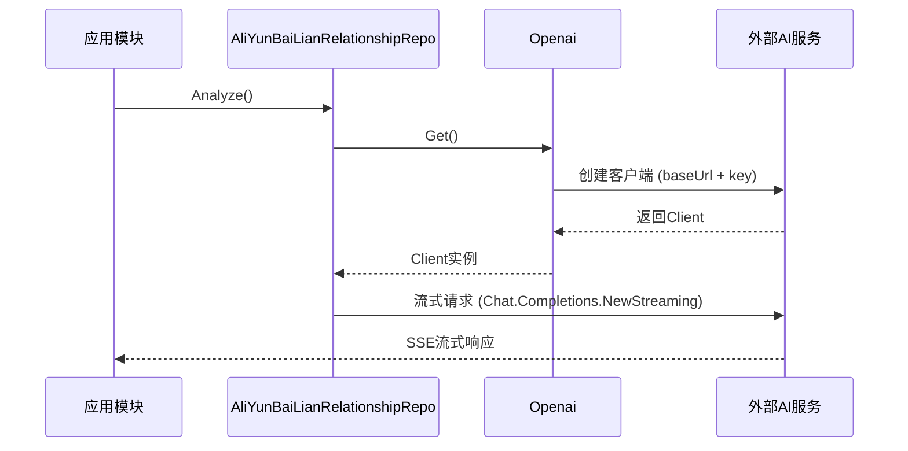

# 扩展与集成

<cite>
**本文档中引用的文件**  
- [openai.go](file://internal/infra/ai/openai.go)
- [db.go](file://internal/infra/database/db.go)
- [routes.go](file://internal/app/tools/routes.go)
- [handler_interfaces.go](file://internal/shared/handler_interfaces.go)
- [prompts.go](file://internal/app/tools/repo/aliyun_bailian_relationship/prompts.go)
- [aliyun_bailian_relationship_repo.go](file://internal/app/tools/repo/aliyun_bailian_relationship/aliyun_bailian_relationship_repo.go)
- [boot.go](file://internal/app/tools/boot.go)
</cite>

## 目录
1. [AI服务替换方案](#ai服务替换方案)
2. [数据库类型扩展方法](#数据库类型扩展方法)
3. [模块化设计与业务模块扩展](#模块化设计与业务模块扩展)
4. [自定义分析提示词修改指南](#自定义分析提示词修改指南)
5. [插件系统扩展点](#插件系统扩展点)

## AI服务替换方案

本系统通过 `internal/infra/ai/openai.go` 文件封装了 OpenAI 客户端，支持接入任何兼容 OpenAI API 的服务，如 Azure OpenAI、本地部署的大模型（如 Llama、ChatGLM 等）。

核心结构 `Openai` 封装了 API 密钥和基础 URL，通过 `NewOpenai(key, baseUrl)` 初始化。`Get()` 方法使用单例模式创建并返回 `openai.Client` 实例，其中 `baseUrl` 可配置为第三方服务的兼容端点。

例如：
- **Azure OpenAI**：将 `baseUrl` 设置为 `https://<your-resource>.openai.azure.com/openai/deployments/<deployment-id>/`
- **本地大模型（如 Ollama）**：设置为 `http://localhost:11434/v1`
- **阿里云百炼**：使用其提供的 OpenAI 兼容接口地址

只要目标服务支持 OpenAI 的 `/chat/completions` 接口规范，即可无缝替换，无需修改业务逻辑。



**Diagram sources**
- [openai.go](file://internal/infra/ai/openai.go#L9-L41)
- [aliyun_bailian_relationship_repo.go](file://internal/app/tools/repo/aliyun_bailian_relationship/aliyun_bailian_relationship_repo.go#L50-L77)

**Section sources**
- [openai.go](file://internal/infra/ai/openai.go#L1-L41)
- [aliyun_bailian_relationship_repo.go](file://internal/app/tools/repo/aliyun_bailian_relationship/aliyun_bailian_relationship_repo.go#L1-L77)

## 数据库类型扩展方法

系统通过 `internal/infra/database/db.go` 实现数据库驱动注册机制，当前支持 SQLite 和 MySQL，可通过扩展支持 PostgreSQL、SQL Server 等。

`DBType` 枚举定义了数据库类型，`NewDB(dbType, dsn)` 根据类型选择 GORM 驱动：
- `SQLite`：使用 `glebarez/sqlite`
- `MySQL`：使用 `gorm.io/driver/mysql`

要添加新数据库支持（如 PostgreSQL）：
1. 在 `db.go` 中添加新的常量：`const PostgreSQL DBType = "postgresql"`
2. 在 `switch dbType` 中添加 `case PostgreSQL` 分支，导入 `gorm.io/driver/postgres` 并调用 `gorm.Open(postgres.Open(dsn), &gorm.Config{})`
3. 确保 `go.mod` 中已包含对应驱动依赖

系统通过 `getDBType(databaseURL)` 自动识别数据库类型，开发者只需提供正确的 DSN 即可。

```mermaid
classDiagram
class DB {
+*gorm.DB
+Type DBType
+Close() error
+AutoMigrate(...interface{}) error
+GetDB() *gorm.DB
}
class DBType {
<<enumeration>>
SQLite
MySQL
}
DB --> DBType : 使用
```

**Diagram sources**
- [db.go](file://internal/infra/database/db.go#L15-L96)

**Section sources**
- [db.go](file://internal/infra/database/db.go#L1-L96)
- [boot.go](file://internal/app/tools/boot.go#L27-L38)

## 模块化设计与业务模块扩展

系统采用模块化设计，所有业务模块需实现 `HandlerInterfaces` 接口并在 `routes.go` 中注册。

`HandlerInterfaces` 定义了 `RegisterRoutes(r fiber.Router)` 方法，所有处理器（如 `database.Handler`、`dbaccount.Handler`）均实现此接口。

在 `boot.go` 中，`App` 结构体维护 `Handlers []HandlerInterfaces` 列表，通过 `AddHandler()` 注册模块。`routes.go` 中的 `RegisterRoutes()` 遍历所有处理器并注册其路由。

新增业务模块步骤：
1. 创建新模块目录（如 `business/user`）
2. 实现 `Handler struct` 并实现 `RegisterRoutes()` 方法
3. 在 `boot.go` 的 `NewApp()` 中创建服务实例并调用 `app.AddHandler(newHandler)`

此设计实现了解耦和可插拔架构。

```mermaid
graph TD
App[App] --> Handlers[Handlers []HandlerInterfaces]
Handlers --> DatabaseHandler[database.Handler]
Handlers --> DBAccountHandler[dbaccount.Handler]
Handlers --> RelationshipHandler[relationship.Handler]
Handlers --> TestHandler[test.Handler]
DatabaseHandler --> RegisterRoutes[RegisterRoutes]
DBAccountHandler --> RegisterRoutes
RelationshipHandler --> RegisterRoutes
TestHandler --> RegisterRoutes
RegisterRoutes --> FiberRouter[fiber.Router]
class App,Handlers,DatabaseHandler,DBAccountHandler,RelationshipHandler,TestHandler,RegisterRoutes HandlerInterfaces;
```

**Diagram sources**
- [handler_interfaces.go](file://internal/shared/handler_interfaces.go#L5-L7)
- [routes.go](file://internal/app/tools/routes.go#L5-L10)
- [boot.go](file://internal/app/tools/boot.go#L18-L21)

**Section sources**
- [handler_interfaces.go](file://internal/shared/handler_interfaces.go#L1-L8)
- [routes.go](file://internal/app/tools/routes.go#L1-L11)
- [boot.go](file://internal/app/tools/boot.go#L1-L93)

## 自定义分析提示词修改指南

系统使用提示词（prompts）指导 AI 分析数据库结构，定义在 `internal/app/tools/repo/aliyun_bailian_relationship/prompts.go`。

关键函数：
- `SystemPrompt()`：系统角色设定，定义 AI 助手的职责和行为规范
- `UserChunkDDlPrompt()`：分批记忆 DDL 的提示词
- `UserSummaryPrompt()`：触发关系分析的提示词，定义输出格式

修改提示词可调整 AI 的分析行为：
- 修改 `SystemPrompt` 可改变 AI 的角色定位（如从“数据库助手”变为“数据架构师”）
- 修改 `UserSummaryPrompt` 可定制输出格式（如增加 JSON 输出、调整表格结构）
- 可添加新的提示词函数以支持多阶段分析

提示词直接影响 AI 输出质量和结构，建议保持清晰、明确的指令。

**Section sources**
- [prompts.go](file://internal/app/tools/repo/aliyun_bailian_relationship/prompts.go#L1-L57)

## 插件系统扩展点

系统提供多个扩展点，支持添加新的数据可视化类型或支持更多 AI 模型。

### AI 模型扩展
通过 `aliyun_bailian_relationship_repo.go` 中的 `Chat()` 方法，可修改 `Model` 参数以支持不同模型（如 `gpt-4`、`qwen-max` 等）。未来可设计模型策略模式，根据配置动态选择模型。

### 数据可视化扩展
当前通过 SSE 流式返回分析结果，前端可基于此实现多种可视化：
- 表格视图（当前实现）
- 图谱关系图（使用 D3.js 或 ECharts）
- 实体关系图（ER 图）
- 拓扑图

后端可通过扩展 `Analyze` 接口，支持返回结构化数据（如 JSON Schema），便于前端渲染不同视图。

### 数据库扩展
如前所述，可通过 GORM 添加对 PostgreSQL、SQL Server、MongoDB 等的支持，实现多数据库兼容。

**Section sources**
- [aliyun_bailian_relationship_repo.go](file://internal/app/tools/repo/aliyun_bailian_relationship/aliyun_bailian_relationship_repo.go#L1-L77)
- [handler.go](file://internal/app/tools/business/relationship/handler.go#L189-L218)