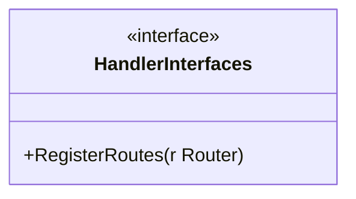
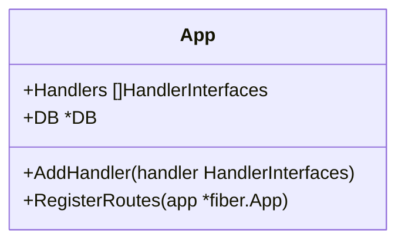
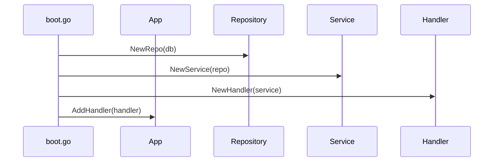
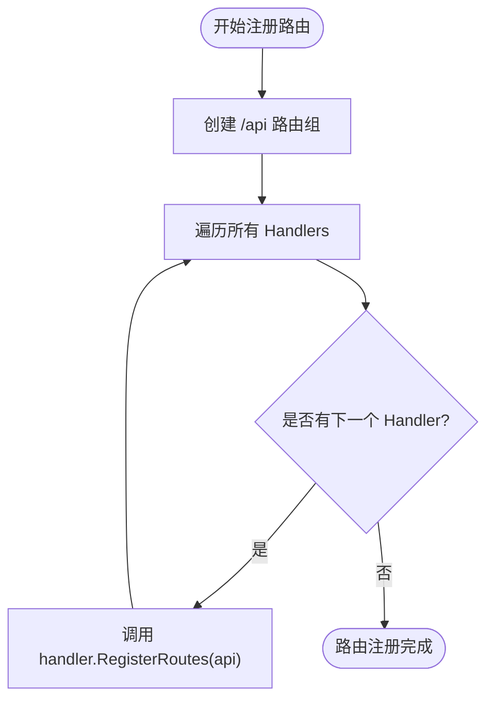
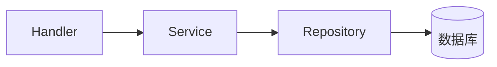

# 模块开发规范

<cite>
**本文档引用文件**  
- [handler_interfaces.go](file://internal/shared/handler_interfaces.go)
- [boot.go](file://internal/app/tools/boot.go)
- [routes.go](file://internal/app/tools/routes.go)
- [model.go](file://internal/app/tools/business/database/model.go)
- [db_account.go](file://internal/app/tools/models/db_account.go)
- [relationship.go](file://internal/app/tools/models/relationship.go)
- [test/handler.go](file://internal/app/tools/business/test/handler.go)
- [test/service.go](file://internal/app/tools/business/test/service.go)
- [test/repo.go](file://internal/app/tools/business/test/repo.go)
</cite>

## 目录
1. [引言](#引言)
2. [核心接口与结构](#核心接口与结构)
3. [模块注册机制](#模块注册机制)
4. [路由统一挂载](#路由统一挂载)
5. [新增模块开发全流程](#新增模块开发全流程)
6. [依赖注入顺序](#依赖注入顺序)
7. [错误传播规范](#错误传播规范)
8. [完整示例分析](#完整示例分析)
9. [最佳实践建议](#最佳实践建议)

## 引言
本文档旨在为新增业务模块提供标准化的开发流程指导。基于现有架构设计，明确从模型定义、仓储实现、服务封装到处理器编写的完整路径。重点强调模块必须遵循的接口契约、注册机制和集成规范，确保新功能能够无缝融入系统整体架构。

## 核心接口与结构

### 处理器接口定义
所有业务模块的处理器必须实现 `HandlerInterfaces` 接口，该接口强制要求实现 `RegisterRoutes` 方法，用于注册模块自身的路由规则。



**Diagram sources**  
- [handler_interfaces.go](file://internal/shared/handler_interfaces.go#L5-L6)

### 应用核心结构
`App` 结构体是整个应用的容器，持有所有处理器实例和数据库连接，通过切片聚合所有实现了 `HandlerInterfaces` 的模块。



**Diagram sources**  
- [boot.go](file://internal/app/tools/boot.go#L18-L21)

**Section sources**  
- [boot.go](file://internal/app/tools/boot.go#L18-L25)

## 模块注册机制

### 模块初始化流程
在 `NewApp` 函数中，系统按顺序初始化各模块的 Repository → Service → Handler，并通过 `AddHandler` 方法将处理器注册到 `App.Handlers` 切片中。



**Diagram sources**  
- [boot.go](file://internal/app/tools/boot.go#L40-L91)

**Section sources**  
- [boot.go](file://internal/app/tools/boot.go#L40-L91)

### 注册方法说明
`AddHandler` 方法负责将实现了 `HandlerInterfaces` 的处理器添加至处理器列表，为后续统一注册路由做准备。

```go
func (a *App) AddHandler(handler shared.HandlerInterfaces) {
	a.Handlers = append(a.Handlers, handler)
}
```

**Section sources**  
- [boot.go](file://internal/app/tools/boot.go#L23-L25)

## 路由统一挂载

### 路由注册实现
`RegisterRoutes` 方法将所有已注册处理器的路由统一挂载到 `/api` 路径下，实现路由前缀的集中管理。



**Diagram sources**  
- [routes.go](file://internal/app/tools/routes.go#L5-L9)

**Section sources**  
- [routes.go](file://internal/app/tools/routes.go#L5-L9)

### 路由分组策略
每个处理器在 `RegisterRoutes` 中进一步创建自己的子路由组（如 `/db-account`、`/relationship`），形成 `/api/模块名` 的层级结构。

```go
func (h *Handler) RegisterRoutes(app fiber.Router) {
	route := app.Group("/db-account")
	route.Post("/", h.Create)
	route.Get("/:id", h.GetByID)
	// ...
}
```

**Section sources**  
- [dbaccount/handler.go](file://internal/app/tools/business/dbaccount/handler.go#L23-L31)

## 新增模块开发全流程

### 步骤一：定义数据模型
在 `internal/app/tools/models/` 目录下定义 GORM 兼容的结构体，包含字段标签和数据库映射。

**Section sources**  
- [db_account.go](file://internal/app/tools/models/db_account.go#L6-L17)
- [relationship.go](file://internal/app/tools/models/relationship.go#L6-L15)

### 步骤二：创建仓储层
在对应业务目录下实现 `repo.go`，封装对数据库的 CRUD 操作，依赖 `*database.DB` 实例。

**Section sources**  
- [test/repo.go](file://internal/app/tools/business/test/repo.go#L7-L25)

### 步骤三：实现服务层
编写 `service.go`，封装业务逻辑，协调多个仓储操作，不直接处理 HTTP 请求。

**Section sources**  
- [test/service.go](file://internal/app/tools/business/test/service.go#L3-L17)

### 步骤四：编写处理器
实现 `handler.go`，包含 `RegisterRoutes` 方法注册路由，并将请求委托给服务层处理。

**Section sources**  
- [test/handler.go](file://internal/app/tools/business/test/handler.go#L12-L14)

## 依赖注入顺序
模块组件的初始化必须遵循以下顺序：
1. Repository → 2. Service → 3. Handler

此顺序确保了依赖关系的单向流动，避免循环依赖。



**Diagram sources**  
- [boot.go](file://internal/app/tools/boot.go#L58-L83)

## 错误传播规范
所有错误应通过 `error` 类型逐层返回，处理器负责转换为适当的 HTTP 状态码和响应格式。

```go
func (h *Handler) GetValue(c *fiber.Ctx) error {
	key := c.Params("key")
	value, ok := h.service.GetValue(key)
	if !ok {
		return c.Status(404).JSON(fiber.Map{"error": "not found"})
	}
	return c.JSON(fiber.Map{"key": key, "value": value})
}
```

**Section sources**  
- [test/handler.go](file://internal/app/tools/business/test/handler.go#L30-L37)

## 完整示例分析
以 `test` 模块为例，展示了从定义内存存储到提供 REST API 的完整实现路径，可作为新模块开发的模板参考。

**Section sources**  
- [test/repo.go](file://internal/app/tools/business/test/repo.go)
- [test/service.go](file://internal/app/tools/business/test/service.go)
- [test/handler.go](file://internal/app/tools/business/test/handler.go)

## 最佳实践建议
- 所有新模块应放置于 `internal/app/tools/business/` 目录下
- 使用 GORM 标签规范字段映射和验证规则
- 在 `boot.go` 的 `NewApp` 中按顺序初始化模块
- 避免在 Handler 中编写复杂业务逻辑
- 统一使用 `fiber.Map` 进行 JSON 响应
- 保持错误处理的一致性，优先使用标准 HTTP 状态码