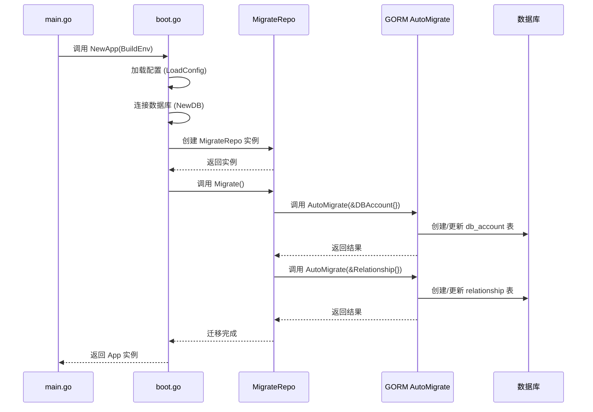
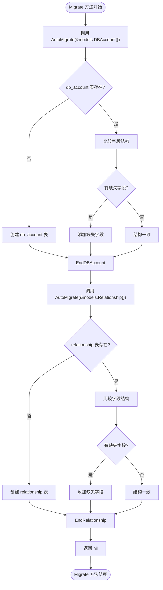
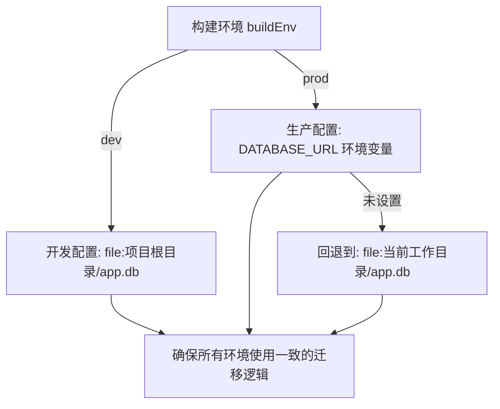

# 数据库自动迁移机制

<cite>
**Referenced Files in This Document**   
- [migrate_repo.go](file://internal/app/tools/repo/migrate_repo.go)
- [boot.go](file://internal/app/tools/boot.go)
- [main.go](file://bin/main/main.go)
- [db_account.go](file://internal/app/tools/models/db_account.go)
- [relationship.go](file://internal/app/tools/models/relationship.go)
- [db.go](file://internal/infra/database/db.go)
- [config.go](file://internal/infra/config/config.go)
</cite>

## Table of Contents
1. [简介](#简介)
2. [核心组件与执行流程](#核心组件与执行流程)
3. [GORM AutoMigrate 机制详解](#gorm-automigrate-机制详解)
4. [跨环境部署一致性](#跨环境部署一致性)
5. [配置与执行时机](#配置与执行时机)
6. [局限性与风险](#局限性与风险)
7. [生产环境最佳实践](#生产环境最佳实践)

## 简介
本文档系统化地阐述了项目中实现的数据库自动迁移机制。该机制通过 `migrate_repo.go` 文件中的 `MigrateRepo` 组件，在应用启动时自动确保 `db_account` 和 `relationship` 两张核心数据表的存在与结构同步。文档详细说明了其调用逻辑、执行流程、配置方式以及在不同环境下的行为，并讨论了其局限性，为开发者提供了全面的理解和使用指南。

## 核心组件与执行流程
数据库自动迁移是应用启动过程中的关键环节，它确保了数据模型与数据库表结构的一致性。

**Diagram sources**
- [main.go](file://bin/main/main.go#L8-L25)
- [boot.go](file://internal/app/tools/boot.go#L40-L92)
- [migrate_repo.go](file://internal/app/tools/repo/migrate_repo.go#L20-L26)

**Section sources**
- [main.go](file://bin/main/main.go#L8-L25)
- [boot.go](file://internal/app/tools/boot.go#L40-L92)
- [migrate_repo.go](file://internal/app/tools/repo/migrate_repo.go#L1-L27)

## GORM AutoMigrate 机制详解
`GORM AutoMigrate` 是实现自动迁移的核心功能，它通过检查数据库中的表结构与 Go 语言中的结构体定义，自动执行必要的 DDL（数据定义语言）操作。

### 调用逻辑
迁移逻辑封装在 `migrate_repo.go` 的 `MigrateRepo.Migrate` 方法中。该方法接收一个 `*database.DB` 实例，并依次对 `DBAccount` 和 `Relationship` 两个模型调用 `AutoMigrate`。

**Diagram sources**
- [migrate_repo.go](file://internal/app/tools/repo/migrate_repo.go#L20-L26)
- [db.go](file://internal/infra/database/db.go#L87-L89)

**Section sources**
- [migrate_repo.go](file://internal/app/tools/repo/migrate_repo.go#L20-L26)

### 处理策略
`AutoMigrate` 的处理策略主要体现在对新增字段和索引的处理上：
- **新增字段**：当 Go 结构体中定义了新的字段，而数据库表中不存在时，`AutoMigrate` 会自动执行 `ALTER TABLE ... ADD COLUMN` 语句来添加该字段。例如，如果未来在 `DBAccount` 模型中添加一个 `Status` 字段，迁移会自动将其添加到 `db_account` 表中。
- **索引**：通过 GORM 的 `gorm:"index"` 或 `gorm:"uniqueIndex"` 标签定义的索引，也会在迁移过程中被创建。如果索引不存在，`AutoMigrate` 会执行 `CREATE INDEX` 语句。
- **现有数据**：`AutoMigrate` 在添加新字段时，会保留表中已有的所有数据，新字段的值将使用其类型的零值（如字符串为空，整数为0）进行填充。

## 跨环境部署一致性
该自动迁移机制是确保开发、测试和生产环境数据库结构一致性的关键。

### 环境配置
应用通过 `config.go` 中的 `LoadConfig` 函数加载环境配置。`buildEnv` 参数决定了应用的构建环境（如 "dev" 或 "prod"）。在开发环境下，数据库 URL 被硬编码为项目根目录下的 `app.db`；而在生产环境下，则优先从环境变量 `DATABASE_URL` 中读取，这使得部署到不同服务器时可以灵活配置数据库连接。

**Diagram sources**
- [config.go](file://internal/infra/config/config.go#L22-L57)

**Section sources**
- [config.go](file://internal/infra/config/config.go#L22-L57)

此机制避免了手动建表或手动执行 SQL 脚本可能带来的错误和不一致，保证了无论在哪个环境部署，只要代码相同，数据库结构就会通过相同的迁移逻辑达到一致状态。

## 配置与执行时机
自动迁移的启用是隐式的，由代码逻辑决定，其执行时机非常明确。

### 执行时机
迁移操作在 `boot.go` 的 `NewApp` 函数中被调用，该函数是应用初始化的核心。其执行顺序如下：
1.  **加载配置**：读取环境变量和配置文件。
2.  **连接数据库**：根据配置建立数据库连接。
3.  **初始化业务组件**：创建各个业务模块所需的仓库（Repo）和服务（Service）。
4.  **执行数据库迁移**：在所有组件初始化之前，创建 `MigrateRepo` 实例并立即调用其 `Migrate` 方法。
5.  **返回应用实例**：只有迁移成功，`NewApp` 才会返回一个完整的 `App` 实例。

这种设计确保了在应用的任何业务逻辑执行之前，数据库结构已经是最新的。如果迁移失败（例如，数据库连接问题或权限不足），`NewApp` 会返回错误，应用将无法启动，从而防止了因数据库结构不匹配而导致的运行时错误。

**Section sources**
- [boot.go](file://internal/app/tools/boot.go#L40-L92)

## 局限性与风险
尽管 `AutoMigrate` 提供了便利，但它也存在显著的局限性和潜在风险，尤其是在生产环境中。

### 主要局限性
- **不支持字段删除**：`AutoMigrate` **不会**删除数据库表中已经存在但 Go 结构体中已移除的字段。这些“孤儿”字段会一直存在于数据库中，可能导致数据混乱和存储浪费。
- **不支持复杂数据迁移**：它无法处理需要数据转换的场景。例如，如果需要将一个 `Name` 字段拆分为 `FirstName` 和 `LastName` 两个字段，`AutoMigrate` 无法自动完成数据的拆分和填充。
- **重命名字段困难**：GORM 无法识别字段的重命名。将 `old_name` 改为 `new_name` 会被视为删除 `old_name` 和添加 `new_name`，导致数据丢失。
- **索引变更限制**：虽然可以添加索引，但修改或删除现有索引的策略可能不够精细，有时需要手动干预。

这些局限性意味着 `AutoMigrate` 更适合于开发和测试阶段的快速迭代，而在生产环境中直接使用则存在较高的数据安全风险。

**Section sources**
- [migrate_repo.go](file://internal/app/tools/repo/migrate_repo.go#L20-L26)

## 生产环境最佳实践
为了在生产环境中安全地管理数据库变更，建议采用更可控的版本化迁移脚本，而非完全依赖 `AutoMigrate`。

### 建议方案
1.  **禁用生产环境的 AutoMigrate**：在生产部署的配置中，可以考虑注释掉或通过条件判断跳过 `migrateRepo.Migrate()` 的调用。
2.  **引入版本化迁移工具**：集成如 `golang-migrate/migrate` 这样的工具。开发者需要手动编写 SQL 迁移脚本（如 `000001_create_users_table.sql` 和 `000002_add_email_index.sql`），并为每个脚本编写相应的回滚脚本。
3.  **自动化迁移流程**：在 CI/CD 流水线中，将执行迁移脚本作为部署流程的一部分。这样可以确保每次发布新版本时，数据库都能精确地升级到所需的版本。
4.  **手动审核**：对于复杂的、涉及数据修改的迁移，应由数据库管理员手动审核和执行，以确保万无一失。

通过结合 `AutoMigrate` 的便捷性和版本化迁移脚本的安全性，可以在不同阶段实现最优的数据库管理策略。

**Section sources**
- [boot.go](file://internal/app/tools/boot.go#L85-L88)
- [migrate_repo.go](file://internal/app/tools/repo/migrate_repo.go#L20-L26)