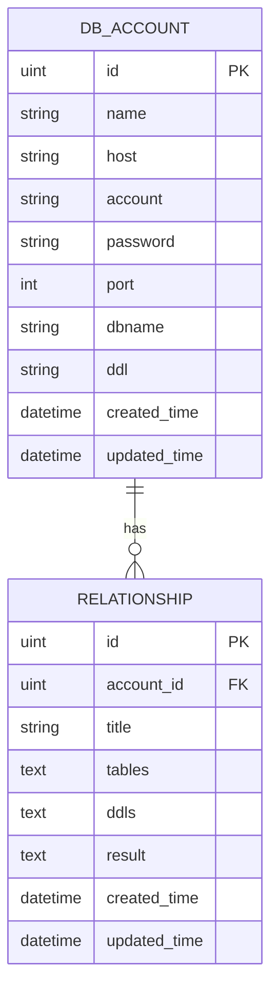

# 数据库设计

<cite>
**Referenced Files in This Document**   
- [db_account.go](file://internal/app/tools/models/db_account.go)
- [relationship.go](file://internal/app/tools/models/relationship.go)
- [migrate_repo.go](file://internal/app/tools/repo/migrate_repo.go)
- [db_account_repo.go](file://internal/app/tools/business/dbaccount/db_account_repo.go)
- [relationship_repo.go](file://internal/app/tools/business/relationship/relationship_repo.go)
- [service.go](file://internal/app/tools/business/dbaccount/service.go)
- [service.go](file://internal/app/tools/business/relationship/service.go)
- [table_info.go](file://internal/app/tools/models/table_info.go)
- [manage_database_repo.go](file://internal/app/tools/repo/manage_database_repo.go)
</cite>

## 目录
1. [核心数据模型](#核心数据模型)
2. [实体关系图](#实体关系图)
3. [自动迁移机制](#自动迁移机制)
4. [数据生命周期与安全](#数据生命周期与安全)

## 核心数据模型

### db_account 表结构

`db_account` 表用于存储数据库连接信息，其字段设计如下：

| 字段名 | 类型 | 约束 | 说明 |
|--------|------|------|------|
| ID | uint | 主键 | 唯一标识符 |
| Name | string | 非空 | 数据库账号名称 |
| Host | string | 非空 | 主机地址 |
| Account | string | 非空 | 登录用户名 |
| Password | string | 非空 | 登录密码 |
| Port | int | 非空 | 端口号 |
| Dbname | string | 非空 | 数据库名称 |
| Ddl | string | - | 数据库定义语言（DDL） |
| CreatedTime | time.Time | - | 创建时间（自动填充） |
| UpdatedTime | time.Time | - | 更新时间（自动填充） |

**GORM 模型映射规则**：
- `ID` 字段通过 `gorm:"primaryKey"` 标签定义为主键
- 所有字符串字段均使用 `gorm:"not null"` 确保非空约束
- `CreatedTime` 和 `UpdatedTime` 分别通过 `gorm:"autoCreateTime"` 和 `gorm:"autoUpdateTime"` 实现自动时间戳管理

**Section sources**
- [db_account.go](file://internal/app/tools/models/db_account.go#L5-L16)

### relationship 表结构

`relationship` 表用于存储AI分析结果，其字段设计如下：

| 字段名 | 类型 | 约束 | 说明 |
|--------|------|------|------|
| ID | uint | 主键 | 唯一标识符 |
| AccountID | uint | 非空 | 关联的数据库账号ID |
| Title | string | 非空 | 分析标题 |
| Tables | string | text类型 | JSON格式存储所有表信息 |
| Ddls | string | text类型 | JSON格式存储所有表结构 |
| Result | string | text类型 | AI分析结果存储 |
| CreatedTime | time.Time | - | 创建时间（自动填充） |
| UpdatedTime | time.Time | - | 更新时间（自动填充） |

该表通过 `AccountID` 字段与 `db_account` 表建立外键关联，实现多对一关系。`Tables`、`Ddls` 和 `Result` 字段均采用 `text` 类型以支持大文本存储，满足AI分析结果的存储需求。

**Section sources**
- [relationship.go](file://internal/app/tools/models/relationship.go#L5-L14)

## 实体关系图

**Diagram sources**
- [db_account.go](file://internal/app/tools/models/db_account.go#L5-L16)
- [relationship.go](file://internal/app/tools/models/relationship.go#L5-L14)

## 自动迁移机制

系统通过 `migrate_repo.go` 文件中的 `MigrateRepo` 结构体实现数据库表结构的自动同步。该机制在应用启动时执行，确保数据库模式与代码模型保持一致。

`Migrate` 方法通过调用 GORM 的 `AutoMigrate` 函数，对 `DBAccount` 和 `Relationship` 两个模型进行迁移操作。此过程会自动创建表（如果不存在）、添加缺失的字段，并保持现有数据的完整性。

该机制的优势在于：
- 无需手动编写SQL迁移脚本
- 开发环境与生产环境保持一致的表结构
- 支持增量式模式变更
- 减少人为错误导致的数据库不一致问题

**Section sources**
- [migrate_repo.go](file://internal/app/tools/repo/migrate_repo.go#L20-L26)

## 数据生命周期与安全

### 连接信息加密存储

系统在连接数据库时，直接使用 `db_account` 表中存储的明文密码构建连接字符串。当前实现中，数据库连接凭证以明文形式存储在数据库中，存在一定的安全风险。

**安全改进建议**：
- 实现字段级加密，对 `Password` 字段进行加密存储
- 使用密钥管理系统（KMS）管理加密密钥
- 考虑使用数据库连接池和凭证代理模式，避免直接暴露原始凭证

### 分析结果缓存策略

系统通过 `manage_database_repo.go` 中的 `ManageDatabaseRepo` 结构体实现了数据库连接的缓存管理。该组件维护一个内存映射（`databases map[uint]*Database`），将数据库账号ID映射到对应的数据库连接实例。

这种缓存策略的优势包括：
- 避免重复建立数据库连接，提高性能
- 集中管理数据库连接生命周期
- 支持快速切换不同数据库实例进行分析

当用户发起AI分析请求时，系统首先从缓存中获取对应的数据库连接，然后提取指定表的DDL信息，最后将这些结构化数据提交给AI服务进行关系分析。

**Section sources**
- [manage_database_repo.go](file://internal/app/tools/repo/manage_database_repo.go#L19-L40)