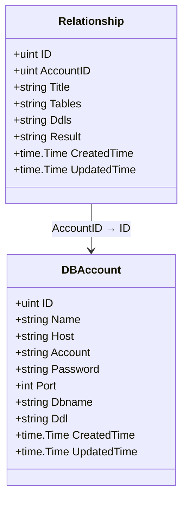
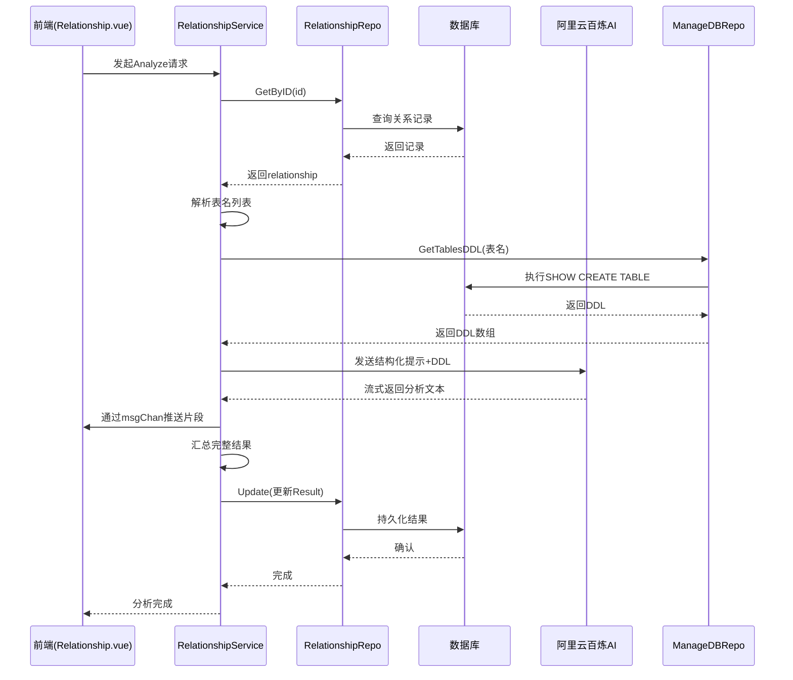

# 表关系分析模型 (relationship)

<cite>
**本文档引用文件**  
- [relationship.go](file://internal/app/tools/models/relationship.go)
- [db_account.go](file://internal/app/tools/models/db_account.go)
- [service.go](file://internal/app/tools/business/relationship/service.go)
- [model.go](file://internal/app/tools/business/relationship/model.go)
- [Relationship.vue](file://web/src/views/database/Relationship.vue)
</cite>

## 目录
1. [引言](#引言)
2. [模型设计与字段构成](#模型设计与字段构成)
3. [GORM结构体与数据库映射](#gorm结构体与数据库映射)
4. [服务层实现：关系分析与持久化](#服务层实现关系分析与持久化)
5. [AI集成与关系推理流程](#ai集成与关系推理流程)
6. [前端消费：关系图谱展示](#前端消费关系图谱展示)
7. [总结](#总结)

## 引言
`relationship` 模型是数据库智能理解功能的核心组成部分，用于存储由阿里云百炼AI服务分析得出的数据库表间关系结果。该模型不仅持久化了原始结构信息与AI生成的关系描述，还作为前端可视化图谱的数据基础，支持用户直观理解复杂数据库架构。

## 模型设计与字段构成
`Relationship` 模型旨在完整记录一次数据库关系分析任务的上下文与结果，其核心字段包括：

- **ID**：主键，唯一标识每条关系记录
- **AccountID**：外键，关联 `db_account` 表，标识所属数据库账户
- **Title**：分析任务标题，便于用户识别
- **Tables**：JSON字符串，存储参与分析的所有表名信息
- **Ddls**：JSON字符串，存储各表的DDL（数据定义语言）结构
- **Result**：文本字段，保存AI服务返回的完整关系分析结果
- **CreatedTime / UpdatedTime**：时间戳，记录创建与更新时间

该设计将结构元数据与AI输出统一存储，确保分析过程可追溯、结果可复现。

**Section sources**
- [relationship.go](file://internal/app/tools/models/relationship.go#L5-L15)

## GORM结构体与数据库映射
在 GORM 框架下，`Relationship` 结构体通过标签精确映射到数据库字段，确保类型安全与ORM行为一致性。关键映射特性如下：

- `gorm:"primaryKey"` 标识 `ID` 为主键
- `gorm:"not null"` 确保 `AccountID` 和 `Title` 为必填字段
- `gorm:"type:text"` 用于大文本字段（如 `Tables`, `Ddls`, `Result`），适配长文本存储需求
- `gorm:"autoCreateTime"` 与 `autoUpdateTime` 自动管理时间戳

此外，通过 `AccountID` 字段建立与 `DBAccount` 模型的显式关联，形成清晰的外键约束，保障数据一致性。



**Diagram sources**
- [relationship.go](file://internal/app/tools/models/relationship.go#L6-L15)
- [db_account.go](file://internal/app/tools/models/db_account.go#L6-L17)

## 服务层实现：关系分析与持久化
`relationship/service.go` 中的 `Service` 结构体封装了完整的业务逻辑，提供创建、查询、更新、删除及核心分析功能。

关键方法包括：
- `Create()`：创建新关系记录前验证账户存在性与字段完整性
- `GetByAccountID()`：按数据库账户聚合所有分析记录
- `Update()`：更新记录时保留原始创建时间，确保审计一致性
- `Delete()`：删除前检查记录是否存在，防止误操作

所有操作均通过 `repo`（仓储层）代理，遵循依赖注入原则，提升可测试性与解耦程度。

**Section sources**
- [service.go](file://internal/app/tools/business/relationship/service.go#L14-L99)

## AI集成与关系推理流程
`Analyze()` 方法是智能分析的核心入口，其实现流程如下：

1. 根据 `ID` 获取关系记录
2. 解析 `Tables` 字段中的表名列表
3. 调用 `manageDatabaseRepo` 获取对应表的完整 DDL 结构
4. 将 DDL 序列化并更新至 `Ddls` 字段
5. 使用 `aliYunBaiLianRelationshipRepo` 向阿里云百炼AI服务发送结构化提示
6. 流式接收 AI 返回的分析结果，并通过 `msgChan` 实时推送至前端
7. 汇总最终结果并持久化至 `Result` 字段

此流程实现了从原始结构到语义关系的自动转化，充分发挥大模型在模式理解与自然语言生成上的优势。



**Diagram sources**
- [service.go](file://internal/app/tools/business/relationship/service.go#L101-L182)

## 前端消费：关系图谱展示
前端通过 `web/src/views/database/Relationship.vue` 组件消费该模型数据。组件通过 API 获取 `Result` 字段中的 AI 分析结果，并将其渲染为可视化的关系图谱。

典型 JSON 输出结构示例如下：
```json
{
  "id": 1,
  "account_id": 2,
  "title": "订单系统表关系分析",
  "tables": "[{\"name\":\"orders\"},{\"name\":\"users\"},{\"name\":\"products\"}]",
  "ddls": "{\"orders\":\"CREATE TABLE ...\", \"users\":\"CREATE TABLE ...\"}",
  "result": "orders 表通过 user_id 外键关联 users 表，构成一对多关系；...",
  "created_time": "2025-04-05T10:00:00Z",
  "updated_time": "2025-04-05T10:05:00Z"
}
```

`Relationship.vue` 组件解析 `result` 字段，提取实体与关系，使用图形库（如 D3 或 AntV）构建交互式图谱，支持缩放、搜索与点击查看详情。

**Section sources**
- [model.go](file://internal/app/tools/business/relationship/model.go#L7-L26)
- [Relationship.vue](file://web/src/views/database/Relationship.vue)

## 总结
`relationship` 模型不仅是数据存储单元，更是连接数据库元数据、AI推理服务与前端可视化的核心枢纽。它通过结构化设计与清晰的服务分层，实现了从原始 DDL 到语义化关系图谱的完整链路，显著提升了数据库理解的智能化水平，在系统中具有不可替代的核心地位。