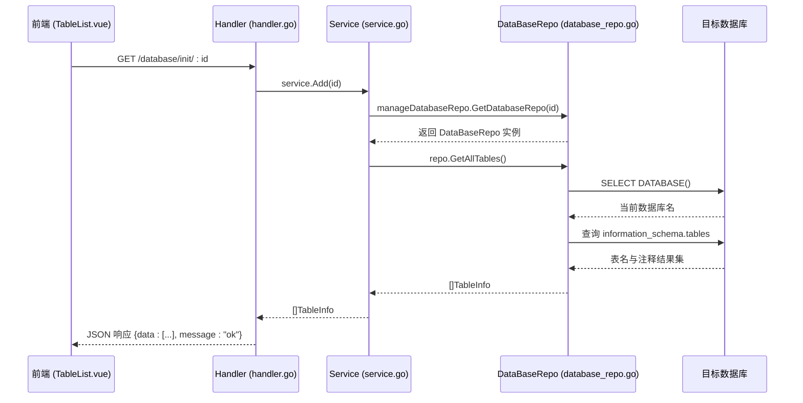

# 表结构信息模型 (table_info)

<cite>
**本文档引用的文件**
- [table_info.go](file://internal/app/tools/models/table_info.go)
- [database_repo.go](file://internal/app/tools/repo/database_repo.go)
- [service.go](file://internal/app/tools/business/database/service.go)
- [handler.go](file://internal/app/tools/business/database/handler.go)
- [TableList.vue](file://web/database_api/src/views/database/TableList.vue)
</cite>

## 目录
1. [介绍](#介绍)
2. [模型设计用途](#模型设计用途)
3. [技术实现](#技术实现)
4. [数据转换流程](#数据转换流程)
5. [前端使用方式](#前端使用方式)
6. [依赖关系图](#依赖关系图)
7. [结论](#结论)

## 介绍
`table_info` 模型是系统中用于临时存储数据库表结构元数据的核心数据结构。它不对应任何持久化数据库表，而是作为服务层向 API 响应提供结构化数据的中间传输对象。该模型主要用于获取目标数据库中所有表的名称与注释信息，并通过 GORM 反射机制从 `information_schema.tables` 动态提取数据。

**Section sources**
- [table_info.go](file://internal/app/tools/models/table_info.go#L3-L6)

## 模型设计用途
`TableInfo` 结构体的设计目的是为了封装数据库表的基本元数据，包括：
- **Name**: 表名，映射到数据库字段 `TABLE_NAME`
- **Comment**: 表注释，映射到数据库字段 `TABLE_COMMENT`

该模型属于非持久化模型，即它本身并不在应用的数据库中创建对应的表。其主要作用是作为**数据传输对象（DTO）**，在后端服务与前端之间传递表结构信息。这种设计避免了直接暴露底层数据库结构，增强了系统的解耦性和安全性。

此外，`TableInfo` 被广泛用于数据库浏览功能中，为用户提供可视化的表列表及其描述信息，辅助用户理解数据库内容。

**Section sources**
- [table_info.go](file://internal/app/tools/models/table_info.go#L3-L6)

## 技术实现
`table_info` 模型的技术实现涉及多个层次的协作，主要包括模型定义、仓库层查询、服务层封装和处理器层暴露接口。

### 模型定义
`TableInfo` 定义于 `internal/app/tools/models/table_info.go` 文件中，使用 GORM 标签将结构体字段映射到 `information_schema.tables` 的实际列名。

### 仓库层实现
`DataBaseRepo.GetAllTables()` 方法负责执行原始 SQL 查询，从 `information_schema.tables` 中提取当前数据库的所有表名和注释。其实现逻辑如下：
1. 使用 GORM 的 `Raw()` 方法执行 `SELECT DATABASE()` 获取当前数据库名。
2. 构造动态 SQL 查询语句，筛选 `table_schema` 为当前数据库名的记录。
3. 将查询结果扫描（Scan）到 `[]models.TableInfo` 切片中并返回。

此方法利用了 GORM 的反射能力，自动将查询结果映射到 `TableInfo` 结构体字段。

### 服务层封装
`database.Service.GetTables(id uint)` 方法通过 `manageDatabaseRepo.GetDatabaseRepo(id)` 获取对应数据库的仓库实例，并调用其 `GetAllTables()` 方法获取表信息列表。该服务方法作为业务逻辑的统一入口，屏蔽了底层数据访问细节。

### 处理器层接口暴露
`Handler.Init()` 方法是一个 HTTP 处理函数，接收前端传入的数据库连接 ID，调用服务层的 `Add()` 和 `GetTables()` 方法完成数据库初始化并获取表列表，最终通过 `api.Success()` 返回 JSON 格式的响应。



**Diagram sources**
- [table_info.go](file://internal/app/tools/models/table_info.go#L3-L6)
- [database_repo.go](file://internal/app/tools/repo/database_repo.go#L20-L44)
- [service.go](file://internal/app/tools/business/database/service.go#L21-L23)
- [handler.go](file://internal/app/tools/business/database/handler.go#L21-L31)

## 数据转换流程
从原始 SQL 查询结果到 `table_info` 实例的转换流程如下：

1. **请求触发**：前端发起 `/database/init/:id` 请求。
2. **参数解析**：`Handler.Init()` 解析 URL 路径中的 `id` 参数。
3. **服务调用**：调用 `service.GetTables(id)`。
4. **仓库获取**：通过 `manageDatabaseRepo.GetDatabaseRepo(id)` 获取对应数据库连接的 `DataBaseRepo`。
5. **SQL 查询**：`GetAllTables()` 执行以下 SQL：
   ```sql
   SELECT TABLE_NAME, IFNULL(TABLE_COMMENT, '') AS TABLE_COMMENT
   FROM information_schema.tables 
   WHERE table_schema = '当前数据库名'
   ORDER BY TABLE_NAME
   ```
6. **结果映射**：GORM 使用 `Scan(&tables)` 将每一行结果自动映射到 `TableInfo` 结构体字段，依据 `json` 和 `gorm` 标签进行绑定。
7. **返回响应**：最终将 `[]TableInfo` 序列化为 JSON 返回前端。

该流程体现了典型的分层架构模式，各层职责清晰，便于维护和扩展。

**Section sources**
- [database_repo.go](file://internal/app/tools/repo/database_repo.go#L20-L44)
- [service.go](file://internal/app/tools/business/database/service.go#L21-L23)
- [handler.go](file://internal/app/tools/business/database/handler.go#L21-L31)

## 前端使用方式
`table_info` 模型的数据在前端 `TableList.vue` 组件中被消费。该组件通过调用 `/database/init/:id` 接口获取表结构信息，并将其渲染为可交互的表格或列表。

前端定义了对应的 TypeScript 接口 `TableInfo`，结构与后端保持一致：
```ts
interface TableInfo {
  name: string
  comment: string
  selected?: boolean
}
```
其中 `selected` 字段为扩展属性，用于标记用户是否选中该表，便于后续操作（如生成 DDL、分析关系等）。

组件通过 API 请求获取数据后，将响应中的 `data` 字段（即 `TableInfo[]`）绑定到视图，实现动态展示数据库表结构。

**Section sources**
- [TableList.vue](file://web/database_api/src/views/database/TableList.vue#L75-L79)

## 依赖关系图
```mermaid
graph TD
Handler[Handler.Init] --> Service[Service.GetTables]
Service --> ManageRepo[ManageDatabaseRepo.GetDatabaseRepo]
ManageRepo --> DataBaseRepo[DataBaseRepo.GetAllTables]
DataBaseRepo --> InfoSchema[(information_schema.tables)]
DataBaseRepo --> TableInfo[TableInfo]
TableInfo --> Name[Name: string]
TableInfo --> Comment[Comment: string]
Handler --> Response[api.Success(tables)]
```

**Diagram sources**
- [handler.go](file://internal/app/tools/business/database/handler.go#L21-L31)
- [service.go](file://internal/app/tools/business/database/service.go#L21-L23)
- [database_repo.go](file://internal/app/tools/repo/database_repo.go#L20-L44)
- [table_info.go](file://internal/app/tools/models/table_info.go#L3-L6)

## 结论
`table_info` 模型是系统中实现数据库元数据浏览功能的关键组件。它通过非持久化设计，作为服务层与 API 层之间的数据传输中间层，有效解耦了业务逻辑与数据展示。结合 GORM 的反射能力，能够动态从 `information_schema` 提取表结构信息，并通过清晰的分层架构传递至前端组件 `TableList.vue`，实现了数据库表的可视化展示。该模型设计简洁、职责明确，具备良好的可维护性和扩展性。