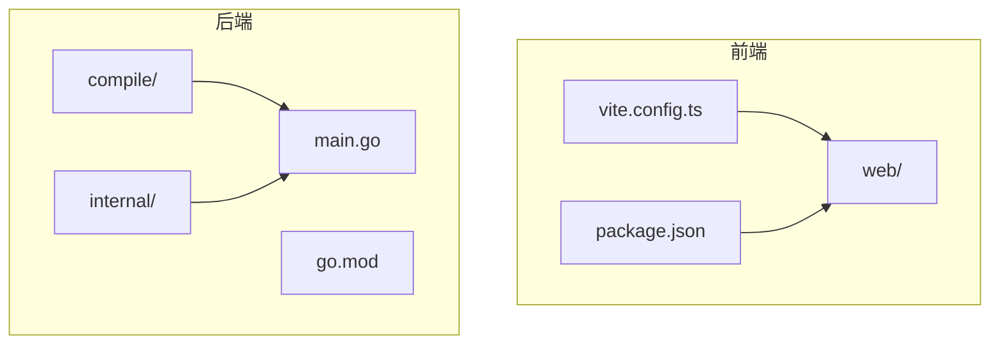
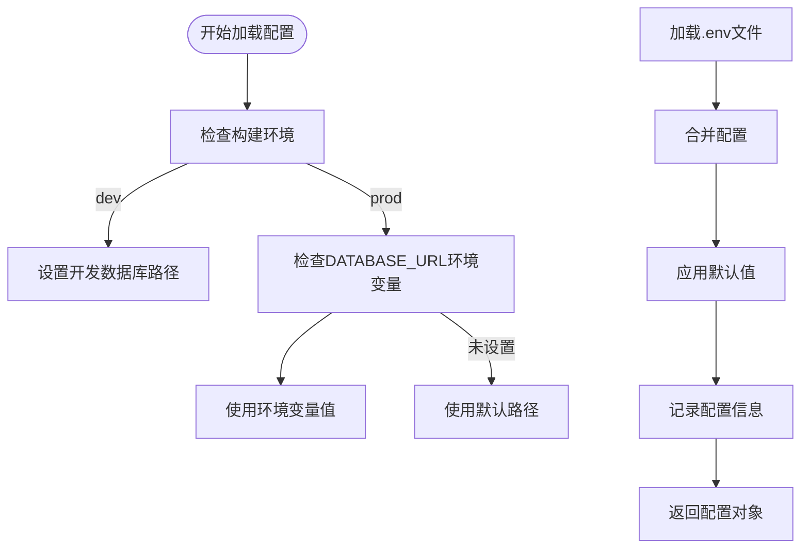

# 容器化部署

<cite>
**本文档引用的文件**  
- [config.go](file://internal/infra/config/config.go)
- [dev.go](file://compile/dev.go)
- [prod.go](file://compile/prod.go)
- [start_web.go](file://compile/start_web.go)
- [main.go](file://bin/main/main.go)
- [go.mod](file://go.mod)
- [vite.config.ts](file://web/vite.config.ts)
- [package.json](file://web/package.json)
</cite>

## 目录

1. [简介](#简介)
2. [项目结构](#项目结构)
3. [多阶段Docker构建策略](#多阶段docker构建策略)
4. [Dockerfile设计](#dockerfile设计)
5. [docker-compose.yml配置示例](#docker-composeyml配置示例)
6. [Kubernetes部署建议](#kubernetes部署建议)
7. [环境变量与配置管理集成](#环境变量与配置管理集成)
8. [镜像优化技巧](#镜像优化技巧)
9. [结论](#结论)

## 简介

本文档提供基于Docker的容器化部署指南，涵盖从开发到生产环境的完整流程。系统采用Go语言作为后端服务，Vue框架构建前端界面，通过多阶段Docker构建实现前后端一体化打包。文档详细说明如何使用Node镜像构建前端静态资源，使用Go镜像编译后端二进制文件并嵌入前端资源，确保部署一致性与高效性。

## 项目结构

项目采用分层架构设计，主要包含以下目录：
- `web/`：前端Vue应用，使用Vite构建，包含组件、路由和API调用逻辑
- `internal/`：后端核心逻辑，包括应用服务、基础设施、共享工具等
- `compile/`：构建相关代码，支持开发与生产环境的不同构建策略
- 根目录包含`go.mod`、`main.go`等核心后端文件及前端构建配置

前端通过Vite开发服务器运行于`localhost:5173`，后端Fiber框架服务默认监听`8080`端口，并通过代理将非API请求转发至前端开发服务器。



**Diagram sources**
- [vite.config.ts](file://web/vite.config.ts#L1-L27)
- [main.go](file://bin/main/main.go#L1-L25)

**Section sources**
- [main.go](file://bin/main/main.go#L1-L25)
- [vite.config.ts](file://web/vite.config.ts#L1-L27)
- [package.json](file://web/package.json)

## 多阶段Docker构建策略

本项目采用多阶段Docker构建策略，分为两个主要阶段：

1. **前端构建阶段**：使用Node.js镜像安装依赖并执行`pnpm build`，生成静态资源文件
2. **后端构建阶段**：使用Go镜像编译后端二进制文件，并将前端构建产物嵌入到Go二进制中

该策略有效分离构建环境，避免将Node.js运行时带入最终镜像，显著减小镜像体积。

**Section sources**
- [prod.go](file://compile/prod.go#L1-L36)
- [dev.go](file://compile/dev.go#L1-L63)

## Dockerfile设计

```Dockerfile
# 第一阶段：构建前端
FROM node:18-alpine AS frontend
WORKDIR /app/web
COPY web/package.json web/pnpm-lock.yaml ./
RUN npm install -g pnpm && pnpm install
COPY web/ .
RUN pnpm run build

# 第二阶段：构建后端
FROM golang:1.24-alpine AS backend
WORKDIR /app
COPY go.mod go.sum ./
RUN go mod download
COPY . .
# 嵌入前端构建结果
COPY --from=frontend /app/web/dist ./web/dist
RUN CGO_ENABLED=0 GOOS=linux go build -o main ./bin/main/main.go

# 最终阶段：运行时环境
FROM alpine:latest
RUN apk --no-cache add ca-certificates
WORKDIR /root/
COPY --from=backend /app/main .
COPY --from=backend /app/app.db ./app.db
EXPOSE 8080
CMD ["./main"]
```

构建命令示例：
```bash
docker build -t database-ai-app .
```

**Section sources**
- [main.go](file://bin/main/main.go#L1-L25)
- [prod.go](file://compile/prod.go#L1-L36)
- [go.mod](file://go.mod#L1-L53)

## docker-compose.yml配置示例

```yaml
version: '3.8'
services:
  app:
    build:
      context: .
      dockerfile: Dockerfile
    ports:
      - "8080:8080"
    environment:
      - APP_ENV=prod
      - APP_PORT=8080
      - DATABASE_URL=file:/root/app.db?_foreign_keys=on
      - OPENAI_URL=https://dashscope.aliyuncs.com
      - OPENAI_KEY=${OPENAI_KEY}
    volumes:
      - app_data:/root/app.db
    depends_on:
      - db
    restart: unless-stopped

  db:
    image: sqlite3
    volumes:
      - app_data:/data
    restart: unless-stopped

volumes:
  app_data:
```

**Section sources**
- [config.go](file://internal/infra/config/config.go#L1-L58)
- [vite.config.ts](file://web/vite.config.ts#L1-L27)

## Kubernetes部署建议

### 资源配置
```yaml
resources:
  requests:
    memory: "128Mi"
    cpu: "100m"
  limits:
    memory: "512Mi"
    cpu: "500m"
```

### 健康检查探针
```yaml
livenessProbe:
  httpGet:
    path: /api/health
    port: 8080
  initialDelaySeconds: 30
  periodSeconds: 10

readinessProbe:
  httpGet:
    path: /api/ready
    port: 8080
  initialDelaySeconds: 10
  periodSeconds: 5
```

### 持久化存储方案
使用PersistentVolumeClaim挂载SQLite数据库文件，确保数据持久化：
```yaml
volumeMounts:
  - name: app-storage
    mountPath: /root/app.db
    subPath: app.db

volumes:
  - name: app-storage
    persistentVolumeClaim:
      claimName: app-pvc
```

**Section sources**
- [config.go](file://internal/infra/config/config.go#L1-L58)
- [main.go](file://bin/main/main.go#L1-L25)

## 环境变量与配置管理集成

系统通过`internal/infra/config/config.go`中的`LoadConfig`函数加载环境变量，优先级如下：
1. 系统环境变量
2. `.env`文件
3. 默认值

支持的关键环境变量包括：
- `APP_ENV`：应用环境（dev/prod）
- `APP_PORT`：服务端口
- `DATABASE_URL`：数据库连接字符串
- `OPENAI_KEY`：AI服务密钥
- `OPENAI_URL`：AI服务地址

配置加载过程会根据构建环境自动调整数据库路径，开发环境使用项目根目录下的`app.db`，生产环境支持自定义路径。



**Diagram sources**
- [config.go](file://internal/infra/config/config.go#L22-L58)

**Section sources**
- [config.go](file://internal/infra/config/config.go#L1-L58)

## 镜像优化技巧

1. **使用轻量基础镜像**：最终镜像使用`alpine:latest`，仅包含必要证书
2. **构建缓存利用**：
   - 分层COPY，先复制`go.mod`再复制源码
   - 前端构建阶段独立缓存依赖安装
3. **多阶段构建**：分离构建与运行环境，避免携带编译工具
4. **静态链接**：`CGO_ENABLED=0`生成静态二进制，无需动态库
5. **最小化层**：合并RUN指令减少镜像层数
6. **忽略不必要的文件**：通过`.dockerignore`排除`node_modules`、`test`等目录

**Section sources**
- [Dockerfile](file://Dockerfile)
- [go.mod](file://go.mod#L1-L53)

## 结论

本文档提供了完整的容器化部署方案，通过多阶段Docker构建实现了前后端一体化打包。结合docker-compose和Kubernetes配置建议，可灵活适应不同部署场景。配置管理系统与环境变量的深度集成确保了应用在不同环境下的可移植性。通过镜像优化技巧，最终生成的容器镜像具有体积小、启动快、安全性高的特点，适合生产环境部署。