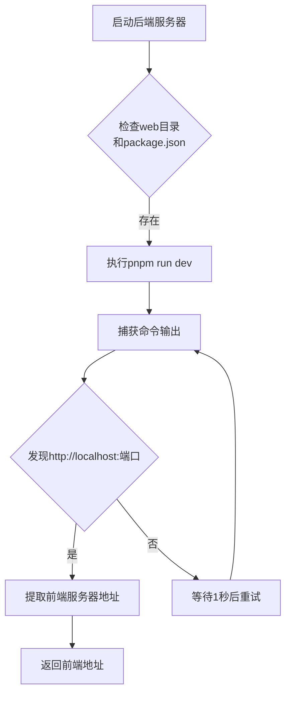
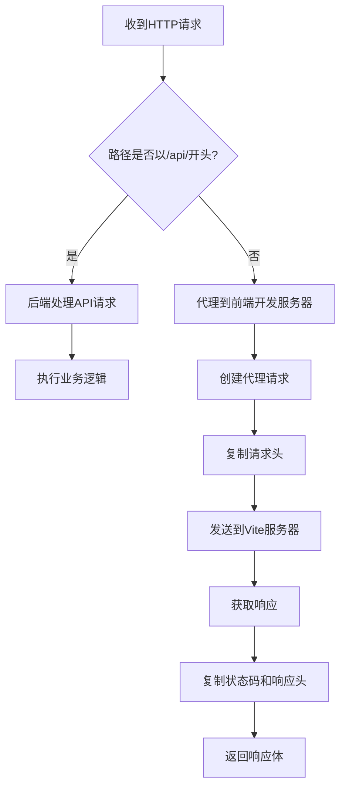

# 开发模式构建

<cite>
**Referenced Files in This Document**   
- [build_dev.go](file://build_dev.go)
- [main.go](file://main.go)
- [compile/dev.go](file://compile/dev.go)
- [compile/start_web.go](file://compile/start_web.go)
</cite>

## 目录
1. [开发模式构建与启动流程](#开发模式构建与启动流程)
2. [条件编译机制](#条件编译机制)
3. [前后端分离开发实现](#前后端分离开发实现)
4. [请求分流与代理逻辑](#请求分流与代理逻辑)
5. [常见问题与解决方案](#常见问题与解决方案)

## 开发模式构建与启动流程

在开发环境中，通过 `go run -tags dev main.go` 命令启动应用。该命令利用 Go 语言的构建标签（build tags）机制，仅编译和链接标记为 `dev` 的代码文件，从而启用开发专用的功能。

启动流程如下：
1. 执行 `go run -tags dev main.go` 命令
2. Go 编译器根据 `//go:build dev` 标签选择性地编译 `build_dev.go` 文件
3. 程序从 `main.go` 的 `main()` 函数开始执行
4. 调用 `setupProductionWeb()` 函数，该函数在开发模式下实际指向 `compile.SetupDev()` 功能
5. 启动后端 Fiber 服务器并自动拉起前端 Vite 开发服务器

**Section sources**
- [main.go](file://main.go#L10-L24)
- [build_dev.go](file://build_dev.go#L1-L17)

## 条件编译机制

Go 语言通过 `//go:build` 指令实现条件编译。在本项目中，`build_dev.go` 文件顶部的 `//go:build dev` 标签定义了该文件仅在指定 `dev` 构建标签时才会被编译。

```go
//go:build dev
// +build dev

package main

var BuildEnv = "dev"

func setupProductionWeb(app *fiber.App) {
	compile.SetupDev(app)
}
```

当执行 `go run -tags dev main.go` 时，编译器会包含此文件，将 `BuildEnv` 变量设置为 `"dev"`，并使 `setupProductionWeb` 函数调用 `SetupDev`。而在生产环境中，使用 `build_prod.go` 文件（通过 `//go:build !dev` 标签排除），实现不同的构建逻辑。

**Section sources**
- [build_dev.go](file://build_dev.go#L1-L17)
- [build_prod.go](file://build_prod.go#L1-L21)

## 前后端分离开发实现

### 前端开发服务器自动启动

`compile.StartWebDevServer()` 函数负责在后端启动时自动拉起前端开发环境。该函数执行以下操作：

1. 验证 `./web` 目录和 `package.json` 文件的存在性
2. 使用 `exec.Command("pnpm", "run", "dev")` 在 `./web` 目录下启动 Vite 开发服务器
3. 实时捕获命令输出，通过正则表达式 `http://localhost:\d+` 提取前端服务器的实际地址
4. 返回前端服务器的访问地址，供代理使用



**Diagram sources**
- [compile/start_web.go](file://compile/start_web.go#L15-L68)

### 开发环境代理设置

`compile.SetupDev()` 函数配置了后端服务器的请求代理机制，实现开发模式下的前后端分离开发。该函数首先调用 `StartWebDevServer()` 获取前端服务器地址，然后设置 Fiber 中间件进行请求代理。

**Section sources**
- [compile/dev.go](file://compile/dev.go#L9-L62)

## 请求分流与代理逻辑

系统通过 Fiber 框架的中间件机制实现智能请求分流，将 API 请求与静态资源请求分别处理。

### 请求分流策略



**Diagram sources**
- [compile/dev.go](file://compile/dev.go#L9-L62)

### 中间件实现细节

Fiber 中间件通过 `app.Use("/", ...)` 注册，拦截所有请求。其核心逻辑包括：

1. **API 请求识别**：使用 `strings.HasPrefix(c.Path(), "/api/")` 判断是否为 API 请求
2. **请求放行**：如果是 API 请求，调用 `c.Next()` 继续执行后续处理器
3. **代理请求创建**：对于非 API 请求，创建指向 Vite 服务器的新 HTTP 请求
4. **请求头复制**：遍历原始请求头并复制到代理请求
5. **响应处理**：接收 Vite 服务器响应后，复制状态码、响应头和响应体返回给客户端

这种设计确保了开发环境下前后端可以独立运行，同时通过单一入口访问，简化了开发配置。

**Section sources**
- [compile/dev.go](file://compile/dev.go#L9-L62)

## 常见问题与解决方案

### 端口冲突

**问题**：Vite 开发服务器默认使用 5173 端口，可能与其他应用冲突。

**解决方案**：
1. 修改 `web/vite.config.ts` 中的 `server.port` 配置
2. 确保 `StartWebDevServer()` 函数能正确识别新端口
3. 检查防火墙设置，确保端口可访问

### 代理失败

**问题**：后端无法连接到前端开发服务器。

**解决方案**：
1. 确认 `./web` 目录存在且包含有效的 `package.json`
2. 检查 `pnpm` 是否已正确安装
3. 验证网络连接和权限设置
4. 查看控制台输出，确认 Vite 服务器已成功启动

### 构建标签不生效

**问题**：`go run` 命令未正确应用构建标签。

**解决方案**：
1. 确保使用 `go run -tags dev main.go` 而非 `go run main.go`
2. 检查 `build_dev.go` 文件中的 `//go:build dev` 语法是否正确
3. 验证 Go 版本支持构建标签（Go 1.17+）

**Section sources**
- [compile/dev.go](file://compile/dev.go#L9-L62)
- [compile/start_web.go](file://compile/start_web.go#L15-L68)
- [build_dev.go](file://build_dev.go#L1-L17)