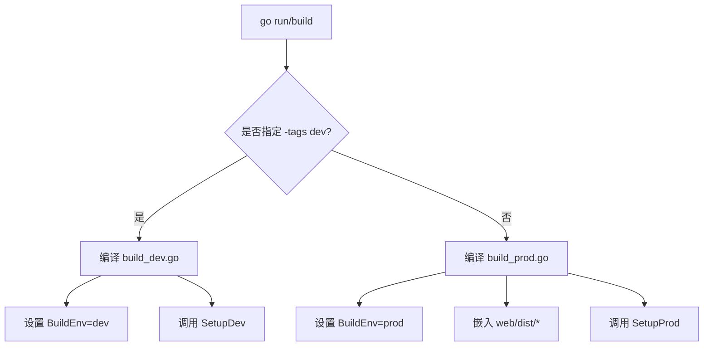
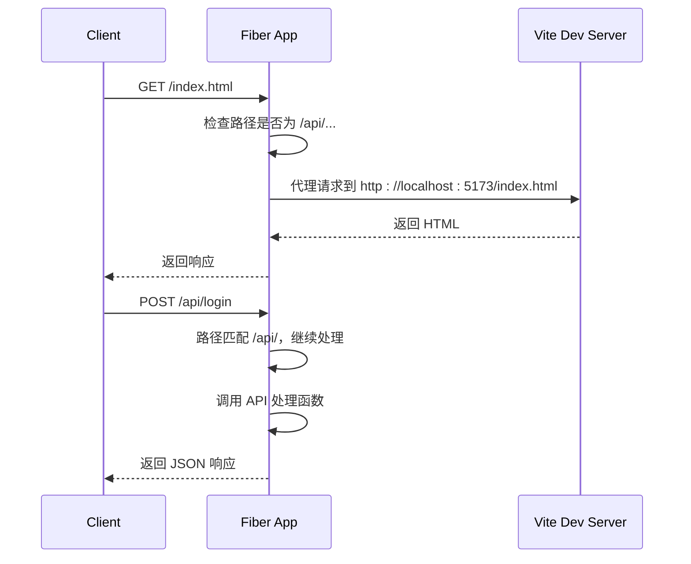

# 构建与部署

<cite>
**本文档引用的文件**  
- [main.go](file://main.go)
- [build_dev.go](file://build_dev.go)
- [build_prod.go](file://build_prod.go)
- [compile/dev.go](file://compile/dev.go)
- [compile/prod.go](file://compile/prod.go)
- [go.mod](file://go.mod)
- [web/package.json](file://web/package.json)
</cite>

## 目录

1. [简介](#简介)
2. [开发模式构建与运行](#开发模式构建与运行)
3. [生产模式构建流程](#生产模式构建流程)
4. [条件编译机制详解](#条件编译机制详解)
5. [编译时前端启动行为实现](#编译时前端启动行为实现)
6. [Docker 多阶段构建建议](#docker-多阶段构建建议)
7. [Kubernetes 部署资源配置建议](#kubernetes-部署资源配置建议)

## 简介

本指南详细说明了项目的完整构建与部署流程，涵盖开发模式与生产环境两种场景。系统采用 Go 语言后端与 Vue 前端（Vite 构建）的架构，通过条件编译实现不同环境下的差异化行为。开发模式下通过代理将前端请求转发至 Vite 开发服务器（5173 端口），生产模式下则将前端静态资源嵌入二进制文件中统一部署。

**Section sources**  
- [main.go](file://main.go#L1-L25)

## 开发模式构建与运行

在开发模式下，项目通过 `go run -tags dev main.go` 启动。该命令使用 `dev` 构建标签激活开发专用代码路径。此时，后端服务运行在 8080 端口，而前端 Vite 开发服务器运行在 5173 端口。

后端通过反向代理机制将非 API 请求（如 `/`, `/about` 等）转发至 Vite 服务器，实现前后端分离开发。API 请求（以 `/api/` 开头）则由后端直接处理。

启动命令：
```bash
go run -tags dev main.go
```

该模式下，前端代码修改可实时热重载，极大提升开发效率。

**Section sources**  
- [build_dev.go](file://build_dev.go#L1-L17)
- [compile/dev.go](file://compile/dev.go#L9-L62)

## 生产模式构建流程

生产环境构建分为两个阶段：前端构建与后端编译。

### 1. 前端构建

进入 `web` 目录并执行构建命令，生成 `dist` 文件夹：

```bash
cd web
pnpm run build
```

该命令依据 `web/package.json` 中的脚本定义，调用 `vite build` 完成打包。

### 2. 后端编译

前端构建完成后，执行标准 Go 构建命令：

```bash
go build -o databaseAi main.go
```

由于未指定 `dev` 标签，系统自动启用生产模式构建逻辑。`//go:embed web/dist/*` 指令将 `dist` 目录下的所有静态文件嵌入最终的二进制文件中。

**Section sources**  
- [build_prod.go](file://build_prod.go#L1-L22)
- [compile/prod.go](file://compile/prod.go#L12-L37)
- [web/package.json](file://web/package.json#L6-L9)

## 条件编译机制详解

项目通过 Go 的构建标签（build tags）实现开发与生产环境的代码分离。

### build_dev.go

```go
//go:build dev
package main

var BuildEnv = "dev"

func setupProductionWeb(app *fiber.App) {
    compile.SetupDev(app)
}
```

当使用 `-tags dev` 编译时，此文件生效，`BuildEnv` 被设为 `"dev"`，并调用 `SetupDev` 函数。

### build_prod.go

```go
//go:build !dev
package main

//go:embed web/dist/*
var webFiles embed.FS
var BuildEnv = "prod"

func setupProductionWeb(app *fiber.App) {
    compile.SetupProd(app, webFiles)
}
```

当未指定 `dev` 标签时，此文件生效。它嵌入 `web/dist` 目录下的所有文件，并调用 `SetupProd` 提供静态服务。

这两个文件互斥，确保在任一构建中仅有一个生效。

**Diagram sources**  
- [build_dev.go](file://build_dev.go#L1-L17)
- [build_prod.go](file://build_prod.go#L1-L22)



## 编译时前端启动行为实现

### 开发模式：SetupDev

位于 `compile/dev.go` 的 `SetupDev` 函数实现反向代理逻辑：

- 启动 Vite 开发服务器（通过 `StartWebDevServer`）
- 对所有请求进行拦截
- 若路径以 `/api/` 开头，则交由后续处理器（API 路由）
- 否则，将请求代理至 `http://localhost:5173`（Vite 服务）
- 复制请求头、转发请求、读取响应并返回给客户端

该机制实现了开发时前后端的无缝集成。

### 生产模式：SetupProd

位于 `compile/prod.go` 的 `SetupProd` 函数实现静态文件服务：

- 验证嵌入的 `web/dist` 目录是否存在
- 若不存在，返回提示信息
- 使用 `fs.Sub` 创建子文件系统
- 通过 `filesystem` 中间件提供静态文件服务
- 所有请求由嵌入的静态文件响应



**Diagram sources**  
- [compile/dev.go](file://compile/dev.go#L10-L62)
- [compile/prod.go](file://compile/prod.go#L12-L37)

## Docker 多阶段构建建议

推荐使用多阶段构建以减小镜像体积并提高安全性。

```Dockerfile
# 阶段1：前端构建
FROM node:20-alpine AS frontend
WORKDIR /app
COPY web/package.json web/pnpm-lock.yaml ./
RUN npm install -g pnpm && pnpm install
COPY web ./web
RUN pnpm --prefix web run build

# 阶段2：后端构建
FROM golang:1.24-alpine AS backend
WORKDIR /app
COPY go.mod go.sum ./
RUN go mod download
COPY . .
COPY --from=frontend /app/web/dist ./web/dist
RUN go build -o databaseAi main.go

# 阶段3：运行时
FROM alpine:latest
RUN apk --no-cache add ca-certificates
WORKDIR /root/
COPY --from=backend /app/databaseAi .
EXPOSE 8080
CMD ["./databaseAi"]
```

此策略确保最终镜像仅包含运行时二进制文件和必要依赖，不包含构建工具和源码。

**Section sources**  
- [go.mod](file://go.mod#L1-L53)
- [web/package.json](file://web/package.json#L1-L38)

## Kubernetes 部署资源配置建议

以下为推荐的 Kubernetes 部署资源配置：

```yaml
apiVersion: apps/v1
kind: Deployment
metadata:
  name: databaseai-backend
spec:
  replicas: 3
  selector:
    matchLabels:
      app: databaseai
  template:
    metadata:
      labels:
        app: databaseai
    spec:
      containers:
      - name: backend
        image: your-registry/databaseai:latest
        ports:
        - containerPort: 8080
        resources:
          requests:
            memory: "256Mi"
            cpu: "250m"
          limits:
            memory: "512Mi"
            cpu: "500m"
        livenessProbe:
          httpGet:
            path: /api/health
            port: 8080
          initialDelaySeconds: 30
          periodSeconds: 10
        readinessProbe:
          httpGet:
            path: /api/health
            port: 8080
          initialDelaySeconds: 10
          periodSeconds: 5
---
apiVersion: v1
kind: Service
metadata:
  name: databaseai-service
spec:
  selector:
    app: databaseai
  ports:
    - protocol: TCP
      port: 80
      targetPort: 8080
  type: LoadBalancer
```

关键建议：
- 设置合理的资源请求与限制，防止资源争用
- 配置存活与就绪探针，确保服务健康
- 使用负载均衡服务暴露应用
- 副本数建议至少为 2-3 以实现高可用

**Section sources**  
- [main.go](file://main.go#L11-L20)