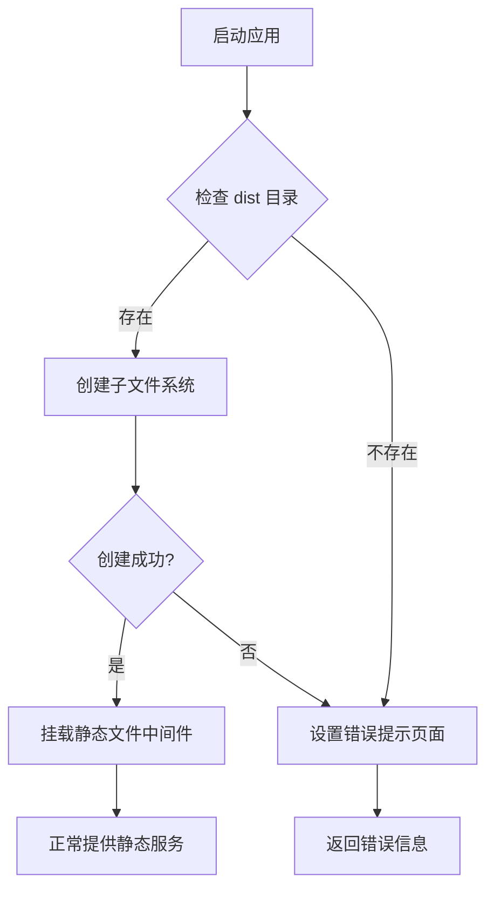

# 生产模式构建

<cite>
**Referenced Files in This Document**  
- [build_prod.go](file://bin/main/build_prod.go)
- [prod.go](file://bin/main/compile/prod.go)
- [vite.config.ts](file://web/database_api/vite.config.ts)
- [main.go](file://bin/main/main.go)
</cite>

## 目录
1. [生产环境构建流程](#生产环境构建流程)
2. [条件编译与资源嵌入机制](#条件编译与资源嵌入机制)
3. [静态文件服务实现](#静态文件服务实现)
4. [降级提示逻辑](#降级提示逻辑)
5. [构建优化建议](#构建优化建议)

## 生产环境构建流程

生产环境构建流程分为两个关键阶段：前端资源构建与后端二进制打包。首先，在 `web/database_api` 目录下执行 `pnpm run build` 命令，该命令依据 `vite.config.ts` 配置文件中的构建设置，将 Vue 3 项目编译为优化后的静态资源，并输出至 `dist` 目录。此过程利用 Vite 的高效构建能力，生成包含 HTML、CSS、JavaScript 和静态资源的生产级文件夹。

完成前端构建后，执行 `go build` 命令编译后端 Go 应用。此时，`build_prod.go` 文件中的 `//go:embed` 指令会将 `web/database_api/dist` 目录下的所有文件作为虚拟文件系统（`embed.FS`）嵌入到最终的可执行二进制文件中。这种一体化打包方式确保了应用的自包含性，简化了部署流程，无需在目标服务器上单独部署前端资源。

**Section sources**
- [vite.config.ts](file://web/database_api/vite.config.ts#L1-L27)
- [build_prod.go](file://bin/main/build_prod.go#L1-L22)

## 条件编译与资源嵌入机制

Go 语言的条件编译和资源嵌入是实现生产模式构建的核心技术。`build_prod.go` 文件顶部的 `//go:build !dev` 指令定义了条件编译标签，确保该文件仅在非开发环境（即生产环境）下被编译器包含。这与可能存在的 `build_dev.go` 文件形成互斥，实现了开发与生产构建逻辑的分离。

`//go:embed /web/database_api/dist/*` 指令则负责将前端构建产物嵌入二进制文件。它声明了一个名为 `webFiles` 的 `embed.FS` 类型变量，该变量在编译时被填充为一个包含 `dist` 目录下所有文件的只读虚拟文件系统。这种机制将静态资源直接编译进程序，消除了对文件系统路径的运行时依赖，极大地提升了部署的便捷性和应用的健壮性。

**Section sources**
- [build_prod.go](file://bin/main/build_prod.go#L1-L22)

## 静态文件服务实现

`compile/prod.go` 文件中的 `SetupProd` 函数负责在生产环境中配置静态文件服务。该函数接收一个 `*fiber.App` 实例和之前嵌入的 `webFiles` 虚拟文件系统作为参数。

其核心逻辑是使用标准库 `io/fs` 中的 `fs.Sub` 函数，从 `webFiles` 根目录创建一个指向 `web/database_api/dist` 子目录的子文件系统 `subFS`。随后，通过 `github.com/gofiber/fiber/v2/middleware/filesystem` 中间件，将此 `subFS` 挂载到 Fiber 应用的根路径 `/`。`filesystem.New` 函数接收 `http.FS(subFS)` 作为根目录，使得所有对根路径的 HTTP 请求都能被正确地路由到嵌入的静态资源上，从而提供完整的前端页面服务。

**Section sources**
- [prod.go](file://bin/main/compile/prod.go#L12-L37)

## 降级提示逻辑

为增强应用的健壮性，`SetupProd` 函数在提供静态服务前会进行资源可用性检查。它通过调用 `webFiles.ReadDir("web/database_api/dist")` 尝试读取嵌入的 `dist` 目录。如果此操作返回错误（例如，`dist` 目录不存在或路径错误），则表明前端资源未成功嵌入。

在此情况下，函数会立即返回，并设置一个简单的路由：当用户访问根路径 `/` 时，服务器返回纯文本响应 "web files not found. Please build the web first."。这为部署人员提供了清晰的故障诊断信息，提示他们需要先执行前端构建命令。此外，如果在创建子文件系统 `fs.Sub` 时发生错误，也会设置一个类似的错误提示页面，确保应用在任何资源加载失败的情况下都能提供有意义的反馈。

**Diagram sources**
- [prod.go](file://bin/main/compile/prod.go#L14-L30)

**Section sources**
- [prod.go](file://bin/main/compile/prod.go#L12-L37)

## 构建优化建议

为了优化生产构建，建议在 `vite.config.ts` 中明确配置输出路径和构建选项。虽然当前配置未显示 `build` 选项，但最佳实践是显式设置 `build.outDir` 为 `dist`，以确保与后端 `//go:embed` 指令的路径完全匹配。同时，应启用代码压缩（如 `terser` 或 `esbuild` 压缩）和资源哈希（`build.rollupOptions.output.assetFileNames`）以实现长期缓存策略。

此外，可以在 `build_prod.go` 中增加构建时的环境变量注入，例如将 `BuildEnv` 变量替换为更详细的版本信息或构建时间戳。对于大型应用，考虑使用 `//go:embed` 的通配符精确控制嵌入的文件类型（如 `*.js`, `*.css`, `*.html`），避免嵌入不必要的源映射文件（`.map`），从而减小二进制文件体积。

**Section sources**
- [vite.config.ts](file://web/database_api/vite.config.ts#L1-L27)
- [build_prod.go](file://bin/main/build_prod.go#L1-L22)