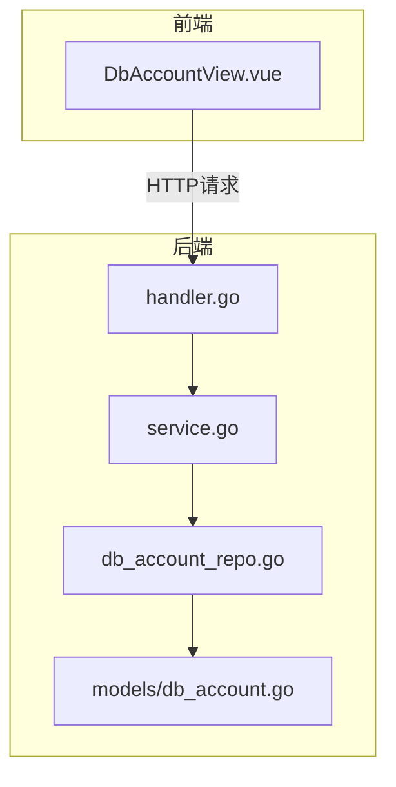
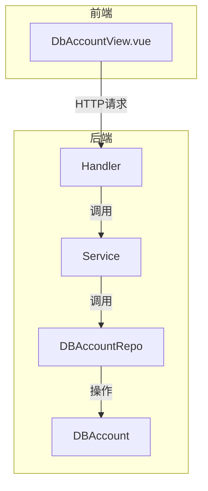
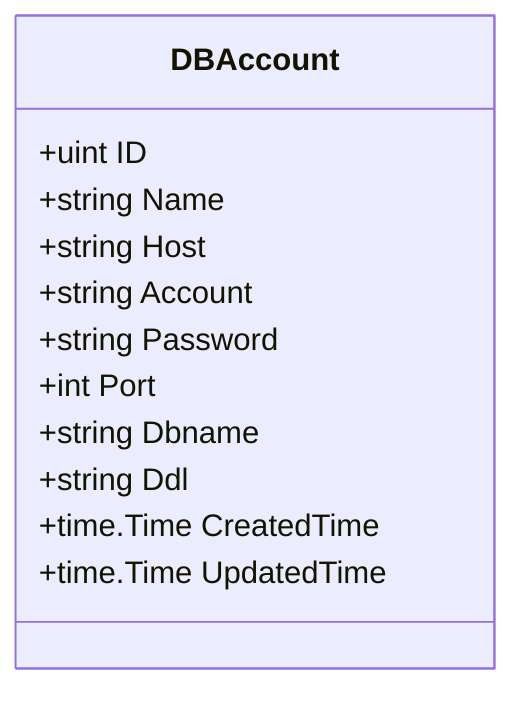
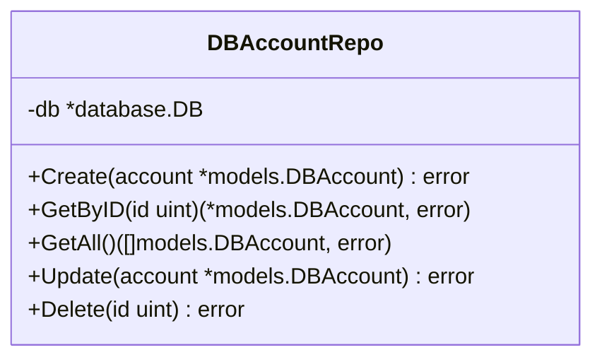
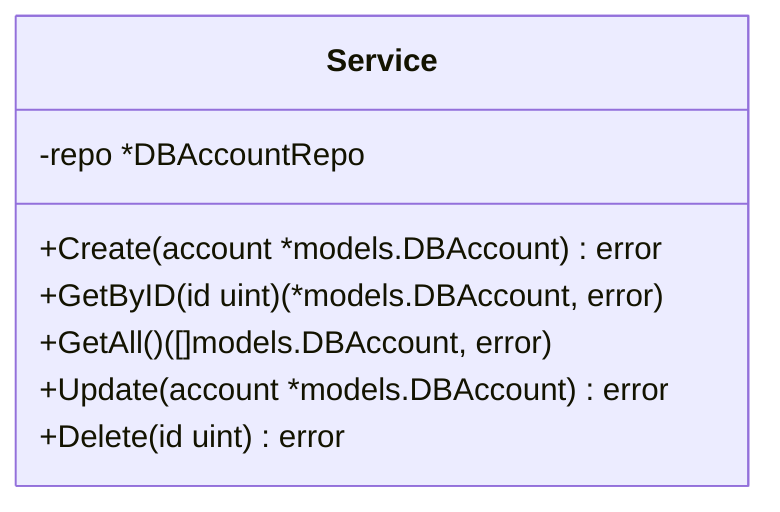
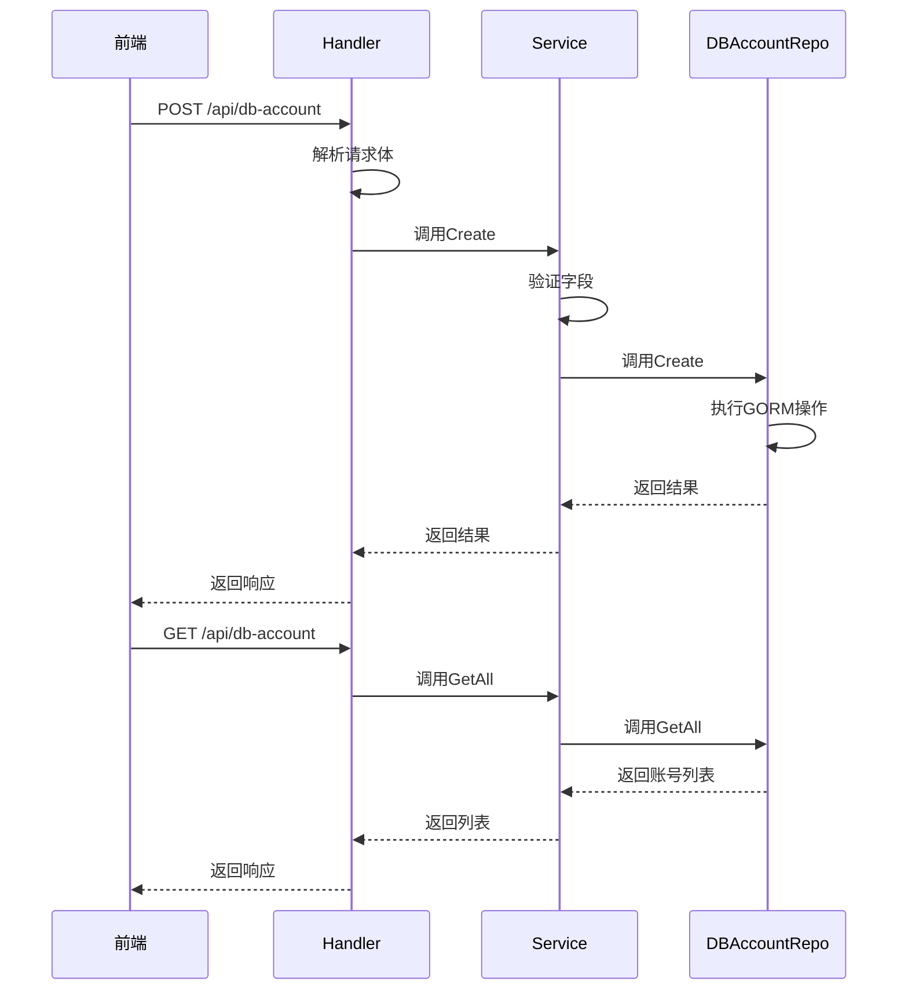
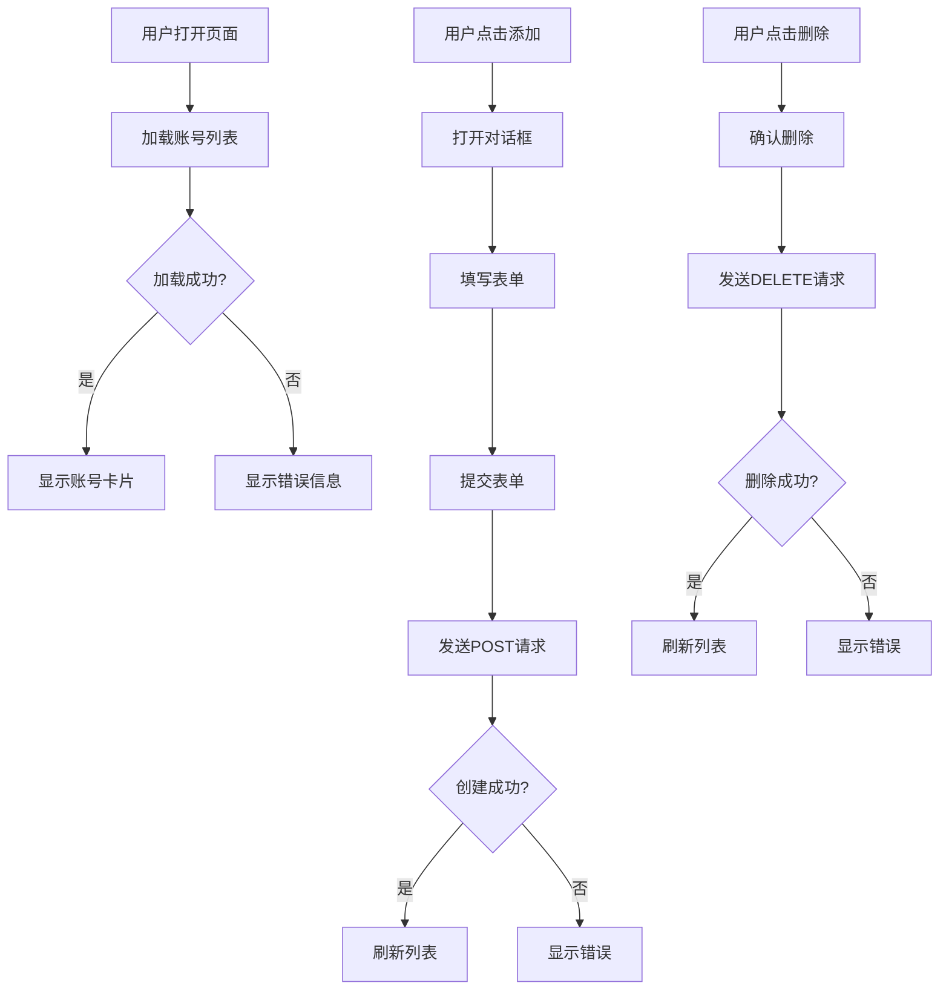
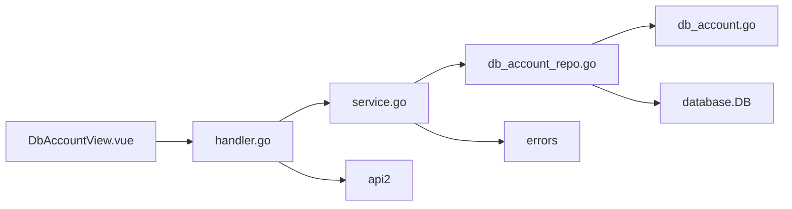

# 数据库账户管理

<cite>
**本文档引用文件**  
- [db_account.go](file://internal/app/tools/models/db_account.go)
- [db_account_repo.go](file://internal/app/tools/business/dbaccount/db_account_repo.go)
- [service.go](file://internal/app/tools/business/dbaccount/service.go)
- [handler.go](file://internal/app/tools/business/dbaccount/handler.go)
- [model.go](file://internal/app/tools/business/dbaccount/model.go)
- [DbAccountView.vue](file://web/database_api/src/views/DbAccountView.vue)
</cite>

## 目录
1. [简介](#简介)
2. [项目结构](#项目结构)
3. [核心组件](#核心组件)
4. [架构概述](#架构概述)
5. [详细组件分析](#详细组件分析)
6. [依赖分析](#依赖分析)
7. [性能考虑](#性能考虑)
8. [故障排除指南](#故障排除指南)
9. [结论](#结论)

## 简介
本文档详细阐述数据库账户管理模块的设计与实现。该模块用于持久化数据库连接信息，包括主机、端口、用户名、密码、数据库名称等，并通过GORM实现CRUD操作。系统采用分层架构，包含模型层、数据访问层（Repository）、业务逻辑层（Service）和处理层（Handler），并提供RESTful API供前端调用。

## 项目结构
数据库账户管理功能位于 `internal/app/tools/business/dbaccount/` 目录下，采用典型的分层架构设计。前端视图位于 `web/database_api/src/views/DbAccountView.vue`。

**图表来源**  
- [db_account.go](file://internal/app/tools/models/db_account.go#L5-L16)
- [db_account_repo.go](file://internal/app/tools/business/dbaccount/db_account_repo.go#L10-L12)
- [service.go](file://internal/app/tools/business/dbaccount/service.go#L8-L10)
- [handler.go](file://internal/app/tools/business/dbaccount/handler.go#L11-L13)
- [DbAccountView.vue](file://web/database_api/src/views/DbAccountView.vue#L134-L144)

## 核心组件
数据库账户管理模块由多个核心组件构成：`DBAccount` 模型用于数据持久化，`DBAccountRepo` 封装数据访问逻辑，`Service` 实现业务校验和事务控制，`Handler` 暴露RESTful接口。前端通过 `DbAccountView.vue` 提供用户界面。

**章节来源**  
- [db_account.go](file://internal/app/tools/models/db_account.go#L5-L16)
- [db_account_repo.go](file://internal/app/tools/business/dbaccount/db_account_repo.go#L10-L12)
- [service.go](file://internal/app/tools/business/dbaccount/service.go#L8-L10)
- [handler.go](file://internal/app/tools/business/dbaccount/handler.go#L11-L13)

## 架构概述
系统采用分层架构，从前端到后端依次为：视图层 → 处理层 → 业务服务层 → 数据访问层 → 模型层。各层职责分明，通过接口进行通信，确保高内聚低耦合。

**图表来源**  
- [db_account.go](file://internal/app/tools/models/db_account.go#L5-L16)
- [db_account_repo.go](file://internal/app/tools/business/dbaccount/db_account_repo.go#L10-L12)
- [service.go](file://internal/app/tools/business/dbaccount/service.go#L8-L10)
- [handler.go](file://internal/app/tools/business/dbaccount/handler.go#L11-L13)
- [DbAccountView.vue](file://web/database_api/src/views/DbAccountView.vue#L134-L144)

## 详细组件分析

### 模型层分析
`DBAccount` 模型定义了数据库连接信息的结构，使用GORM标签进行字段映射和约束。

**图表来源**  
- [db_account.go](file://internal/app/tools/models/db_account.go#L5-L16)

**章节来源**  
- [db_account.go](file://internal/app/tools/models/db_account.go#L5-L16)

### 数据访问层分析
`DBAccountRepo` 封装了对 `DBAccount` 模型的CRUD操作，提供统一的数据访问接口。

**图表来源**  
- [db_account_repo.go](file://internal/app/tools/business/dbaccount/db_account_repo.go#L10-L12)

**章节来源**  
- [db_account_repo.go](file://internal/app/tools/business/dbaccount/db_account_repo.go#L10-L56)

### 业务逻辑层分析
`Service` 层实现业务校验逻辑，如字段验证、存在性检查等，并协调数据访问操作。

**图表来源**  
- [service.go](file://internal/app/tools/business/dbaccount/service.go#L8-L10)

**章节来源**  
- [service.go](file://internal/app/tools/business/dbaccount/service.go#L8-L87)

### 处理层分析
`Handler` 层暴露RESTful API接口，处理HTTP请求和响应，是前后端交互的桥梁。

**图表来源**  
- [handler.go](file://internal/app/tools/business/dbaccount/handler.go#L11-L13)
- [service.go](file://internal/app/tools/business/dbaccount/service.go#L8-L10)
- [db_account_repo.go](file://internal/app/tools/business/dbaccount/db_account_repo.go#L10-L12)

**章节来源**  
- [handler.go](file://internal/app/tools/business/dbaccount/handler.go#L11-L159)

### 前端视图分析
`DbAccountView.vue` 提供用户友好的界面，支持添加、编辑、删除数据库连接，并与后端API进行交互。

**图表来源**  
- [DbAccountView.vue](file://web/database_api/src/views/DbAccountView.vue#L1-L238)

**章节来源**  
- [DbAccountView.vue](file://web/database_api/src/views/DbAccountView.vue#L1-L238)

## 依赖分析
数据库账户管理模块依赖于GORM进行数据库操作，依赖于Fiber框架处理HTTP请求，并通过 `database.DB` 实例连接数据库。

**图表来源**  
- [go.mod](file://go.mod#L1-L30)
- [db_account_repo.go](file://internal/app/tools/business/dbaccount/db_account_repo.go#L3-L8)
- [handler.go](file://internal/app/tools/business/dbaccount/handler.go#L3-L9)

**章节来源**  
- [go.mod](file://go.mod#L1-L30)
- [db_account_repo.go](file://internal/app/tools/business/dbaccount/db_account_repo.go#L3-L8)
- [handler.go](file://internal/app/tools/business/dbaccount/handler.go#L3-L9)

## 性能考虑
- 使用GORM连接池配置，设置最大空闲连接数为10，最大打开连接数为100
- 数据库操作使用索引优化查询性能
- 前端采用分页加载策略，避免一次性加载过多数据
- 后端接口返回必要的字段，减少网络传输量

## 故障排除指南
常见问题及解决方案：
- **连接失败**：检查主机、端口、用户名、密码是否正确
- **创建失败**：确保所有必填字段已填写，特别是账号名称、主机地址、密码和端口
- **更新失败**：确认要更新的记录存在
- **删除失败**：确认要删除的记录存在且未被其他功能引用

**章节来源**  
- [service.go](file://internal/app/tools/business/dbaccount/service.go#L20-L36)
- [service.go](file://internal/app/tools/business/dbaccount/service.go#L49-L74)
- [service.go](file://internal/app/tools/business/dbaccount/service.go#L77-L85)

## 结论
数据库账户管理模块通过清晰的分层架构实现了数据库连接信息的持久化管理。系统采用GORM进行数据操作，通过Repository模式封装数据访问逻辑，Service层实现业务校验，Handler层提供RESTful API。前端通过Vue组件与后端交互，实现了完整的增删改查功能。安全性方面，密码以加密形式存储，输入参数经过严格验证，确保系统稳定可靠。