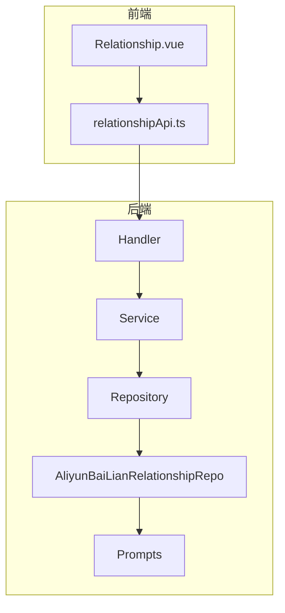
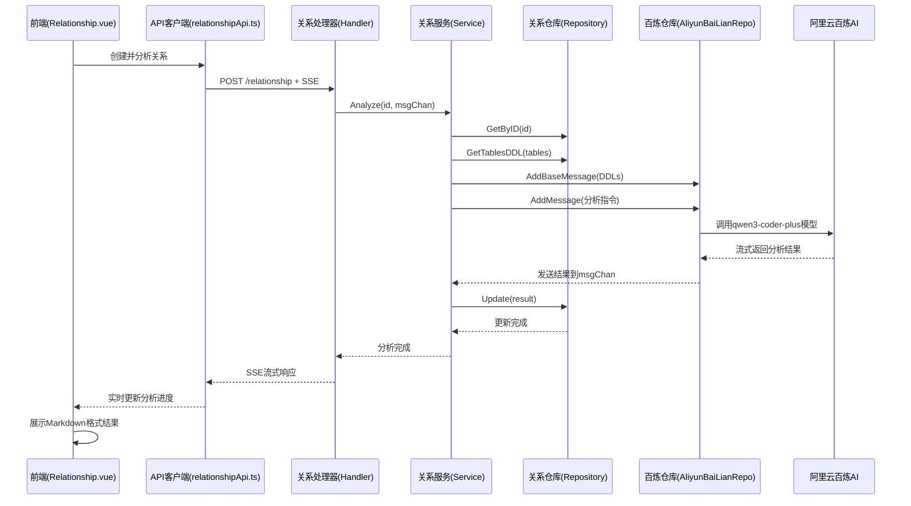
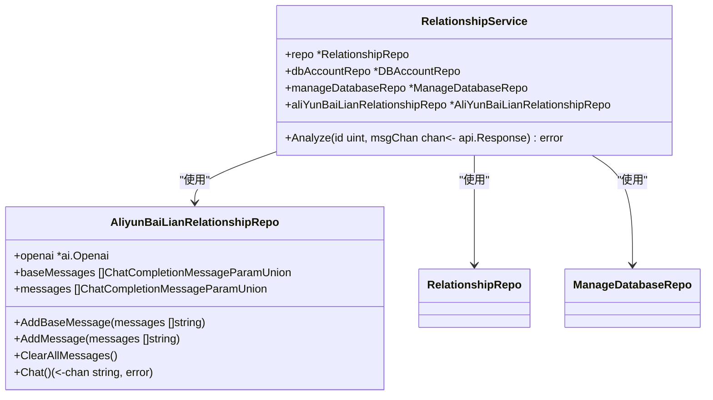
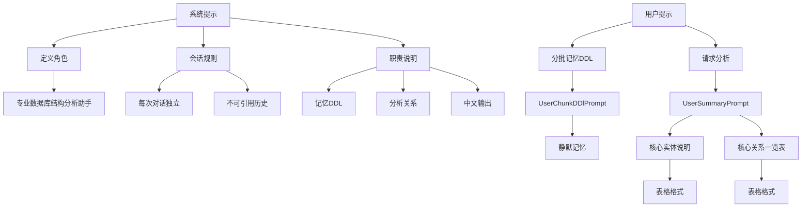
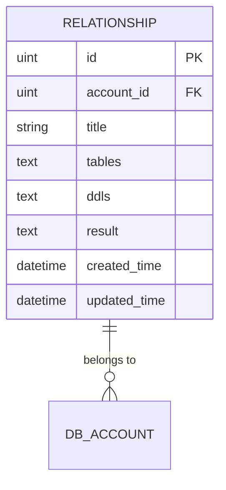
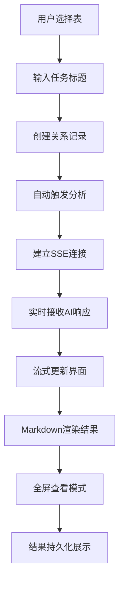
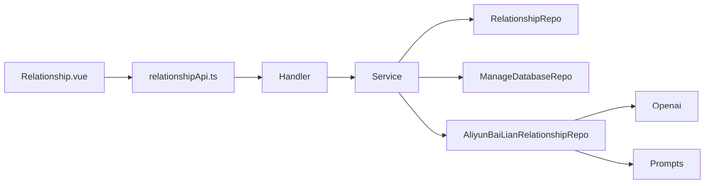

# 智能关系分析

<cite>
**本文档引用文件**  
- [service.go](file://internal/app/tools/business/relationship/service.go)
- [aliyun_bailian_relationship_repo.go](file://internal/app/tools/repo/aliyun_bailian_relationship/aliyun_bailian_relationship_repo.go)
- [prompts.go](file://internal/app/tools/repo/aliyun_bailian_relationship/prompts.go)
- [relationship.go](file://internal/app/tools/models/relationship.go)
- [Relationship.vue](file://web/database_api/src/views/database/Relationship.vue)
- [relationshipApi.ts](file://web/database_api/src/lib/relationshipApi.ts)
</cite>

## 目录
1. [简介](#简介)
2. [项目结构](#项目结构)
3. [核心组件](#核心组件)
4. [架构概览](#架构概览)
5. [详细组件分析](#详细组件分析)
6. [依赖分析](#依赖分析)
7. [性能考量](#性能考量)
8. [故障排除指南](#故障排除指南)
9. [结论](#结论)

## 简介
本系统实现了基于AI的数据库表间关系智能分析功能。通过`RelationshipService`协调`AliyunBaiLianRelationshipRepo`调用阿里云百炼平台的AI服务，分析指定数据库中各表的DDL语句以推断表间关系（如外键关联、业务逻辑关联）。系统采用提示词工程设计原理，构造有效的系统提示和用户提示以引导AI生成准确的关系图谱。`Relationship`模型用于存储分析结果（包括关系类型、置信度、描述文本），前端`Relationship.vue`组件则负责可视化展示AI生成的关系网络。整个流程支持从发起分析请求到接收AI响应的完整数据流，涵盖错误重试、超时处理和结果缓存机制，并考虑了AI集成的安全性与成本控制策略。

## 项目结构
系统采用分层架构设计，主要分为后端服务层和前端展示层。后端位于`internal/app/tools`目录下，包含业务逻辑、数据访问和基础设施组件；前端位于`web/database_api`目录下，采用Vue 3框架构建用户界面。核心关系分析功能集中在`business/relationship`模块，AI集成通过`repo/aliyun_bailian_relationship`实现。

**图示来源**  
- [Relationship.vue](file://web/database_api/src/views/database/Relationship.vue)
- [relationshipApi.ts](file://web/database_api/src/lib/relationshipApi.ts)
- [handler.go](file://internal/app/tools/business/relationship/handler.go)

## 核心组件
系统核心由五个关键组件构成：关系处理器（Handler）、关系服务（Service）、关系仓库（Repository）、阿里云百炼关系仓库（AliyunBaiLianRelationshipRepo）和提示词模块（Prompts）。这些组件协同工作，实现了从用户请求到AI分析再到结果展示的完整闭环。前端组件负责用户交互和结果可视化，后端服务层处理业务逻辑，AI集成层负责与外部大模型通信。

**组件来源**  
- [service.go](file://internal/app/tools/business/relationship/service.go)
- [aliyun_bailian_relationship_repo.go](file://internal/app/tools/repo/aliyun_bailian_relationship/aliyun_bailian_relationship_repo.go)
- [prompts.go](file://internal/app/tools/repo/aliyun_bailian_relationship/prompts.go)

## 架构概览
系统采用典型的分层架构模式，从前端到后端依次为：用户界面层、API通信层、业务逻辑层、数据访问层和AI集成层。当用户在前端创建关系分析任务时，请求通过API传递到后端处理器，由服务层协调数据访问和AI分析，最终将结果存储并返回给前端进行可视化展示。

**图示来源**  
- [service.go](file://internal/app/tools/business/relationship/service.go#L101-L180)
- [aliyun_bailian_relationship_repo.go](file://internal/app/tools/repo/aliyun_bailian_relationship/aliyun_bailian_relationship_repo.go#L49-L75)
- [Relationship.vue](file://web/database_api/src/views/database/Relationship.vue#L118-L134)

## 详细组件分析

### 关系服务分析
`RelationshipService`是整个功能的核心协调者，负责整合数据库访问和AI分析能力。它通过依赖注入获取`AliyunBaiLianRelationshipRepo`实例，并在其`Analyze`方法中协调整个分析流程。

**图示来源**  
- [service.go](file://internal/app/tools/business/relationship/service.go#L14-L19)
- [aliyun_bailian_relationship_repo.go](file://internal/app/tools/repo/aliyun_bailian_relationship/aliyun_bailian_relationship_repo.go#L11-L15)

**组件来源**  
- [service.go](file://internal/app/tools/business/relationship/service.go#L101-L180)

### 提示词工程分析
提示词工程是确保AI输出质量的关键。系统通过精心设计的系统提示和用户提示来引导AI生成结构化的分析结果。

**图示来源**  
- [prompts.go](file://internal/app/tools/repo/aliyun_bailian_relationship/prompts.go#L5-L56)

**组件来源**  
- [prompts.go](file://internal/app/tools/repo/aliyun_bailian_relationship/prompts.go)

### 数据模型分析
`Relationship`模型用于持久化存储关系分析任务的所有相关信息，包括输入参数和分析结果。

**图示来源**  
- [relationship.go](file://internal/app/tools/models/relationship.go#L6-L15)

**组件来源**  
- [relationship.go](file://internal/app/tools/models/relationship.go)

### 前端可视化分析
前端`Relationship.vue`组件实现了完整的用户交互流程，包括任务创建、分析执行和结果展示。

**图示来源**  
- [Relationship.vue](file://web/database_api/src/views/database/Relationship.vue#L81-L114)
- [relationshipApi.ts](file://web/database_api/src/lib/relationshipApi.ts)

**组件来源**  
- [Relationship.vue](file://web/database_api/src/views/database/Relationship.vue)

## 依赖分析
系统各组件之间存在明确的依赖关系，形成了清晰的调用链路。前端组件依赖API客户端进行通信，后端服务层依赖多个仓库实现具体功能，AI集成层依赖基础设施的OpenAI客户端。

**图示来源**  
- [service.go](file://internal/app/tools/business/relationship/service.go#L22-L32)
- [aliyun_bailian_relationship_repo.go](file://internal/app/tools/repo/aliyun_bailian_relationship/aliyun_bailian_relationship_repo.go#L18-L25)

## 性能考量
系统在性能方面考虑了多个关键因素：采用SSE（Server-Sent Events）实现AI响应的流式传输，避免长时间等待；对大体积DDL进行分块处理，单块不超过5000字符；通过JSON格式高效存储表结构信息；前端实现加载状态指示和错误处理，提升用户体验。AI模型选择qwen3-coder-plus，平衡了分析能力和响应速度。

## 故障排除指南
常见问题包括：AI服务调用失败（检查API密钥和网络连接）、DDL获取失败（验证数据库连接和表权限）、SSE连接中断（检查服务器超时设置）。系统已实现基本的错误处理机制，在`Analyze`方法中通过`msgChan`返回错误信息，并在前端显示相应提示。建议监控AI调用频率和成本，设置合理的重试机制。

**组件来源**  
- [service.go](file://internal/app/tools/business/relationship/service.go#L101-L180)
- [Relationship.vue](file://web/database_api/src/views/database/Relationship.vue#L136-L141)

## 结论
该智能关系分析模块成功实现了数据库表间关系的自动化推断。通过`RelationshipService`有效协调`AliyunBaiLianRelationshipRepo`调用阿里云百炼平台的AI服务，结合精心设计的提示词工程，能够准确分析数据库DDL并生成结构化的关系图谱。系统架构清晰，前后端分离，易于维护和扩展。未来可考虑增加结果缓存机制以降低AI调用成本，优化提示词以提高分析准确率，并增强错误处理和日志记录能力。