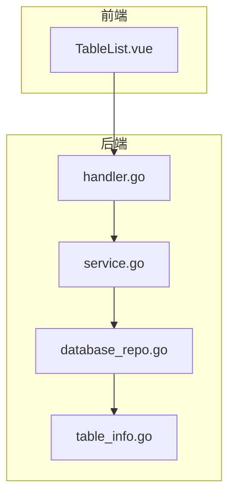
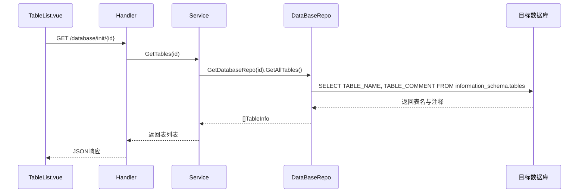
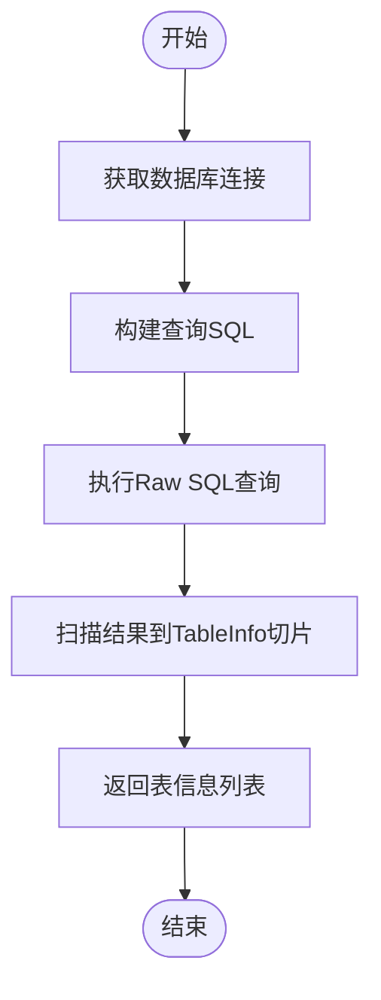
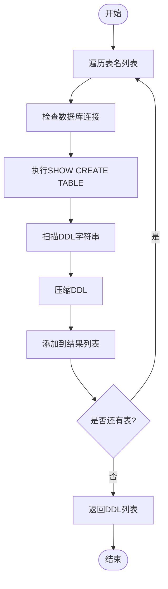
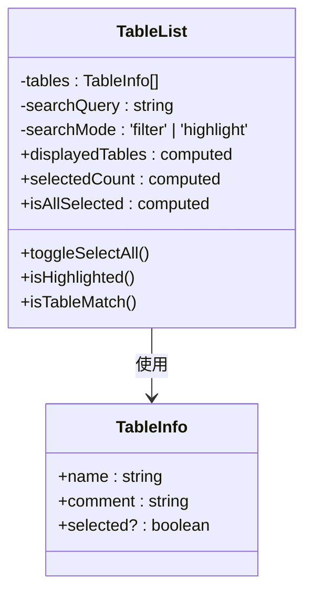
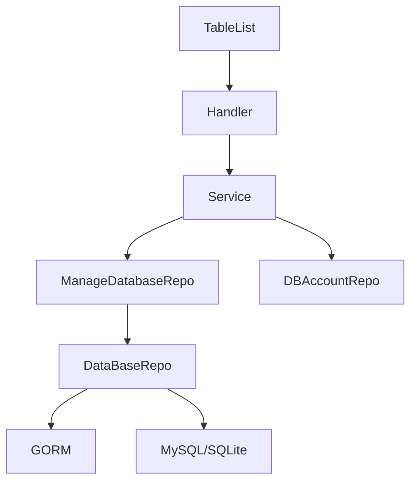

# 表结构浏览

<cite>
**本文档引用文件**  
- [handler.go](file://internal/app/tools/business/database/handler.go)
- [service.go](file://internal/app/tools/business/database/service.go)
- [database_repo.go](file://internal/app/tools/repo/database_repo.go)
- [table_info.go](file://internal/app/tools/models/table_info.go)
- [TableList.vue](file://web/database_api/src/views/database/TableList.vue)
</cite>

## 目录
1. [简介](#简介)
2. [项目结构](#项目结构)
3. [核心组件](#核心组件)
4. [架构概览](#架构概览)
5. [详细组件分析](#详细组件分析)
6. [依赖分析](#依赖分析)
7. [性能考虑](#性能考虑)
8. [故障排除指南](#故障排除指南)
9. [结论](#结论)

## 简介
本文档深入解析系统中“表结构浏览”功能的技术实现。该功能允许用户通过动态数据库连接（基于用户配置的DBAccount）获取目标数据库的元数据信息，包括表名、字段、类型、主键、外键和注释等。系统使用GORM或原生SQL查询实现跨数据库兼容性，并通过标准化模型统一数据结构。前端组件`TableList.vue`负责请求并渲染表列表与表详情，支持搜索、高亮和筛选功能。本文还将探讨元数据缓存、分页加载等性能优化策略。

## 项目结构
系统采用分层架构设计，主要分为后端Go服务与前端Vue应用两大部分。后端逻辑集中在`internal/app/tools/business/database`模块中，包含处理表结构查询的`handler.go`、`service.go`及`database_repo.go`；前端视图组件位于`web/database_api/src/views/database/TableList.vue`，负责展示和交互。

**图示来源**  
- [handler.go](file://internal/app/tools/business/database/handler.go#L1-L42)
- [service.go](file://internal/app/tools/business/database/service.go#L1-L35)
- [database_repo.go](file://internal/app/tools/repo/database_repo.go#L1-L72)
- [table_info.go](file://internal/app/tools/models/table_info.go#L1-L12)
- [TableList.vue](file://web/database_api/src/views/database/TableList.vue#L1-L203)

**本节来源**  
- [internal/app/tools/business/database](file://internal/app/tools/business/database)
- [web/database_api/src/views/database](file://web/database_api/src/views/database)

## 核心组件
系统通过`DatabaseRepo`实现跨数据库元数据查询，`DatabaseService`协调业务逻辑，`TableInfo`模型标准化表结构数据。前端`TableList.vue`组件通过API请求获取数据并提供交互式界面。

**本节来源**  
- [handler.go](file://internal/app/tools/business/database/handler.go#L21-L41)
- [service.go](file://internal/app/tools/business/database/service.go#L21-L23)
- [database_repo.go](file://internal/app/tools/repo/database_repo.go#L20-L45)

## 架构概览
整个表结构浏览功能遵循典型的MVC模式，前端发起请求，后端路由分发至处理器，服务层调用仓库获取数据，最终返回结构化结果。

**图示来源**  
- [handler.go](file://internal/app/tools/business/database/handler.go#L21-L32)
- [service.go](file://internal/app/tools/business/database/service.go#L21-L23)
- [database_repo.go](file://internal/app/tools/repo/database_repo.go#L20-L45)

## 详细组件分析

### 后端服务分析

#### 数据库元数据查询流程
系统通过`DataBaseRepo.GetAllTables()`方法从`information_schema.tables`中查询当前数据库的所有表名及其注释，使用GORM执行原生SQL以确保跨数据库兼容性。

**图示来源**  
- [database_repo.go](file://internal/app/tools/repo/database_repo.go#L20-L45)

#### DDL查询实现
`GetTablesDDL`方法遍历指定表名列表，对每张表执行`SHOW CREATE TABLE`语句获取其DDL定义，并通过`utils.CompressDDL`压缩格式后返回。

**图示来源**  
- [database_repo.go](file://internal/app/tools/repo/database_repo.go#L48-L71)

### 前端组件分析

#### TableList.vue 组件逻辑
该组件接收表列表数据，支持两种搜索模式：高亮模式（关键词匹配高亮）和筛选模式（仅显示完全匹配的表）。用户可选择多个表，选中状态通过事件传递给父组件。

**图示来源**  
- [TableList.vue](file://web/database_api/src/views/database/TableList.vue#L76-L80)

**本节来源**  
- [TableList.vue](file://web/database_api/src/views/database/TableList.vue#L1-L203)

## 依赖分析
系统各组件之间存在清晰的依赖关系：前端组件依赖后端API接口，后端Handler依赖Service，Service依赖Repo，Repo依赖GORM和数据库连接。

**图示来源**  
- [handler.go](file://internal/app/tools/business/database/handler.go#L10-L11)
- [service.go](file://internal/app/tools/business/database/service.go#L9-L12)
- [database_repo.go](file://internal/app/tools/repo/database_repo.go#L12-L14)

**本节来源**  
- [handler.go](file://internal/app/tools/business/database/handler.go#L1-L42)
- [service.go](file://internal/app/tools/business/database/service.go#L1-L35)
- [database_repo.go](file://internal/app/tools/repo/database_repo.go#L1-L72)

## 性能考虑
为提升性能，系统可引入以下优化策略：
- **元数据缓存**：对频繁访问的表结构信息进行缓存，减少重复查询。
- **分页加载**：当数据库表数量庞大时，支持分页获取表列表。
- **批量DDL查询优化**：合并多个`SHOW CREATE TABLE`为单次查询（部分数据库支持）。
- **连接池管理**：复用数据库连接，降低连接开销。

目前实现中未包含缓存机制，每次请求均实时查询目标数据库。

## 故障排除指南
常见问题及解决方案：
- **无法获取表列表**：检查DBAccount配置是否正确，目标数据库网络是否可达。
- **表注释为空**：确认目标数据库表是否设置了COMMENT属性。
- **DDL获取失败**：检查用户权限是否具备`SHOW CREATE TABLE`权限。
- **中文乱码**：确保数据库连接字符集设置为UTF-8。

**本节来源**  
- [database_repo.go](file://internal/app/tools/repo/database_repo.go#L50-L62)
- [handler.go](file://internal/app/tools/business/database/handler.go#L24-L25)

## 结论
表结构浏览功能通过清晰的分层架构实现了跨数据库的元数据查询能力。后端利用GORM与原生SQL结合的方式保证兼容性，前端提供灵活的搜索与选择功能。未来可通过引入缓存、分页等机制进一步提升用户体验与系统性能。