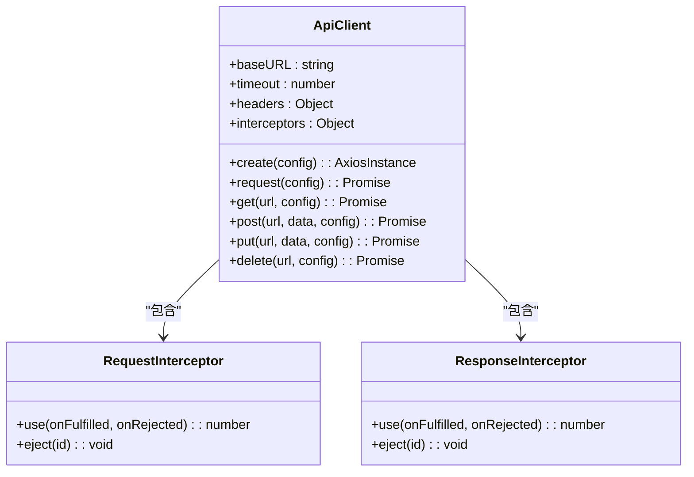
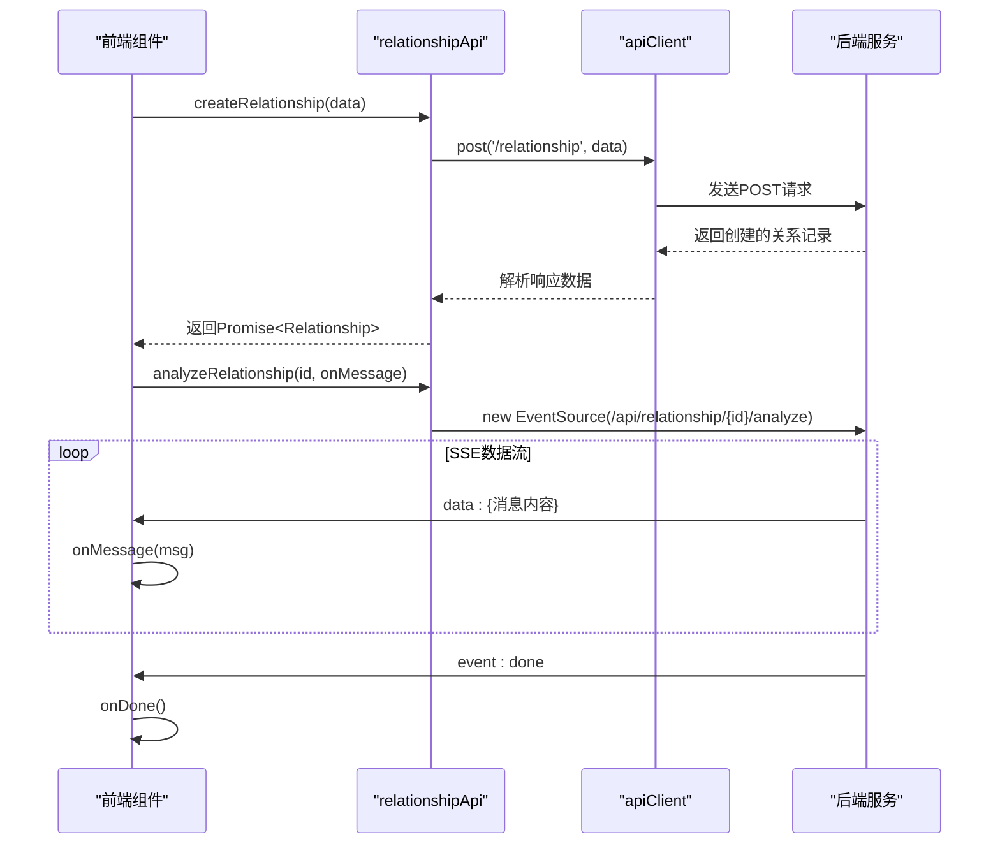
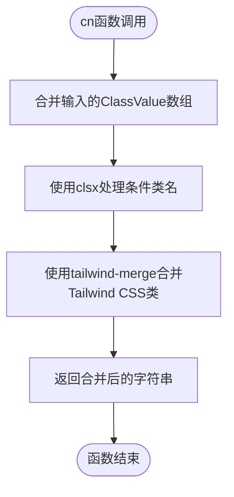

# API集成与数据交互

<cite>
**本文档引用文件**  
- [api.ts](file://web/database/src/lib/api.ts)
- [relationshipApi.ts](file://web/database/src/lib/relationshipApi.ts)
- [utils.ts](file://web/database/src/lib/utils.ts)
- [index.ts](file://web/database/src/router/index.ts)
- [main.ts](file://web/database/src/main.ts)
- [handler.go](file://internal/app/tools/business/relationship/handler.go)
- [service.go](file://internal/app/tools/business/relationship/service.go)
</cite>

## 目录
1. [引言](#引言)
2. [HTTP客户端配置](#http客户端配置)
3. [关系分析专用API方法](#关系分析专用api方法)
4. [辅助函数支持](#辅助函数支持)
5. [前端路由与后端端点映射](#前端路由与后端端点映射)
6. [全局API实例注入](#全局api实例注入)
7. [API调用完整示例](#api调用完整示例)
8. [跨域解决方案与代理配置](#跨域解决方案与代理配置)

## 引言
本项目通过前后端分离架构实现数据库智能分析功能，其中前端通过RESTful API与后端服务进行数据交互。核心交互机制基于Axios封装的HTTP客户端，结合Vue Router实现路由控制，并利用SSE（Server-Sent Events）实现分析结果的实时推送。本文档深入解析API集成机制，涵盖客户端配置、专用接口调用、辅助工具支持及跨域处理等关键环节。

## HTTP客户端配置

前端通过`api.ts`文件封装Axios实例，实现统一的HTTP请求管理。该实例配置了基础URL、超时时间、请求头等核心参数，并通过拦截器实现请求预处理和响应统一处理。



**图示来源**  
- [api.ts](file://web/database/src/lib/api.ts#L3-L47)

**本节来源**  
- [api.ts](file://web/database/src/lib/api.ts#L1-L47)

### 基础配置
- **基础URL**: 设置为`/api`，所有请求将自动拼接此前缀
- **超时时间**: 10秒，防止请求长时间挂起
- **请求头**: 默认设置`Content-Type`为`application/json`

### 请求拦截器
在请求发送前执行，可用于：
- 添加认证Token（当前注释状态）
- 日志记录
- 请求参数预处理

### 响应拦截器
统一处理响应数据和错误：
- 成功响应：直接返回`response.data`，简化调用层处理
- 错误响应：对401未授权状态进行特殊处理（如跳转登录页）

## 关系分析专用API方法

`relationshipApi.ts`文件封装了针对关系分析功能的专用API调用方法，基于`apiClient`实例构建，提供类型安全的接口调用。



**图示来源**  
- [relationshipApi.ts](file://web/database/src/lib/relationshipApi.ts#L4-L89)
- [handler.go](file://internal/app/tools/business/relationship/handler.go#L155-L217)

**本节来源**  
- [relationshipApi.ts](file://web/database/src/lib/relationshipApi.ts#L1-L89)

### 核心方法
| 方法名 | 参数 | 返回值 | 用途 |
|-------|------|-------|------|
| `createRelationship` | `Partial<Relationship>` | `Promise<Relationship>` | 创建关系记录 |
| `getRelationshipById` | `id: number` | `Promise<Relationship>` | 获取单个关系记录 |
| `getRelationshipsByAccountId` | `accountId: number` | `Promise<Relationship[]>` | 按账号ID获取关系列表 |
| `getAllRelationships` | 无 | `Promise<Relationship[]>` | 获取所有关系记录 |
| `updateRelationship` | `id: number, data: Partial<Relationship>` | `Promise<Relationship>` | 更新关系记录 |
| `deleteRelationship` | `id: number` | `Promise<void>` | 删除关系记录 |
| `analyzeRelationship` | `id: number, onMessage: (msg: string) => void, onDone?: () => void` | `EventSource` | 分析关系记录（SSE） |
| `createRelationshipFromSelectedTables` | `accountId, selectedTables, title` | `Promise<Relationship>` | 从选中表创建关系 |

### 特殊实现：SSE分析接口
`analyzeRelationship`方法采用SSE技术实现服务器到客户端的实时消息推送：
- 创建`EventSource`连接`/api/relationship/{id}/analyze`
- 通过`onmessage`回调接收分析进度和结果
- `onerror`处理连接错误
- 监听`done`事件关闭连接
- 返回`EventSource`实例供上层控制（如手动关闭）

## 辅助函数支持

`utils.ts`文件提供通用辅助函数，支持前端开发中的样式组合等需求。



**图示来源**  
- [utils.ts](file://web/database/src/lib/utils.ts#L1-L8)

**本节来源**  
- [utils.ts](file://web/database/src/lib/utils.ts#L1-L8)

### 函数说明
- **`cn(...inputs: ClassValue[])`**: 组合多个类名，自动处理Tailwind CSS类的合并冲突
- **依赖库**: `clsx`用于条件类名处理，`tailwind-merge`用于智能合并Tailwind类

> 注：虽然当前`utils.ts`未直接参与API调用，但其提供的工具函数在构建响应式UI组件时至关重要，特别是在处理加载状态和错误提示的样式控制方面。

## 前端路由与后端端点映射

`router/index.ts`定义了前端路由结构，与后端`/api`端点形成清晰的映射关系。

```mermaid
graph TB
subgraph "前端路由"
A[/] --> B[test]
B --> C[Home]
B --> D[About]
B --> E[ApiTest]
B --> F[DbAccount]
B --> G[Login]
H[/database-chat/:id] --> I[DatabaseChatView]
end
subgraph "后端API端点"
J[/api/relationship] --> K[GET, POST]
L[/api/relationship/{id}] --> M[GET, PUT, DELETE]
N[/api/relationship/{id}/analyze] --> O[GET (SSE)]
P[/api/dbaccount] --> Q[CRUD]
end
B < --> J
C < --> J
I < --> L
F < --> P
```

**图示来源**  
- [index.ts](file://web/database/src/router/index.ts#L1-L59)
- [handler.go](file://internal/app/tools/business/relationship/handler.go#L155-L217)

**本节来源**  
- [index.ts](file://web/database/src/router/index.ts#L1-L59)

### 路由映射关系
| 前端路由 | 对应视图 | 关联API端点 | 功能描述 |
|---------|---------|------------|---------|
| `/test` | TestView | - | 主布局容器 |
| `/test/home` | HomeView | `/api/relationship` | 关系列表展示 |
| `/test/db-account` | DbAccountView | `/api/dbaccount` | 数据库账号管理 |
| `/database-chat/:id` | DatabaseChatView | `/api/relationship/{id}` | 特定关系分析界面 |
| `/test/login` | LoginView | `/api/auth/login` | 用户登录（隐式） |

## 全局API实例注入

`main.ts`作为应用入口文件，负责初始化Vue应用并注入全局依赖，包括路由系统。

```mermaid
flowchart LR
A[createApp(App)] --> B[app.use(router)]
B --> C[app.mount('#app')]
C --> D[应用启动]
style A fill:#f9f,stroke:#333
style B fill:#bbf,stroke:#333,color:#fff
style C fill:#bbf,stroke:#333,color:#fff
style D fill:#9f9,stroke:#333
```

**图示来源**  
- [main.ts](file://web/database/src/main.ts#L1-L11)

**本节来源**  
- [main.ts](file://web/database/src/main.ts#L1-L11)

### 初始化流程
1. 创建Vue应用实例
2. 注入Vue Router插件
3. 挂载到DOM根节点
4. 启动应用

> 注：虽然当前代码中未显式注入`apiClient`为全局属性，但通过模块化导入方式在需要的组件中直接引用，实现了API客户端的全局可用性。

## API调用完整示例

以下是在`Relationship.vue`组件中完整的API调用流程示例：

```mermaid
sequenceDiagram
participant User as "用户"
participant UI as "UI组件"
participant API as "relationshipApi"
participant Toast as "Sonner通知"
User->>UI : 点击"创建并分析"
UI->>UI : 验证输入账号ID、选中表、标题
alt 验证失败
UI->>Toast : 显示错误提示
Toast-->>User : "请先选择至少一个数据表"
stop
end
UI->>UI : 设置creating = true
UI->>API : createRelationshipFromSelectedTables()
API->>Backend : POST /api/relationship
Backend-->>API : 返回新创建的关系记录
API-->>UI : 解析数据
UI->>Toast : 显示"关系记录创建成功"
UI->>API : analyzeRelationship(id, onMessage, onDone)
API->>Backend : SSE连接 /api/relationship/{id}/analyze
loop 服务器推送消息
Backend->>UI : data : {分析进度}
UI->>UI : 更新界面显示
end
Backend->>UI : event : done
UI->>Toast : 显示"关系分析完成"
UI->>UI : 调用fetchRelationships()刷新列表
UI->>UI : 设置creating = false
UI-->>User : 完成
```

**本节来源**  
- [relationshipApi.ts](file://web/database/src/lib/relationshipApi.ts#L70-L89)
- [Relationship.vue](file://web/database/src/views/database/Relationship.vue#L79-L131)

### 关键实现要点
- **请求体构造**: `createRelationshipFromSelectedTables`中将选中表数据序列化为JSON字符串
- **响应数据解析**: 所有API方法返回`Promise<T>`，自动解析`response.data`
- **加载状态管理**: 使用`loadingStates`对象跟踪每个关系记录的分析状态
- **错误提示**: 统一使用`toast.error()`显示错误信息，集成Sonner通知组件
- **成功反馈**: 使用`toast.success()`提供操作成功反馈

## 跨域解决方案与代理配置

项目通过开发服务器代理解决跨域问题，实现前后端分离开发环境下的无缝集成。

### 协同工作原理
1. 前端请求发送至开发服务器（如`http://localhost:5173/api/relationship`）
2. Vite开发服务器根据`vite.config.ts`中的代理配置，将`/api`前缀的请求转发至后端服务（如`http://localhost:3000/api/relationship`）
3. 后端服务处理请求并返回响应
4. 代理服务器将响应返回给前端

### 配置优势
- 前端无需关心后端实际地址
- 避免浏览器同源策略限制
- 开发环境与生产环境配置一致（生产环境通常通过Nginx等反向代理实现）

> 注：具体代理配置位于`vite.config.ts`文件中，虽未在当前上下文中展示，但根据项目结构可推断其存在并配置了`/api`路径的代理规则。

**本节来源**  
- [handler.go](file://internal/app/tools/business/relationship/handler.go#L155-L217)
- [relationshipApi.ts](file://web/database/src/lib/relationshipApi.ts#L45-L67)