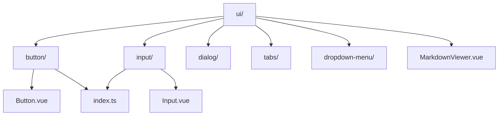
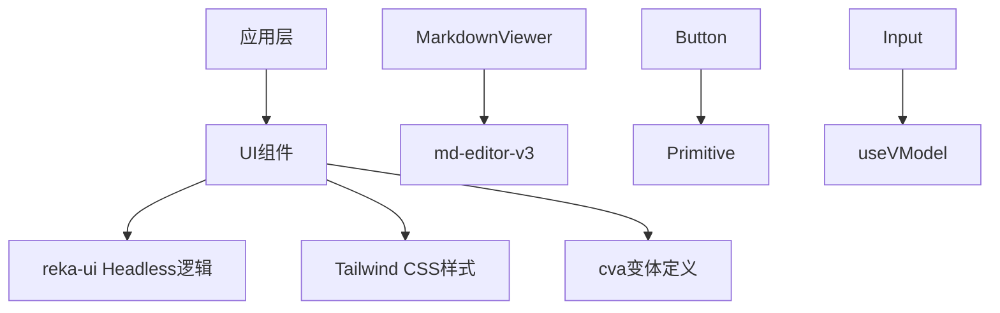
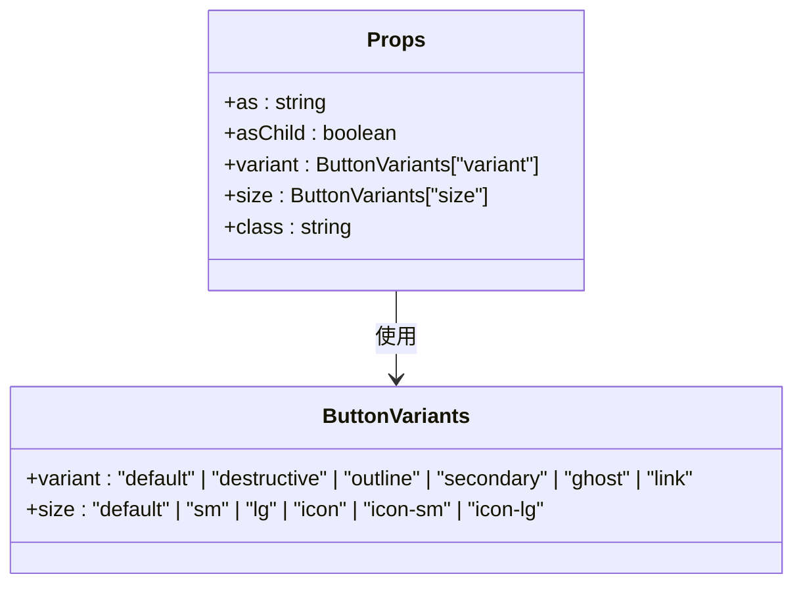
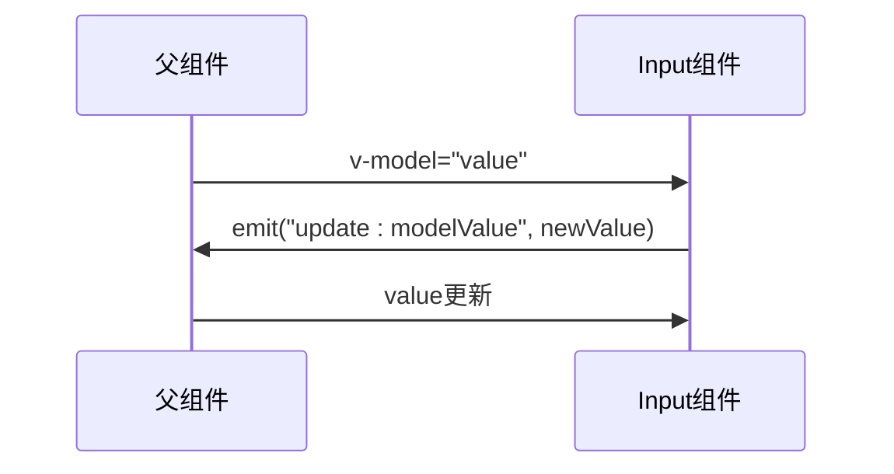
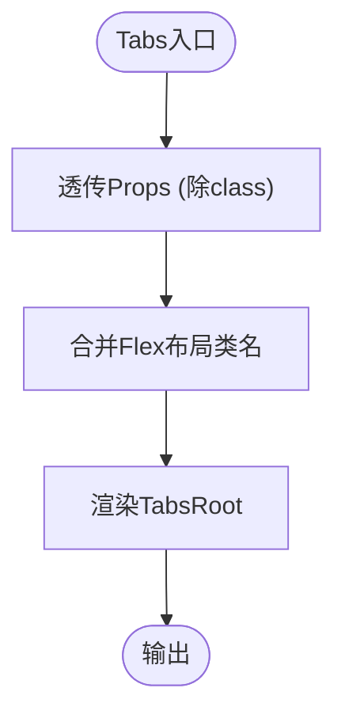
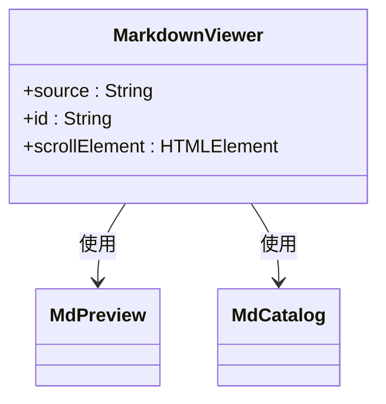
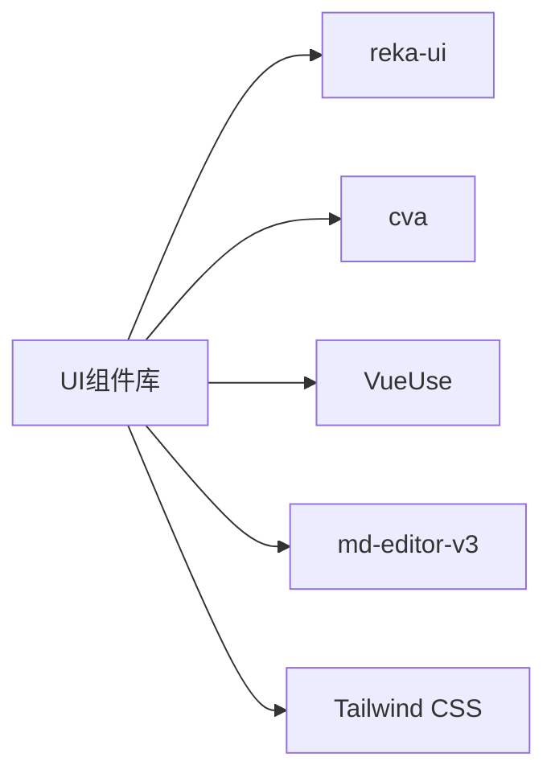

# UI组件库

<cite>
**本文档引用文件**  
- [web/database_api/src/components/ui/button/Button.vue](file://web/database_api/src/components/ui/button/Button.vue)
- [web/database_api/src/components/ui/button/index.ts](file://web/database_api/src/components/ui/button/index.ts)
- [web/database_api/src/components/ui/input/Input.vue](file://web/database_api/src/components/ui/input/Input.vue)
- [web/database_api/src/components/ui/input/index.ts](file://web/database_api/src/components/ui/input/index.ts)
- [web/database_api/src/components/ui/dialog/Dialog.vue](file://web/database_api/src/components/ui/dialog/Dialog.vue)
- [web/database_api/src/components/ui/dialog/index.ts](file://web/database_api/src/components/ui/dialog/index.ts)
- [web/database_api/src/components/ui/tabs/Tabs.vue](file://web/database_api/src/components/ui/tabs/Tabs.vue)
- [web/database_api/src/components/ui/tabs/index.ts](file://web/database_api/src/components/ui/tabs/index.ts)
- [web/database_api/src/components/ui/dropdown-menu/DropdownMenu.vue](file://web/database_api/src/components/ui/dropdown-menu/DropdownMenu.vue)
- [web/database_api/src/components/ui/dropdown-menu/index.ts](file://web/database_api/src/components/ui/dropdown-menu/index.ts)
- [web/database_api/src/components/ui/MarkdownViewer.vue](file://web/database_api/src/components/ui/MarkdownViewer.vue)
</cite>

## 目录
1. [简介](#简介)
2. [项目结构](#项目结构)
3. [核心组件](#核心组件)
4. [架构概览](#架构概览)
5. [详细组件分析](#详细组件分析)
6. [依赖分析](#依赖分析)
7. [性能考量](#性能考量)
8. [故障排除指南](#故障排除指南)
9. [结论](#结论)

## 简介
本文档详细说明了基于Headless UI模式的原子化UI组件库的设计与实现。重点涵盖Button、Input、Dialog、Tabs、DropdownMenu等核心组件的可组合性设计、无障碍访问支持（a11y）、状态管理与事件处理机制。同时阐述了组件的props、slots、emits定义及其在实际页面中的使用方式，并结合`MarkdownViewer.vue`说明富文本渲染集成方案。

## 项目结构
该组件库采用模块化组织方式，所有UI组件集中存放于`web/database_api/src/components/ui`目录下，每个组件以独立子目录形式存在，包含主组件文件、子组件及`index.ts`导出文件。整体结构清晰，便于维护和Tree-shaking优化。

**图示来源**  
- [web/database_api/src/components/ui](file://web/database_api/src/components/ui)

**本节来源**  
- [web/database_api/src/components/ui](file://web/database_api/src/components/ui)

## 核心组件
组件库实现了多个基础且可复用的UI原子组件，包括Button、Input、Dialog、Tabs、DropdownMenu等。这些组件均遵循Headless UI设计理念，将逻辑与样式分离，通过组合式API提供高度灵活性和定制能力。

**本节来源**  
- [web/database_api/src/components/ui/button/Button.vue](file://web/database_api/src/components/ui/button/Button.vue)
- [web/database_api/src/components/ui/input/Input.vue](file://web/database_api/src/components/ui/input/Input.vue)
- [web/database_api/src/components/ui/dialog/Dialog.vue](file://web/database_api/src/components/ui/dialog/Dialog.vue)
- [web/database_api/src/components/ui/tabs/Tabs.vue](file://web/database_api/src/components/ui/tabs/Tabs.vue)
- [web/database_api/src/components/ui/dropdown-menu/DropdownMenu.vue](file://web/database_api/src/components/ui/dropdown-menu/DropdownMenu.vue)

## 架构概览
整个UI组件库基于Headless UI原则构建，使用`reka-ui`作为底层无样式组件库，通过`class-variance-authority`（cva）管理变体样式，结合Tailwind CSS实现主题化设计。各组件通过`index.ts`统一导出，支持按需引入和Tree-shaking。

**图示来源**  
- [web/database_api/src/components/ui/button/Button.vue](file://web/database_api/src/components/ui/button/Button.vue)
- [web/database_api/src/components/ui/input/Input.vue](file://web/database_api/src/components/ui/input/Input.vue)
- [web/database_api/src/components/ui/MarkdownViewer.vue](file://web/database_api/src/components/ui/MarkdownViewer.vue)

## 详细组件分析

### 按钮组件分析
`Button`组件通过`Primitive`包装原生元素，支持`as`属性指定渲染标签类型。利用`cva`定义了多种视觉变体（default、destructive、outline等）和尺寸（default、sm、lg、icon等），并通过`cn`工具函数合并类名。

#### 组件属性与类型

**图示来源**  
- [web/database_api/src/components/ui/button/index.ts](file://web/database_api/src/components/ui/button/index.ts)
- [web/database_api/src/components/ui/button/Button.vue](file://web/database_api/src/components/ui/button/Button.vue)

#### 事件与插槽
- **插槽（slots）**：默认插槽用于插入按钮内容，支持图标组合。
- **事件（emits）**：无显式emit，继承原生事件。
- **无障碍支持**：通过`data-slot="button"`增强可访问性，焦点样式统一管理。

**本节来源**  
- [web/database_api/src/components/ui/button/Button.vue](file://web/database_api/src/components/ui/button/Button.vue)
- [web/database_api/src/components/ui/button/index.ts](file://web/database_api/src/components/ui/button/index.ts)

### 输入框组件分析
`Input`组件使用`useVModel`实现双向绑定，兼容`v-model`语法。支持`defaultValue`和`modelValue`属性，自动处理受控与非受控状态切换。

#### 属性与事件
- **props**：`defaultValue`, `modelValue`, `class`
- **emits**：`update:modelValue`
- **状态管理**：通过`useVModel`自动同步值变化

**图示来源**  
- [web/database_api/src/components/ui/input/Input.vue](file://web/database_api/src/components/ui/input/Input.vue)

**本节来源**  
- [web/database_api/src/components/ui/input/Input.vue](file://web/database_api/src/components/ui/input/Input.vue)

### 对话框组件分析
`Dialog`组件封装`reka-ui`的`DialogRoot`，使用`useForwardPropsEmits`透传属性与事件，保持API一致性。

#### 组件组成
由多个子组件构成：
- `DialogTrigger`：触发器
- `DialogContent`：内容容器
- `DialogOverlay`：遮罩层
- `DialogTitle`：标题
- `DialogDescription`：描述
- `DialogClose`：关闭按钮

**本节来源**  
- [web/database_api/src/components/ui/dialog/Dialog.vue](file://web/database_api/src/components/ui/dialog/Dialog.vue)
- [web/database_api/src/components/ui/dialog/index.ts](file://web/database_api/src/components/ui/dialog/index.ts)

### 标签页组件分析
`Tabs`组件使用`TabsRoot`作为根容器，通过`reactiveOmit`排除`class`属性后透传其余props，确保样式与逻辑分离。

**图示来源**  
- [web/database_api/src/components/ui/tabs/Tabs.vue](file://web/database_api/src/components/ui/tabs/Tabs.vue)

**本节来源**  
- [web/database_api/src/components/ui/tabs/Tabs.vue](file://web/database_api/src/components/ui/tabs/Tabs.vue)
- [web/database_api/src/components/ui/tabs/index.ts](file://web/database_api/src/components/ui/tabs/index.ts)

### 下拉菜单组件分析
`DropdownMenu`同样基于`reka-ui`的`DropdownMenuRoot`，结构清晰，支持嵌套子菜单、分组、复选、单选等功能。

**本节来源**  
- [web/database_api/src/components/ui/dropdown-menu/DropdownMenu.vue](file://web/database_api/src/components/ui/dropdown-menu/DropdownMenu.vue)
- [web/database_api/src/components/ui/dropdown-menu/index.ts](file://web/database_api/src/components/ui/dropdown-menu/index.ts)

### 富文本查看器组件分析
`MarkdownViewer.vue`集成`md-editor-v3`库，仅用于预览Markdown内容，不提供编辑功能。

#### 实现机制
- 使用`MdPreview`渲染Markdown为HTML
- 使用`MdCatalog`生成目录并支持滚动同步
- 通过`editorId`和`scrollElement`配置交互行为

**图示来源**  
- [web/database_api/src/components/ui/MarkdownViewer.vue](file://web/database_api/src/components/ui/MarkdownViewer.vue)

**本节来源**  
- [web/database_api/src/components/ui/MarkdownViewer.vue](file://web/database_api/src/components/ui/MarkdownViewer.vue)

## 依赖分析
组件库依赖外部库实现核心功能：
- `reka-ui`：提供无头组件逻辑
- `class-variance-authority`：管理样式变体
- `@vueuse/core`：提供`useVModel`、`reactiveOmit`等组合式工具
- `md-editor-v3`：用于Markdown渲染

**图示来源**  
- [web/database_api/src/components/ui/button/index.ts](file://web/database_api/src/components/ui/button/index.ts)
- [web/database_api/src/components/ui/MarkdownViewer.vue](file://web/database_api/src/components/ui/MarkdownViewer.vue)

**本节来源**  
- [web/database_api/src/components/ui/button/index.ts](file://web/database_api/src/components/ui/button/index.ts)
- [web/database_api/src/components/ui/input/index.ts](file://web/database_api/src/components/ui/input/index.ts)
- [web/database_api/src/components/ui/MarkdownViewer.vue](file://web/database_api/src/components/ui/MarkdownViewer.vue)

## 性能考量
- **Tree-shaking优化**：通过`index.ts`分别导出组件，支持按需引入，避免打包冗余代码。
- **类名合并优化**：使用`cn`工具函数智能合并Tailwind类名，减少重复。
- **响应式优化**：使用`reactiveOmit`避免不必要的响应式代理开销。
- **事件透传**：`useForwardPropsEmits`减少中间层事件转发成本。

## 故障排除指南
常见问题及解决方法：

| 问题现象 | 可能原因 | 解决方案 |
|--------|--------|--------|
| 按钮点击无反应 | `as`属性设置错误或事件被阻止 | 检查`as`是否为可交互元素，确认未阻止冒泡 |
| 输入框v-model不更新 | 未正确使用`useVModel` | 确保`modelValue`通过`useVModel`绑定 |
| Dialog无法打开 | 缺少`DialogTrigger`或状态未绑定 | 检查触发器与`v-model:open`绑定 |
| 下拉菜单不显示 | `DropdownMenuTrigger`未正确嵌套 | 确保`Trigger`在`DropdownMenu`内部 |
| Markdown不渲染 | `source`为空或格式错误 | 验证传入的Markdown字符串有效性 |

**本节来源**  
- [web/database_api/src/components/ui/button/Button.vue](file://web/database_api/src/components/ui/button/Button.vue)
- [web/database_api/src/components/ui/input/Input.vue](file://web/database_api/src/components/ui/input/Input.vue)
- [web/database_api/src/components/ui/dialog/Dialog.vue](file://web/database_api/src/components/ui/dialog/Dialog.vue)
- [web/database_api/src/components/ui/MarkdownViewer.vue](file://web/database_api/src/components/ui/MarkdownViewer.vue)

## 结论
该UI组件库采用Headless UI架构，实现了高可组合性、良好无障碍支持和灵活的主题定制能力。通过合理的导出机制支持Tree-shaking，结合`reka-ui`与Tailwind CSS，构建了一套现代化、可维护的前端组件体系。建议在使用时遵循组件嵌套规范，充分利用类型系统提升开发效率。