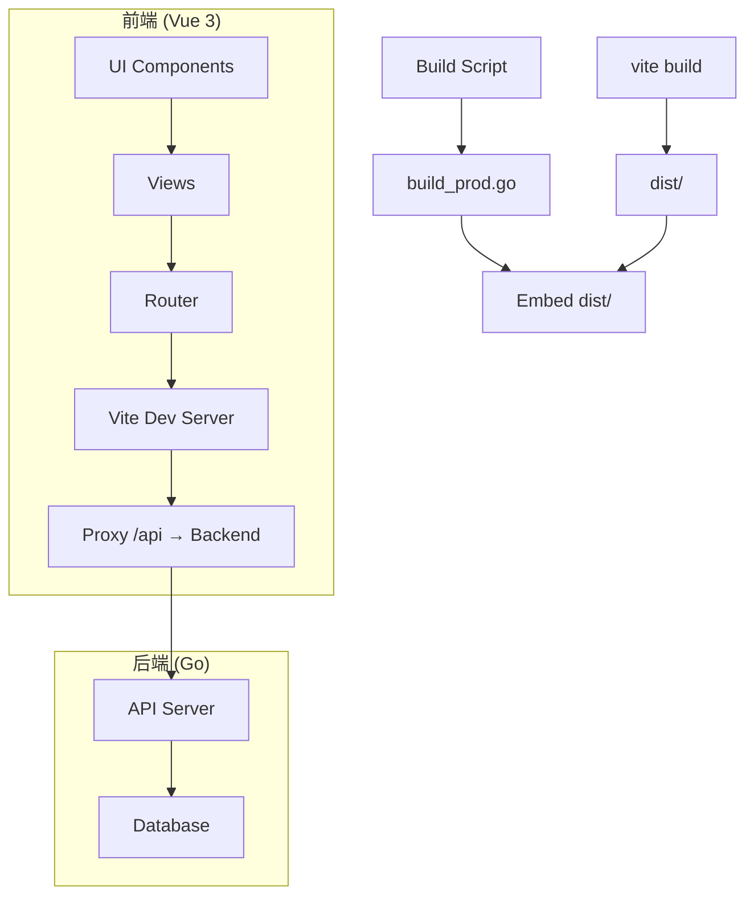
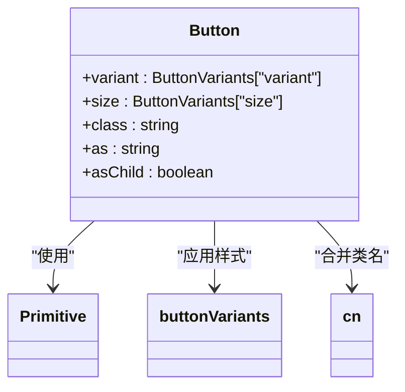
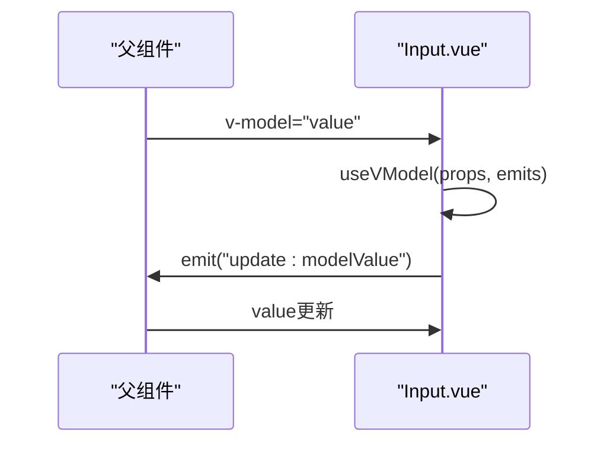
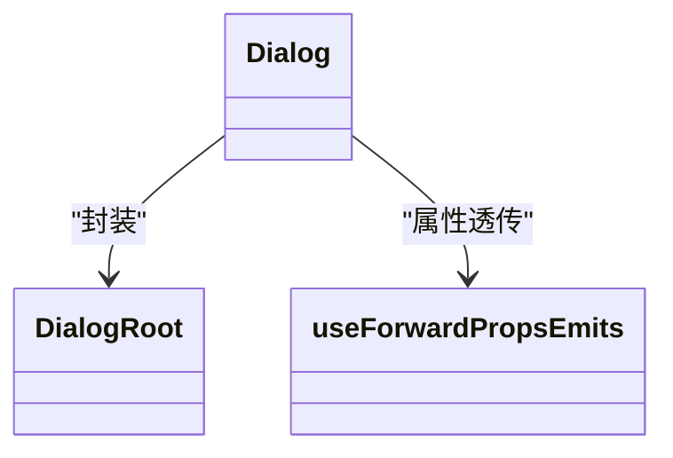
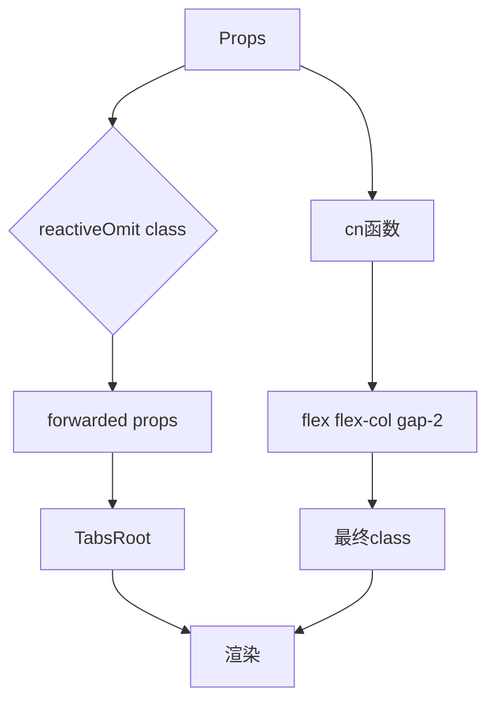

# 前端项目结构

<cite>
**本文档中引用的文件**  
- [vite.config.ts](file://web/vite.config.ts)
- [package.json](file://web/package.json)
- [index.ts](file://web/src/router/index.ts)
- [build_prod.go](file://bin/main/build_prod.go)
- [README.md](file://web/README.md)
- [Button.vue](file://web/src/components/ui/button/Button.vue)
- [Input.vue](file://web/src/components/ui/input/Input.vue)
- [Dialog.vue](file://web/src/components/ui/dialog/Dialog.vue)
- [Tabs.vue](file://web/src/components/ui/tabs/Tabs.vue)
- [DbAccountView.vue](file://web/src/views/DbAccountView.vue)
- [DatabaseChatView.vue](file://web/src/views/database/IndexView.vue)
- [Relationship.vue](file://web/src/views/database/Relationship.vue)
</cite>

## 目录

1. [项目结构](#项目结构)
2. [核心组件](#核心组件)
3. [架构概览](#架构概览)
4. [详细组件分析](#详细组件分析)
5. [依赖分析](#依赖分析)
6. [性能考虑](#性能考虑)
7. [故障排除指南](#故障排除指南)
8. [结论](#结论)

## 项目结构

本项目采用前后端分离架构，前端位于 `web/` 目录下，基于 Vue 3 + TypeScript + Vite 构建。前端代码组织清晰，遵循模块化设计原则。

- `web/src/components/ui/`：包含基于 Headless UI 模式的原子化可复用组件
- `web/src/views/`：存放页面级组件，如数据库账户管理、关系图谱、数据库对话等
- `web/src/router/index.ts`：定义前端路由系统
- `web/vite.config.ts`：Vite 构建配置，包含开发服务器代理设置
- `web/package.json`：前端构建脚本与依赖管理
- `build_prod.go`：后端构建脚本，负责将前端资源嵌入二进制文件

**Section sources**
- [vite.config.ts](file://web/vite.config.ts#L1-L27)
- [package.json](file://web/package.json#L1-L38)

## 核心组件

前端项目采用原子化设计思想，`web/src/components/ui/` 目录下的组件基于 Headless UI 模式实现，通过 `reka-ui` 和 `shadcn-vue` 提供无样式的交互逻辑，结合 Tailwind CSS 实现高度可定制的 UI 表现。

这些组件包括但不限于：
- Button：按钮组件，支持多种变体和尺寸
- Input：输入框组件，支持 v-model 双向绑定
- Dialog：模态对话框，提供完整的打开/关闭控制
- Tabs：标签页组件，支持动态切换内容

所有组件均通过 `index.ts` 导出，便于统一导入和使用。

**Section sources**
- [Button.vue](file://web/src/components/ui/button/Button.vue#L1-L30)
- [Input.vue](file://web/src/components/ui/input/Input.vue#L1-L34)
- [Dialog.vue](file://web/src/components/ui/dialog/Dialog.vue#L1-L19)
- [Tabs.vue](file://web/src/components/ui/tabs/Tabs.vue#L1-L24)

## 架构概览



**Diagram sources**
- [vite.config.ts](file://web/vite.config.ts#L13-L26)
- [index.ts](file://web/src/router/index.ts#L1-L59)
- [build_prod.go](file://bin/main/build_prod.go#L1-L22)

## 详细组件分析

### 原子化UI组件设计

#### Button组件分析
`Button.vue` 基于 `reka-ui` 的 `Primitive` 组件构建，通过 `buttonVariants` 工具函数结合 `cn`（clsx + tailwind-merge）实现样式变体控制。组件支持作为其他元素渲染（as prop），并可通过 `asChild` 传递子元素。



**Diagram sources**
- [Button.vue](file://web/src/components/ui/button/Button.vue#L1-L30)

#### Input组件分析
`Input.vue` 使用 `@vueuse/core` 的 `useVModel` 实现 `v-model` 的双向绑定支持，同时兼容 `defaultValue`。组件内部通过 `cn` 函数组合大量 Tailwind CSS 类名，实现精细的样式控制，包括焦点状态、无效状态、暗色模式等。



**Diagram sources**
- [Input.vue](file://web/src/components/ui/input/Input.vue#L1-L34)

#### Dialog组件分析
`Dialog.vue` 封装了 `reka-ui` 的 `DialogRoot` 组件，使用 `useForwardPropsEmits` 将属性和事件透明传递。这种Headless设计模式使得UI表现与交互逻辑完全解耦，开发者可自由定制弹窗外观。



**Diagram sources**
- [Dialog.vue](file://web/src/components/ui/dialog/Dialog.vue#L1-L19)

#### Tabs组件分析
`Tabs.vue` 同样采用Headless模式，通过 `reactiveOmit` 排除 `class` 属性后透传给 `TabsRoot`，再结合 `cn` 函数添加基础布局类名。这种设计既保持了组件的灵活性，又提供了默认的样式规范。



**Diagram sources**
- [Tabs.vue](file://web/src/components/ui/tabs/Tabs.vue#L1-L24)

### 页面组件布局与功能划分

#### DbAccountView分析
`DbAccountView.vue` 作为数据库账户管理页面，集成表单输入、按钮操作和列表展示等原子组件，实现数据库连接信息的增删改查功能。

**Section sources**
- [DbAccountView.vue](file://web/src/views/DbAccountView.vue)

#### DatabaseChatView分析
`DatabaseChatView.vue`（实际文件为 `IndexView.vue`）是数据库对话主页面，可能包含聊天界面、SQL生成、执行结果展示等功能模块，通过路由参数 `:id` 区分不同会话。

**Section sources**
- [DatabaseChatView.vue](file://web/src/views/database/IndexView.vue)

#### Relationship分析
`Relationship.vue` 负责展示数据库表间关系图谱，可能集成图形可视化库，结合原子化组件展示元数据信息。

**Section sources**
- [Relationship.vue](file://web/src/views/database/Relationship.vue)

## 依赖分析

前端项目依赖关系清晰，主要依赖包括：
- Vue 3：核心框架，使用 `<script setup>` 语法
- Vite：构建工具，提供快速热重载
- Tailwind CSS：原子化CSS框架
- reka-ui/shadcn-vue：Headless UI组件库
- vue-router：前端路由管理

后端通过 `build_prod.go` 中的 `//go:embed` 指令将 `web/dist/` 目录下的静态资源嵌入二进制文件，实现单文件部署。

```mermaid
dependencyDiagram
web --> vite : "构建"
vite --> dist : "输出"
dist --> build_prod.go : "嵌入"
build_prod.go --> binary : "生成"
web --> vue-router : "路由"
web --> tailwindcss : "样式"
web --> reka-ui : "组件"
```

**Diagram sources**
- [package.json](file://web/package.json#L1-L38)
- [vite.config.ts](file://web/vite.config.ts#L1-L27)
- [build_prod.go](file://bin/main/build_prod.go#L1-L22)

## 性能考虑

- Vite 利用 ESBuild 实现快速冷启动和热模块替换（HMR）
- 原子化组件设计减少CSS体积，Tailwind仅生成实际使用的类名
- 组件按需加载，路由配置支持代码分割
- 生产构建通过 `vue-tsc` 进行类型检查，确保代码质量

## 故障排除指南

常见问题及解决方案：
- **开发服务器无法启动**：检查 `vite.config.ts` 中的 HMR 端口是否被占用
- **API请求404**：确认代理配置 `/api` 是否正确指向后端服务
- **样式不生效**：检查 `tailwindcss` 插件是否正确注册
- **构建失败**：运行 `vue-tsc -b` 检查类型错误

**Section sources**
- [vite.config.ts](file://web/vite.config.ts#L13-L26)
- [package.json](file://web/package.json#L7-L9)

## 结论

本前端项目采用现代化的Vue 3技术栈，通过Headless UI模式实现高度可复用的原子化组件。Vite配置合理，支持高效的开发体验和生产构建。前后端通过API代理和资源嵌入实现无缝集成，整体架构清晰，易于维护和扩展。