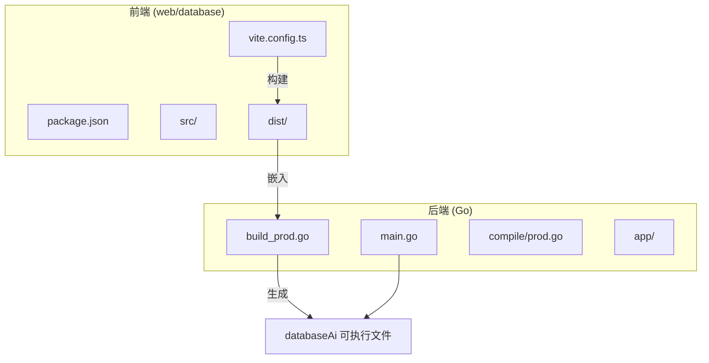
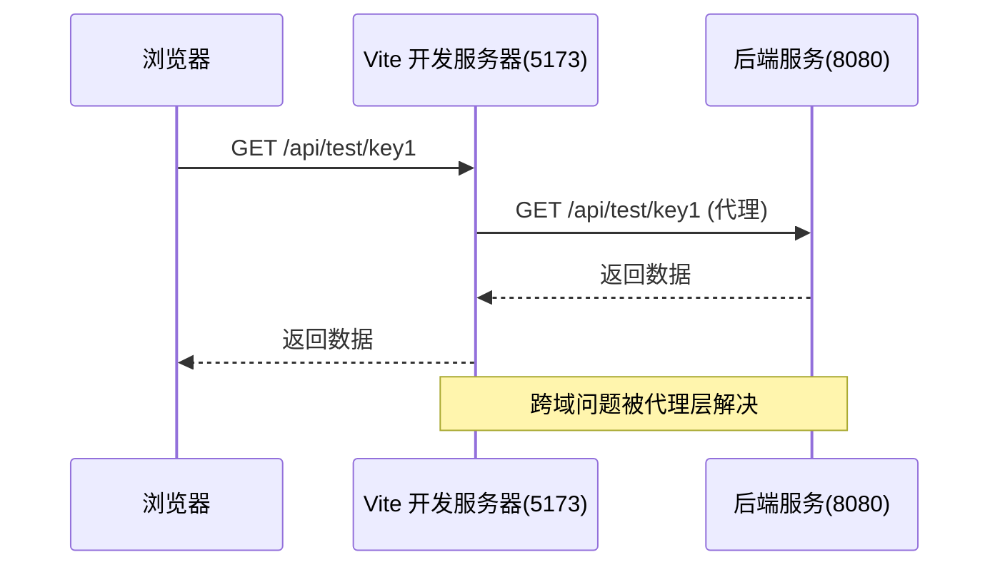
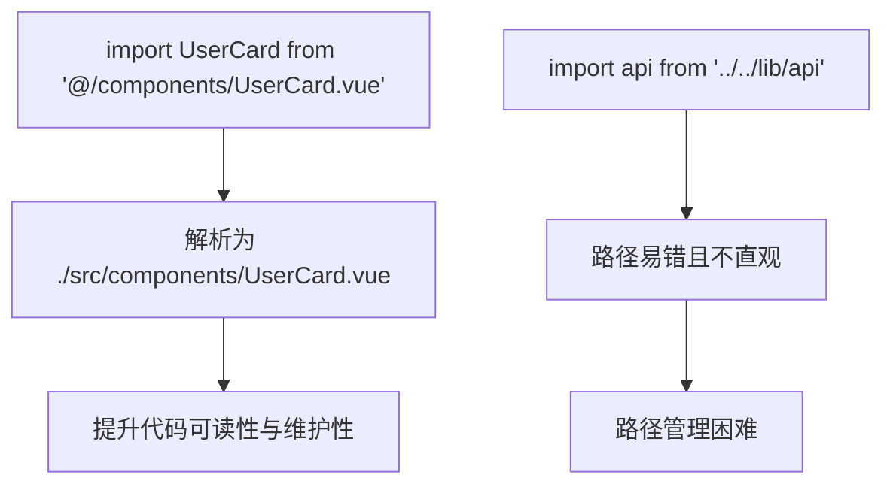
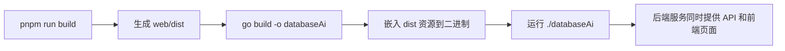

# 构建配置与部署

<cite>
**本文档引用文件**  
- [vite.config.ts](file://web/database/vite.config.ts)
- [package.json](file://web/database/package.json)
- [build_prod.go](file://bin/main/build_prod.go)
- [README.md](file://README.md)
- [web/README.md](file://web/database/README.md)
</cite>

## 目录

1. [简介](#简介)
2. [项目结构](#项目结构)
3. [核心构建配置](#核心构建配置)
4. [开发服务器与代理机制](#开发服务器与代理机制)
5. [模块别名配置](#模块别名配置)
6. [构建与部署脚本分析](#构建与部署脚本分析)
7. [前后端一体化部署机制](#前后端一体化部署机制)
8. [本地开发环境搭建](#本地开发环境搭建)
9. [常见构建问题排查](#常见构建问题排查)
10. [结论](#结论)

## 简介

本文档全面解析项目的前端构建流程与前后端集成部署机制。重点阐述基于 Vite 的开发服务器配置、API 代理设置、模块别名便利性、构建脚本作用，以及如何通过 Go 构建脚本将前端静态资源嵌入后端二进制文件，实现一体化部署。同时提供本地开发环境搭建步骤与常见问题解决方案。

## 项目结构

项目采用前后端分离但一体化构建的架构模式，前端位于 `web/database` 目录，后端为 Go 服务，通过构建脚本实现资源嵌入。

**Diagram sources**
- [vite.config.ts](file://web/database/vite.config.ts#L1-L27)
- [build_prod.go](file://bin/main/build_prod.go#L1-L18)

**Section sources**
- [README.md](file://README.md#L5-L33)

## 核心构建配置

项目通过 Vite 作为前端构建工具，结合 Go 的构建标签（build tags）实现开发与生产环境的差异化构建流程。前端配置集中于 `vite.config.ts` 和 `package.json`，后端通过 `build_dev.go` 和 `build_prod.go` 控制构建行为。

**Section sources**
- [vite.config.ts](file://web/database/vite.config.ts#L1-L27)
- [package.json](file://web/database/package.json#L1-L38)

## 开发服务器与代理机制

为解决开发阶段前后端分离导致的跨域问题，Vite 配置了反向代理规则。所有以 `/api` 开头的请求将被自动转发至后端服务 `http://127.0.0.1:8080`，从而实现无缝接口调用。

**Diagram sources**
- [vite.config.ts](file://web/database/vite.config.ts#L18-L24)

**Section sources**
- [vite.config.ts](file://web/database/vite.config.ts#L13-L26)
- [README.md](file://README.md#L102-L117)

## 模块别名配置

通过 `vite.config.ts` 中的 `resolve.alias` 配置，项目定义了 `@` 别名指向 `./src` 目录。此配置极大简化了模块导入路径，避免了深层嵌套组件间繁琐的相对路径引用。

**Diagram sources**
- [vite.config.ts](file://web/database/vite.config.ts#L9-L11)

**Section sources**
- [vite.config.ts](file://web/database/vite.config.ts#L8-L12)

## 构建与部署脚本分析

`package.json` 中定义了三个核心脚本，分别对应开发、构建和预览流程。

| 脚本 | 命令 | 作用 |
|------|------|------|
| `dev` | `vite` | 启动 Vite 开发服务器，支持热重载 |
| `build` | `vue-tsc -b && vite build` | 类型检查并构建生产环境静态资源至 `dist/` 目录 |
| `preview` | `vite preview` | 在本地启动一个静态服务器预览 `dist/` 内容 |

**Section sources**
- [package.json](file://web/database/package.json#L6-L10)

## 前后端一体化部署机制

在生产构建时，`build_prod.go` 文件通过构建标签 `!dev` 被包含。该文件调用 `compile.SetupProd` 函数，将前端构建生成的静态资源（由 `web/dist` 目录打包）嵌入到 Go 二进制文件中。运行时，后端 Fiber 应用通过 `setupProductionWeb` 函数提供这些静态资源服务，实现单文件部署。

**Diagram sources**
- [build_prod.go](file://bin/main/build_prod.go#L14-L16)
- [package.json](file://web/database/package.json#L8)

**Section sources**
- [build_prod.go](file://bin/main/build_prod.go#L1-L18)
- [README.md](file://README.md#L80-L93)

## 本地开发环境搭建

根据 `web/README.md` 和项目根目录 `README.md`，本地开发环境搭建步骤如下：

1. 进入 `backend` 目录
2. 进入 `web/database` 子目录
3. 执行 `pnpm install` 安装前端依赖
4. 返回 `backend` 目录
5. 使用 `just dev` 或 `go run -tags dev main.go` 启动开发服务

开发模式下，Vite 提供热重载功能，修改前端代码后浏览器将自动刷新。

**Section sources**
- [README.md](file://README.md#L53-L73)
- [web/README.md](file://web/database/README.md)

## 常见构建问题排查

### 端口冲突
- **现象**：Vite 开发服务器无法启动
- **原因**：5173 端口被占用
- **解决方案**：在 `vite.config.ts` 中修改 `server.hmr.port` 为其他值（如 5174）

### 依赖缺失
- **现象**：`pnpm install` 报错或构建失败
- **原因**：未正确安装前端依赖
- **解决方案**：确保在 `web/database` 目录下执行 `pnpm install`，检查网络连接及 pnpm 是否正确安装

### 构建失败
- **现象**：`go build` 失败或缺少前端资源
- **原因**：前端未成功构建或路径错误
- **解决方案**：确认已执行 `pnpm run build`，检查 `dist` 目录是否存在且非空

**Section sources**
- [vite.config.ts](file://web/database/vite.config.ts#L16)
- [package.json](file://web/database/package.json#L8)
- [README.md](file://README.md#L85-L88)

## 结论

本项目通过 Vite 的现代化构建能力与 Go 的静态编译优势，实现了高效且便捷的前后端一体化开发与部署流程。开发阶段利用代理解决跨域，生产阶段通过资源嵌入实现单文件部署，兼顾了开发效率与部署便利性。合理的脚本配置与目录结构为项目的可维护性提供了坚实基础。