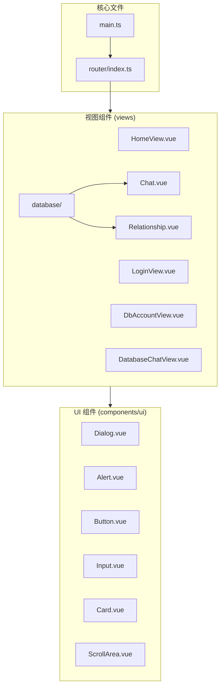
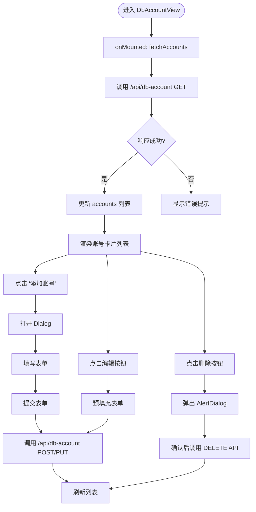
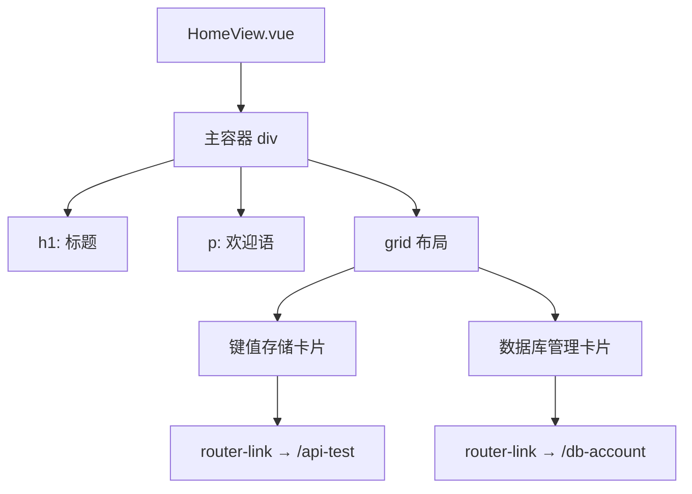
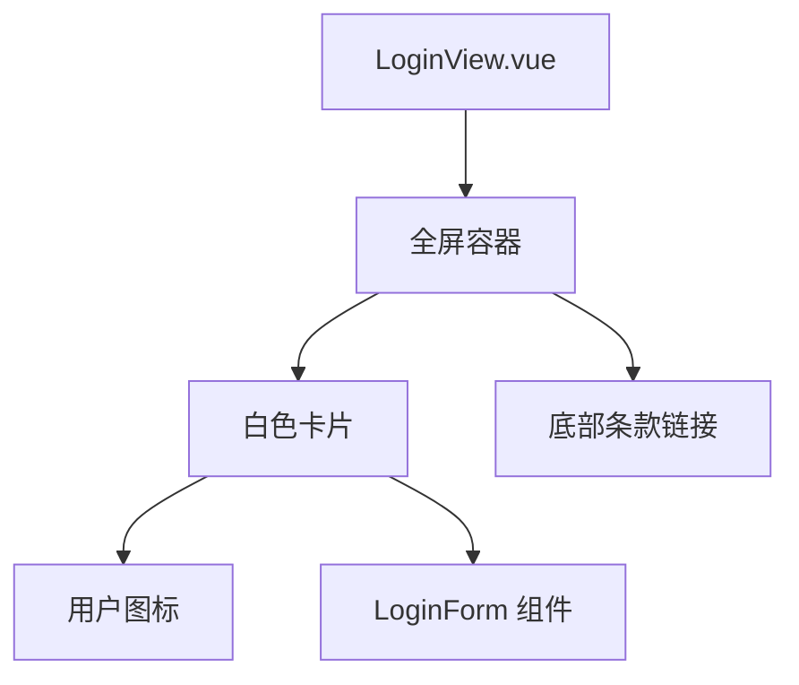

# 页面视图结构

<cite>
**本文档中引用的文件**  
- [DbAccountView.vue](file://web/src/views/DbAccountView.vue)
- [DatabaseChatView.vue](file://web/src/views/DatabaseChatView.vue)
- [Chat.vue](file://web/src/views/database/Chat.vue)
- [Relationship.vue](file://web/src/views/database/Relationship.vue)
- [HomeView.vue](file://web/src/views/HomeView.vue)
- [LoginView.vue](file://web/src/views/LoginView.vue)
- [main.ts](file://web/src/main.ts)
- [index.ts](file://web/src/router/index.ts)
</cite>

## 目录
1. [项目结构](#项目结构)
2. [核心视图组件分析](#核心视图组件分析)
3. [DbAccountView 数据库账号管理](#dbaccountview-数据库账号管理)
4. [DatabaseChatView 与 Chat.vue 嵌套关系](#databasechatview-与-chatvue-嵌套关系)
5. [Relationship.vue 关系图谱可视化](#relationshipvue-关系图谱可视化)
6. [HomeView 主布局容器](#homeview-主布局容器)
7. [LoginView 身份验证流程](#loginview-身份验证流程)
8. [状态管理与交互模式](#状态管理与交互模式)
9. [路由参数传递与生命周期](#路由参数传递与生命周期)

## 项目结构

前端视图组件位于 `web/src/views` 目录下，采用 Vue 3 + TypeScript + Vite 技术栈。主要视图包括主页、登录页、数据库管理相关功能页。组件库基于 `shadcn-vue` 风格构建，位于 `web/src/components/ui` 目录。



**图示来源**  
- [main.ts](file://web/src/main.ts#L1-L11)
- [index.ts](file://web/src/router/index.ts#L1-L59)
- [项目结构](file://web/src/views/)

**本节来源**  
- [main.ts](file://web/src/main.ts#L1-L11)
- [index.ts](file://web/src/router/index.ts#L1-L59)

## 核心视图组件分析

系统前端由多个独立视图组成，通过 Vue Router 实现路由导航。各视图职责分明，分别承担主界面、身份验证、数据库连接管理、自然语言查询和关系分析等功能。整体采用组合式 API（`<script setup>`）编写，状态管理依赖本地响应式变量而非 Vuex 或 Pinia。

**本节来源**  
- [main.ts](file://web/src/main.ts#L1-L11)
- [index.ts](file://web/src/router/index.ts#L1-L59)

## DbAccountView 数据库账号管理

`DbAccountView` 实现了完整的数据库连接信息管理功能，支持增删改查操作。该视图通过集成表单组件（如 `Input`、`Label`、`Dialog`）实现用户交互，并通过原生 `fetch` API 与后端通信。

- 使用 `Dialog` 组件实现添加/编辑模态框
- 利用 `Alert` 组件展示错误信息
- 通过 `Card` 组件列表化展示数据库账号
- 表单字段包含名称、主机、端口、账号、密码、数据库名等连接参数
- 状态变量包括 `accounts`（账号列表）、`loading`、`error`、`currentAccount` 等
- 在 `onMounted` 钩子中调用 `fetchAccounts()` 加载数据



**图示来源**  
- [DbAccountView.vue](file://web/src/views/DbAccountView.vue#L1-L238)

**本节来源**  
- [DbAccountView.vue](file://web/src/views/DbAccountView.vue#L1-L238)

## DatabaseChatView 与 Chat.vue 嵌套关系

`DatabaseChatView.vue` 当前为占位文件，实际聊天界面由 `database/Chat.vue` 实现。`Chat.vue` 构成了自然语言查询的核心界面，采用典型的聊天布局：

- 上方为消息历史区域，使用 `ScrollArea` 实现滚动
- 消息气泡根据发送者（用户/机器人）左右对齐
- 下方固定输入区包含 `Textarea` 和发送按钮
- 支持回车键发送消息（`@keyup.enter`）
- 使用 `ref` 和 `nextTick` 实现消息发送后自动滚动到底部
- 消息列表通过 `v-for` 渲染，包含 ID、发送者、内容等字段

该组件展示了典型的异步交互模式：用户输入 → 发送请求 → 接收响应 → 更新 UI。

```mermaid
flowchart LR
UserInput["用户输入消息"] --> PressEnter["按下 Enter"]
PressEnter --> CallSend["调用 sendMessage()"]
CallSend --> AddToMessages["添加到 messages 列表"]
AddToMessages --> ClearInput["清空输入框"]
ClearInput --> ScrollDown["scrollToBottom()"]
ScrollDown --> SimulateAI["setTimeout 模拟 AI 回复"]
SimulateAI --> AddBotMessage["添加机器人回复"]
AddBotMessage --> ScrollDownAgain["再次滚动到底部"]
```



**图示来源**  
- [Chat.vue](file://web/src/views/database/Chat.vue#L1-L94)

**本节来源**  
- [DatabaseChatView.vue](file://web/src/views/DatabaseChatView.vue#L1-L13)
- [Chat.vue](file://web/src/views/database/Chat.vue#L1-L94)

## Relationship.vue 关系图谱可视化

`database/Relationship.vue` 集成了关系图谱的可视化组件，主要功能包括：

- 展示已有的关系分析记录（`relationships` 列表）
- 支持创建新的关系分析任务
- 提供全屏查看分析结果的功能
- 集成 Markdown 渲染器展示结构化结果
- 使用 `InputGroup` 组件组构建复杂输入界面
- 通过 `toast` 组件提供操作反馈

关键集成点：
- 使用 `MarkdownViewer` 组件渲染 AI 生成的分析结果
- 利用 `ScrollArea` 实现内容区域滚动
- 通过 `fullscreen` API 实现全屏查看模式
- 使用 `SSE`（Server-Sent Events）监听分析进度（`analyzeRelationship` 函数）
- 状态变量包括 `relationships`、`loadingStates`、`fullscreenContent` 等

```mermaid
classDiagram
class Relationship {
+id : number
+title : string
+tables : string
+result : string
+created_time : string
}
class TableInfo {
+name : string
+comment : string
+fields : Field[]
}
class Field {
+name : string
+type : string
+comment : string
}
class RelationshipVue {
-relationships : Ref~Relationship[]~
-selecteds : Ref~TableInfo[]~
-loadingStates : Ref~Record<number, boolean>~
-fullscreenContent : Ref~{title : string, result : string}~
+fetchRelationships()
+createRelationshipRecord()
+analyzeRelationshipRecord(id)
+deleteRelationshipRecord(id)
+showFullscreen(title, result)
}
RelationshipVue --> Relationship : "管理"
RelationshipVue --> TableInfo : "引用"
RelationshipVue --> "MarkdownViewer" : "渲染"
RelationshipVue --> "toast" : "通知"
```

**图示来源**  
- [Relationship.vue](file://web/src/views/database/Relationship.vue#L1-L340)

**本节来源**  
- [Relationship.vue](file://web/src/views/database/Relationship.vue#L1-L340)

## HomeView 主布局容器

`HomeView` 作为应用的主页面，承担着导航中枢的角色。其结构设计简洁明了：

- 使用 `grid` 布局展示功能卡片
- 每个卡片代表一个核心功能模块
- 通过 `router-link` 实现页面跳转
- 包含欢迎语和功能简介
- 集成 `Button` 组件用于交互演示

该视图不直接处理复杂状态，而是作为功能入口点，引导用户进入具体的功能页面。



**图示来源**  
- [HomeView.vue](file://web/src/views/HomeView.vue#L1-L35)

**本节来源**  
- [HomeView.vue](file://web/src/views/HomeView.vue#L1-L35)

## LoginView 身份验证流程

`LoginView` 实现了身份验证的入口界面，其主要特点包括：

- 全屏渐变背景，提升视觉体验
- 居中卡片式登录表单
- 使用 `LoginForm` 组件实现具体表单逻辑
- 包含服务条款和隐私政策链接
- 采用响应式设计，适配不同屏幕尺寸

身份验证流程集成体现在：
- 通过导入 `LoginForm` 组件实现表单功能复用
- 界面设计符合现代 Web 应用标准
- 为后续实现真实认证流程预留了结构基础



**图示来源**  
- [LoginView.vue](file://web/src/views/LoginView.vue#L1-L34)

**本节来源**  
- [LoginView.vue](file://web/src/views/LoginView.vue#L1-L34)

## 状态管理与交互模式

尽管未显式使用 Vuex 或 Pinia，项目采用了组合式 API 的响应式状态管理方案：

- 使用 `ref` 和 `reactive` 创建响应式变量
- 状态作用域限定在组件内部（本地状态）
- 通过 `props` 实现父子组件通信
- 利用 `emits` 实现子向父通信（未在当前代码中显式体现）
- 使用 `toast` 全局通知组件进行跨组件通信

数据流模式：
1. 组件挂载 → 调用 API 获取数据 → 更新响应式变量 → 自动触发 UI 重渲染
2. 用户交互 → 修改响应式变量 → 触发方法 → 调用 API → 根据响应更新状态

**本节来源**  
- [DbAccountView.vue](file://web/src/views/DbAccountView.vue#L1-L238)
- [Relationship.vue](file://web/src/views/database/Relationship.vue#L1-L340)
- [Chat.vue](file://web/src/views/database/Chat.vue#L1-L94)

## 路由参数传递与生命周期

### 路由配置分析
路由系统通过 `vue-router` 实现，关键配置包括：
- 动态路由 `/database-chat/:id` 用于传递数据库连接 ID
- 嵌套路由结构，`/test` 为父路由，包含多个子路由
- 使用 `createWebHistory` 模式

### 生命周期使用
各视图普遍采用以下生命周期模式：
- `onMounted`：用于初始化数据加载（如 `fetchAccounts`、`fetchRelationships`）
- `onUpdated`：用于 DOM 更新后的操作（如 `scrollToBottom`）
- `onUnmounted`：用于清理资源（如事件监听器）

### 异步数据加载
采用原生 `fetch` API 进行异步数据加载，典型模式：
```typescript
const loadData = async () => {
  try {
    loading.value = true
    const res = await fetch('/api/endpoint')
    const result = await res.json()
    if (result.code === 200) {
      data.value = result.data
    } else {
      error.value = result.msg
    }
  } catch (e) {
    error.value = '网络错误'
  } finally {
    loading.value = false
  }
}
```

此模式在 `DbAccountView` 和 `Relationship.vue` 中均有体现。

**本节来源**  
- [index.ts](file://web/src/router/index.ts#L1-L59)
- [DbAccountView.vue](file://web/src/views/DbAccountView.vue#L1-L238)
- [Relationship.vue](file://web/src/views/database/Relationship.vue#L1-L340)
- [Chat.vue](file://web/src/views/database/Chat.vue#L1-L94)