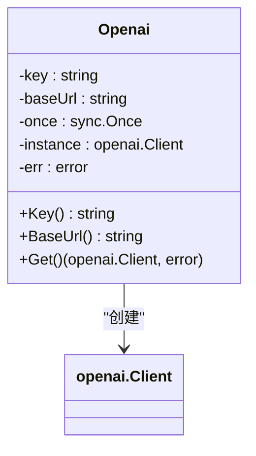
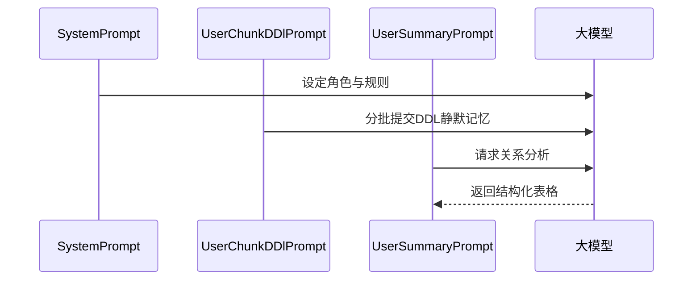
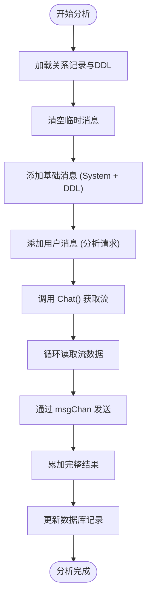
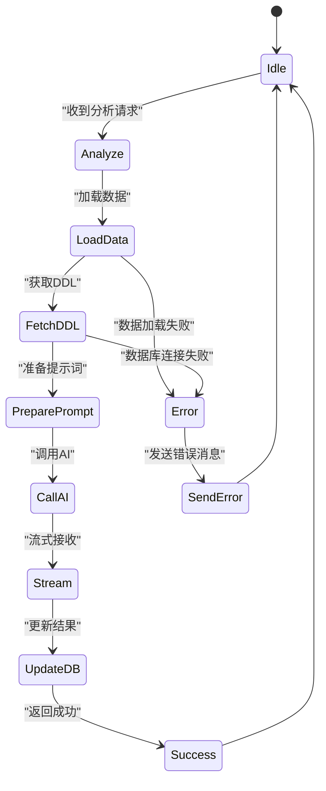
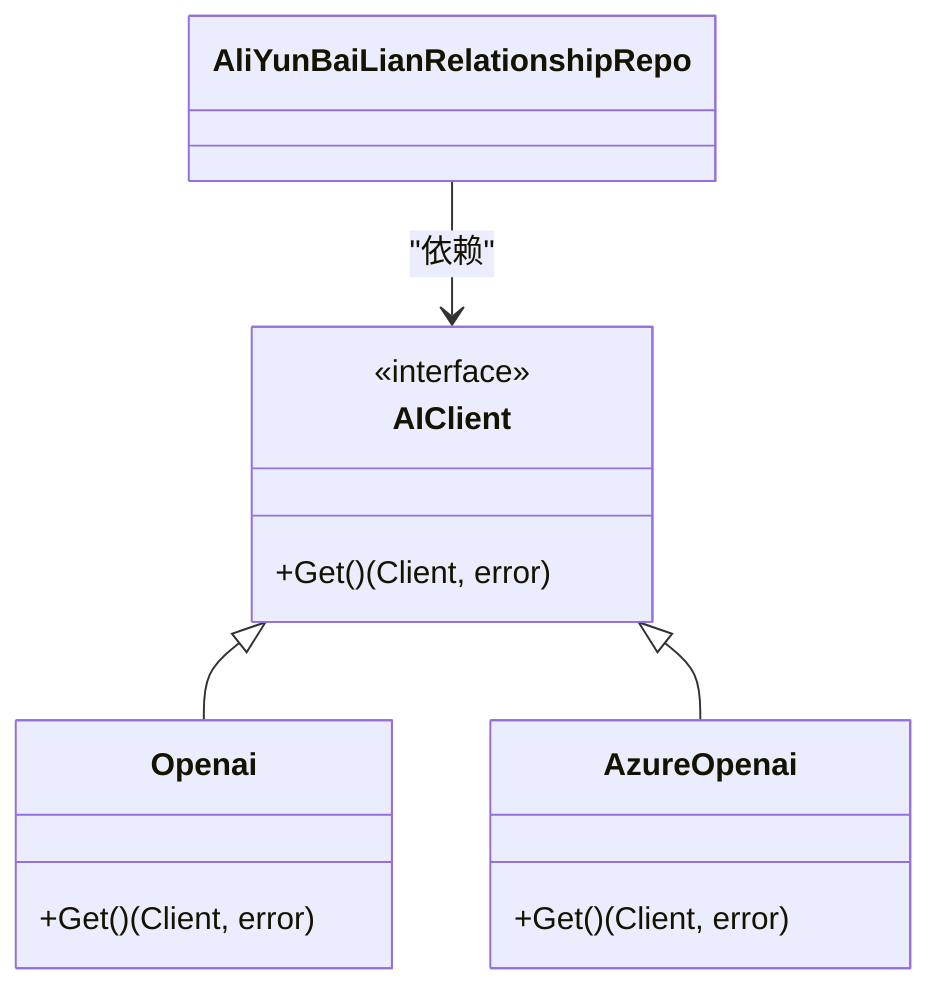

# AI服务集成机制

<cite>
**本文档引用文件**  
- [openai.go](file://internal/infra/ai/openai.go)
- [aliyun_bailian_relationship_repo.go](file://internal/app/tools/repo/aliyun_bailian_relationship/aliyun_bailian_relationship_repo.go)
- [prompts.go](file://internal/app/tools/repo/aliyun_bailian_relationship/prompts.go)
- [service.go](file://internal/app/tools/business/relationship/service.go)
- [handler.go](file://internal/app/tools/business/relationship/handler.go)
- [config.go](file://internal/infra/config/config.go)
</cite>

## 目录
1. [AI客户端封装机制](#ai客户端封装机制)
2. [提示词工程与结构化输出设计](#提示词工程与结构化输出设计)
3. [异步处理与流式响应模式](#异步处理与流式响应模式)
4. [结果缓存与错误降级策略](#结果缓存与错误降级策略)
5. [扩展指南：适配其他OpenAI兼容API](#扩展指南适配其他openai兼容api)
6. [生产环境注意事项](#生产环境注意事项)

## AI客户端封装机制

`openai.go` 文件中的 `Openai` 结构体封装了对 OpenAI 兼容 API 的调用，采用单例模式确保客户端实例的线程安全与复用。该封装通过 `sync.Once` 保证 `Get()` 方法仅初始化一次客户端实例，避免重复创建连接。

认证机制通过构造函数 `NewOpenai(key, baseUrl)` 注入 API 密钥和基础 URL，其中密钥用于 `option.WithAPIKey()`，URL 用于 `option.WithBaseURL()`，适配阿里云百炼等非官方 OpenAI 接口。请求超时设置由底层 SDK 管理，未显式配置时使用默认值。

重试策略未在当前封装中实现，依赖外部调用方或 SDK 默认行为。响应解析由调用方在接收流式数据后完成，`Chat` 方法返回 `chan string`，逐段接收模型输出并拼接。

**图示来源**  
- [openai.go](file://internal/infra/ai/openai.go#L9-L15)

**本节来源**  
- [openai.go](file://internal/infra/ai/openai.go#L1-L41)

## 提示词工程与结构化输出设计

`aliyun_bailian_relationship_repo.go` 利用阿里云百炼平台的大模型能力进行数据库表关系分析。系统通过 `SystemPrompt()` 定义系统级角色，明确模型作为“数据库结构分析助手”的职责，强调会话独立性、记忆规则与输出格式要求。

`UserChunkDDlPrompt()` 用于分批提交 DDL 语句，提示模型“静默记忆”而不输出确认信息，避免干扰后续分析。`UserSummaryPrompt()` 触发最终的关系分析，要求模型输出严格遵循 Markdown 表格格式，包含“核心实体说明”和“核心关系一览表”两部分，确保结构化 JSON 解析的可行性。

该设计通过分阶段提示（先记忆，后分析）控制模型行为，结合格式约束提升输出一致性，便于前端解析展示。

**图示来源**  
- [prompts.go](file://internal/app/tools/repo/aliyun_bailian_relationship/prompts.go#L5-L55)

**本节来源**  
- [prompts.go](file://internal/app/tools/repo/aliyun_bailian_relationship/prompts.go#L1-L57)
- [aliyun_bailian_relationship_repo.go](file://internal/app/tools/repo/aliyun_bailian_relationship/aliyun_bailian_relationship_repo.go#L18-L25)

## 异步处理与流式响应模式

系统采用异步流式处理模式提升用户体验。`AliYunBaiLianRelationshipRepo.Chat()` 方法创建一个带缓冲的 `chan string`，通过 goroutine 发起流式请求，并将 `stream.Current().Delta.Content` 持续推送到 channel 中。

在业务层 `Service.Analyze()` 中，该 channel 被用于实时推送分析结果。Web 层 `Handler.Analyze()` 通过 Server-Sent Events (SSE) 将结果分段发送给前端，实现“打字机”效果，避免用户长时间等待。

此模式解耦了 AI 调用与 HTTP 响应，确保长耗时任务不会阻塞主线程，同时提供实时反馈。

**图示来源**  
- [aliyun_bailian_relationship_repo.go](file://internal/app/tools/repo/aliyun_bailian_relationship/aliyun_bailian_relationship_repo.go#L49-L75)
- [service.go](file://internal/app/tools/business/relationship/service.go#L101-L180)
- [handler.go](file://internal/app/tools/business/relationship/handler.go#L188-L216)

**本节来源**  
- [aliyun_bailian_relationship_repo.go](file://internal/app/tools/repo/aliyun_bailian_relationship/aliyun_bailian_relationship_repo.go#L49-L75)
- [service.go](file://internal/app/tools/business/relationship/service.go#L101-L180)
- [handler.go](file://internal/app/tools/business/relationship/handler.go#L188-L216)

## 结果缓存与错误降级策略

系统通过数据库字段 `Relationship.Result` 持久化存储 AI 分析结果，实现结果缓存。当用户再次请求同一关系分析时，可直接返回历史结果，避免重复调用 AI 接口，节省成本并提升响应速度。

错误降级方案体现在多层处理中：在 `Analyze()` 方法中，任何步骤的错误都会通过 `msgChan` 发送错误响应并终止流程，确保前端能收到明确反馈。同时，`ClearAllMessages()` 在每次分析前重置消息状态，防止脏数据影响后续调用，保证分析的独立性和准确性。

**图示来源**  
- [service.go](file://internal/app/tools/business/relationship/service.go#L101-L180)

**本节来源**  
- [service.go](file://internal/app/tools/business/relationship/service.go#L101-L180)
- [models/relationship.go](file://internal/app/tools/models/relationship.go#L11-L12)

## 扩展指南：适配其他OpenAI兼容API

为支持 Azure OpenAI 等其他兼容 API，建议采用适配器模式。可创建新的 `AzureOpenai` 结构体，实现与 `Openai` 相同的接口（如 `Get() (Client, error)`）。在 `boot.go` 的 `NewApp` 函数中，根据配置项动态选择初始化 `Openai` 或 `AzureOpenai` 实例，并注入到 `AliYunBaiLianRelationshipRepo` 中。

由于 `AliYunBaiLianRelationshipRepo` 依赖的是 `*ai.Openai` 类型，需将 `Openai` 结构体抽象为接口，例如 `AIClient`，包含 `Get()` 方法。这样，`AliYunBaiLianRelationshipRepo` 依赖该接口而非具体实现，实现真正的解耦。

**图示来源**  
- [openai.go](file://internal/infra/ai/openai.go#L9-L15)
- [aliyun_bailian_relationship_repo.go](file://internal/app/tools/repo/aliyun_bailian_relationship/aliyun_bailian_relationship_repo.go#L12-L12)

**本节来源**  
- [openai.go](file://internal/infra/ai/openai.go#L1-L41)
- [aliyun_bailian_relationship_repo.go](file://internal/app/tools/repo/aliyun_bailian_relationship/aliyun_bailian_relationship_repo.go#L11-L15)

## 生产环境注意事项

1. **API限流**：应在服务层增加限流逻辑（如令牌桶算法），防止恶意请求耗尽 API 配额。
2. **Token消耗监控**：需记录每次请求的输入/输出 token 数量，用于成本核算与用量预警。
3. **敏感数据过滤**：在发送 DDL 前，应进行脱敏处理，移除或替换可能包含的敏感信息（如真实表名、字段名）。
4. **配置管理**：`config.go` 通过环境变量加载配置，确保密钥等敏感信息不硬编码在代码中，符合安全最佳实践。
5. **连接复用**：`Openai` 的单例设计有效减少了 HTTP 连接开销，提升性能。

**本节来源**  
- [config.go](file://internal/infra/config/config.go#L13-L20)
- [boot.go](file://internal/app/tools/boot.go#L54-L67)
- [openai.go](file://internal/infra/ai/openai.go#L31-L39)