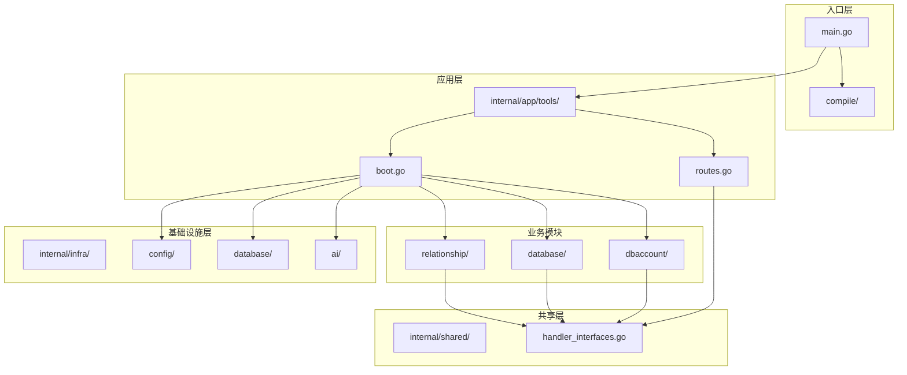
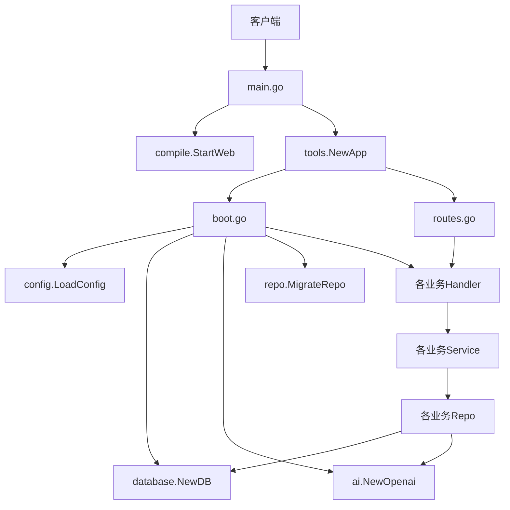
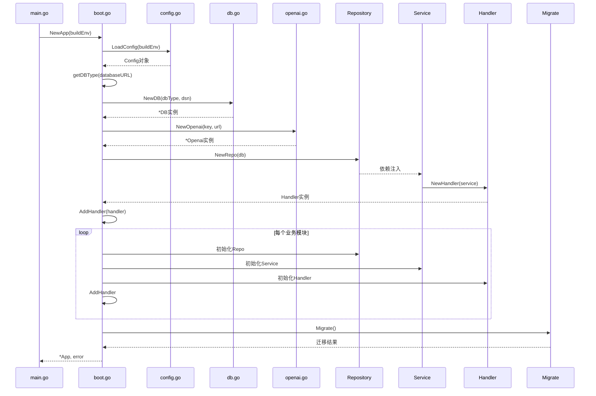
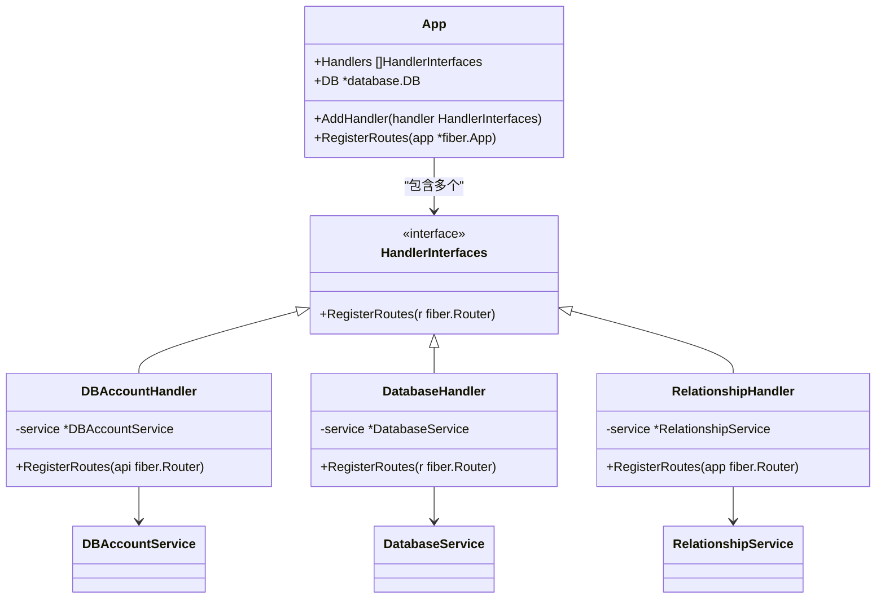
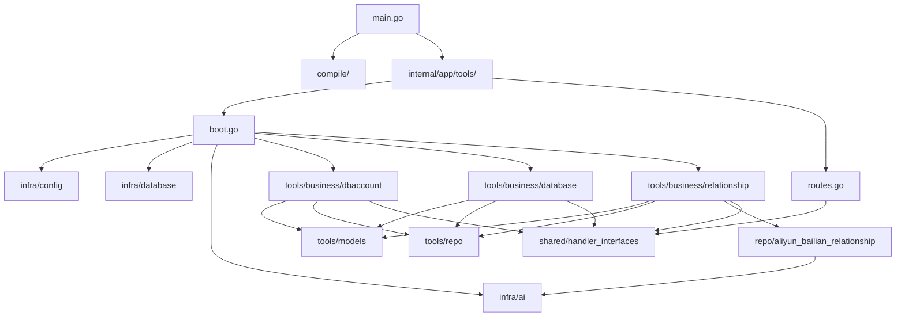

# 后端架构说明

<cite>
**本文档引用的文件**  
- [main.go](file://main.go)
- [boot.go](file://internal/app/tools/boot.go)
- [routes.go](file://internal/app/tools/routes.go)
- [handler_interfaces.go](file://internal/shared/handler_interfaces.go)
- [config.go](file://internal/infra/config/config.go)
- [db.go](file://internal/infra/database/db.go)
- [openai.go](file://internal/infra/ai/openai.go)
- [dev.go](file://compile/dev.go)
- [prod.go](file://compile/prod.go)
- [db_account_repo.go](file://internal/app/tools/business/dbaccount/db_account_repo.go)
- [handler.go](file://internal/app/tools/business/dbaccount/handler.go)
- [service.go](file://internal/app/tools/business/dbaccount/service.go)
- [database/handler.go](file://internal/app/tools/business/database/handler.go)
- [database/service.go](file://internal/app/tools/business/database/service.go)
- [relationship/handler.go](file://internal/app/tools/business/relationship/handler.go)
- [relationship/service.go](file://internal/app/tools/business/relationship/service.go)
- [database_repo.go](file://internal/app/tools/repo/database_repo.go)
- [manage_database_repo.go](file://internal/app/tools/repo/manage_database_repo.go)
- [aliyun_bailian_relationship_repo.go](file://internal/app/tools/repo/aliyun_bailian_relationship/aliyun_bailian_relationship_repo.go)
</cite>

## 目录
1. [简介](#简介)
2. [项目结构](#项目结构)
3. [核心组件](#核心组件)
4. [架构概览](#架构概览)
5. [详细组件分析](#详细组件分析)
6. [依赖分析](#依赖分析)
7. [性能考虑](#性能考虑)
8. [故障排除指南](#故障排除指南)
9. [结论](#结论)

## 简介
本项目是一个基于 Go 语言的后端服务系统，采用模块化分层架构设计，结合 Fiber 框架实现 RESTful API 接口。系统通过 `internal/app/tools/` 目录组织业务逻辑，利用依赖注入和接口抽象实现模块解耦，并通过 `compile/` 包支持开发与生产环境的差异化启动。核心功能包括数据库账号管理、数据库结构分析、关系图谱生成及 AI 智能分析能力。

## 项目结构



**图示来源**
- [main.go](file://main.go#L1-L25)
- [boot.go](file://internal/app/tools/boot.go#L1-L93)
- [routes.go](file://internal/app/tools/routes.go#L1-L11)
- [handler_interfaces.go](file://internal/shared/handler_interfaces.go#L1-L8)

## 核心组件

系统采用清晰的分层架构，主要包括：
- **启动引导模块**：`boot.go` 负责初始化配置、数据库、AI 客户端及服务注册。
- **路由中枢模块**：`routes.go` 统一注册各业务模块的 API 路由。
- **接口规范定义**：`shared/handler_interfaces.go` 定义统一的路由注册接口。
- **环境差异化启动**：`compile/` 包根据构建环境配置 Web 服务模式。
- **基础设施组件**：`infra/` 层封装配置、数据库、AI 等底层依赖。

**组件来源**
- [boot.go](file://internal/app/tools/boot.go#L1-L93)
- [routes.go](file://internal/app/tools/routes.go#L1-L11)
- [handler_interfaces.go](file://internal/shared/handler_interfaces.go#L1-L8)
- [config.go](file://internal/infra/config/config.go#L1-L58)
- [db.go](file://internal/infra/database/db.go#L1-L96)
- [openai.go](file://internal/infra/ai/openai.go#L1-L41)

## 架构概览



**图示来源**
- [main.go](file://main.go#L1-L25)
- [boot.go](file://internal/app/tools/boot.go#L1-L93)
- [routes.go](file://internal/app/tools/routes.go#L1-L11)
- [config.go](file://internal/infra/config/config.go#L1-L58)
- [db.go](file://internal/infra/database/db.go#L1-L96)
- [openai.go](file://internal/infra/ai/openai.go#L1-L41)

## 详细组件分析

### 启动流程分析

`boot.go` 文件中的 `NewApp` 函数是应用初始化的核心入口，其执行流程如下：

1. 创建 `App` 实例并初始化处理器列表
2. 加载环境配置（开发/生产）
3. 根据数据库 URL 自动判断数据库类型（SQLite/MySQL）
4. 建立数据库连接并设置连接池
5. 初始化 AI 客户端（阿里云百炼）
6. 依次创建各业务模块的 Repository、Service 和 Handler
7. 将 Handler 注册到 App 的处理器列表中
8. 执行数据库迁移
9. 返回初始化完成的 App 实例



**图示来源**
- [boot.go](file://internal/app/tools/boot.go#L40-L92)
- [config.go](file://internal/infra/config/config.go#L22-L50)
- [db.go](file://internal/infra/database/db.go#L30-L76)
- [openai.go](file://internal/infra/ai/openai.go#L25-L30)

### 路由注册机制

`routes.go` 实现了统一的路由注册机制，通过接口抽象实现模块解耦：



**图示来源**
- [routes.go](file://internal/app/tools/routes.go#L5-L10)
- [handler_interfaces.go](file://internal/shared/handler_interfaces.go#L5-L7)
- [dbaccount/handler.go](file://internal/app/tools/business/dbaccount/handler.go#L24-L32)
- [database/handler.go](file://internal/app/tools/business/database/handler.go#L16-L19)
- [relationship/handler.go](file://internal/app/tools/business/relationship/handler.go#L26-L36)

### 接口解耦设计

`shared/handler_interfaces.go` 定义了统一的处理器接口规范，使得 `routes.go` 可以无需了解具体业务实现即可完成路由注册，实现了完美的模块解耦。

```go
type HandlerInterfaces interface {
    RegisterRoutes(r fiber.Router)
}
```

这种设计模式的优势：
- 新增业务模块无需修改路由中枢代码
- 各业务模块独立开发、测试和部署
- 易于单元测试和 Mock
- 符合开闭原则（对扩展开放，对修改关闭）

**组件来源**
- [handler_interfaces.go](file://internal/shared/handler_interfaces.go#L5-L7)
- [routes.go](file://internal/app/tools/routes.go#L7-L8)

### 环境差异化启动

系统通过 `compile/` 包实现开发与生产环境的差异化启动：

```mermaid
flowchart TD
Start([程序启动]) --> CheckEnv{BuildEnv}
CheckEnv --> |dev| SetupDev[SetupDev()]
CheckEnv --> |prod| SetupProd[SetupProd()]
SetupDev --> StartVite[启动Vite开发服务器]
SetupDev --> ProxyAPI[代理API请求]
SetupDev --> ProxyWeb[代理前端资源]
SetupProd --> EmbedFS[嵌入前端文件系统]
SetupProd --> ServeStatic[提供静态文件服务]
SetupProd --> Fallback[404提示页面]
SetupDev --> InitApp[初始化App]
SetupProd --> InitApp[初始化App]
InitApp --> RegisterRoutes[注册所有路由]
RegisterRoutes --> StartServer[启动服务器]
```

**图示来源**
- [dev.go](file://compile/dev.go#L10-L64)
- [prod.go](file://compile/prod.go#L12-L37)
- [main.go](file://main.go#L10-L24)

### 基础设施层分析

#### 配置管理
`infra/config/config.go` 实现了灵活的配置加载机制：
- 支持环境变量覆盖
- 支持 `.env` 文件加载
- 开发环境自动定位项目根目录
- 提供默认值 fallback 机制

#### 数据库管理
`infra/database/db.go` 封装了 GORM 数据库操作：
- 支持 SQLite 和 MySQL
- 配置连接池参数
- 统一日志输出格式
- 提供 AutoMigrate 功能

#### AI 客户端
`infra/ai/openai.go` 封装了阿里云百炼 AI 服务：
- 使用 sync.Once 实现单例模式
- 支持自定义 API Key 和 Base URL
- 提供线程安全的客户端获取方法

**组件来源**
- [config.go](file://internal/infra/config/config.go#L1-L58)
- [db.go](file://internal/infra/database/db.go#L1-L96)
- [openai.go](file://internal/infra/ai/openai.go#L1-L41)

## 依赖分析



**图示来源**
- [main.go](file://main.go#L1-L25)
- [boot.go](file://internal/app/tools/boot.go#L3-L16)
- [routes.go](file://internal/app/tools/routes.go#L3)
- [handler_interfaces.go](file://internal/shared/handler_interfaces.go#L3)

## 性能考虑

系统在设计时考虑了以下性能优化点：
- **数据库连接池**：设置最大空闲连接数 10，最大打开连接数 100
- **GORM 日志配置**：仅在 Info 级别以上输出日志，避免过度 I/O
- **AI 客户端单例**：使用 sync.Once 确保客户端只初始化一次
- **SSE 流式响应**：`Analyze` 接口使用 Server-Sent Events 实现流式输出
- **DDL 压缩**：对获取的表结构 DDL 进行压缩存储
- **内存缓存**：`ManageDatabaseRepo` 在内存中维护已连接的数据库实例

## 故障排除指南

常见问题及解决方案：

1. **数据库连接失败**
   - 检查 `DATABASE_URL` 环境变量或 `.env` 文件配置
   - 确认数据库服务是否正常运行
   - 检查网络连接和防火墙设置

2. **AI 服务调用失败**
   - 检查 `OPENAI_KEY` 和 `OPENAI_URL` 配置
   - 确认阿里云百炼服务是否可用
   - 检查网络代理设置

3. **前端资源无法加载（生产环境）**
   - 确保已执行前端构建命令生成 `web/dist` 目录
   - 检查文件嵌入配置是否正确

4. **路由无法访问**
   - 确认 Handler 是否已正确注册到 App
   - 检查路由前缀 `/api` 是否正确添加
   - 验证 HTTP 方法和路径是否匹配

5. **SSE 流式响应中断**
   - 检查后端处理逻辑是否有 panic
   - 确认客户端正确处理 `text/event-stream` 响应类型
   - 检查网络连接稳定性

**故障排除来源**
- [config.go](file://internal/infra/config/config.go#L22-L50)
- [db.go](file://internal/infra/database/db.go#L30-L63)
- [openai.go](file://internal/infra/ai/openai.go#L32-L40)
- [relationship/handler.go](file://internal/app/tools/business/relationship/handler.go#L189-L217)

## 结论

本系统采用清晰的分层架构和模块化设计，具有以下优势：
- **高内聚低耦合**：通过接口抽象实现模块间解耦
- **易扩展**：新增业务模块只需实现标准接口
- **环境适配**：支持开发与生产环境的差异化部署
- **健壮性**：完善的错误处理和日志记录机制
- **性能优化**：合理的连接池配置和资源管理

建议后续可考虑：
- 增加配置热更新功能
- 实现更细粒度的权限控制
- 添加分布式追踪支持
- 完善单元测试覆盖率
- 引入健康检查接口