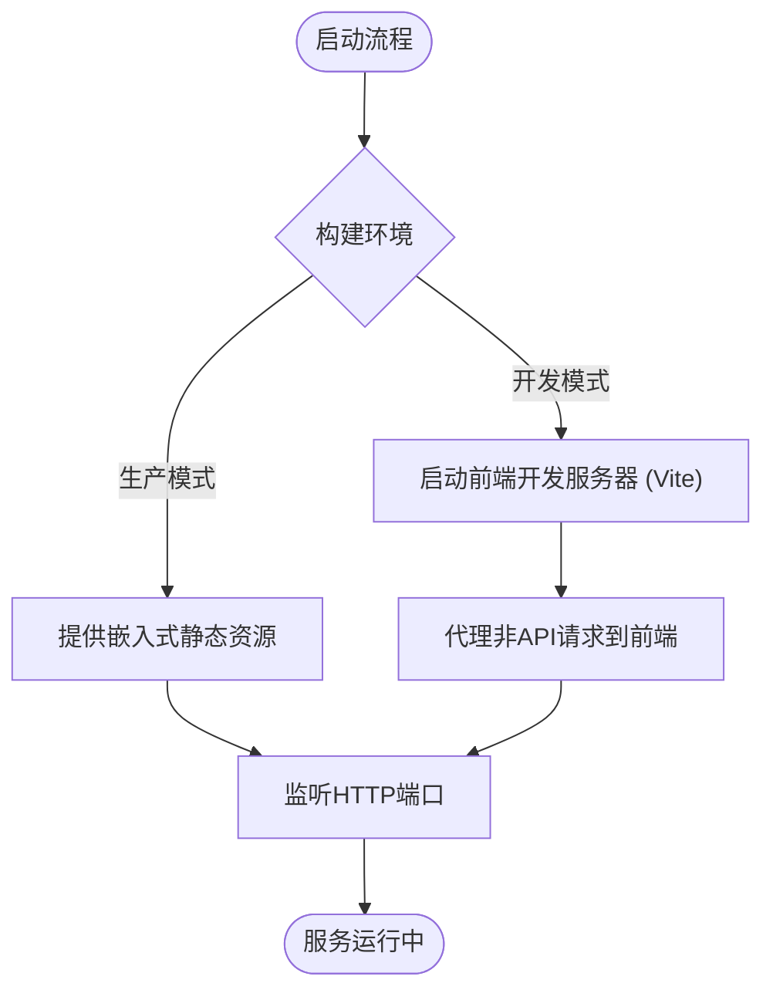
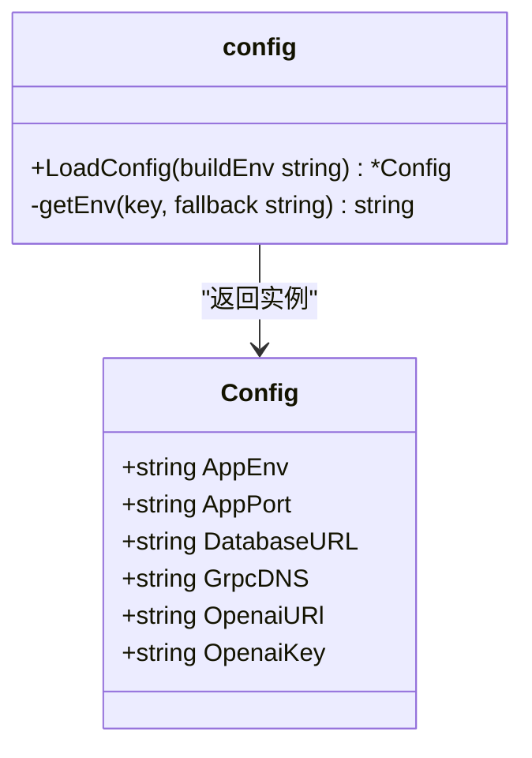
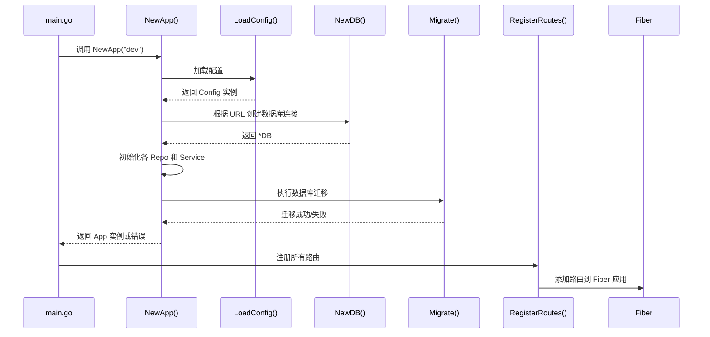

# 应用启动流程

<cite>
**本文档引用的文件**  
- [main.go](file://main.go)
- [boot.go](file://internal/app/tools/boot.go)
- [config.go](file://internal/infra/config/config.go)
- [start_web.go](file://compile/start_web.go)
- [dev.go](file://compile/dev.go)
- [prod.go](file://compile/prod.go)
</cite>

## 目录
1. [项目启动入口](#项目启动入口)
2. [编译环境启动逻辑](#编译环境启动逻辑)
3. [配置加载与类型安全访问](#配置加载与类型安全访问)
4. [应用初始化流程](#应用初始化流程)
5. [开发与生产环境差异化配置](#开发与生产环境差异化配置)
6. [常见启动失败场景及排查方法](#常见启动失败场景及排查方法)

## 项目启动入口

项目从 `main.go` 文件的 `main()` 函数开始执行。该函数负责获取当前工作目录，并为后续的 Web 服务初始化做准备。尽管部分代码被注释，但其结构清晰地表明了应用将通过 `tools.NewApp()` 创建应用实例，并注册路由后启动 Fiber 框架监听端口。

**Section sources**  
- [main.go](file://main.go#L8-L26)

## 编译环境启动逻辑

`compile` 包中的 `start_web.go`、`dev.go` 和 `prod.go` 文件分别定义了不同构建环境下的启动行为。`StartWebDevServer()` 函数用于在开发模式下启动前端 Vite 服务器，并通过正则匹配提取本地服务地址。该地址随后被用于反向代理非 API 请求，实现前后端分离开发。

在开发模式中，`SetupDev()` 函数设置了一个中间件，将所有非 `/api/` 路径的请求代理至前端开发服务器（如 `http://localhost:5173`），从而支持热重载和实时调试。

在生产模式中，`SetupProd()` 使用 Go 的 `embed.FS` 将前端构建产物（位于 `web/database_api/dist`）嵌入二进制文件，并通过 `filesystem.New` 提供静态资源服务，确保部署时无需额外提供前端文件。

**Diagram sources**  
- [start_web.go](file://compile/start_web.go#L16-L69)
- [dev.go](file://compile/dev.go#L10-L64)
- [prod.go](file://compile/prod.go#L13-L38)

**Section sources**  
- [start_web.go](file://compile/start_web.go#L1-L75)
- [dev.go](file://compile/dev.go#L1-L64)
- [prod.go](file://compile/prod.go#L1-L38)

## 配置加载与类型安全访问

`config.go` 中定义了 `Config` 结构体，用于以类型安全的方式绑定环境变量和默认值。`LoadConfig(buildEnv)` 函数根据传入的构建环境（`dev` 或其他）决定数据库路径的生成方式：开发环境下使用项目根目录下的 `app.db`，生产环境下优先读取 `DATABASE_URL` 环境变量。

配置项通过 `getEnv(key, fallback)` 函数实现优先级控制：先尝试从操作系统环境变量读取，若不存在则使用默认值。此外，系统尝试加载 `.env` 文件以支持本地开发配置。

日志输出显示已加载的环境和端口信息，便于调试。

**Diagram sources**  
- [config.go](file://internal/infra/config/config.go#L13-L58)

**Section sources**  
- [config.go](file://internal/infra/config/config.go#L1-L58)

## 应用初始化流程

`boot.go` 中的 `NewApp(buildEnv string)` 函数是整个后端服务的核心初始化入口。其执行顺序如下：

1. **创建 App 实例**：初始化包含处理器列表和数据库连接的 `App` 结构体。
2. **加载配置**：调用 `config.LoadConfig(buildEnv)` 获取运行时配置。
3. **判断数据库类型**：通过 `getDBType(databaseURL)` 解析连接字符串前缀，支持 SQLite 和 MySQL。
4. **建立数据库连接**：使用 `database2.NewDB()` 创建数据库实例并赋值给 `app.DB`。
5. **初始化 AI 客户端**：基于 OpenAI 配置创建 `openai` 实例，用于后续 AI 功能调用。
6. **依赖注入各业务模块**：
   - 初始化各 Repository（数据访问层）
   - 创建 Service（业务逻辑层）并注入 Repository
   - 创建 Handler（接口层）并注入 Service
   - 将 Handler 注册到 `app.Handlers` 列表中
7. **执行数据库迁移**：通过 `migrateRepo.Migrate()` 自动同步表结构。

若任一环节出错（如数据库连接失败、迁移失败），函数将返回错误，阻止服务启动。

**Diagram sources**  
- [boot.go](file://internal/app/tools/boot.go#L40-L93)

**Section sources**  
- [boot.go](file://internal/app/tools/boot.go#L1-L93)

## 开发与生产环境差异化配置

| 配置项 | 开发环境 (`dev`) | 生产环境 (`prod`) |
|--------|------------------|--------------------|
| 数据库路径 | 项目根目录 `app.db` | 环境变量 `DATABASE_URL` 或默认路径 |
| 前端服务 | 启动 Vite 开发服务器并代理请求 | 提供嵌入式静态文件 (`dist`) |
| 错误处理 | 显示详细错误堆栈（通过代理日志） | 静默失败并返回友好提示页面 |
| 日志输出 | 输出配置详情（`log.Printf`） | 同左 |
| 构建方式 | 前后端独立运行 | 前端打包嵌入后端二进制 |

通过构建标签和条件逻辑，系统实现了无缝的环境切换，开发者无需修改代码即可在不同场景下运行。

**Section sources**  
- [dev.go](file://compile/dev.go#L1-L64)
- [prod.go](file://compile/prod.go#L1-L38)
- [config.go](file://internal/infra/config/config.go#L27-L33)

## 常见启动失败场景及排查方法

### 1. 数据库连接超时或失败
- **可能原因**：数据库文件路径错误、权限不足、MySQL 服务未启动
- **排查方法**：
  - 检查 `DATABASE_URL` 环境变量或 `.env` 文件配置
  - 确认 `app.db` 是否存在于项目根目录
  - 使用 `sqlite3 app.db .tables` 验证数据库可访问性

### 2. 配置缺失导致默认值异常
- **可能原因**：`.env` 文件未加载、关键环境变量未设置
- **排查方法**：
  - 查看日志中 `[config] Loaded configuration` 输出，确认 `AppEnv`, `DatabaseURL` 正确
  - 手动执行 `go run main.go` 并观察输出

### 3. 前端开发服务器无法启动
- **可能原因**：`web` 目录缺失、`package.json` 不存在、`pnpm` 未安装
- **排查方法**：
  - 确保 `./web` 存在且包含 `package.json`
  - 运行 `pnpm install` 安装依赖
  - 检查终端输出是否有 `web development server started successfully`

### 4. 路由注册失败或接口 404
- **可能原因**：Handler 未正确注册、路由未绑定
- **排查方法**：
  - 检查 `boot.go` 中 `app.AddHandler()` 是否被调用
  - 确认 `routes.go` 是否实现 `RegisterRoutes(*fiber.App)`

### 5. 数据库迁移失败
- **可能原因**：表结构冲突、字段重复、SQL 语法错误
- **排查方法**：
  - 检查 `migrate_repo.go` 中的迁移脚本
  - 手动删除 `app.db` 并重启应用以重新生成

**Section sources**  
- [boot.go](file://internal/app/tools/boot.go#L87-L89)
- [config.go](file://internal/infra/config/config.go#L35-L38)
- [dev.go](file://compile/dev.go#L21-L28)