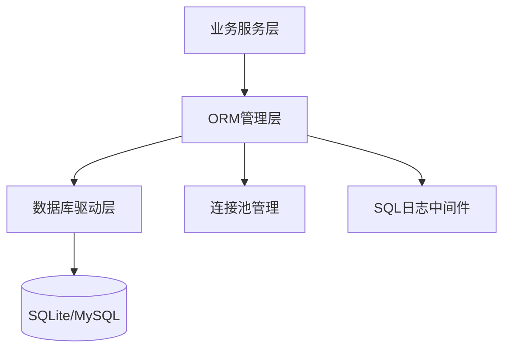
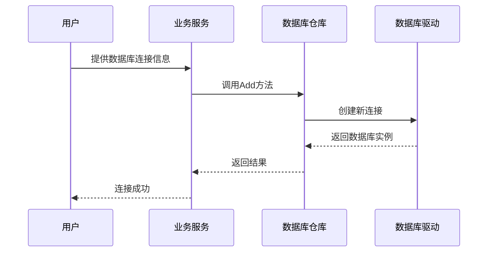
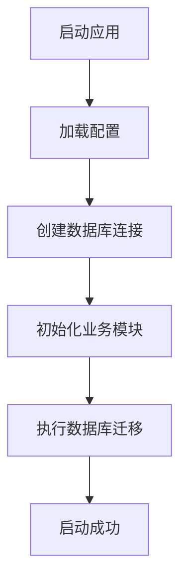

# 数据库连接与ORM管理

<cite>
**Referenced Files in This Document**   
- [db.go](file://internal/infra/database/db.go)
- [migrate_repo.go](file://internal/app/tools/repo/migrate_repo.go)
- [boot.go](file://internal/app/tools/boot.go)
- [db_account.go](file://internal/app/tools/models/db_account.go)
- [relationship.go](file://internal/app/tools/models/relationship.go)
</cite>

## 目录
1. [引言](#引言)
2. [数据库连接层架构](#数据库连接层架构)
3. [全局DB实例初始化](#全局db实例初始化)
4. [多数据库支持设计](#多数据库支持设计)
5. [自动迁移机制](#自动迁移机制)
6. [高级用法指导](#高级用法指导)
7. [常见错误处理](#常见错误处理)
8. [总结](#总结)

## 引言
本文档系统阐述了数据库访问层的架构设计，重点解析了全局数据库实例的初始化过程、连接池配置、SQL日志集成、多数据库支持以及自动迁移机制。通过深入分析核心组件的实现原理，为开发者提供全面的数据库管理指导。

## 数据库连接层架构
系统采用分层架构设计，将数据库访问逻辑与业务逻辑分离。核心组件包括数据库驱动层、ORM管理层和业务服务层。通过`DB`结构体封装GORM实例，提供统一的数据库访问接口。

**Diagram sources**
- [db.go](file://internal/infra/database/db.go#L23-L26)
- [boot.go](file://internal/app/tools/boot.go#L18-L20)

**Section sources**
- [db.go](file://internal/infra/database/db.go#L1-L96)
- [boot.go](file://internal/app/tools/boot.go#L1-L93)

## 全局DB实例初始化
全局`DB`实例的初始化过程包含连接池参数配置、SQL日志中间件集成和驱动注册等关键步骤。

### 连接池参数配置
系统通过`NewDB`函数创建数据库实例时，自动配置连接池参数：
- **最大空闲连接数**：10个
- **最大打开连接数**：100个
- **连接最大生命周期**：1小时

这些参数确保了数据库连接的高效利用和资源管理。

### SQL日志中间件集成
系统集成了GORM的日志中间件，配置如下：
- **慢SQL阈值**：1秒
- **日志级别**：Info
- **忽略记录未找到错误**：启用
- **彩色打印**：禁用

日志输出到标准输出，便于开发和调试。

### 驱动注册机制
系统支持SQLite和MySQL两种数据库驱动，通过`DBType`枚举类型进行区分。在`NewDB`函数中根据数据库类型选择相应的驱动进行连接。

**Section sources**
- [db.go](file://internal/infra/database/db.go#L29-L75)

## 多数据库支持设计
系统设计支持多数据库，包括默认的SQLite和可选的MySQL。

### 设计思路
通过`DBType`枚举类型和工厂模式实现多数据库支持。`NewDB`函数根据传入的数据库类型参数，选择相应的驱动进行数据库连接。

### 动态数据库连接
系统支持动态连接用户指定的目标数据库。通过`ManageDatabaseRepo`的`Add`方法，可以根据数据库账号信息动态创建新的数据库连接。

**Diagram sources**
- [db.go](file://internal/infra/database/db.go#L45-L58)
- [manage_database_repo.go](file://internal/app/tools/repo/manage_database_repo.go#L30-L38)

**Section sources**
- [db.go](file://internal/infra/database/db.go#L15-L21)
- [manage_database_repo.go](file://internal/app/tools/repo/manage_database_repo.go#L30-L45)

## 自动迁移机制
系统通过`migrate_repo.go`实现启动时自动迁移，支持`db_account`和`relationship`等模型的表结构同步。

### 实现原理
`MigrateRepo`结构体包含`Migrate`方法，该方法调用`AutoMigrate`函数对指定的模型进行表结构迁移。在应用启动时，通过`boot.go`中的`NewApp`函数调用`Migrate`方法执行迁移。

### 启动流程
1. 加载配置
2. 创建数据库连接
3. 初始化各业务模块
4. 执行数据库迁移
5. 启动应用

**Diagram sources**
- [migrate_repo.go](file://internal/app/tools/repo/migrate_repo.go#L20-L26)
- [boot.go](file://internal/app/tools/boot.go#L85-L88)

**Section sources**
- [migrate_repo.go](file://internal/app/tools/repo/migrate_repo.go#L1-L28)
- [boot.go](file://internal/app/tools/boot.go#L85-L88)

## 高级用法指导
### 连接泄漏检测
定期检查连接池状态，监控空闲连接和打开连接的数量变化。通过设置合理的连接最大生命周期，避免长时间空闲连接占用资源。

### 查询性能优化
- 使用索引优化查询性能
- 避免N+1查询问题
- 合理使用预加载
- 对复杂查询进行性能分析

### 事务管理
使用GORM的事务功能确保数据一致性。对于需要保证原子性的操作，使用事务进行包裹。

**Section sources**
- [db.go](file://internal/infra/database/db.go#L78-L84)
- [db.go](file://internal/infra/database/db.go#L87-L89)

## 常见错误处理
### 连接超时
- 检查网络连接
- 验证数据库服务是否正常运行
- 调整连接超时参数

### 死锁
- 优化事务逻辑，减少事务持有时间
- 按照固定顺序访问资源
- 使用适当的隔离级别

### 其他常见问题
- **驱动不支持**：确保安装了正确的数据库驱动
- **权限不足**：检查数据库用户权限配置
- **表结构冲突**：在生产环境中谨慎使用自动迁移

**Section sources**
- [db.go](file://internal/infra/database/db.go#L60-L63)
- [boot.go](file://internal/app/tools/boot.go#L51-L53)

## 总结
本文档详细阐述了数据库访问层的架构设计和实现细节。通过合理的连接池配置、多数据库支持和自动迁移机制，系统实现了高效、可靠的数据库管理。开发者应遵循最佳实践，合理使用高级功能，确保系统的稳定性和性能。