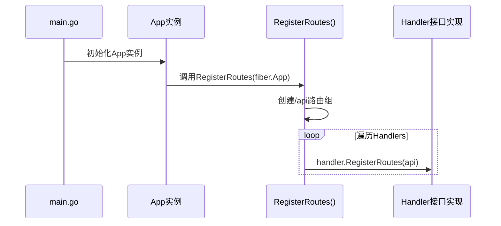
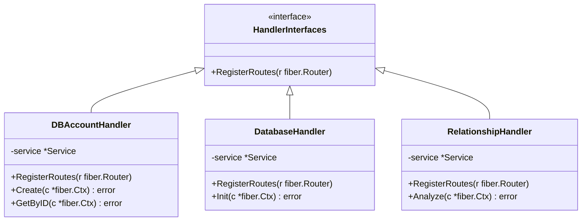

# 路由注册与分发机制

<cite>
**本文档引用文件**  
- [routes.go](file://internal/app/tools/routes.go)
- [handler_interfaces.go](file://internal/shared/handler_interfaces.go)
- [dbaccount/handler.go](file://internal/app/tools/business/dbaccount/handler.go)
- [database/handler.go](file://internal/app/tools/business/database/handler.go)
- [relationship/handler.go](file://internal/app/tools/business/relationship/handler.go)
- [main.go](file://bin/main/main.go)
</cite>

## 目录
1. [引言](#引言)
2. [路由注册核心设计](#路由注册核心设计)
3. [依赖注入与接口规范](#依赖注入与接口规范)
4. [模块化路由注册机制](#模块化路由注册机制)
5. [RESTful路由分组与中间件应用](#restful路由分组与中间件应用)
6. [请求处理最佳实践](#请求处理最佳实践)
7. [自定义中间件开发指南](#自定义中间件开发指南)
8. [常见问题与解决方案](#常见问题与解决方案)
9. [总结](#总结)

## 引言
本项目基于GoFiber框架构建了模块化、可扩展的RESTful API服务。路由系统采用依赖注入与接口抽象相结合的设计模式，实现了业务模块间的解耦与统一注册机制。通过`RegisterRoutes()`函数聚合所有Handler实例，结合统一的`HandlerInterfaces`接口规范，确保各业务模块（如数据库账号、数据库管理、关系分析等）能够以一致的方式注册其API端点。

## 路由注册核心设计



**图示来源**  
- [routes.go](file://internal/app/tools/routes.go#L5-L10)
- [main.go](file://bin/main/main.go#L19)

**本节来源**  
- [routes.go](file://internal/app/tools/routes.go#L5-L10)
- [main.go](file://bin/main/main.go#L19)

## 依赖注入与接口规范

系统通过`HandlerInterfaces`接口定义统一的路由注册契约，所有业务Handler必须实现`RegisterRoutes(r fiber.Router)`方法。该接口位于`internal/shared/handler_interfaces.go`，是实现模块解耦的关键抽象层。



**图示来源**  
- [handler_interfaces.go](file://internal/shared/handler_interfaces.go#L5-L7)
- [dbaccount/handler.go](file://internal/app/tools/business/dbaccount/handler.go#L11-L14)
- [database/handler.go](file://internal/app/tools/business/database/handler.go#L9-L11)
- [relationship/handler.go](file://internal/app/tools/business/relationship/handler.go#L14-L16)

**本节来源**  
- [handler_interfaces.go](file://internal/shared/handler_interfaces.go#L5-L7)

## 模块化路由注册机制

各业务模块通过实现`RegisterRoutes`方法，在指定路由组下注册自身API端点。这种设计允许每个模块独立管理其路由逻辑，同时由主应用统一聚合。

### 数据库账号模块注册
```go
func (h *Handler) RegisterRoutes(app fiber.Router) {
    route := app.Group("/db-account")
    route.Post("/", h.Create)
    route.Get("/:id", h.GetByID)
    // ...
}
```

### 数据库管理模块注册
```go
func (h *Handler) RegisterRoutes(r fiber.Router) {
    route := r.Group("/database")
    route.Get("/init/:id", h.Init)
}
```

### 关系分析模块注册
```go
func (h *Handler) RegisterRoutes(app fiber.Router) {
    route := app.Group("/relationship")
    route.Post("/", h.Create)
    route.Get("/:id/analyze", h.Analyze)
    // ...
}
```

**本节来源**  
- [dbaccount/handler.go](file://internal/app/tools/business/dbaccount/handler.go#L24-L32)
- [database/handler.go](file://internal/app/tools/business/database/handler.go#L16-L19)
- [relationship/handler.go](file://internal/app/tools/business/relationship/handler.go#L26-L36)

## RESTful路由分组与中间件应用

系统采用`/api`作为API根路径，并在此基础上进行模块化分组：
- `/api/db-account`：数据库账号管理
- `/api/database`：数据库实例管理
- `/api/relationship`：表关系分析

虽然当前代码未显式展示中间件注册，但GoFiber支持在路由组上应用中间件，例如：

```go
api := app.Group("/api")
api.Use(logger.New())      // 请求日志
api.Use(recover.New())     // 错误捕获
```

此类中间件可统一应用于所有API路由，确保日志记录、异常处理的一致性。

**本节来源**  
- [routes.go](file://internal/app/tools/routes.go#L6)
- [dbaccount/handler.go](file://internal/app/tools/business/dbaccount/handler.go#L25)
- [database/handler.go](file://internal/app/tools/business/database/handler.go#L17)
- [relationship/handler.go](file://internal/app/tools/business/relationship/handler.go#L27)

## 请求处理最佳实践

### 请求参数绑定与验证
Handler通过`c.BodyParser()`解析JSON请求体，并结合业务逻辑进行验证：

```go
var account DBAccountReq
if err := c.BodyParser(&account); err != nil {
    return api2.Error(c, 400, "请求参数解析失败")
}
```

路径参数使用`c.Params()`获取并进行类型转换：

```go
id, err := strconv.ParseUint(c.Params("id"), 10, 32)
if err != nil {
    return api2.Error(c, 400, "无效的ID参数")
}
```

### 上下文传递与响应封装
通过依赖注入将Service实例传递给Handler，确保业务逻辑与HTTP处理分离。响应统一使用`api.Success()`和`api.Error()`进行封装，保证返回格式一致性。

**本节来源**  
- [dbaccount/handler.go](file://internal/app/tools/business/dbaccount/handler.go#L46-L48)
- [relationship/handler.go](file://internal/app/tools/business/relationship/handler.go#L74-L76)
- [dbaccount/handler.go](file://internal/app/tools/business/dbaccount/handler.go#L55)
- [relationship/handler.go](file://internal/app/tools/business/relationship/handler.go#L58)

## 自定义中间件开发指南

要开发自定义中间件，需定义一个返回`fiber.Handler`类型的函数：

```go
func CustomMiddleware() fiber.Handler {
    return func(c *fiber.Ctx) error {
        // 前置逻辑
        c.Set("X-Custom-Header", "value")
        
        // 调用下一个处理器
        err := c.Next()
        
        // 后置逻辑
        // log request
        return err
    }
}
```

在应用启动时注册：
```go
app.Use(CustomMiddleware())
```

或在特定路由组上应用：
```go
api := app.Group("/api")
api.Use(CustomMiddleware())
```

**本节来源**  
- 通用GoFiber中间件模式

## 常见问题与解决方案

### 路由冲突
当多个模块注册相同路径时会发生冲突。解决方案：
- 使用唯一前缀（如`/db-account`、`/relationship`）
- 在注册前检查路径是否存在
- 使用命名空间隔离

### 路径覆盖
后注册的路由会覆盖先注册的同名路由。预防措施：
- 统一规划API路径命名规范
- 使用代码审查确保路径唯一性
- 添加单元测试验证路由映射

### 参数解析错误
建议统一处理`BodyParser`错误，并返回标准化的400响应：
```go
if err := c.BodyParser(&data); err != nil {
    return api.Error(c, 400, "请求参数格式错误")
}
```

**本节来源**  
- [dbaccount/handler.go](file://internal/app/tools/business/dbaccount/handler.go#L47-L48)
- [relationship/handler.go](file://internal/app/tools/business/relationship/handler.go#L51-L52)

## 总结
本系统的路由注册机制通过接口抽象与依赖注入实现了高度模块化和可维护性。`RegisterRoutes()`函数作为统一入口，聚合所有业务模块的API定义；`HandlerInterfaces`接口确保各模块遵循相同契约；RESTful分组设计提升了API的可读性和可管理性。该架构支持轻松扩展新业务模块，同时保持整体结构的一致性和稳定性。