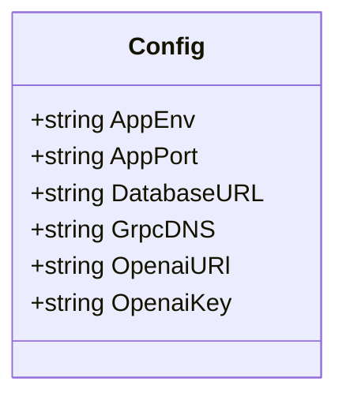
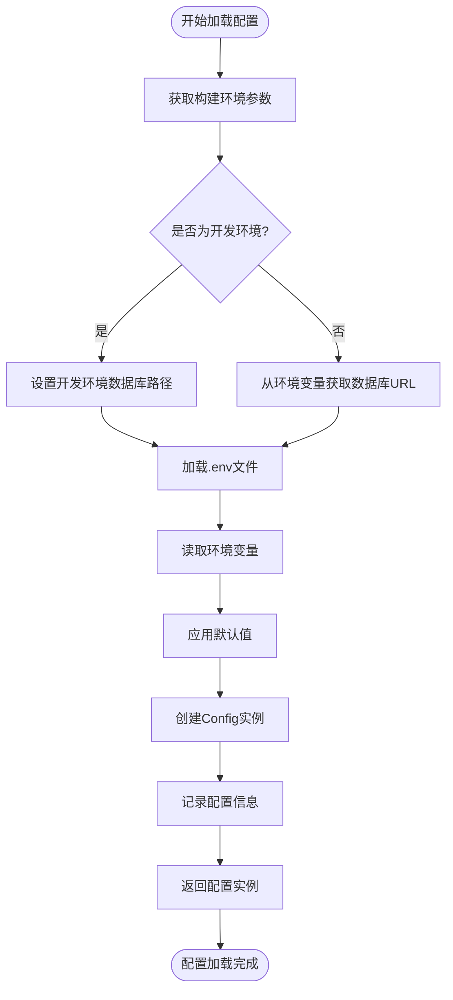
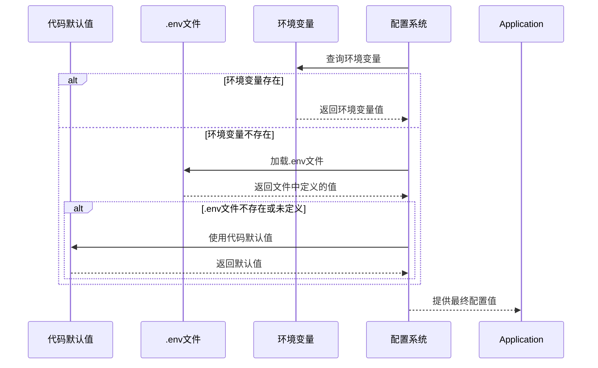
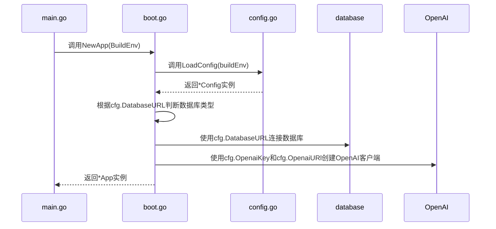

# 配置管理机制

<cite>
**Referenced Files in This Document**   
- [config.go](file://internal/infra/config/config.go)
- [boot.go](file://internal/app/tools/boot.go)
- [environment_type.go](file://internal/shared/environment_type.go)
- [build_dev.go](file://bin/main/build_dev.go)
- [build_prod.go](file://bin/main/build_prod.go)
- [main.go](file://bin/main/main.go)
- [projectpath.go](file://internal/utils/projectpath.go)
</cite>

## 目录
1. [配置系统概述](#配置系统概述)
2. [核心配置结构](#核心配置结构)
3. [配置加载流程](#配置加载流程)
4. [环境变量与配置优先级](#环境变量与配置优先级)
5. [配置项详解](#配置项详解)
6. [应用生命周期中的配置使用](#应用生命周期中的配置使用)
7. [配置错误处理与调试](#配置错误处理与调试)
8. [最佳实践与安全建议](#最佳实践与安全建议)

## 配置系统概述

本系统采用类型安全的配置管理机制，通过`Config`结构体集中管理所有应用配置。配置系统支持多环境部署，通过构建环境参数区分开发、测试和生产环境。系统利用Viper库的替代方案（`joho/godotenv`）实现`.env`文件加载和环境变量覆盖功能，确保配置的灵活性和安全性。

**Section sources**
- [config.go](file://internal/infra/config/config.go#L1-L58)
- [environment_type.go](file://internal/shared/environment_type.go#L1-L4)

## 核心配置结构

配置系统以`Config`结构体为核心，采用Go语言的结构体类型安全特性组织配置项。该结构体定义了应用所需的所有配置字段，包括环境类型、服务器端口、数据库连接字符串、gRPC DNS地址以及OpenAI API相关配置。

**Diagram sources**
- [config.go](file://internal/infra/config/config.go#L13-L20)

**Section sources**
- [config.go](file://internal/infra/config/config.go#L13-L20)

## 配置加载流程

配置加载通过`LoadConfig`函数实现，该函数接收构建环境参数并返回配置实例。加载流程包括：确定项目根路径、根据环境设置数据库URL、加载`.env`文件、读取环境变量并应用默认值。

**Diagram sources**
- [config.go](file://internal/infra/config/config.go#L22-L49)
- [projectpath.go](file://internal/utils/projectpath.go#L1-L10)

**Section sources**
- [config.go](file://internal/infra/config/config.go#L22-L49)

## 环境变量与配置优先级

系统通过`getEnv`辅助函数实现环境变量覆盖机制，遵循"环境变量 > .env文件 > 默认值"的优先级顺序。当环境变量存在时，优先使用环境变量值；否则使用`.env`文件中的值；若两者都不存在，则使用代码中定义的默认值。

`EnvironmentType`枚举（在代码中体现为`Environment`类型别名）用于区分不同部署环境。系统通过构建标签（build tag）在编译时确定环境类型，`build_dev.go`和`build_prod.go`文件分别定义了开发和生产环境的构建参数。

**Diagram sources**
- [config.go](file://internal/infra/config/config.go#L52-L57)
- [build_dev.go](file://bin/main/build_dev.go#L11)
- [build_prod.go](file://bin/main/build_prod.go#L15)

**Section sources**
- [config.go](file://internal/infra/config/config.go#L52-L57)
- [build_dev.go](file://bin/main/build_dev.go#L11)
- [build_prod.go](file://bin/main/build_prod.go#L15)

## 配置项详解

系统定义了以下核心配置项：

| 配置项 | 环境变量 | 默认值 | 作用域 | 说明 |
|--------|----------|--------|--------|------|
| AppEnv | APP_ENV | 构建环境 | 全局 | 应用运行环境 (dev/prod) |
| AppPort | APP_PORT | 8080 | 服务器 | HTTP服务器监听端口 |
| DatabaseURL | DATABASE_URL | file:app.db?_foreign_keys=on | 数据库 | 数据库连接DSN |
| GrpcDNS | GRPC_DNS | file:app.db?_foreign_keys=on | gRPC | gRPC服务DNS配置 |
| OpenaiURl | OPENAI_URL | https://dashscope.aliyuncs.com | AI服务 | OpenAI兼容API地址 |
| OpenaiKey | OPENAI_KEY | sk-523cb71b9cbe475ab7e7f27cdab6d379 | AI服务 | OpenAI API密钥 |

**Section sources**
- [config.go](file://internal/infra/config/config.go#L39-L45)

## 应用生命周期中的配置使用

配置实例在整个应用生命周期中以单例模式使用。`boot.go`中的`NewApp`函数在应用初始化时调用`LoadConfig`获取配置实例，并将配置值传递给各个服务组件。配置一旦加载，在应用运行期间保持不变，不支持热加载。

**Diagram sources**
- [boot.go](file://internal/app/tools/boot.go#L40-L91)
- [config.go](file://internal/infra/config/config.go#L22-L49)

**Section sources**
- [boot.go](file://internal/app/tools/boot.go#L40-L91)

## 配置错误处理与调试

当配置加载失败或关键配置项缺失时，系统会通过日志记录详细的错误信息。常见的启动失败原因包括：数据库连接失败、环境变量格式错误、.env文件权限问题等。调试策略包括检查环境变量设置、验证数据库URL格式、确认文件权限等。

**Section sources**
- [config.go](file://internal/infra/config/config.go#L35-L38)
- [boot.go](file://internal/app/tools/boot.go#L51-L53)

## 最佳实践与安全建议

1. **敏感信息保护**：避免在代码中硬编码敏感信息，使用环境变量管理API密钥等机密数据
2. **配置验证**：在应用启动时验证关键配置项的有效性
3. **环境隔离**：为不同环境使用独立的配置和数据库实例
4. **默认值设计**：为非关键配置提供合理的默认值，提高部署灵活性
5. **文档化**：维护完整的配置文档，包括所有配置项的说明和示例

对于敏感信息加密存储，建议使用专门的密钥管理服务（如Hashicorp Vault）或云服务商提供的密钥管理方案，而不是在应用层实现加密。

**Section sources**
- [config.go](file://internal/infra/config/config.go#L45)
- [boot.go](file://internal/app/tools/boot.go#L54)