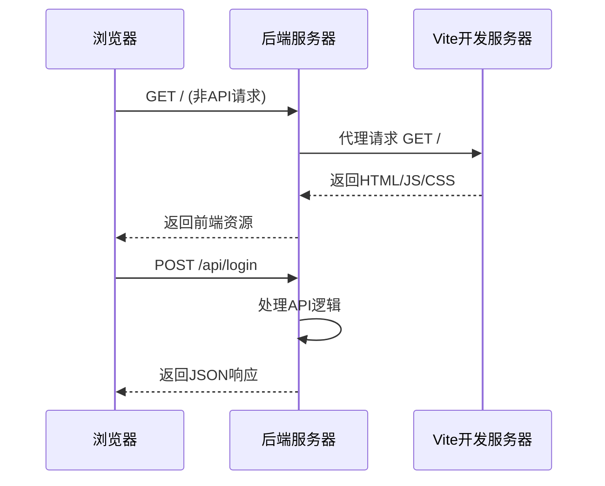
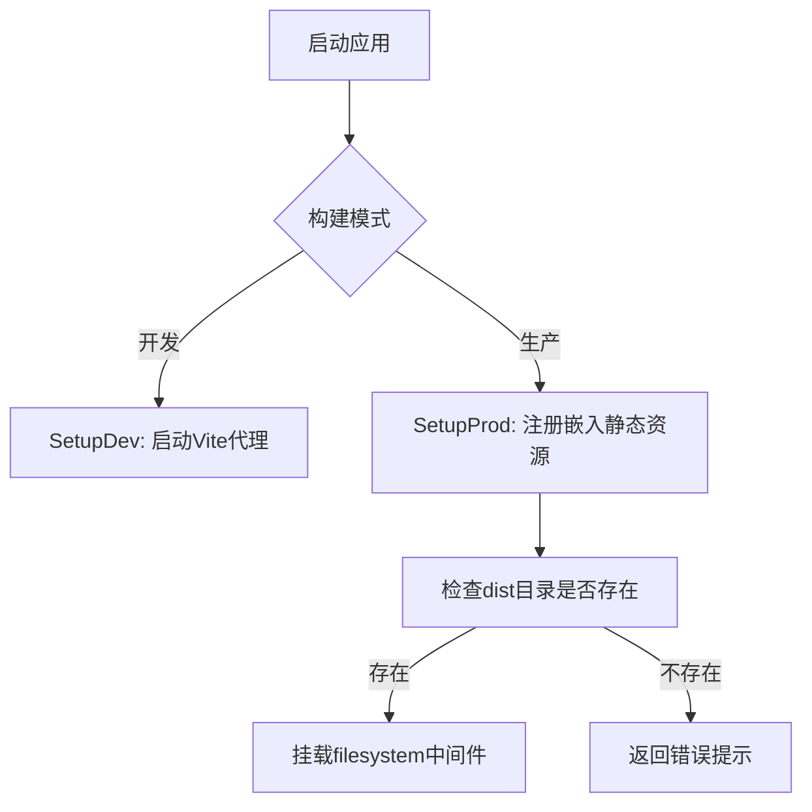

# 前端集成机制

<cite>
**本文档引用文件**  
- [start_web.go](file://compile/start_web.go)
- [dev.go](file://compile/dev.go)
- [prod.go](file://compile/prod.go)
- [boot.go](file://internal/app/tools/boot.go)
- [vite.config.ts](file://web/database/vite.config.ts)
- [justfile](file://justfile)
- [main.go](file://bin/main/main.go)
- [build_dev.go](file://bin/main/build_dev.go)
- [build_prod.go](file://bin/main/build_prod.go)
</cite>

## 目录
1. [简介](#简介)
2. [开发模式下的前后端通信机制](#开发模式下的前后端通信机制)
3. [生产环境下的静态资源服务](#生产环境下的静态资源服务)
4. [构建配置与集成策略](#构建配置与集成策略)
5. [常见问题排查指南](#常见问题排查指南)
6. [性能优化建议](#性能优化建议)
7. [总结](#总结)

## 简介
本项目采用前后端分离架构，前端基于 Vite + Vue 构建，后端使用 Go Fiber 框架提供 API 服务。系统通过条件编译和构建脚本实现开发与生产环境的无缝切换：开发模式下后端代理前端请求至 Vite 开发服务器；生产模式下前端构建产物被嵌入二进制文件并通过 Fiber 静态文件服务提供。

**Section sources**
- [main.go](file://bin/main/main.go#L1-L25)
- [boot.go](file://internal/app/tools/boot.go#L39-L91)

## 开发模式下的前后端通信机制

在开发模式下，后端通过 `compile/dev.go` 中的 `SetupDev` 函数启动并代理前端请求。其核心流程如下：

1. 调用 `StartWebDevServer()` 启动 Vite 开发服务器（执行 `pnpm run dev`）。
2. 使用中间件拦截所有非 `/api/` 开头的请求。
3. 将这些请求代理至本地运行的 Vite 服务（如 `http://localhost:5173`）。
4. 复制请求头、转发请求，并将响应结果返回给客户端。

该机制实现了前后端独立开发，前端热重载功能不受后端影响。



**Diagram sources**
- [dev.go](file://compile/dev.go#L9-L62)
- [start_web.go](file://compile/start_web.go#L15-L69)

**Section sources**
- [dev.go](file://compile/dev.go#L9-L62)
- [start_web.go](file://compile/start_web.go#L15-L69)

## 生产环境下的静态资源服务

生产环境下，前端资源通过 `embed.FS` 嵌入后端二进制文件中，由 Fiber 框架通过 `Static` 方法提供服务。

### 静态文件路由注册逻辑

`boot.go` 文件中的 `NewApp` 函数负责初始化应用组件，但静态资源服务的注册由 `compile/prod.go` 中的 `SetupProd` 函数完成：

1. 检查嵌入文件系统中是否存在 `web/database_api/dist` 目录。
2. 若存在，则创建子文件系统 `subFS` 并挂载为根路径 `/` 的静态资源服务。
3. 使用 `filesystem` 中间件提供目录浏览功能（`Browse: true`）。
4. 若资源缺失，则返回提示页面。



**Diagram sources**
- [prod.go](file://compile/prod.go#L12-L36)
- [boot.go](file://internal/app/tools/boot.go#L39-L91)

**Section sources**
- [prod.go](file://compile/prod.go#L12-L36)
- [boot.go](file://internal/app/tools/boot.go#L39-L91)

## 构建配置与集成策略

### vite.config.ts 构建输出配置

前端构建输出路径由 `vite.config.ts` 中的 `build.outDir` 决定。当前配置未显式指定 `outDir`，因此默认输出至 `dist` 目录。但后端期望路径为 `web/database_api/dist`，需确保构建脚本或部署流程中完成路径映射。

此外，`vite.config.ts` 配置了开发服务器代理：
- 所有 `/api` 请求被代理至 `http://127.0.0.1:8080`（后端服务）
- HMR 端口固定为 `5173`

此配置确保开发时 API 请求正确转发至后端处理。

### Justfile 构建任务分析

`justfile` 定义了前后端的构建流程：

| 任务 | 描述 |
|------|------|
| `dev` | 以开发模式运行后端（`MODE=dev go run main.go`） |
| `build-web` | 进入 `web` 目录安装依赖并构建前端 |
| `build` | 先执行 `build-web`，再构建后端二进制 |
| `build_exe` | 构建 Windows 可执行文件 |
| `clean` | 清理构建产物 |

通过 `build` 任务实现前后端集成构建，确保前端资源在编译时被正确嵌入。


**Diagram sources**
- [vite.config.ts](file://web/database/vite.config.ts#L1-L27)
- [justfile](file://justfile#L1-L33)

**Section sources**
- [vite.config.ts](file://web/database/vite.config.ts#L1-L27)
- [justfile](file://justfile#L1-L33)

## 常见问题排查指南

### 路径错误与资源404
- **现象**：页面空白或资源加载失败（404）
- **原因**：
  - 前端构建目录与后端预期路径不一致（应为 `web/database_api/dist`）
  - `embed` 未正确包含 `dist` 目录
- **解决方案**：
  1. 确认 `vite.config.ts` 构建输出路径或调整后端读取路径。
  2. 检查 `go:embed` 指令是否覆盖正确路径。
  3. 构建前执行 `just clean` 清理旧文件。

### CORS 配置问题
- **现象**：浏览器报跨域错误
- **原因**：开发模式下未启用 CORS 中间件
- **解决方案**：
  - 在 `main.go` 中启用 `cors` 中间件（当前被注释）：
    ```go
    app.Use(cors.New())
    ```

### 开发服务器启动失败
- **现象**：`StartWebDevServer` 无法获取 Vite 服务地址
- **原因**：
  - `web` 目录或 `package.json` 缺失
  - Vite 启动日志未输出标准格式的地址
- **解决方案**：
  1. 确保 `web` 目录存在且包含 `package.json`
  2. 检查 `pnpm run dev` 是否正常启动
  3. 调整正则匹配逻辑以适应不同日志格式

**Section sources**
- [start_web.go](file://compile/start_web.go#L15-L69)
- [main.go](file://bin/main/main.go#L1-L25)
- [dev.go](file://compile/dev.go#L9-L62)

## 性能优化建议

### 静态资源压缩
- 启用 Gzip/Brotli 压缩中间件以减小传输体积：
  ```go
  app.Use(compress.New(compress.Config{
      Level: compress.LevelBestSpeed,
  }))
  ```

### 缓存策略
- 为静态资源设置长期缓存（如 `Cache-Control: public, max-age=31536000`）
- 利用文件哈希实现缓存失效（Vite 默认支持）

### 构建优化
- 使用 `vite build --minify` 进一步压缩前端资源
- 分离公共依赖，提升加载速度
- 启用代码分割（code splitting），按需加载

### 嵌入资源优化
- 仅嵌入 `dist` 目录，避免包含源码或开发文件
- 考虑使用外部静态文件服务（如 CDN）减轻二进制体积

**Section sources**
- [prod.go](file://compile/prod.go#L12-L36)
- [vite.config.ts](file://web/database/vite.config.ts#L1-L27)

## 总结
本项目通过 `compile` 包中的条件编译机制实现了前后端在开发与生产环境下的高效集成。开发模式下利用反向代理实现热重载，生产模式下通过嵌入式文件系统提供静态资源服务。结合 `justfile` 构建脚本，实现了自动化的一体化构建流程。建议进一步完善路径配置、启用 CORS 和压缩中间件，以提升开发体验与运行性能。

**Section sources**
- [dev.go](file://compile/dev.go#L9-L62)
- [prod.go](file://compile/prod.go#L12-L36)
- [justfile](file://justfile#L1-L33)