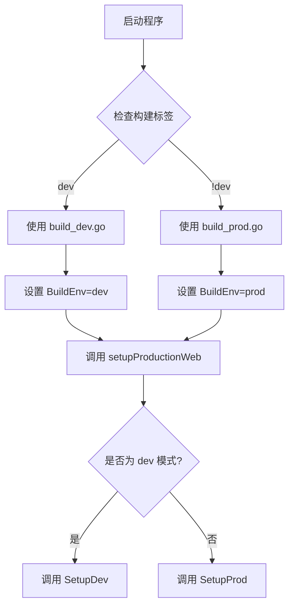
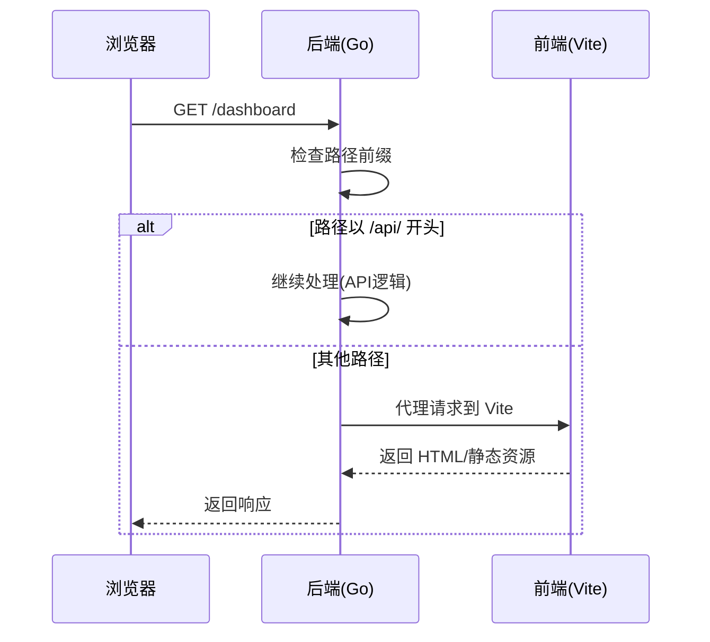
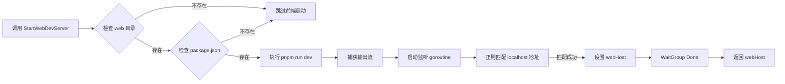
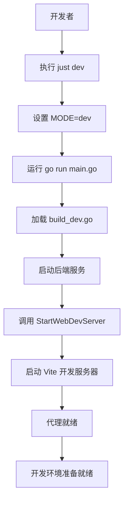

# 开发模式启动

<cite>
**本文档中引用的文件**  
- [build_dev.go](file://build_dev.go)
- [compile/dev.go](file://compile/dev.go)
- [compile/start_web.go](file://compile/start_web.go)
- [justfile](file://justfile)
</cite>

## 目录
1. [简介](#简介)
2. [开发构建入口](#开发构建入口)
3. [开发专用逻辑解析](#开发专用逻辑解析)
4. [前端开发服务器启动流程](#前端开发服务器启动流程)
5. [前后端分离架构优势](#前后端分离架构优势)
6. [本地开发环境启动步骤](#本地开发环境启动步骤)
7. [Justfile 一键启动机制](#justfile-一键启动机制)
8. [总结](#总结)

## 简介
本文档详细说明了项目在开发模式下的完整启动流程，重点分析通过构建标签 `//go:build dev` 启用的开发专用逻辑，以及 `build_dev.go` 文件作为开发构建入口的作用。同时，深入解析 `StartWebDevServer` 函数如何使用 `os/exec` 调用 `pnpm dev` 命令启动 Vite 开发服务器，并实现后端 Go 进程对前端服务的生命周期管理。此外，还介绍了通过 `just dev` 命令一键启动整个开发环境的内部执行逻辑。

**Section sources**
- [build_dev.go](file://build_dev.go#L1-L18)
- [justfile](file://justfile#L1-L33)

## 开发构建入口

`build_dev.go` 是开发模式下的主要构建入口文件，其作用是标识当前构建环境为开发环境，并引导程序进入开发专用的初始化流程。该文件通过 `//go:build dev` 和 `// +build dev` 构建标签确保仅在开发构建时被编译器包含。

文件中定义了全局变量 `BuildEnv = "dev"`，用于在运行时判断当前环境类型。同时，`setupProductionWeb` 函数在此模式下被重定向为调用 `compile.SetupDev(app)`，从而启用开发环境特有的前端代理机制。



**Diagram sources**
- [build_dev.go](file://build_dev.go#L1-L18)

**Section sources**
- [build_dev.go](file://build_dev.go#L1-L18)

## 开发专用逻辑解析

`compile/dev.go` 文件包含了开发模式下特有的核心逻辑，主要通过 `SetupDev` 函数实现。该函数利用构建标签条件编译，在开发环境中自动激活前端开发服务器的代理功能。

`SetupDev` 的核心职责是启动前端 Vite 开发服务器并设置反向代理规则：当接收到非 API 请求时，将其代理至本地运行的 Vite 服务；而所有以 `/api/` 开头的请求则交由后端 Fiber 框架继续处理，实现前后端请求的智能分流。

此机制使得开发者可以在不重新构建整个应用的情况下实时查看前端变更，极大提升了开发效率。



**Diagram sources**
- [compile/dev.go](file://compile/dev.go#L10-L64)

**Section sources**
- [compile/dev.go](file://compile/dev.go#L10-L64)

## 前端开发服务器启动流程

`compile/start_web.go` 中的 `StartWebDevServer` 函数负责启动 Vite 前端开发服务器。该函数通过 `os/exec` 包执行 `pnpm run dev` 命令，并在 `./web` 目录下运行。

启动流程包括以下关键步骤：
1. 验证 `./web` 目录和 `package.json` 文件是否存在
2. 使用 `exec.Command` 创建子进程并设置工作目录
3. 捕获命令输出（同时输出到控制台和缓冲区）
4. 启动异步 goroutine 监听 Vite 服务启动完成（通过正则匹配 `http://localhost:xxxx`）
5. 使用 `sync.WaitGroup` 等待服务地址被成功捕获后返回主机地址

该函数实现了后端进程对前端开发服务器的完整生命周期管理，确保前端服务在后端启动前已准备就绪。



**Diagram sources**
- [compile/start_web.go](file://compile/start_web.go#L15-L69)

**Section sources**
- [compile/start_web.go](file://compile/start_web.go#L15-L69)

## 前后端分离架构优势

开发模式下采用前后端分离运行的架构设计，具有以下显著优势：

- **热重载（Hot Reload）**：前端代码修改后，Vite 开发服务器能立即编译并刷新浏览器，无需重启后端服务
- **实时调试**：前端可独立使用浏览器开发者工具进行调试，不受后端进程影响
- **独立开发**：前后端团队可并行开发，互不干扰
- **快速反馈**：前端变更几乎即时可见，提升开发体验
- **环境隔离**：开发环境与生产环境行为一致，避免“在我机器上能运行”问题

该架构通过反向代理机制无缝集成前后端，在保持分离开发优势的同时，提供统一的访问入口。

## 本地开发环境启动步骤

要成功启动本地开发环境，请按以下步骤操作：

1. **安装依赖**
   ```bash
   # 安装 Go 依赖
   go mod download

   # 安装前端依赖（在 web 目录下）
   cd web && pnpm install
   ```

2. **配置环境变量**
   确保 `.env` 文件存在并正确配置数据库连接、AI API 密钥等必要参数。

3. **并发启动服务**
   - 方法一：直接运行
     ```bash
     MODE=dev go run main.go
     ```
   - 方法二：使用 Justfile（推荐）
     ```bash
     just dev
     ```

4. **验证服务**
   - 后端 API：访问 `http://localhost:8080/api/health`
   - 前端页面：访问 `http://localhost:8080` 应能正常加载

## Justfile 一键启动机制

`justfile` 提供了简化的命令行接口，其中 `dev` 命令实现了开发环境的一键启动：

```makefile
dev:
	MODE=dev && go run main.go
```

执行 `just dev` 时，该命令会：
1. 设置环境变量 `MODE=dev`
2. 调用 `go run main.go` 启动后端服务
3. 触发 `build_dev.go` 的构建标签逻辑
4. 自动启动 Vite 前端开发服务器
5. 建立反向代理连接

这种设计简化了开发者的操作流程，避免了复杂的命令记忆和环境配置，提升了开发效率。



**Diagram sources**
- [justfile](file://justfile#L11-L13)

**Section sources**
- [justfile](file://justfile#L11-L13)

## 总结

本文档全面解析了项目的开发模式启动机制，涵盖了从构建标签条件编译、前后端分离运行到一键启动的完整流程。通过 `//go:build dev` 标签精准控制开发逻辑的加载，利用 `os/exec` 实现对 Vite 服务的生命周期管理，并通过反向代理实现无缝集成。配合 `justfile` 的自动化命令，开发者可以高效地启动和调试应用，充分发挥现代前端开发工具链的优势。