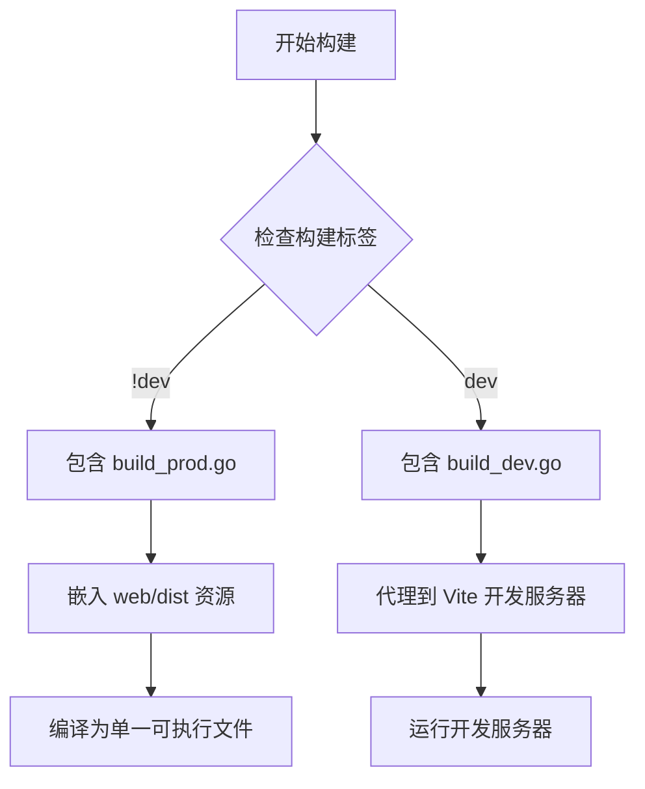
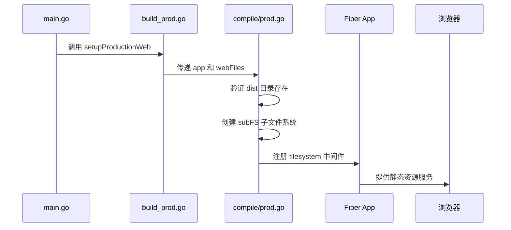
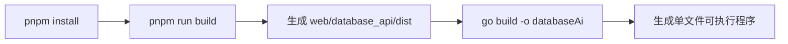
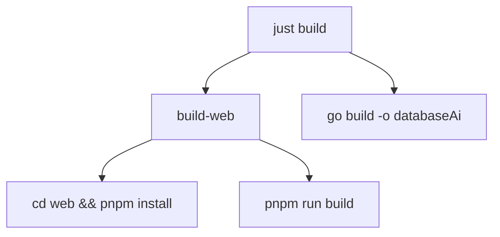

# 生产模式构建

<cite>
**本文档引用的文件**
- [prod.go](file://compile/prod.go)
- [build_prod.go](file://build_prod.go)
- [vite.config.ts](file://web/database_api/vite.config.ts)
- [package.json](file://web/database_api/package.json)
- [justfile](file://justfile)
</cite>

## 目录
1. [生产构建机制概述](#生产构建机制概述)
2. [构建标签与环境控制](#构建标签与环境控制)
3. [前端资源嵌入实现](#前端资源嵌入实现)
4. [CI/CD 构建流程](#cicd-构建流程)
5. [前端构建配置分析](#前端构建配置分析)
6. [标准化构建命令](#标准化构建命令)
7. [自动化构建实践](#自动化构建实践)

## 生产构建机制概述

本项目采用 Go 的构建标签（build tags）和 `embed.FS` 机制，实现前后端一体化的单文件部署方案。在生产模式下，前端通过 Vite 构建生成静态资源，后端使用 `//go:embed` 指令将这些资源嵌入二进制文件中，最终生成一个包含完整前端界面的可执行程序。

该机制确保了部署的简便性与环境一致性，避免了前后端分离部署的复杂性，同时提升了服务的启动速度和资源访问效率。

## 构建标签与环境控制

项目通过 Go 的构建标签精确控制不同环境下的编译行为。`//go:build !dev` 标签确保 `build_prod.go` 文件仅在非开发模式下参与编译，从而激活生产环境特有的资源嵌入逻辑。



**Diagram sources**
- [build_prod.go](file://build_prod.go#L1-L23)
- [compile/dev.go](file://compile/dev.go#L1-L63)

**Section sources**
- [build_prod.go](file://build_prod.go#L1-L23)
- [compile/prod.go](file://compile/prod.go#L1-L38)

## 前端资源嵌入实现

`build_prod.go` 文件中定义了 `webFiles` 变量，使用 `//go:embed web/database_api/dist/*` 指令将前端构建产物嵌入到 Go 二进制文件中。该变量类型为 `embed.FS`，提供对静态文件的只读访问能力。

`compile/prod.go` 中的 `SetupProd` 函数负责初始化生产环境的静态文件服务。它首先验证嵌入文件是否存在，然后使用 `fs.Sub` 创建子文件系统，并通过 `fiber` 框架的 `filesystem` 中间件对外提供服务。



**Diagram sources**
- [build_prod.go](file://build_prod.go#L14-L16)
- [compile/prod.go](file://compile/prod.go#L13-L37)

**Section sources**
- [build_prod.go](file://build_prod.go#L14-L23)
- [compile/prod.go](file://compile/prod.go#L13-L37)

## CI/CD 构建流程

完整的 CI/CD 流程分为两个阶段：前端构建和后端编译。首先执行 `pnpm run build` 生成生产级静态资源，然后执行 `go build` 将这些资源嵌入后端二进制文件。



**Diagram sources**
- [justfile](file://justfile#L15-L20)
- [vite.config.ts](file://web/database_api/vite.config.ts#L6-L27)

## 前端构建配置分析

前端项目位于 `web/database_api` 目录下，使用 Vite 作为构建工具。`vite.config.ts` 配置文件中定义了开发服务器的代理规则，将 `/api` 请求转发至后端服务（`http://127.0.0.1:8080`），实现开发环境下的前后端联调。

`package.json` 中的构建脚本 `build` 指定了输出目录为 `dist`，与后端嵌入路径 `web/database_api/dist/*` 保持一致，确保资源正确嵌入。

**Section sources**
- [vite.config.ts](file://web/database_api/vite.config.ts#L1-L27)
- [package.json](file://web/database_api/package.json)

## 标准化构建命令

生产环境构建应遵循以下标准命令序列：

```bash
# 安装前端依赖
cd web/database_api && pnpm install

# 构建前端资源
pnpm run build

# 编译后端服务（嵌入前端）
go build -o databaseAi .
```

对于 Windows 平台，可使用：

```bash
GOOS=windows GOARCH=amd64 go build -o databaseAi.exe .
```

## 自动化构建实践

项目通过 `justfile` 实现构建流程的自动化。`just build` 命令会自动执行前端构建并编译后端服务，确保流程的一致性和可重复性。



**Diagram sources**
- [justfile](file://justfile#L19-L20)

**Section sources**
- [justfile](file://justfile#L15-L20)