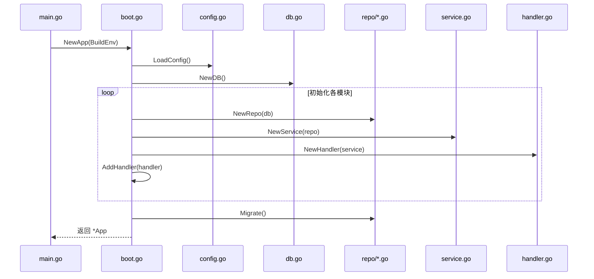
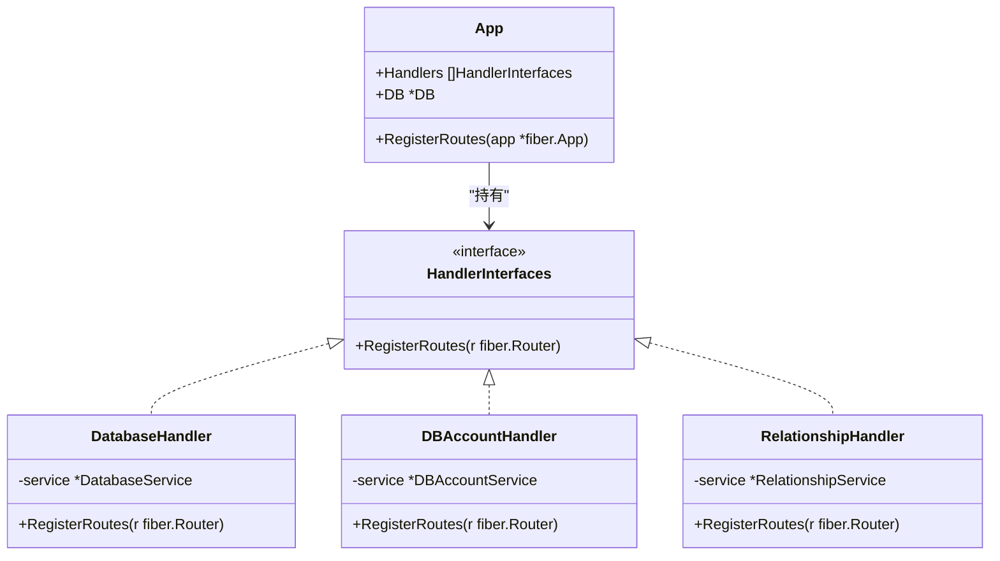
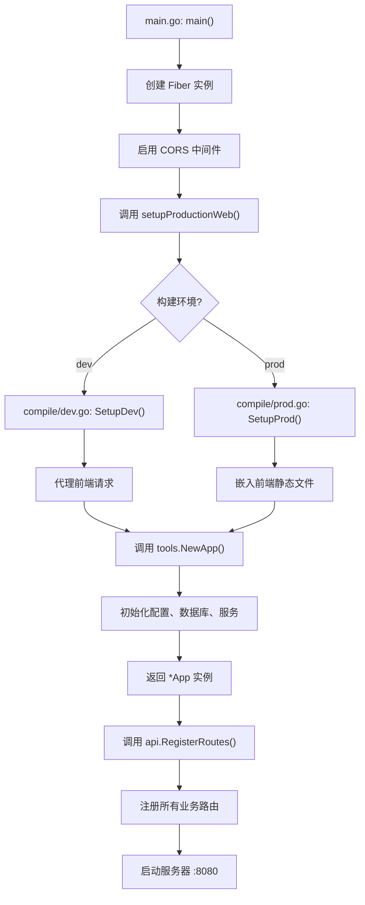
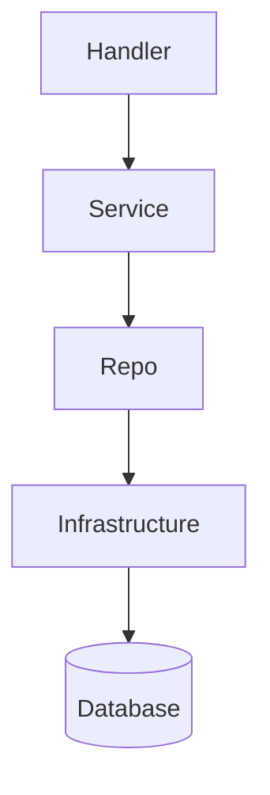

# 目录结构说明

<cite>
**本文档中引用的文件**  
- [main.go](file://main.go)
- [build_dev.go](file://build_dev.go)
- [build_prod.go](file://build_prod.go)
- [compile/dev.go](file://compile/dev.go)
- [compile/prod.go](file://compile/prod.go)
- [compile/start_web.go](file://compile/start_web.go)
- [internal/app/tools/boot.go](file://internal/app/tools/boot.go)
- [internal/app/tools/routes.go](file://internal/app/tools/routes.go)
- [internal/app/tools/business/database/handler.go](file://internal/app/tools/business/database/handler.go)
- [internal/app/tools/business/database/service.go](file://internal/app/tools/business/database/service.go)
- [internal/app/tools/business/dbaccount/handler.go](file://internal/app/tools/business/dbaccount/handler.go)
- [internal/app/tools/business/dbaccount/service.go](file://internal/app/tools/business/dbaccount/service.go)
- [internal/app/tools/business/relationship/handler.go](file://internal/app/tools/business/relationship/handler.go)
- [internal/app/tools/business/relationship/service.go](file://internal/app/tools/business/relationship/service.go)
- [internal/app/tools/repo/database_repo.go](file://internal/app/tools/repo/database_repo.go)
- [internal/app/tools/repo/manage_database_repo.go](file://internal/app/tools/repo/manage_database_repo.go)
- [internal/infra/database/db.go](file://internal/infra/database/db.go)
- [internal/infra/config/config.go](file://internal/infra/config/config.go)
- [internal/shared/handler_interfaces.go](file://internal/shared/handler_interfaces.go)
</cite>

## 目录概览

本项目采用清晰的分层架构设计，根目录下主要包含 `compile/`、`internal/`、`web/` 三大核心目录，以及 `main.go` 程序入口和构建脚本。整体结构遵循 Go 语言最佳实践，强调模块化、可维护性和环境隔离。

**本文档中引用的文件**  
- [main.go](file://main.go)
- [build_dev.go](file://build_dev.go)
- [build_prod.go](file://build_prod.go)
- [internal/app/tools/boot.go](file://internal/app/tools/boot.go)
- [internal/app/tools/routes.go](file://internal/app/tools/routes.go)

## compile/ 目录：环境配置与前端集成

`compile/` 目录专门用于管理不同部署环境下的启动配置和前端集成策略，实现了开发与生产环境的无缝切换。

### dev.go 与 prod.go：构建标签驱动的环境区分

`dev.go` 和 `prod.go` 文件通过 Go 的构建标签（`//go:build dev` 和 `//go:build !dev`）来区分开发和生产环境。这种设计允许在编译时根据标签选择性地包含特定文件，从而实现环境相关的代码隔离。

### start_web.go：前端服务集成中枢

`start_web.go` 文件定义了 `SetupDev` 和 `SetupProd` 两个函数，分别处理开发和生产环境下的前端请求。在开发模式下，它代理请求至 Vite 开发服务器；在生产模式下，它通过 `embed` 包将前端静态文件直接嵌入到二进制文件中，简化了部署流程。

**Section sources**
- [compile/dev.go](file://compile/dev.go)
- [compile/prod.go](file://compile/prod.go)
- [compile/start_web.go](file://compile/start_web.go)

## internal/ 目录：核心业务逻辑容器

`internal/` 目录是整个应用的核心，遵循领域驱动设计（DDD）思想，将业务代码与基础设施代码分离，确保了高内聚、低耦合。

### app/tools/：应用工具与业务模块

`app/tools/` 是核心业务逻辑的容器，其分层设计清晰地划分了职责。

#### business/：业务逻辑层

`business/` 子目录包含了具体的业务模块，如 `database`、`dbaccount`、`relationship` 和 `test`。每个模块都遵循标准的三层架构：
- **handler.go**：处理 HTTP 请求，负责参数解析和响应封装。
- **service.go**：实现核心业务逻辑，协调数据访问。
- **model.go**：定义数据传输对象（DTO）和业务模型。

#### infra/：基础设施层

`infra/` 子目录封装了与外部系统的交互，如数据库、AI 服务和配置管理。`models/` 子目录定义了与数据库表映射的实体模型，而 `repo/` 子目录则实现了数据访问对象（DAO），负责与数据库进行 CRUD 操作。

#### boot.go：应用启动核心

`boot.go` 文件中的 `NewApp` 函数是应用初始化的核心。它负责：
1.  **加载配置**：根据构建环境加载相应的配置。
2.  **建立数据库连接**：解析数据库 URL 并创建数据库实例。
3.  **初始化仓库（Repo）**：为各个业务模块创建数据访问实例。
4.  **初始化服务（Service）**：将仓库注入到服务层。
5.  **初始化处理器（Handler）**：将服务注入到处理器层，并将处理器注册到应用的处理器列表中。
6.  **执行数据库迁移**：确保数据库结构与代码定义一致。

此文件是整个应用依赖注入的起点，确保了各层之间的正确连接。

**Diagram sources**
- [internal/app/tools/boot.go](file://internal/app/tools/boot.go#L40-L92)
- [internal/infra/config/config.go](file://internal/infra/config/config.go)
- [internal/infra/database/db.go](file://internal/infra/database/db.go)

**Section sources**
- [internal/app/tools/boot.go](file://internal/app/tools/boot.go)
- [internal/app/tools/business/database/service.go](file://internal/app/tools/business/database/service.go)
- [internal/app/tools/business/dbaccount/service.go](file://internal/app/tools/business/dbaccount/service.go)
- [internal/app/tools/business/relationship/service.go](file://internal/app/tools/business/relationship/service.go)
- [internal/app/tools/repo/database_repo.go](file://internal/app/tools/repo/database_repo.go)
- [internal/app/tools/repo/manage_database_repo.go](file://internal/app/tools/repo/manage_database_repo.go)

#### routes.go：统一路由中枢

`routes.go` 文件定义了 `RegisterRoutes` 方法，作为整个应用的路由注册中心。它遍历 `App` 结构体中的 `Handlers` 列表，调用每个处理器的 `RegisterRoutes` 方法，将各自的路由规则注册到 Fiber 框架的路由组下。这种设计实现了路由的集中管理和模块化注册。

**Diagram sources**
- [internal/app/tools/routes.go](file://internal/app/tools/routes.go#L5-L10)
- [internal/shared/handler_interfaces.go](file://internal/shared/handler_interfaces.go)
- [internal/app/tools/business/database/handler.go](file://internal/app/tools/business/database/handler.go)
- [internal/app/tools/business/dbaccount/handler.go](file://internal/app/tools/business/dbaccount/handler.go)
- [internal/app/tools/business/relationship/handler.go](file://internal/app/tools/business/relationship/handler.go)

**Section sources**
- [internal/app/tools/routes.go](file://internal/app/tools/routes.go)
- [internal/shared/handler_interfaces.go](file://internal/shared/handler_interfaces.go)

## web/ 目录：独立的 Vue 前端项目

`web/` 目录是一个完整的 Vue 3 项目，使用 Vite 作为构建工具，具有完整的前端工程化结构。

### 组件化架构

`components/` 目录下的 `ui/` 子目录遵循原子设计原则，将 UI 拆分为可复用的原子组件（如 Button, Input, Card），并通过 `index.ts` 文件统一导出，便于在项目中导入使用。

### 模块化视图

`views/` 目录包含了应用的主要页面视图，如 `DatabaseChatView.vue`、`DbAccountView.vue` 等，每个视图负责一个功能模块的展示。

### API 封装

`lib/` 目录下的 `api.ts` 和 `relationshipApi.ts` 文件对后端 API 进行了封装，提供了清晰的接口调用方法，实现了前后端的解耦。

**Section sources**
- [web/src/components/ui/button/Button.vue](file://web/src/components/ui/button/Button.vue)
- [web/src/views/DbAccountView.vue](file://web/src/views/DbAccountView.vue)
- [web/src/lib/api.ts](file://web/src/lib/api.ts)

## main.go：程序入口与模块协调

`main.go` 是整个应用的启动入口。它首先创建一个 Fiber Web 框架实例，并启用 CORS 中间件。随后，它调用 `setupProductionWeb` 函数，该函数的具体实现由 `build_dev.go` 或 `build_prod.go` 根据构建环境决定，用于配置前端服务。最后，它调用 `tools.NewApp` 初始化应用核心，并通过 `api.RegisterRoutes` 将所有路由注册到 Web 框架中，最终在 8080 端口启动服务器。

**Diagram sources**
- [main.go](file://main.go#L10-L24)
- [build_dev.go](file://build_dev.go#L14-L15)
- [build_prod.go](file://build_prod.go#L19-L20)
- [internal/app/tools/boot.go](file://internal/app/tools/boot.go#L40-L92)
- [internal/app/tools/routes.go](file://internal/app/tools/routes.go#L5-L10)

**Section sources**
- [main.go](file://main.go)
- [build_dev.go](file://build_dev.go)
- [build_prod.go](file://build_prod.go)

## 构建策略：build_dev.go 与 build_prod.go

`build_dev.go` 和 `build_prod.go` 不仅通过构建标签区分环境，还定义了不同的 `BuildEnv` 变量和 `setupProductionWeb` 函数实现。

- **build_dev.go**：定义 `BuildEnv = "dev"`，其 `setupProductionWeb` 调用 `compile.SetupDev`，将前端请求代理到本地的 Vite 开发服务器（通常是 `localhost:5173`），便于开发调试。
- **build_prod.go**：定义 `BuildEnv = "prod"`，其 `setupProductionWeb` 调用 `compile.SetupProd`，并利用 `//go:embed web/dist/*` 指令将编译后的前端静态文件打包进最终的二进制文件中，实现单文件部署。

**Section sources**
- [build_dev.go](file://build_dev.go)
- [build_prod.go](file://build_prod.go)

## 模块间依赖关系分析

项目严格遵循依赖倒置原则，依赖关系清晰且单向。

### 依赖层级图

### 具体依赖示例

- **Handler 层依赖 Service 层**：
  - `database/handler.go` 依赖 `database/service.go` 来执行添加、移除数据库等业务逻辑。
  - `dbaccount/handler.go` 依赖 `dbaccount/service.go` 来处理账号的增删改查。
  - `relationship/handler.go` 依赖 `relationship/service.go` 来处理关系记录的分析和管理。

- **Service 层依赖 Repo 层**：
  - `database/service.go` 依赖 `dbaccount.DBAccountRepo` 来获取账号信息，并依赖 `repo.ManageDatabaseRepo` 来管理数据库连接池。
  - `dbaccount/service.go` 依赖 `dbaccount.DBAccountRepo` 来执行数据库的 CRUD 操作。
  - `relationship/service.go` 依赖 `relationship.RelationshipRepo` 来持久化关系数据，同时依赖 `repo.ManageDatabaseRepo` 来获取目标数据库的 DDL 信息。

这种分层依赖确保了业务逻辑的可测试性和可维护性。

**Section sources**
- [internal/app/tools/business/database/handler.go](file://internal/app/tools/business/database/handler.go#L23)
- [internal/app/tools/business/database/service.go](file://internal/app/tools/business/database/service.go#L9)
- [internal/app/tools/business/dbaccount/service.go](file://internal/app/tools/business/dbaccount/service.go#L10)
- [internal/app/tools/repo/manage_database_repo.go](file://internal/app/tools/repo/manage_database_repo.go)