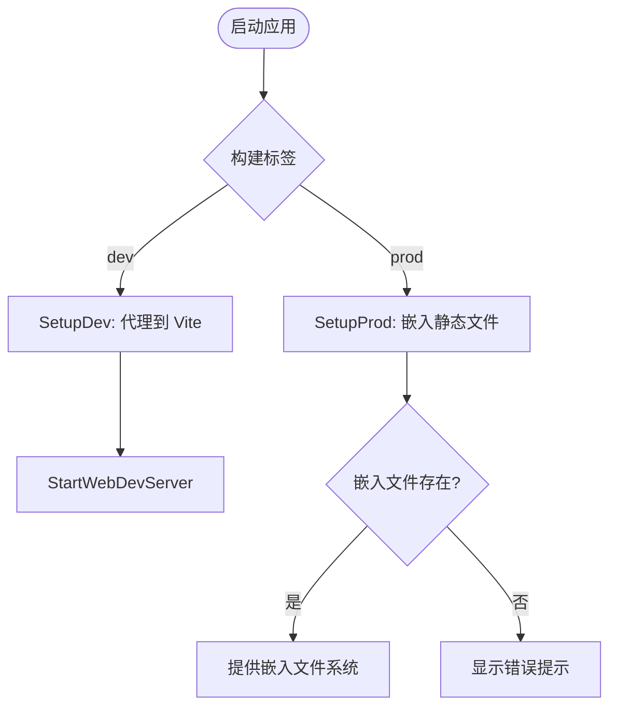

# 配置管理

<cite>
**本文档引用的文件**  
- [config.go](file://internal/infra/config/config.go)
- [environment_type.go](file://internal/shared/environment_type.go)
- [projectpath.go](file://internal/utils/projectpath.go)
- [dev.go](file://bin/main/compile/dev.go)
- [prod.go](file://bin/main/compile/prod.go)
- [start_web.go](file://bin/main/compile/start_web.go)
- [build_dev.go](file://bin/main/build_dev.go)
- [build_prod.go](file://bin/main/build_prod.go)
- [main.go](file://bin/main/main.go)
</cite>

## 目录
1. [简介](#简介)
2. [配置结构体定义](#配置结构体定义)
3. [环境变量加载机制](#环境变量加载机制)
4. [运行时环境管理](#运行时环境管理)
5. [可配置项说明](#可配置项说明)
6. [配置优先级顺序](#配置优先级顺序)
7. [示例文件使用指导](#示例文件使用指导)
8. [开发与生产模式下的配置差异](#开发与生产模式下的配置差异)
9. [总结](#总结)

## 简介
本项目采用结构化配置管理体系，支持多环境部署（development/staging/production），通过 `godotenv` 加载环境变量，结合编译时构建标签（build tags）实现灵活的运行时行为控制。配置系统集中定义于 `config.go`，并通过 `environment_type.go` 区分不同部署场景的行为差异。

## 配置结构体定义

配置系统的核心是 `Config` 结构体，定义了所有可配置参数。该结构体位于 `internal/infra/config/config.go` 文件中，包含以下字段：

- `AppEnv`: 应用运行环境（如 dev、prod）
- `AppPort`: 服务器监听端口
- `DatabaseURL`: 数据库连接字符串
- `GrpcDNS`: gRPC 服务地址
- `OpenaiURl`: AI 服务 API 地址
- `OpenaiKey`: AI 服务认证密钥

该结构体通过 `LoadConfig` 函数初始化，并根据构建环境参数动态调整配置值。

**Section sources**
- [config.go](file://internal/infra/config/config.go#L13-L20)

## 环境变量加载机制

项目使用 `github.com/joho/godotenv` 库加载 `.env` 文件中的环境变量。在 `LoadConfig` 函数中，首先尝试从项目根目录加载 `.env` 文件：

```go
err := godotenv.Load(path.Join(projectPath, ".env"))
```

若文件不存在或读取失败，仅输出错误日志而不中断程序。所有配置项通过 `getEnv` 函数获取，其逻辑为：优先使用操作系统环境变量，若未设置则使用默认值。

`getEnv` 函数实现如下：
```go
func getEnv(key, fallback string) string {
	if val, ok := os.LookupEnv(key); ok {
		return val
	}
	return fallback
}
```

此机制确保了配置的灵活性和安全性。

**Section sources**
- [config.go](file://internal/infra/config/config.go#L35-L38)
- [config.go](file://internal/infra/config/config.go#L52-L57)

## 运行时环境管理

项目通过 `internal/shared/environment_type.go` 定义 `Environment` 类型来区分不同部署场景。虽然该文件目前仅定义类型别名，但其设计意图是作为环境枚举的基础。

实际环境区分通过 Go 的构建标签（build tags）实现。项目包含两个构建文件：
- `build_dev.go`：启用 `dev` 构建标签，定义 `BuildEnv = "dev"`
- `build_prod.go`：启用 `!dev` 构建标签，定义 `BuildEnv = "prod"`

这两个文件在同一包中定义相同的变量 `BuildEnv`，编译时根据构建标签选择其中一个，从而实现环境感知。

**Section sources**
- [environment_type.go](file://internal/shared/environment_type.go#L3)
- [build_dev.go](file://bin/main/build_dev.go#L6)
- [build_prod.go](file://bin/main/build_prod.go#L6)

## 可配置项说明

以下是系统支持的所有可配置项及其默认值：

| 配置项 | 环境变量名 | 默认值 | 说明 |
|--------|------------|--------|------|
| 运行环境 | APP_ENV | 构建环境（dev/prod） | 应用运行环境 |
| 服务器端口 | APP_PORT | 8080 | HTTP 服务监听端口 |
| 数据库连接 | DATABASE_URL | file:app.db?_foreign_keys=on | SQLite 数据库路径 |
| gRPC 地址 | GRPC_DNS | file:app.db?_foreign_keys=on | gRPC 服务连接地址 |
| AI 服务地址 | OPENAI_URL | https://dashscope.aliyuncs.com | AI API 基地址 |
| AI 密钥 | OPENAI_KEY | sk-523cb71b9cbe475ab7e7f27cdab6d379 | AI 服务认证密钥 |

这些配置项均可通过环境变量覆盖，默认值用于开发和快速启动。

**Section sources**
- [config.go](file://internal/infra/config/config.go#L39-L46)

## 配置优先级顺序

配置系统遵循明确的优先级顺序，从高到低如下：

1. **操作系统环境变量**：最高优先级，直接通过 `os.LookupEnv` 读取
2. **.env 文件中的变量**：通过 `godotenv.Load` 加载
3. **代码中定义的默认值**：最低优先级，作为后备值

特别注意：`.env` 文件中的变量仍需通过 `getEnv` 函数与环境变量合并处理，环境变量始终优先于 `.env` 文件。

**Section sources**
- [config.go](file://internal/infra/config/config.go#L52-L57)

## 示例文件使用指导

项目应提供以下示例配置文件：

- `.env.example`：环境变量模板文件，列出所有支持的配置项及说明
- `.dockerenv`：Docker 部署专用环境文件，用于容器化运行

使用建议：
1. 开发者首次运行项目时，复制 `.env.example` 为 `.env`
2. 根据实际需求修改 `.env` 中的配置值
3. 将 `.env` 添加到 `.gitignore`，避免敏感信息提交
4. 在 Docker 部署时，可通过 `-env-file .dockerenv` 指定环境文件

尽管当前代码库中未直接包含这些示例文件，但其使用模式已通过 `godotenv.Load` 调用隐式支持。

## 开发与生产模式下的配置差异

### 开发模式（dev）
- 构建标签：`//go:build dev`
- 数据库路径：使用 `utils.ProjectRoot()` 定位项目根目录下的 `app.db`
- 前端服务：通过 `SetupDev` 启动 Vite 开发服务器并代理请求
- 静态资源：不嵌入二进制，实时从 `web/` 目录加载

### 生产模式（prod）
- 构建标签：`//go:build !dev`
- 数据库路径：优先使用环境变量 `DATABASE_URL`，否则使用默认路径
- 前端服务：通过 `SetupProd` 提供嵌入的静态文件
- 静态资源：编译时通过 `embed.FS` 将前端资源嵌入二进制文件

路径处理方面，生产模式通过 `fs.Sub` 从嵌入文件系统中提取 `web/database/dist` 子目录作为静态资源根目录，确保路径一致性。



**Diagram sources**
- [dev.go](file://bin/main/compile/dev.go#L10-L63)
- [prod.go](file://bin/main/compile/prod.go#L13-L37)
- [start_web.go](file://bin/main/compile/start_web.go#L16-L68)

**Section sources**
- [dev.go](file://bin/main/compile/dev.go#L10-L63)
- [prod.go](file://bin/main/compile/prod.go#L13-L37)
- [start_web.go](file://bin/main/compile/start_web.go#L16-L68)

## 总结

本项目的配置管理体系结合了环境变量、配置文件和编译时构建标签，实现了灵活的多环境支持。通过 `godotenv` 加载 `.env` 文件，`Config` 结构体集中管理配置项，构建标签区分开发与生产行为，确保了系统在不同部署场景下的正确运行。建议补充 `.env.example` 和 `.dockerenv` 示例文件以提升开发体验。