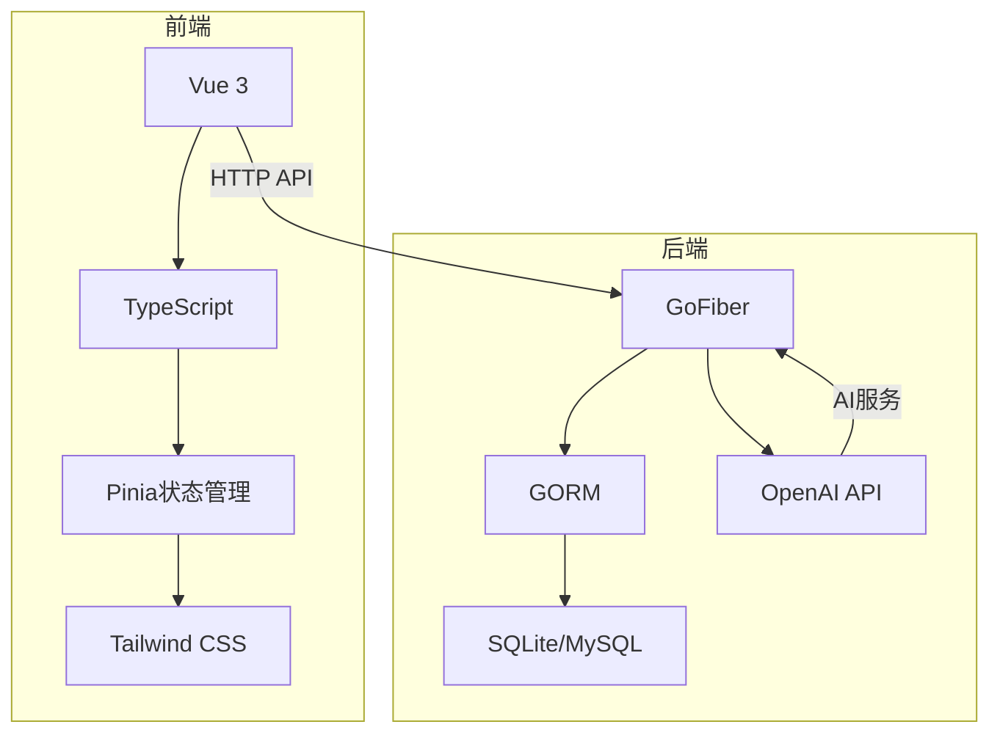
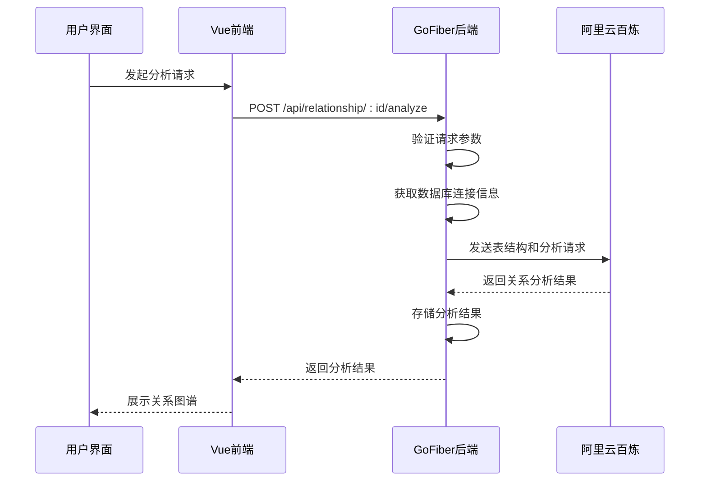
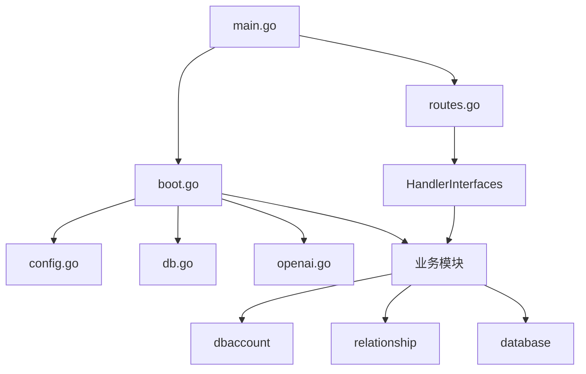

# 项目概述

<cite>
**本文档引用的文件**  
- [main.go](file://main.go)
- [boot.go](file://internal/app/tools/boot.go)
- [routes.go](file://internal/app/tools/routes.go)
- [config.go](file://internal/infra/config/config.go)
- [openai.go](file://internal/infra/ai/openai.go)
- [aliyun_bailian_relationship_repo.go](file://internal/app/tools/repo/aliyun_bailian_relationship/aliyun_bailian_relationship_repo.go)
- [relationship_repo.go](file://internal/app/tools/business/relationship/relationship_repo.go)
- [db_account_repo.go](file://internal/app/tools/business/dbaccount/db_account_repo.go)
- [migrate_repo.go](file://internal/app/tools/repo/migrate_repo.go)
- [db.go](file://internal/infra/database/db.go)
- [handler_interfaces.go](file://internal/shared/handler_interfaces.go)
</cite>

## 目录

1. [项目概述](#项目概述)
2. [核心目标与技术价值](#核心目标与技术价值)
3. [系统架构与全栈设计](#系统架构与全栈设计)
4. [核心问题解决机制](#核心问题解决机制)
5. [系统工作流分析](#系统工作流分析)
6. [项目结构与模块协同](#项目结构与模块协同)
7. [学习路径建议](#学习路径建议)
8. [实际使用场景示例](#实际使用场景示例)

## 核心目标与技术价值

Database AI项目旨在通过人工智能技术革新传统数据库管理方式，实现智能化、自然语言驱动的数据库操作体验。项目核心价值体现在三个方面：首先，利用AI模型自动分析数据库表间关系，生成可视化的关系图谱，帮助开发者快速理解复杂数据库结构；其次，提供自然语言查询能力，用户可通过普通语言描述查询需求，系统自动转换为SQL语句执行；最后，简化数据库操作流程，通过统一的Web界面完成连接管理、查询执行和关系分析等操作，降低数据库使用门槛。

**Section sources**
- [main.go](file://main.go#L1-L25)
- [boot.go](file://internal/app/tools/boot.go#L1-L93)

## 系统架构与全栈设计

本项目采用GoFiber作为后端框架，Vue 3 + TypeScript作为前端技术栈，构建了一个完整的全栈应用。后端使用Go语言提供高性能的RESTful API服务，前端采用现代化的组件化开发模式，通过Vite构建工具实现快速开发体验。系统采用前后端分离架构，在开发模式下通过代理机制实现无缝集成，生产模式下将前端静态资源嵌入后端二进制文件，实现单文件部署。

**Diagram sources**
- [main.go](file://main.go#L1-L25)
- [web/package.json](file://web/package.json#L1-L38)

**Section sources**
- [main.go](file://main.go#L1-L25)
- [web/package.json](file://web/package.json#L1-L38)

## 核心问题解决机制

项目重点解决传统数据库管理中的三个核心痛点：数据库结构理解困难、SQL编写门槛高、操作流程复杂。通过AI技术实现表间关系的智能分析，系统能够自动扫描数据库模式，识别外键约束和潜在关联，生成直观的关系图谱。自然语言查询功能基于阿里云百炼平台的AI模型，将用户输入的自然语言描述转换为精确的SQL查询语句。操作流程简化则通过统一的Web界面实现，用户无需记忆复杂命令即可完成数据库管理任务。

**Section sources**
- [boot.go](file://internal/app/tools/boot.go#L1-L93)
- [openai.go](file://internal/infra/ai/openai.go#L1-L41)
- [aliyun_bailian_relationship_repo.go](file://internal/app/tools/repo/aliyun_bailian_relationship/aliyun_bailian_relationship_repo.go#L1-L25)

## 系统工作流分析

系统工作流从用户界面交互开始，经过后端服务处理，最终与AI服务集成完成智能分析。用户在前端界面发起请求后，Vue应用通过Axios发送HTTP请求到GoFiber后端。后端接收到请求后，根据路由配置分发到相应的处理器，执行业务逻辑。对于涉及AI分析的请求，系统会调用OpenAI客户端与阿里云百炼平台通信，获取AI生成的结果。整个流程体现了清晰的分层架构和职责分离。

**Diagram sources**
- [main.go](file://main.go#L1-L25)
- [routes.go](file://internal/app/tools/routes.go#L1-L11)
- [relationship/handler.go](file://internal/app/tools/business/relationship/handler.go#L1-L22)

**Section sources**
- [main.go](file://main.go#L1-L25)
- [routes.go](file://internal/app/tools/routes.go#L1-L11)
- [relationship/handler.go](file://internal/app/tools/business/relationship/handler.go#L1-L22)

## 项目结构与模块协同

项目采用分层架构设计，各目录职责明确。`internal/app/tools`目录包含应用核心逻辑，其中`boot.go`负责应用初始化，`routes.go`处理路由注册。`internal/infra`目录封装基础设施，包括数据库连接、AI服务等。`internal/app/tools/business`目录按业务领域划分模块，如`dbaccount`管理数据库账户，`relationship`处理关系分析。`web`目录存放前端代码，采用组件化设计，通过Vue Router实现页面导航。

**Diagram sources**
- [main.go](file://main.go#L1-L25)
- [boot.go](file://internal/app/tools/boot.go#L1-L93)
- [routes.go](file://internal/app/tools/routes.go#L1-L11)
- [config.go](file://internal/infra/config/config.go#L1-L58)

**Section sources**
- [main.go](file://main.go#L1-L25)
- [boot.go](file://internal/app/tools/boot.go#L1-L93)
- [routes.go](file://internal/app/tools/routes.go#L1-L11)

## 学习路径建议

建议初学者按照以下路径理解项目：首先从`main.go`入口文件开始，了解应用启动流程；然后深入`boot.go`文件，学习应用初始化和依赖注入机制；接着研究`routes.go`文件，掌握路由注册模式；最后逐个分析业务模块的实现。重点关注`HandlerInterfaces`接口的设计，理解如何通过接口实现模块解耦。对于前端部分，建议从`main.ts`开始，了解Vue应用的启动过程，然后学习组件结构和API调用方式。

**Section sources**
- [main.go](file://main.go#L1-L25)
- [boot.go](file://internal/app/tools/boot.go#L1-L93)
- [routes.go](file://internal/app/tools/routes.go#L1-L11)
- [web/src/main.ts](file://web/src/main.ts#L1-L11)

## 实际使用场景示例

### 新增数据库连接
用户在前端界面填写数据库连接信息后，系统执行以下流程：前端发送POST请求到`/api/db-account`，后端`dbaccount`模块接收请求，验证参数后将连接信息加密存储到数据库。成功后返回连接ID，前端使用该ID进行后续操作。

### 执行智能关系分析
用户选择已保存的数据库连接并启动分析，系统执行以下流程：前端发送GET请求到`/api/relationship/:id/analyze`，后端`relationship`模块获取数据库连接信息，连接目标数据库扫描表结构，将表信息发送给AI服务进行关系分析，接收分析结果后存储并返回给前端展示。

**Section sources**
- [db_account_repo.go](file://internal/app/tools/business/dbaccount/db_account_repo.go#L1-L19)
- [relationship_repo.go](file://internal/app/tools/business/relationship/relationship_repo.go#L1-L19)
- [aliyun_bailian_relationship_repo.go](file://internal/app/tools/repo/aliyun_bailian_relationship/aliyun_bailian_relationship_repo.go#L1-L25)
- [web/src/lib/api.ts](file://web/src/lib/api.ts)
- [web/src/lib/relationshipApi.ts](file://web/src/lib/relationshipApi.ts)